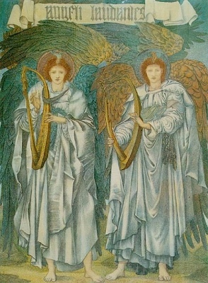

  
[Intangible Textual Heritage](../../index)  [Bible](../index.md) 
[Apocrypha](../../chr/apo/index.md) 

------------------------------------------------------------------------

[Buy this Book on
Kindle](https://www.amazon.com/exec/obidos/ASIN/B0037Z6LLW/internetsacredte.md)

------------------------------------------------------------------------

<table width="75%">
<colgroup>
<col style="width: 50%" />
<col style="width: 50%" />
</colgroup>
<tbody>
<tr class="odd">
<td width="50%" data-valign="CENTER"></td>
<td width="50%" data-valign="CENTER"><h1 id="the-book-of-enoch" data-align="CENTER">The Book of Enoch</h1>
<h3 id="tr.-by-r.h.-charles" data-align="CENTER">tr. by R.H. Charles</h3>
<h4 id="section" data-align="CENTER">[1917]</h4></td>
</tr>
</tbody>
</table>

------------------------------------------------------------------------

[Contents](#contents)    [Start Reading](boe000.md)    [Page
Index](pageidx)    [Text \[Zipped\]](boe.txt.gz.md)

------------------------------------------------------------------------

The Book of Enoch, written during the second century B.C.E., is one of
the most important non-canonical apocryphal works, and probably had a
huge influence on early Christian, particularly Gnostic, beliefs. Filled
with hallucinatory visions of heaven and hell, angels and devils, Enoch
introduced concepts such as fallen angels, the appearance of a Messiah,
Resurrection, a Final Judgement, and a Heavenly Kingdom on Earth.
Interspersed with this material are quasi-scientific digressions on
calendrical systems, geography, cosmology, astronomy, and meteorology.

This etext has been prepared specially for sacred-texts, and is a great
improvement over other versions on the Internet, with the introduction,
correct verse numbering, page numbers from the 1917 edition, and intact
critical apparatus.

------------------------------------------------------------------------

 [Title Page](boe000.md)  
[Editors' Preface](boe001.md)  
[Introduction](boe002.md)  
[Abbreviations, Brackets and Symbols Specially Used in the Translation
of 1 Enoch](boe003.md)  

### The Book of Enoch

[Chapter I](boe004.md)  
[Chapter II](boe005.md)  
[Chapter III.](boe006.md)  
[Chapter IV.](boe007.md)  
[Chapter V.](boe008.md)  
[Chapter VI.](boe009.md)  
[Chapter VII](boe010.md)  
[Chapter VIII.](boe011.md)  
[Chapter IX](boe012.md)  
[Chapter X](boe013.md)  
[Chapter XI](boe014.md)  
[Chapter XII](boe015.md)  
[Chapter XIII](boe016.md)  
[Chapter XIV](boe017.md)  
[Chapter XV](boe018.md)  
[Chapter XVI](boe019.md)  

### Enoch's Journeys through the Earth and Sheol

[Chapter XVII](boe020.md)  
[Chapter XVIII](boe021.md)  
[Chapter XIX](boe022.md)  
[Chapter XX](boe023.md)  
[Chapter XXI](boe024.md)  
[Chapter XXII](boe025.md)  
[Chapter XXIII](boe026.md)  
[Chapter XXIV](boe027.md)  
[Chapter XXV](boe028.md)  
[Chapter XXVI](boe029.md)  
[Chapter XXVII](boe030.md)  
[Chapter XXVIII](boe031.md)  
[Chapter XXIX](boe032.md)  
[Chapter XXX](boe033.md)  
[Chapter XXXI](boe034.md)  
[Chapter XXXII](boe035.md)  
[Chapter XXXIII](boe036.md)  
[Chapter XXXIV](boe037.md)  
[Chapter XXXV](boe038.md)  
[Chapter XXXVI](boe039.md)  

### The Parables

[Chapter XXXVII](boe040.md)  

### The First Parable

[Chapter XXXVIII](boe041.md)  
[Chapter XXXIX](boe042.md)  
[Chapter XL](boe043.md)  
[Chapter XLI](boe044.md)  
[Chapter XLII](boe045.md)  
[Chapter XLIII](boe046.md)  
[Chapter XLIV](boe047.md)  

### The Second Parable

[Chapter XLV](boe048.md)  
[Chapter XLVI](boe049.md)  
[Chapter XLVII](boe050.md)  
[Chapter XLVIII](boe051.md)  
[Chapter XLIX](boe052.md)  
[Chapter L](boe053.md)  
[Chapter LI](boe054.md)  
[Chapter LII](boe055.md)  
[Chapter LIII](boe056.md)  
[Chapter LIV](boe057.md)  
[Chapter LIV](boe058.md)  
[Chapter LVI](boe059.md)  
[Chapter LVII](boe060.md)  

### The Third Parable

[Chapter LVIII.](boe061.md)  
[Chapter LIX](boe062.md)  

### Book of Noah--a Fragment

[Chapter LX](boe063.md)  
[Chapter LXI](boe064.md)  
[Chapter LXII](boe065.md)  
[Chapter LXIII](boe066.md)  
[Chapter LXIV](boe067.md)  
[Chapter LXV](boe068.md)  
[Chapter LXVI](boe069.md)  
[Chapter LXVII](boe070.md)  
[Chapter LXVIII](boe071.md)  
[Chapter LXIX](boe072.md)  

 

[Chapter LXX](boe073.md)  
[Chapter LXXI](boe074.md)  

### The Book of the Courses of the Heavenly Luminaries

[Chapter LXXII.](boe075.md)  
[Chapter LXXIII](boe076.md)  
[Chapter LXXIV](boe077.md)  
[Chapter LXXV](boe078.md)  
[Chapter LXXVI](boe079.md)  
[Chapter LXXVII](boe080.md)  
[Chapter LXXVIII](boe081.md)  
[Chapter LXXIX](boe082.md)  
[Chapter LXXX](boe083.md)  
[Chapter LXXI](boe084.md)  
[Chapter LXXXII](boe085.md)  

### The Dream-Vision

[Chapter LXXXIII](boe086.md)  
[Chapter LXXXIV](boe087.md)  
[Chapter LXXXV](boe088.md)  
[Chapter LXXXVI](boe089.md)  
[Chapter LXXXVII](boe090.md)  
[Chapter LXXXVIII](boe091.md)  
[Chapter LXXXIX](boe092.md)  
[Chapter XC](boe093.md)  

### The Concluding Section of the Book

[Chapter XCII](boe094.md)  
[Chapter XCI](boe095.md)  
[Chapter XCIII](boe096.md)  
[Chapter XCI](boe097.md)  
[Chapter XCIV](boe098.md)  
[Chapter XCV](boe099.md)  
[Chapter XCVI](boe100.md)  
[Chapter XCVII](boe101.md)  
[Chapter XCVIII](boe102.md)  
[Chapter XCIX](boe103.md)  
[Chapter C](boe104.md)  
[Chapter CI](boe105.md)  
[Chapter CII.](boe106.md)  
[Chapter CIII](boe107.md)  
[Chapter CIV](boe108.md)  
[Chapter CV](boe109.md)  

### Fragment of the Book of Noah

[Chapter CVI](boe110.md)  
[Chapter CVII](boe111.md)  

### An Appendix to the Book of Enoch

[Chapter CVIII](boe112.md)  
