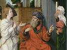

  
[Intangible Textual Heritage](../../index)  [Bible](../index.md) 
[Index](index)  [Previous](coj064)  [Next](coj066.md) 

------------------------------------------------------------------------

  
*Chronicles of Jerahmeel*, by M. Gaster \[1899\], at Intangible Textual
Heritage

------------------------------------------------------------------------

### THE CHILDREN OF MOSES.

LXI\. (1) The banishment brought about by Titus, Vespasianus, and
Hadrian, occurred on the eve of the ninth of Ab, on the outgoing of the
Sabbath and the Sabbatical year. The Levites were then occupied with
their ministrations, and, with their harps in their hands, were singing
their hymns. But Scripture saith, 'He hath brought upon them their own
iniquity, and shall cut them off in their own evil.' The words 'He shall
cut them off' were not yet fully uttered ere their enemies came upon
them, slaughtered many of them, and sent the rest into exile. Thus,
also, when Nebuchadnezzar the wicked sent them into exile it fell upon
the eve of the ninth of Ab, the outgoing of the Sabbatical year and the
Sabbath, when the Levites were standing on their 'Duchan,' being sixty
myriads in number, who were, moreover, of the seed

p. 187

of Moses our instructor. While the harps were in their hands, the verse
'He hath brought upon them their own iniquity, and shall cut them off in
their own evil,' was not yet fully uttered, ere the enemy came and
exiled them to Babylon. When they arrived in Babylon, their enemies and
captors said to them, 'Sing us a song of Zion.' And they replied, 'How
can we sing a song of Zion upon strange ground?'

\(2\) 'Now,' retorted their captors, 'ye shall sing by force.' But they
at once cut off their fingers with their teeth, and cast them before
them. And they replied, 'How can those fingers which struck the strings
of the harps in the temple strike them here in a strange land?' And God
exclaimed, 'If I forget Jerusalem, My right hand shall be forgotten.'

\(3\) A cloud then descended, and lifting all the children of Moses,
with their sheep and cattle, brought them to the east of Havila. In the
night they were let down, and on that same night they heard a great
noise surrounding them, like that of a river, without seeing a drop of
water descending, but heard only the rolling of stones and sand, where
there had never been a river. This river then rolled great stones, and
the sand, without any water, made a noise as of a great earthquake, so
that if anyone came near that river, he was dashed to pieces. This
continued until the Sabbath. The river they called Sabbatyon or
Sabbatianus. In some part the river is less than sixty cubits in width;
there the people stand and speak with those of the other side. On the
Sabbath it ceases to flow, and on the eve of Sabbath a cloud descends
full of smoke. No one is able to approach them, neither do they approach
us. There are no wild beasts, no unclean animals, nor any reptiles or
creeping things; nothing except their flocks and herds.

\(4\) They reap and sow, and they ask the others, and thus they learned
of the destruction of the second temple. Behind the sons of Moses we do
not know who may be dwelling; but Naphtali, Gad, and Asher came to Dan
after the destruction of the second temple; for Isaachar, who lived at
the mountains of the deep, quarrelled with them and

p. 188

called them 'the sons of the handmaids.' At length, being afraid lest
they be coming to battle, those three tribes went away until they came
to Dan, and these four tribes were thus living in one place.

------------------------------------------------------------------------

[Next: LXII. The Ten Banishments of the Sanhedrim](coj066.md)

