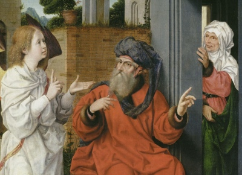

  
[Intangible Textual Heritage](../../index)  [Bible](../index) 

------------------------------------------------------------------------

<table width="75%">
<colgroup>
<col style="width: 50%" />
<col style="width: 50%" />
</colgroup>
<tbody>
<tr class="odd">
<td width="50%" data-valign="TOP"></td>
<td width="50%" data-valign="CENTER"><h1 id="chronicles-of-jerahmeel" data-align="CENTER">Chronicles of Jerahmeel</h1>
<h2 id="by-moses-gaster" data-align="CENTER">by Moses Gaster</h2>
<h4 id="section" data-align="CENTER">[1899]</h4></td>
</tr>
</tbody>
</table>

------------------------------------------------------------------------

[Contents](#contents)    [Start Reading](coj000)    [Page
Index](pageidx)    [Text \[Zipped\]](coj.txt.gz)

------------------------------------------------------------------------

This is Moses Gaster's translation of the Chronicles of Jerahmeel. The
book is a collection of extended Biblical events, mixed with Roman
history, lists of geographical names, and Patriarchial genealogies.
Gaster believed that the Chronicles were compiled from Hebrew sources,
both ancient and medieval. The text runs from the void before Creation,
through the Deuterocanonical Apocrypha. This book abounds with
astounding folklore.--J.B. Hare, Dec. 30th, 2009.

------------------------------------------------------------------------

 [Title Page](coj000)  
[Contents](coj001)  
[Preface](coj002)  
[Introduction](coj003)  
[Compiler's Preface](coj004)  
[I](coj005)  
[II](coj006)  
[III](coj007)  
[IV](coj008)  
[V](coj009)  
[VI](coj010)  
[VII](coj011)  
[VIII](coj012)  
[IX. The Formation of the Child](coj013)  
[X](coj014)  
[XI](coj015)  
[XII](coj016)  
[XIII. The Beating of the Grave](coj017)  
[XIV. This Is the Description of Gehinnom (Hell)](coj018)  
[XV](coj019)  
[XVI](coj020)  
[XVII](coj021)  
[XVIII. Paradise](coj022)  
[XIX](coj023)  
[XX](coj024)  
[XXI](coj025)  
[XXII](coj026)  
[XXIII](coj027)  
[XXIV](coj028)  
[XXV. The Midrash of Shemḥazai and ‘Azael.](coj029)  
[XXVI](coj030)  
[XXVII](coj031)  
[XXVIII](coj032)  
[XXIX](coj033)  
[XXX](coj034)  
[XXXI](coj035)  
[XXXII](coj036)  
[XXXIII](coj037)  
[XXXIV](coj038)  
[XXXV](coj039)  
[XXXVI](coj040)  
[XXXVII](coj041)  
[XXXVIII. This Is the Will (Testament) of Naphtali, Son of
Jacob](coj042)  
[XXXIX](coj043)  
[XL](coj044)  
[XLI](coj045)  
[XLII](coj046)  
[XLIII. The Chronicles of Moses](coj047)  
[XLIV](coj048)  
[XLV](coj049)  
[XLVI](coj050)  
[XLVII](coj051)  
[XLVIII](coj052)  
[XLIX. The Death of Aaron, of Blessed Memory](coj053)  
[L](coj054)  
[LI](coj055)  
[LII](coj056)  
[LIII](coj057)  
[LIV. The Smiting of the Firstborn](coj058)  
[LV. The Rebellion of Korah](coj059)  
[LVI](coj060)  
[LVII](coj061)  
[LVIII](coj062)  
[LIX](coj063)  
[LX. The Eight Exiles](coj064)  
[LXI. The Children of Moses](coj065)  
[LXII. The Ten Banishments of the Sanhedrim](coj066)  
[LXIII. Elchanan the Merchant](coj067)  
[LXIV. The Midrash of Aḥab Ben Qolaya and Zedekiah Ben
Ma‘aseyah](coj068)  
[LXV. The History of Susanna](coj069)  
[LXVI](coj070)  
[LXVII](coj071)  
[LXVIII](coj072)  
[LXIX](coj073)  
[LXX](coj074)  
[LXXI](coj075)  
[LXXII](coj076)  
[LXXIII](coj077)  
[LXXIV](coj078)  
[LXXV](coj079)  
[LXXVI](coj080)  
[LXXVII](coj081)  
[LXXVIII](coj082)  
[LXXIX](coj083)  
[LXXX. The Beating of the Grave](coj084)  
[LXXXI](coj085)  
[LXXXII](coj086)  
[LXXXIII](coj087)  
[LXXXIV. The Throne of Solomon, King of Israel](coj088)  
[LXXXV. The Book of the Maccabee](coj089)  
[LXXXVI](coj090)  
[LXXXVII](coj091)  
[LXXXVIII](coj092)  
[LXXXIX](coj093)  
[XC](coj094)  
[XCI](coj095)  
[XCII](coj096)  
[XCIII](coj097)  
[XCIV](coj098)  
[XCV](coj099)  
[XCVI](coj100)  
[XCVII](coj101)  
[XCVIII](coj102)  
