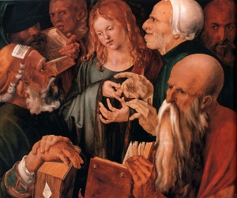

  
[Intangible Textual Heritage](../../index)  [Bible](../index.md) 

------------------------------------------------------------------------

[Buy this Book at
Amazon.com](https://www.amazon.com/exec/obidos/ASIN/B0027CSIX0/internetsacredte.md)

------------------------------------------------------------------------

<table width="75%">
<colgroup>
<col style="width: 50%" />
<col style="width: 50%" />
</colgroup>
<tbody>
<tr class="odd">
<td width="50%" data-valign="TOP"> 
Christ Among the Doctors, by Alberecht Duerer [1506] 
(Public Domain Image)</td>
<td width="50%" data-valign="CENTER"><h1 id="the-complete-sayings-of-jesus" data-align="CENTER">The Complete Sayings of Jesus</h1>
<h2 id="by-arthur-hinds" data-align="CENTER">by Arthur Hinds</h2>
<h4 id="section" data-align="CENTER">[1927]</h4></td>
</tr>
</tbody>
</table>

------------------------------------------------------------------------

[Contents](#contents)    [Start Reading](csj000.md)    [Page
Index](pageidx)    [Text \[Zipped\]](csj.txt.gz.md)

------------------------------------------------------------------------

|                                                                                                                           |
|---------------------------------------------------------------------------------------------------------------------------|
|  |

Like the [Jefferson Bible](../jb/index.md), this is an attempt to edit the
four gospels into a consistent account, in this case focusing on the
words of Jesus. There is plenty of connecting narrative around the
instances where Jesus speaks, so this is better than simply presenting
each quote out of context. The focus on what Jesus is attributed as
saying makes it easier to browse the core texts of the New Testament.
All in all, a very useful reference, and a great read.

PRODUCTION NOTES: In this etext, Jesus' words are highlighted in blue,
slightly larger text. The date and age information was extracted from
the copytext page headers and moved into the file title area in the
online edition.

------------------------------------------------------------------------

 [Title Page](csj000.md)  
[Reminder by the Publisher](csj001.md)  
[The Compiler's Purpose](csj002.md)  
[Introduction by Norman Vincent Peale](csj003.md)  
[I. Lineage of Jesus—Born In Bethlehem](csj004.md)  
[II. The Escape From Herod—Again In Galilee At Nazareth](csj005.md)  
[III. The Boy Jesus](csj006.md)  
[IV. Jesus At Thirty—Baptized By John](csj007.md)  
[V. Christ's Long Fast in the Wilderness—Satan's Futile Wiles](csj008.md)  
[VI. John Answers the Priests](csj009.md)  
[VII. Jesus’ Mother and the Water Changed to Wine](csj010.md)  
[VIII. Nighttime Visit of Nicodemus—Christ Enlightens Him](csj011.md)  
[IX. John Extols Jesus](csj012.md)  
[X. Christ in Cana Cures Nobleman's Son at Capernaum](csj013.md)  
[XI. At The Pool of Bethesda](csj014.md)  
[XII. Christ Reads in Synagogue at Nazareth](csj015.md)  
[XIII. By the Sea](csj016.md)  
[XIV. The Sermon on the Mount](csj017.md)  
[XV. The Sermon on the Mount (Continued)](csj018.md)  
[XVI. The Sermon on the Mount (Concluded)](csj019.md)  
[XVII. A Leper Cleansed](csj020.md)  
[XVIII. Matthew (Levi) Called](csj021.md)  
[XIX. In the Cornfield on the Sabbath](csj022.md)  
[XX. The Twelve by Name—The Sermon in the Plain](csj023.md)  
[XXI. The Sermon in the Plain (Concluded)](csj024.md)  
[XXII. The Centurion's Servant Healed](csj025.md)  
[XXIII. John, From Prison, Sends Messengers](csj026.md)  
[XXIV. Woe Unto Chorazin, Bethsaida, Capernaum](csj027.md)  
[XXV. The Woman With the Alabaster Box](csj028.md)  
[XXVI. The Man Blind, Mute, And Bedeviled](csj029.md)  
[XXVII. Doubters Seek a Sign](csj030.md)  
[XXVIII. His Mother and Brethren Would Speak With Jesus](csj031.md)  
[XXIX. Parables: The Mustard Seed, the Leaven, the Merchantman, the
Net](csj032.md)  
[XXX. The Madman and the Swine](csj033.md)  
[XXXI. Jairus’ Daughter Healed](csj034.md)  
[XXXII. Home Again: A Prophet Without Honor](csj035.md)  
[XXXIII. Herod Desires To See Christ](csj036.md)  
[XXXIV. Five Thousand Fed](csj037.md)  
[XXXV. Jesus Would Not Be Made King](csj038.md)  
[XXXVI. “I Am The Bread Of Life”](csj039.md)  
[XXXVII. Pharisees Querulous](csj040.md)  
[XXXVIII. The Woman of Canaan](csj041.md)  
[XXXIX. “Seven Loaves and a Few Little Fishes”](csj042.md)  
[XL. “Upon This Rock I Will Build My Church”](csj043.md)  
[XLI. The Transfiguration](csj044.md)  
[XLII. Jesus Foretells His Death and Resurrection](csj045.md)  
[XLIII. John Answered: “Forbid Him Not”](csj046.md)  
[XLIV. “Except Ye Become As Little Children”](csj047.md)  
[XLV. At the Feast of the Tabernacle](csj048.md)  
[XLVI. The Woman Taken In Adultery](csj049.md)  
[XLVII. “I Am the Light of the World”](csj050.md)  
[XLVIII. “Hath Not Where To Lay His Head”](csj051.md)  
[XLIV. The Good Samaritan](csj052.md)  
[L. The Lord's Prayer](csj053.md)  
[LI. Sermon to the Innumerable Multitude](csj054.md)  
[LII. Sermon to the Innumerable Multitude (cont.)](csj055.md)  
[LIII. Sabbath Cure of Crippled Woman](csj056.md)  
[LIV. “O Jerusalem, Jerusalem!”](csj057.md)  
[LV. Sermon in Parables](csj058.md)  
[LVI. Sermon In Parables (Continued): The Prodigal Son](csj059.md)  
[LVII. Sermon In Parables (cont.): “Ye Cannot Serve God and
Mammon”](csj060.md)  
[LVIII. Sermon In Parables (Concluded): “I Am the
Resurrection”](csj061.md)  
[LIX. “The Kingdom of God Is Within You”](csj062.md)  
[LX. “Easier For a Camel to Go Through the Eye of a Needle”](csj063.md)  
[LXI. Divorce Denounced](csj064.md)  
[LXII. “Drink Indeed of My Cup”](csj065.md)  
[LXIII. Sight Restored to Two Blind Beggars](csj066.md)  
[LXIV. Jesus Goes to Jerusalem](csj067.md)  
[LXV. The Fig Tree Withered](csj068.md)  
[LXVI. Christ's Authority Challenged](csj069.md)  
[LXVII. “Many Are Called”—“Render unto Cesar”](csj070.md)  
[LXVIII. The First Great Commandment: and the Second](csj071.md)  
[LXIX. “Woe Unto You, Scribes and Pharisees!”](csj072.md)  
[LXX. “Now Is My Soul Troubled”](csj073.md)  
[LXXI. The Temple Doomed](csj074.md)  
[LXXII. “My Words Shall Not Pass Away”—Wise and Foolish
Virgins.](csj075.md)  
[LXXIII. Parable of the Talents](csj076.md)  
[LXXIV. “Me Ye Have Not Always”](csj077.md)  
[LXXV. The Thirty Pieces of Silver](csj078.md)  
[LXXVI. The Last Supper—“Do This In Remembrance of Me”](csj079.md)  
[LXXVII. Last Supper (cont.) “I Am The Way, The Truth, The
Life”](csj080.md)  
[LXXVIII. Last Supper (cont.) “Greater Love Hath No Man Than
This”](csj081.md)  
[LXXIX. Last Supper (cont.) “Be of Good Cheer, I Have Overcome the
World”](csj082.md)  
[LXXX. Last Supper (cont.) “I Have Finished the Work”](csj083.md)  
[LXXXI. In Gethsemane](csj084.md)  
[LXXXII. The Betrayal: Judas’ Kiss](csj085.md)  
[LXXXIII. Christ's Trial](csj086.md)  
[LXXXIV. Christ Before Pilate—“Crucify Him”](csj087.md)  
[LXXXV. The Crucifixion—“Father, Forgive Them”](csj088.md)  
[LXXXVI. “It Is Finished”](csj089.md)  
[LXXXVII. Laid in the Tomb](csj090.md)  
[LXXXVIII. The Resurrection](csj091.md)  
[LXXXIX](csj092.md)  
[XC. At The Sea of Tiberias](csj093.md)  
[XCI. The Ascension—“Go Ye and Preach the Gospel to Every
Creature”](csj094.md)  
[XCII. Apostles’ Question Answered—Saul's Conversion](csj095.md)  
[XCIII. The Lord to Paul in a Vision—“I Am With Thee”](csj096.md)  

### Appendix: Paul's Witness

[XCIV. Paul at Cesarea and Jerusalem](csj097.md)  
[XCV. The Revelation](csj098.md)  
[XCVI. To The Church of Ephesus—“I Will Give to Eat of the Tree of
Life”](csj099.md)  
[XCVII. To the Church in Smyrna—“Be Thou Faithful Unto Death”](csj100.md)  
[XCVIII. To the Church in Pergamos—“Repent, Or Else I Will Come
Quickly”](csj101.md)  
[XCIX. To the Church in Thyatira—“I Will Give Unto Every One of You
According to His Works”](csj102.md)  
[C. To the Church in Sardis—“Be Watchful: I Will Come As a
Thief”](csj103.md)  
[CI. To the Church in Philadelphia—“I Have Set Before Thee an Open
Door”](csj104.md)  
[CII. To The Church Of The Laodiceans—“I Stand At The Door, And
Knock”](csj105.md)  
[CIII. “I am Alpha and Omega”](csj106.md)  
