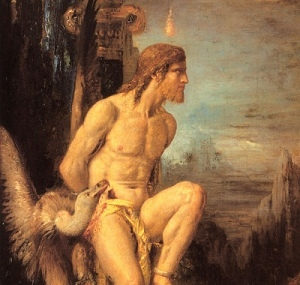

  
[Intangible Textual Heritage](../../../index)  [Bible](../../index.md) 
[Bible Critical Views](../index.md) 

------------------------------------------------------------------------

[Buy this Book at
Amazon.com](https://www.amazon.com/exec/obidos/ASIN/B002EVPFEO/internetsacredte.md)

------------------------------------------------------------------------

<table width="75%">
<colgroup>
<col style="width: 50%" />
<col style="width: 50%" />
</colgroup>
<tbody>
<tr class="odd">
<td width="50%" data-valign="TOP"> 
Prometheus, (Detail) by Gustave Moreau [19th cent.] (Public Domain Image)</td>
<td width="50%" data-valign="CENTER"><h1 id="pagan-christs" data-align="CENTER">Pagan Christs</h1>
<h2 id="by-john-m.-robertson" data-align="CENTER">by John M. Robertson</h2>
<h4 id="section" data-align="CENTER">[1911]</h4></td>
</tr>
</tbody>
</table>

------------------------------------------------------------------------

[Contents](#contents)    [Start Reading](pch00.md)    [Page
Index](pageidx)    [Text \[Zipped\]](pch.txt.gz.md)

------------------------------------------------------------------------

|                                                                                                                           |
|---------------------------------------------------------------------------------------------------------------------------|
|  |

...you take the blue pill--the story ends...you take
the red pill...and I show you how deep the rabbit hole goes.--Morpheus
in The Matrix

Talk about your red pills. J.M. Robertson herein challenges not only the
historical authenticity of the canonical accounts of the founding of
Christianity, but also Buddhism, Hinduism, Jainism, Zoroastrianism, and
Judaism. He answers the question implicit in Kersey Graves' 1875 screed,
[The World's Sixteen Crucified Saviors](../wscs/index.md). Why so many
similar stories of savior figures in world religion?

At the dark heart of this mystery, according to Robinson, is a
prehistoric drama involving human sacrifice (particularly, of children),
cannibalism, and regicide. The purpose: to implore the gods, or to
expiate collective sin. As time passed, the rituals were softened, and
turned into symbolic equivalents (such as the scapegoat and the
eucharist), while retaining the tragic end of the narrative. A culture
hero, born under portents, dies, often under torture, in order to save
all humanity. These and other tropes ended up embedded in our tales of
the founders of major religions, from Buddha to Jesus.

Robertson pulls in historic, ethnographic and folklore data from
hundreds of carefully cited sources. He covers examples from antiquity
such as Mithraism, Manichaeism, and Apollonius of Tyana. In the final
section he universalizes his study and focuses on Native America,
particularly the Aztec. The conclusions of this book remain highly
controversial, but the sheer mass of evidence accumulated demands
consideration. This will be a thorny book for believers, but a
revelation for free-thinkers.

--J.B. Hare, Feb. 10, 2008.

------------------------------------------------------------------------

 [Title Page](pch00.md)  
[By the Same Author](pch01.md)  
[Contents](pch02.md)  
[Preface to the Second Edition](pch03.md)  
[Introduction](pch04.md)  

### Part I. The Rationale of Religion

### Chapter I. The Naturalness of all Belief

[§ 1. Origin of the Gods from Fear](pch05.md)  
[§ 2. All Belief Results of Reasoning](pch06.md)  
[§ 3. Dr. Jevons’ Theories of Religious Evolution](pch07.md)  
[§ 4. Scientific View of the Religious Evolution](pch08.md)  
[§ 5. Dr. Frazer's Definition](pch09.md)  
[§ 6. The Scientific Induction](pch10.md)  
[§ 7. Dr. Jevons’ Series of Self-Contradictions](pch11.md)  
[§ 8. His Contradictory Doctrine of the Conditions of the Survival of
Religion](pch12.md)  
[§ 9. The Continuity of Religious Phenomena](pch13.md)  
[§ 10. Dr. Frazer's Sociological Vindication of the Sorcerer](pch14.md)  
[§ 11. The Beginning of the End of Religion](pch15.md)  
[§ 12. Historic View of Ancestor Worship](pch16.md)  
[§ 13. The Authoritarian Element a Mark of Religion](pch17.md)  
[§ 14. Definition of Religion](pch18.md)  

### Chapter II. Comparison and Appraisement of Religions

[§ 1. Early Forces of Reform](pch19.md)  
[§ 2. Reform as a Religious Process](pch20.md)  
[§ 3. Polytheism and Monotheism](pch21.md)  
[§ 4. Hebrews and Babylonians](pch22.md)  
[§ 5. Forces of Religious Evolution](pch23.md)  
[§ 6. The Hebrew Evolution](pch24.md)  
[§ 7. Post-Exilic Phases](pch25.md)  
[§ 8. Revival and Disintegration](pch26.md)  
[§ 9. Conclusion](pch27.md)  

### Part II. Secondary God-Making

### Chapter I. The Sacrificed Saviour-God

[§ 1. Totemism and Sacraments](pch28.md)  
[§ 2. Theory and Ritual of Human Sacrifice](pch29.md)  
[§ 3. The Christian Crucifixion](pch30.md)  
[§ 4. Vogue of Human Sacrifice](pch31.md)  
[§ 5. The Divinity of the Victim](pch32.md)  
[§ 6. The Cannibal Sacrament](pch33.md)  
[§ 7. The Semitic Antecedents](pch34.md)  
[§ 8. The Judaic Evolution](pch35.md)  
[§ 9. Specific Survivals in Judaism](pch36.md)  
[§ 10. The Pre-Christian Jesus-God](pch37.md)  
[§ 11. Private Jewish Eucharists](pch38.md)  
[§ 12. The Eucharist in Orthodox Judaism](pch39.md)  
[§ 13. Special Features of the Crucifixion Myth](pch40.md)  
[§ 14. Possible Historical Elements](pch41.md)  
[§ 15. The Gospel Mystery-Play](pch42.md)  
[§ 16. The Mystery-Play and the Cultus](pch43.md)  
[§ 17. Further Pagan Adaptations](pch44.md)  
[§ 18. Synopsis and Conclusion: Genealogy of Human Sacrifice and
Sacrament](pch45.md)  

### Chapter II. The Teaching God

[§ 1. Primary and Secondary Ideas](pch46.md)  
[§ 2. The Logos](pch47.md)  
[§ 3. Derivations of the Christian Logos](pch48.md)  
[§ 4. The Search for a Historical Jesus](pch49.md)  
[§ 5. The Critical Problem](pch50.md)  
[§ 6. Collapse of the Constructive Case](pch51.md)  
[§ 7. Parallel Problems](pch52.md)  
[§ 8. The Problem of Buddhist Origins](pch53.md)  
[§ 9. Buddhism and Buddhas](pch54.md)  
[§ 10. The Buddhist Cruces](pch55.md)  
[§ 11. Sociological Clues](pch56.md)  
[§ 12. Buddhism and Asoka](pch57.md)  
[§ 13. The Buddha Myth](pch58.md)  
[§ 14. The Problem of Manichæus](pch59.md)  
[§ 15. The Manichean Solution](pch60.md)  
[§ 16. The Case of Apollonius of Tyana](pch61.md)  

### Part III. Mithraism

[§ 1. Introductory](pch62.md)  
[§ 2. Beginnings of Cult](pch63.md)  
[§ 3. Zoroastrianism](pch64.md)  
[§ 4. Evolution of Mithra](pch65.md)  
[§ 5. The Process of Syncretism](pch66.md)  
[§ 6. Symbols of Mithra](pch67.md)  
[§ 7. The Cultus](pch68.md)  
[§ 8. The Creed](pch69.md)  
[§ 9. Mithraism and Christianity](pch70.md)  
[§ 10. Further Christian Parallels](pch71.md)  
[§ 11. The Vogue of Mithraism](pch72.md)  
[§ 12. Absorption in Christianity](pch73.md)  
[§ 13. The Point of Junction](pch74.md)  

### Part IV. The Religions of Ancient America

[§ 1. American Racial Origins](pch75.md)  
[§ 2. Aztecs and Peruvians](pch76.md)  
[§ 3. Primitive Religion and Human Sacrifice](pch77.md)  
[§ 4. The Mexican Cultus](pch78.md)  
[§ 5. Mexican Sacrifices and Cannibal Sacraments](pch79.md)  
[§ 6. Mexican Ethics](pch80.md)  
[§ 7. The Mexican White Christ](pch81.md)  
[§ 8. The Fatality of the Priesthood](pch82.md)  
[§ 9. The Religion of Peru](pch83.md)  
[§ 10. Conclusion](pch84.md)  

### Appendices

[Appendix A. The Eating of the Crucified Human Sacrifice](pch85.md)  
[Appendix B. Dramatic and Ritual Survivals](pch86.md)  
[Appendix C. Replies to Criticisms](pch87.md)  
[Index](pch88.md)  
