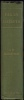

  
[Intangible Textual Heritage](../../../index)  [Bible](../../index) 
[Bible Critical Views](../index)  [Index](index)  [Next](pch01) 

------------------------------------------------------------------------

[Buy this Book at
Amazon.com](https://www.amazon.com/exec/obidos/ASIN/B002EVPFEO/internetsacredte)

------------------------------------------------------------------------

  
*Pagan Christs*, by John M. Robertson, \[1911\], at Intangible Textual
Heritage

------------------------------------------------------------------------

# PAGAN CHRISTS

## STUDIES IN COMPARATIVE HIEROLOGY

###### BY

### JOHN M. ROBERTSON

##### SECOND EDITION, REVISED AND EXPANDED

###### \[ISSUED FOR THE RATIONALIST PRESS ASSOCIATION, LIMITED\]

#### LONDON:

#### WATTS & CO.,

#### 17 JOHNSON'S COURT, FLEET STREET, E.C.

#### \[1911\]

Scanned, proofed and formatted by John Bruno Hare at Intangible Textual
Heritage, Sept-Oct 2007. This book is in the public domain in the US
because it was published prior to 1923.

  [  
Click to enlarge](img/title.jpg)  
Title Page  

 
[  
Click to enlarge](img/spine.jpg)  
Spine  

------------------------------------------------------------------------

[Next: By the Same Author](pch01)
