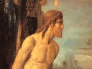

  
[Intangible Textual Heritage](../../../index)  [Bible](../../index.md) 
[Bible Critical Views](../index)  [Index](index)  [Previous](pch02.md) 
[Next](pch04.md) 

------------------------------------------------------------------------

[Buy this Book at
Amazon.com](https://www.amazon.com/exec/obidos/ASIN/B002EVPFEO/internetsacredte.md)

------------------------------------------------------------------------

  
*Pagan Christs*, by John M. Robertson, \[1911\], at Intangible Textual
Heritage

------------------------------------------------------------------------

p. x p. xi

### PREFACE TO THE SECOND EDITION

Since the first issue of this work in
1903, but especially within the past few years, its main positions have
been brought into extensive discussion by other writers, notably in
Germany, where the *Christusmythe* of Professor Arthur Drews has been
the theme of many platform debates. The hypothesis of the Pre-Christian
Jesus-God, first indicated in *Christianity and Mythology*, and further
propounded in the first edition of this book, has received highly
important and independent development at the hands of Professor W.
Benjamin Smith in his *Der Vorchristliche Jesus* (1906), and in the
later exposition of Professor Drews. For one whose tasks include other
busy fields, it is hardly possible to give this the constant attention
it deserves; but the present edition has been as fully revised as might
be; and some fresh elucidatory material has been embodied, without,
however, any pretence of including the results of the other writers
named.

Criticism of the book, so far as I have seen, has been to a surprising
degree limited to subsidiary details. The first part, a discussion of
the general principles and main results of hierology as regards the
reigning religion, has been generally ignored, under circumstances which
suggest rather avoidance than dissidence. But much more surprising is
the general evasion of the two theses upon which criticism was specially
challenged in the Introduction—the theses that the gospel story of the
Last Supper, the Agony, the Betrayal, the Crucifixion, and the
Resurrection is demonstrably not originally a narrative, but a
mystery-drama, which has been transcribed with a minimum of
modification; and that the mystery-drama was inferribly an evolution
from a Palestinian rite of human sacrifice in which the annual victim
was "Jesus the Son of the Father." Against this twofold position I have
seen not a single detailed argument. Writers who confidently and angrily
undertake to expose error in another section of the book pass this with
at most a defiant shot. Like the legendary Scottish preacher, they
recognise a "difficult passage, and, having looked it boldly in the
face, pass on." Even Professor Schmiedel, to my surprise, abstains from

p. xii

argument on an issue of which his candour and acumen must reveal to him
the gravity. It is but fair to say that even sympathetic readers do not
often avow entire acquiescence. Professor Drews leaves this an open
question. But I should have expected that such a proposition, put
forward as capital, would have been dealt with by critics who showed
themselves much concerned to discredit the book in general.

They seem to have been chiefly excited about Mithraism, either finding
in the account of that ancient cultus a provocation which the other
parts of the volume did not yield, or seeing there openings for hostile
criticism which elsewhere were not patent. One Roman Catholic
ecclesiastic has represented me as a "modern apostle" of the
bull-slaying God. It would seem that a semblance, however illusory, of
rivalry in cult propaganda is more evocative of critical conflict than
any mere scientific disintegration of the current creed. Of the attacks
upon the section "Mithraism," as well as of other criticisms of the
book, I have given some account in Appendix C. It is to be regretted
that it should still be necessary to make replies to criticisms in these
matters consist largely of exposures of gross misrepresentation,
blundering, bad faith, and bad feeling, as well as bad reasoning, on the
part of theological critics. In the case of a hostile critique in the
*Hibbert Journal*, which did not incur these characterisations, I made
an amicable appeal for space in which to reply and set forth my own
case; but my request was refused.

Broadly speaking, the critical situation is one of ferment rather than
of decisive conflict. Those devoted Danaïdes, the professional
theologians, continue their labours with the serious assiduity which has
always marked them, exhibiting their learned results in dialectic
vessels which lack the first elements of retention. The theologians are
as much occupied with unrealities to-day, relatively to the advance of
thought, and as sure of their own insight, as were their predecessors of
three hundred years ago, expounding the functions of the devil. In
Germany they are not yet done discussing the inner significance of the
tale of Satan's carrying Jesus to the pinnacle of the temple or to a
mountain top. Professor Zahn circumspectly puts it that Jesus felt
himself so carried. Friedrich Spitta as circumspectly replies that that
is not what the gospels say, but does not press that point to finality.
Professor Harnack pronounces that the story in Matthew is the older.
Spitta cogently proves that it is the later, and that Mark has minimised
Luke. Wellhausen's theory of the priority of Mark he shows to be finally
untenable; and his own conclusion he declares to give a decisive result
as regards

p. xiii

the life of Jesus—namely, that Jesus believed firmly in his Messiah-ship
from the moment of his baptism onwards, and that he held by it in terms
of his own inner experience of divine and fiendish influences. [1](#fn_0.md) And this is history, as written by scholarly
theological experts. The fact that the whole Temptation story is
rationally traceable to a Babylonian sculpture of the Goat-God beside
the Sun-God, interpreted by Greeks and Romans successively as an
education of Apollo or Jupiter by Pan on a mountain top, or a musical
contest between them, has never entered the experts’ consciousness. They
are writing history in the air. Spitta confidently decides that neither
the community nor the disciples nor Paul set up the Messianic conception
of Jesus; and yet he has not a word to say on the problem of Paul's
entire ignorance of the Temptation story. Seventy years before, our own
experts had ascertained with equal industry and certainty that "most
probably our Lord was placed \[by Satan\] not on the sheer descent
\[from the temple\] into the valley (Jos. War, V, v, 2; Ant. XV, xi, 5),
but on the side next the court where stood the multitude to whom He
might thus announce himself from Dan. vii, 13 (1 Chron. xxi, 16), see
Bp. Pearson, VII, f. and g. Solomon's porch was a cross building to the
temple itself, and rose 120 cubits above it. From the term used by both
Evangelists, it is certain that the Tempter stood on no part (τοῦ ναοῦ)
of the *sanctuary*." [2](#fn_1.md) Thus does the
"expert" elucidation of the impossible go on through the generations.
The "experts" of to-day are for the most part as far behind the historic
science of their time as were their predecessors; and their results are
just as nugatory as the older. But they are just as certain as were
their predecessors that they are at the true point of view, and have all
the historical facts in hand.

Orthodox and heterodox alike, in the undertaking to set forth the manner
of the rise of Christianity, either wholly disregard the principles of
historical proof or apply these principles arbitrarily, at their own
convenience. Pfleiderer, latterly more and more bitterly repugning the
interpretations of other scholars, alternately represented the
personality of Jesus as a profoundly obscure problem, and offered
fallacious elucidations thereof, with perfect confidence in his own
selection of certainties. [3](#fn_2.md) Dr.
Heinrici, offering a comprehensive view of *Das Urchristentum* (1902),
ignores all historical difficulties on the score that he is discussing
not the truth but the

p. xiv

influence of Christianity, and so sets forth a copious account of the
psychology of the Gospel Jesus which for critical science has no
validity whatever. Dr. Schweitzer, in his *Von Reimarus zu Wrede* (Eng.
trans., *The Quest of the Historical Jesus*, 1910), after ably confuting
all the current conceptions of the Founder, sets forth one which incurs
fatal criticism as soon as it is propounded. [1](#fn_3.md)

The old fashion of manipulating the evidences, on the other hand, is
still practised from time to time even by distinguished experts like
Professor Bousset, a scholar who has done original and important work in
outlying provinces of research. But how little critical validity
attaches to Bousset's vindication of the main Christian tradition has
been crushingly set forth in the *brochure* of the late Pastor Kalthoff,
*Was wissen wir von Jesus?* (Lehmann, Berlin: 1904), in reply to
Bousset's discourse under the same title. Professing, for instance, to
found on such historical data as the mention of an otherwise unknown
"Chrestus" by Suetonius, Bousset deliberately denaturalises the passage
to suit his purpose, and then makes it vouch for a "Christian" community
at Rome when none such can be shown to have existed. Kalthoff rightly
likens such a handling of documents to the methods of the professed
rationalisers denounced by Lessing in his day. Many of the "liberal"
school of to-day are in fact at the standpoint of the semi-rationalist
beginnings of Biblical criticism among the eighteenth-century deists; on
behalf of whom we can but say that they were at least sincere pioneers,
and that Lessing, in substituting for their undeveloped critical method
the idea of a divine "Education of Mankind" through all religious
systems alike, retrograded to a standpoint where the rational
interpretation of history ceases to be possible, and where the critic
stultifies himself by censuring processes of thought which, on his own
principles, should be envisaged as part of the divine scheme of
"education." Yet that nugatory formula in turn is pressed into the
service of a theology which is consistent only in refusing to submit to
scientific and logical tests.

Then we have the significant portent of the pseudo-biological school of
the Rev. Mr. Crawley, [2](#fn_4.md) according to
which nothing in religion is new and nothing true, but all is more or
less productive of "vitality," and therefore precious, so that no
critical analysis matters. Here the tribunals of historical and moral
truth are brazenly closed; and the critical issue is referred to one
commissioned for the instant by the defender of the faith, whose
hand-to-mouth

p. xv

interpretations and generalisations of Christian history, worthy of a
neophyte's essay, are complacently put forth as the vindication of
beliefs and rites that are admittedly developments from mere savagery.
And this repudiation of all intellectual morals, this negation of the
very instinct of truth, is profusely flavoured with a profession of zeal
for the morals of sex and the "instinct of life." Incidentally, too, an
argument which puts all critical tests out of court is from time to time
tinted with a suggestion of decent concern for historical research.

So, too, among the scholars who reconstruct Christian origins at will,
some profess to apply a critical "method" or set of methods by which
they can put down all challenges of the reality of their subject-matter.
In Appendix C, I have shown what such "method" is worth in the hands of
Professor Carl Clemen. Their general procedure is simply that of
scholastics debating *in vacuo*, assuming what they please, and
rejecting what they please. It is the method by which whole generations
of their predecessors elucidated the details of the sacerdotal system of
the Hebrews in the wilderness, until Colenso—set doubting about sacred
tradition by an intelligent Zulu—established arithmetically the truth of
Voltaire's verdict that the whole thing was impossible. Then the
experts, under cover of orthodox outcry, changed the venue, avowing no
shame for their long aberration. In due time the modern specialists, or
their successors, will realise that their main positions as to Christian
origins are equally fabulous; but they or their successors will continue
to be conscious of their professional perspicacity, and solemnly or
angrily contemptuous of all lay criticism of their "method." "Wir
Gelehrten vom Fach," they still call themselves in Germany—"we scholars
by profession"—thus disposing of all lay criticism.

It is not surprising that alongside of this vain demonstration of the
historicity of myth there spreads, among determined believers in the
historicity, an uneasy disposition to ground faith on the very "to
believe," called by the name of "spiritual experience." With a
confidence equal to that of the professional documentists, such
believers maintain that their own spiritual autobiographies can
establish the historical actuality of what rationalist critics describe
as ancient myths. "The heart answers, I have *felt*." Some of these
reasoners, proceeding on the lines of the pseudo-Paul (1 Cor. ii),
dispose inexpensively of the historical critic by calling him
"impercipient." They themselves are the percipients "vom Fach." Other
apologists, with a little more modesty, reiterate their conviction that

p. xvi

the Christian origins *must* have been what they have been accustomed to
think—that no religious movement can have risen without a revered
Founder, and that the spread and duration of the Christian movement
prove its Founder to have been a very great personality indeed.
Abstractly put, such a theorem logically ends in the bald claim of the
theorist to special "percipience," and a denial of percipience to all
who refuse their assent.

It has latterly come to be associated, however, with an appeal to
historical analogy in the case of the modern Persian movement of the
Bâb, the lessons of which in this connection have been pressed upon
orthodox believers by the late Mr. Herbert Rix. Mr. Rix, whose
personality gave weight and interest to all his views, seems to have set
out as a Unitarian preacher with a fixed belief in the historicity of
the Gospel Jesus, despite a recognition of the weakness of the
historical basis. Noting "with what a childlike mind those ancient
Christians came to all questions of external fact—how independent of
external fact the truth they lived by really was," [1](#fn_5.md) he yet assumed that any tale passed on by
such believers must have had a basis in a great personality. "Those
gospel stories," he wrote, "come down to us by tradition handed on by
the lips of ignorant peasants, so that we can never be *quite* sure that
we have the *precise* truth about any incident." [2](#fn_6.md) Here both the positive and the negative
assumptions are invalid. We do *not* know that all the gospel stories
were passed on by peasants; and we never know whether there was *any*
historical basis whatever for any one tale. But on such assumptions Mr.
Rix founded an unqualified conviction that the Gospel Jesus "headed a
new spiritual era," "altered the whole face of things," "gave us a new
principle to live by," and "revolutionised the whole world of human
affection"; [3](#fn_7.md) and in his posthumous
work, *Rabbi, Messiah, and Martyr* (1907), he presents one more *Life of
Jesus* framed on the principle of excluding the supernatural and taking
all the rest of the gospels as substantially true.

Yet towards the close of his life he seems to have realised either that
this process was illicit or that it could not claim acceptance on
historical grounds. Writing on the Bâb movement, he speaks not only of
"those belated theologians who still think the case of a *supernatural*
Christianity can be historically proved by evidence drawn from the
latter part of the first century," but of the "utter insecurity of the
historical foundation" of Christianity; and he avows "how hopeless it is
to try to base religion upon historical

p. xvii

documents." [1](#fn_8.md) Then comes the exposition
of how the Bâb movement rose in the devotion evoked by a remarkable
personality; and how within thirty years the original account of the
Founder was so completely superseded by a legendary account, full of
miracles, that only one copy of the original document, by a rare chance,
has survived.

The argument now founded on this case is an attempt to salve the
historicity of Jesus in surrendering the records. Renan pointed to the
Bâb movement as showing how an enthusiastic cult could arise and spread
rapidly in our own day by purely natural forces. Accepting that
demonstration, the Neo-Unitarians press the corollary that the Bâb
movement shows how rapidly myth can overgrow history, and that we have
now a new analogical ground for believing that Jesus, like the Bâb, was
an actual person, of great persuasive and inspiring power. But while the
plea is perfectly reasonable, and deserves every consideration, it is
clearly inconclusive. Cult beginnings are not limited to one mode; and
the fatal fact remains that the beginnings of the Christist cult are
wrapped in all the obscurity which surrounds the alleged Founder, while
we have trustworthy contemporary record of the beginnings of the Bâb
movement. Place the two cases beside that of the Bacchic cult in Greece,
and we have a cult-type in which wild devotion is given to a wholly
mythical Founder. The rationalist critic does not affirm the
*impossibility* of an evolution of the Christist movement on the lines
of that of the Bâb: he leaves such à priori reasoning to the other side,
simply insisting that there is no good historical evidence whatever,
while there are strong grounds for inferring a mythical foundation. And
those who abstractly insist on the historicity of Jesus must either
recede from their position or revert to claims expressive merely of the
personal equation—statements of the convincing force of their "religious
experience," or claims to a special faculty of "percipience." To all
such claims the sufficient answer is that, arrogance apart, they are
matched and cancelled by similar claims on the part of believers in
other creeds; and that they could have been advanced with as much
justification by ancient believers in Dionysos and Osiris, who had no
more doubt of the historicity of their Founders than either an orthodox
or a Unitarian Christian has to-day concerning the historicity of Jesus.
In short, the closing of historical problems by insistence on the
personal equation is no more permissible among intellectual freemen than
the settling of scientific

p. xviii

questions thereby. Callous posterity, if not contemporary criticism,
ruthlessly puts aside the personal equation in such matters, and reverts
to the kind of argument which proceeds upon common grounds of credence
and universal canons of evidence.

And this reversion is now in process. Already the argument for the
historicity of the main gospel narrative is being largely grounded even
by some "experts" on the single datum of the mention of "brethren of the
Lord," and "James the brother of the Lord," in two of the Pauline
epistles. This thesis is embodied in one of the ablest arguments on the
historicity question that I have met with. It was put in a letter to me
by a lay correspondent, open-mindedly seeking the truth by fair critical
tests. He began by arguing that the data of a "Paul party," a "Cephas
party," and an "Apollos party" in Corinth, if accepted as evidence for
the personalities of the three party-leaders named, carry with them the
inference of a Christ of whom some *logia* were current. If then the
writer of the epistle—whether Paul or another—ignored such *logia*, the
"silence of Paul" is no argument for ignorance of such *logia* in
general. This ingenious argument, I think, fails in respect of its
unsupported premiss. Christists might call themselves "of Christ" simply
by way of disavowing all sectarian leadership. On the face of the case,
the special converts of Paul were Christists without any logic of Christ
to proceed upon. Equally ingenious, but I think equally inconclusive, is
the further argument that the challenge, "Have I not seen Jesus our
Lord?" (1 Cor. ix, 1), implies that Paul's status was discredited on the
score that he had *not* seen the Lord, while other apostles had. But the
dispute here turns finally on the question of the authenticity of the
epistle as a whole, or the chapter or the plea in particular. As coming
from Paul, it is a weak plea: multitudes were said to have "seen" Jesus;
the apostle would have claimed, if anything, authorisation by Jesus. But
as a traditional claim it is intelligible enough. Now, this portion of
the epistle is one of those most strongly impugned by the tests of Van
Manen as betraying a late authorship and standpoint—that of
ecclesiastics standing for their income and their right to marry. The
conception of Paul battling against his converts for his salary and "the
right to lead about a wife," within a few pages of his declaration (vii,
8-9) to the unmarried and to widows, "It is good for them if they abide
even as I; but if they have not continency, let them marry"—this is
staggering even to believers in the authenticity of "the four" or all of
the epistles, and gives the very strongest ground for treating the
irreconcilable passage in chapter ix,

p. xix

if not the whole chapter, as a subsequent interpolation. That the same
hand penned both passages is incredible.

Thus we come to the "brethren of the Lord" with an indestructible
presumption against the text. They are mentioned as part of the case for
that claim to marry which is utterly excluded by chapter vii. And the
claim for salaries and freedom to marry is as obviously likely to be the
late interpolation as is the doctrine of asceticism to be the earlier.
Given then the clear lateness of the passage, what does the phrase
"brethren of the Lord" prove? That at a period presumably long
subsequent to that of Paul there was a tradition of a number of Church
leaders or teachers so named. Who were they? They are never mentioned in
the Acts. They are never indicated in the gospels. Brethren of Jesus are
there referred to (Mt. xii, 46, xiii, 55; Mk. iii, 31, 32; Lk. viii, 19,
20; Jn. vii, 3, 5, 10); but, to say nothing of the facts that three of
these passages are plainly duplicates, and that only in one are any of
the brethren named, there is never the slightest suggestion that any one
of them joined the propaganda. On the contrary, it is expressly declared
that "even his brethren did not believe on him" (Jn. vii, 5). How then,
on that basis, supposing it to have a primary validity, are we to accept
the view that the James of Gal. i, 19, was a uterine brother or a
half-brother of the Founder, who before Paul's advent had come to
something like primacy in the Church, without leaving even a traditional
trace of him as a brother of Jesus in the Acts?

Either the gospel data are historically decisive or they are not. By
excluding them from his "pillar texts" [1](#fn_9.md)
Professor Schmiedel admits that they are bound up with the
*supernatural* view of Jesus. The resort to the argument from the
epistles is a partial confession that the whole gospel record is open to
doubt; and that the specification of four brothers and several sisters
of Jesus in one passage is a perplexity. It has always been so. Several
Fathers accounted for them as children of Joseph by a former wife;
several others made them children of Clopas and "the other" Mary, and so
only cousins of Jesus. If the gospel record is valid evidence, the
question is at an end. If it is not, the evidence from the epistles
falls. "Brethren of the Lord" is a late allusion, which may stand for a
mere tradition or may tell of a *group name;* and the mention of James
as a "brother" (with no hint of any others) in the epistle to the
Galatians can perfectly well be an interpolation, even supposing the
epistle to be genuine.

p. xx

I have here examined the whole argument because it is fully the
strongest known to me on the side of the historicity of Jesus; and I am
concerned to evade nothing. The candid reader, I think, will admit that
even if he holds by the historicity it cannot be established on the
grounds in question. He will then, I trust, bring an open mind to bear
on the whole reasoning of the Second Part of the ensuing treatise.

As in the case of the second edition of *Christianity and Mythology* I
am deeply indebted to Mr. Percy Vaughan for carefully reading the proofs
of these pages, and revising the Index.

*April*, *1911*.

------------------------------------------------------------------------

### Footnotes

[xiii:1](pch03.htm#fr_0.md) *Die Versuchung Jesu*,
in Bd. iii, H. 2, of *Zur Geschichte and Literatur des Urchristentums*,
1907, pp. 92-3.

[xiii:2](pch03.htm#fr_1.md) *Notes on the Four
Gospels*, etc., 1838, p. 220.

[xiii:3](pch03.htm#fr_2.md) See the Appendix to the
second edition of *Christianity and Mythology*.

[xiv:1](pch03.htm#fr_3.md) See Appendix last cited.

[xiv:2](pch03.htm#fr_4.md) See Appendix C to the
present volume.

[xvi:1](pch03.htm#fr_5.md) *Sermons, Addresses, and
Essays*, 1907, p. 1.

[xvi:2](pch03.htm#fr_6.md) *Id*. p. 107.

[xvi:3](pch03.htm#fr_7.md) *Id*. p. 5.

[xvii:1](pch03.htm#fr_8.md) *Id*. pp. 295-6, 300.

[xix:1](pch03.htm#fr_9.md) For an examination of
these I may refer the reader to the Appendix to the second edition of
*Christianity and Mythology*.

------------------------------------------------------------------------

[Next: Introduction](pch04.md)
