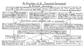

  
[Intangible Textual Heritage](../../../index)  [Bible](../../index) 
[Bible Critical Views](../index)  [Index](index)  [Previous](pch44) 
[Next](pch46) 

------------------------------------------------------------------------

[Buy this Book at
Amazon.com](https://www.amazon.com/exec/obidos/ASIN/B002EVPFEO/internetsacredte)

------------------------------------------------------------------------

  
*Pagan Christs*, by John M. Robertson, \[1911\], at Intangible Textual
Heritage

------------------------------------------------------------------------

#### § 18. Synopsis and Conclusion: Genealogy of Human Sacrifice and Sacrament.

Meantime it may be helpful to draw up a tentative genealogical scheme of
the history of the sacrificial idea as we have sketched it up to
Christianity, and further to reduce this to diagram form. We set out
with the dim primeval life in which

A. *All* "victims," whether animal or human, are not strictly sacrificed
but commonly *eaten*, the "Gods" and the "dead" being held to share in
the feast, as a feast. Dead relatives are similarly eaten, and parents
filially slain and eaten, to preserve their qualities in the family or
tribe. On such habits would follow the sacrifices of human beings at
funerals, [2](#fn_1059) held by Mr. Spencer to
be primordial forms of sacrifice proper. [3](#fn_1060)

p. 210

Thence would differentiate—

B. *Offerings* to the Gods. These would include burnt-offerings, fruits
and libations, especially first fruits, and latterly incense, [1](#fn_1061) corn, and wine; and with them might
correlate

B´. *Totem-Sacrifices*, in which the victim might be eaten either as
(*a*) the God or as (*b*) a mode of union with the God-ancestor or totem
species; and

B″. *Human Sacrifices* as such, normally of captives, which would be
eaten (*a*) along with the God as thank-offering or as food for the
slain dead, or (*b*) as propitiatory or "sin" offerings, or (*c*) as
vegetation-charms and life-charms, or else (*d*) buried in morsels as
vegetation-charms, or (*e*) as sanctifying foundations of houses or
villages. [2](#fn_1062)

In virtue of the general functioning of the priest there would thus
arise the general conception of

C. Priest-blessed *ritual sacrifices*, eaten as sacraments, including

C´. The quasi-totem-sacrifice, in which the God eats himself, as animal
or as symbol, in a sacramental communion with his worshippers; and

C″. Human sacrifices, in which the victim (*a*) represented the God, or
(*b*) had a special efficacy as being a king or a king's son, or (*c*) a
first-born or only son. In the case of Goddesses, the sacrifice might be
a virgin; and this concept would react on the conception of the God in
an ascetic movement, making him either double-sexed or virtually
sexless. For the sacrifice, nevertheless, the victim must latterly be as
a rule a criminal. These various victims might or might not be eaten.

There is thus evolved (1) the general conception of a peculiarly
efficacious *Eucharist* or *sacramental meal* in which is eaten,
symbolically or otherwise, a sacrificed animal or human being, normally
regarded as representing the God, though the God eats thereof. Latterly
men often assume that the animal so sacrificed is thus treated as being
an enemy of the God, where the nature of the animal admits of such an
interpretation. Finally, after public human sacrifices are abolished or
made difficult, there is found (2)

p. 211

  [  
Click to enlarge](img/21100.jpg)

p. 212

the practice of a *Mystery-Drama*, symbolical of the act of human
sacrifice, in which the victim is sympathetically regarded as an
unjustly slain God.

Such practices competing successfully with the official or public rites
and sacrifices, they in turn elicit a priesthood which raises them to
official ritual form. Thus there arises

D. The priest-administered eucharist, of which the mean or norm is
*Bread and Wine* = *Body and Blood*, but which may retain the form of

D´. The symbolical animal, or a dough image thereof, or

D″. A baked image of the God-Man or Child.

In virtue, however, of the symbolical principle, and of the priestly
function, the thing eaten, though still called the host (= *hostia*,
victim), may be reduced to a single symbol, which stands for the living
body, including its blood. Such is the "communion in one kind" or
consecrated wafer of the Catholic Church, repudiated by Protestants, who
revert to the "communion in two kinds" or bread *and* wine of the sacred
books. The Catholic practice is practically on a par with some of the
usages of the pre-Christian Mexicans; while the Protestant reverts to
the Mithraic and Dionysiak usages which were imitated by the early
Church.

Thus is an appallingly long-drawn evolution summed up for the modern
world in a symbol which to the uninstructed eye tells nothing of the
dreadful truth, and presents a fable in its place. If to die as a human
sacrifice for human beings be to deserve the highest human reverence,
the true Christs of the world are to be numbered not by units, but by
millions. Almost every land on this globe has during whole ages drunk
their annually shed blood. According to one calculation, made in the
last century, the annual death-roll from human sacrifice and female
infanticide in one section of British India alone was fifteen
hundred. [1](#fn_1063) Taking the sacrifices
at only a fifteenth of the total; noting further the calculation of Sir
George Grey, which gives four millions of victims for New Zealand alone
in 2,000 years; [2](#fn_1064) taking into
account the known holocausts of modern Africa and Polynesia, [3](#fn_1065) and pre-Christian Mexico, [4](#fn_1066) and the universal practice of
pre-Christian Europe, we are

p. 213

led to an estimate beside which every Christian reckoning of the "army
of martyrs" becomes insignificant. We are forced to reckon by thousands
of millions: the truth is too vast for realisation. *Tantum relligio*.
Thus has the human race paid in death for its faith in immortality.
"Laugh as much as you please," wrote Dobrizhoffer a century ago, "at the
sepulchral rites of the Abipones; you cannot deny them to be proof of
their believing in the immortality of the soul." [1](#fn_1067) Even so. And for rites at which
madness itself could not laugh, we have the same explanation. Of these
miserable victims of insane religion, the majority were "innocent" even
by the code that sacrificed them; and of the rest, in comparison with
those who slew them, who shall now predicate "guilt"? Thus have nameless
men and women done, many millions of times, what is credited to the
fabulous Jesus of the Christian gospels; they have verily laid down
their lives for the sin of many; and while the imaginary sacrifice has
been made the pretext of a historic religion during two thousand years,
the real sacrifices are uncommemorated save as infinitesimals in the
records of anthropology. Twenty literatures vociferously proclaim the
myth, and rivers of tears have been shed at the recital of it, while the
monstrous and inexpugnable truth draws at most a shudder from the
student, when his conceptual knowledge becomes for him at moments a
lightning-flash of concrete vision through the awful vista of the human
past. In a world which thus still distributes its sympathies, a rational
judgment on the historic evolution is not to be looked for save among
the few. Delusion as to the course of religious history must long follow
in the wake of the delusion which made the history possible. [2](#fn_1068)

------------------------------------------------------------------------

### Footnotes

[209:2](pch45.htm#fr_1059) As to the vogue of
these, see Letourneau, *Sociology*, Eng. tr. pp. 226, 231, 232, 234-5,
237, 240, 242-4, 246, 291-3. Cp. Grant Allen, *Evol. of the Idea of
God*, pp. 248, 282, 319.

[209:3](pch45.htm#fr_1060) *Principles of
Sociology*, i, § 141. See also Dr. Jevons, *Introd. to the Hist. of
Relig.*, pp. 161, 199-200; and Mr. Lang, *Myth, Rit., and Relig.*, 2nd
ed. i, 257, 263. Both Dr. Jevons and Mr. Lang, however, seem to
distinguish inconsistently between a "savage" and a "barbaric" stage;
and both at this point arbitrarily exclude propitiatory (or
sympathetic-magical) sacrifices, dealing only with the honorific and
Macular. Dr. Jevons treats the slaughter of persons at the grave of a
"savage chieftain" as "early"—that is, as prior to human sacrifice to
the Gods. But tolerably "low" savages in South America sacrificed
captives on Asiatic lines (J. G. Müller, *Amerik. Urrelig.*, pp. 58,
143, 282-3); and Dr. Jevons (p. 201, *note*) cites high testimonies to
the moral character of the Australian aborigines, whom for the purposes
of this argument Mr. Lang treats as low or backward. Again, Dr. Jevons
(p. 161) ascribes human sacrifice among the Americans and Polynesians to
lack of domestic animals, though the Polynesians have pigs and poultry;
while Mr. Lang lays stress on its absence among the Australians, who had
no domesticated animals at all. Letourneau (*Sociology*, p. 210)
suggests lack of animals as the reason for the common cannibalism of the
Maoris; but this view is negated by the case of many African peoples who
have domestic animals, and yet practise human sacrifice and cannibalism.
We seem rather led to regard human sacrifice as a specialty of the
general Polynesian race, to which the Australians do not appear to
belong. New Zealand is pronounced by Letourneau (*L’Evolution
Religieuse*, 1832, pp. 140-1) "the most archaic of the Polynesian
archipelagos, from the point of view of civilisation"; and Ellis
(*Polynes. Researches*, 2nd ed. iii, 348) heard of no human sacrifices
among them, despite their cannibalism; but such sacrifices had certainly
taken place in the past, the victims being sometimes eaten, sometimes
not. (White, *Anc. Hist. of the Maori*, Wellington, 1887, i, 12.) Sir
George Grey sums up that the creeds of the Maoris were "based upon a
system of human sacrifices to the Gods," and, as we said, reckons that
in a period of 2,000 years at least four millions of human beings had
been sacrificed in the islands where the usage Prevailed (*Polynesian
Mythology*, pref. end).

[210:1](pch45.htm#fr_1061) This is found in
the East among Turanians, Dravidians, and Semites; in the West among the
races reached by early Semitic culture; and in America in the form of
tobacco. (Lafitau, *Mœurs des sauvages ameriquains*, 1724, ii, 133-4;
Brine, *Travels amongst American Indians*, 1894, p. 170; Waitz,
*Anthropologie der Naturvölker*, iii, 155, 181, 220.) The principle
seems to have been the same as that of the burnt-offering—that the God
was reached by odours.

[210:2](pch45.htm#fr_1062) Presumably by way
of feeding, and so propitiating, the earth deities. But cp. Grant Allen,
*Evol. of Idea of God*, p. 249, for another theory—that the victim was
to be a protecting God.

[212:1](pch45.htm#fr_1063) *Calcutta Review*,
vol. x, Dec. 1848, p. 340.

[212:2](pch45.htm#fr_1064) Above, [p.
209](pch44.htm#page_209), *note*.

[212:3](pch45.htm#fr_1065) Leonard, *The Lower
Niger and its Tribes*, 1906, pp. 160, 400; Partridge, *Cross River
Natives*, 1905, pp. 56. 59, 62; H. Ling Roth, *Great Benin*, 1903, pp.
63, 69, 72, 77, etc.; Cunningham, *Uganda and its Peoples*, 1905, p.
215; Burton, *A Mission to Gelele*, 1864, ii, 20, 24: A. B. Ellis, *The
Tshi-Speaking Peoples*, 1887, pp. 35-72, 160, 161, 166, 170; *The
Ewe-Speaking Peoples*, 1890, pp. 120, 124, 1.25, 126, 128; W. Ellis,
*Polynesian Researches*, ed. 1831, i, 104, 348; iv, 362-3; Gill, *Myths
and Songs of the South Pacific*, 1876, pp. 14, 15, 24, 37, 289-90, 297.

[212:4](pch45.htm#fr_1066) Below, Part iv, §
5.

[213:1](pch45.htm#fr_1067) *Account of the
Abipones*, Eng. tr., ii, 269.

[213:2](pch45.htm#fr_1068) How slow is the
evolution may be gathered from the testimony of a modern anthropologist:
"To this day, as I can testify from personal observation, the Samaritans
on Mount Gerizim (where alone in all the world the passover-blood is now
shed, year by year) bring to mind the blood covenant aspect of this
rite, by their uses of that sacred blood. The spurting life-blood of the
consecrated lambs is caught in basins, as it flows from their cut
throats; and not only are all the tents promptly marked with the blood
as a covenant-token, but every child of the covenant receives also a
blood-mark on his forehead, between his eyes, in evidence of his
relation to God in the covenant of blood friendship." (H. Clay Trumbull.
D.D., *The Blood Covenant: A Primitive Rite and its Bearings on
Scripture*, 1887, p. 232.) On the theory of the Blood Covenant, the lamb
is the blood-brother of those who drink the blood. Even so, of old time,
was the slain child or man for whom the lamb was substituted.

------------------------------------------------------------------------

[Next: § 1. Primary and Secondary Ideas](pch46)
