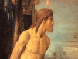

  
[Intangible Textual Heritage](../../../index)  [Bible](../../index.md) 
[Bible Critical Views](../index)  [Index](index)  [Previous](pch67.md) 
[Next](pch69.md) 

------------------------------------------------------------------------

[Buy this Book at
Amazon.com](https://www.amazon.com/exec/obidos/ASIN/B002EVPFEO/internetsacredte.md)

------------------------------------------------------------------------

  
*Pagan Christs*, by John M. Robertson, \[1911\], at Intangible Textual
Heritage

------------------------------------------------------------------------

#### § 7. The Cultus.

Resembling other cults at various points, the Mithraic was latterly
peculiar in others. The great specialty of this worship, as we learn
from several writers, is that it was carried on in caves—so far at least
as its special mysteries were concerned—the cave being considered so
all-important that, where natural caves did not exist,

p. 304

the devotees made artificial ones. [1](#fn_1534.md) Porphyry puts it on record [2](#fn_1535.md) that the "Persians, mystically
signifying the descent of the soul into the sublunary regions, and its
regression thence, initiate the mystic in a place which they call a
cavern. For, as Euboulos says, Zoroaster was the first who consecrated
in the neighbouring mountains of Persia a cave, in which there were
flowers and fountains, in honour of Mithra, the Maker and Father of all
things—a cave, according to him, being an image of the world, *which was
made by Mithra*. But the things contained in the cavern......were
symbols of the mundane elements and climates."

This explanation of the cave was not improbably suggested by a
well-known passage in Plato; [3](#fn_1536.md) and
it is obvious that the custom must have had some simpler origin. At an
early culture-stage among the Romans, indeed, we find the name *mundus*
given to the sacred cave on the Palatine Hill into which the people
threw specimens of all their domestic utensils and a handful of Roman
earth. [4](#fn_1537.md) This is remarkably close
to the symbolic idea in Porphyry; but there must have been an earlier
form still. [5](#fn_1538.md) A cave, in fact,
seems to have been one of the earliest forms of temple. [6](#fn_1539.md) It is easy to understand how to
half-civilised man caves would have a hundred mysterious significances,
as places for dwelling or meeting made by the Deity himself; and fire-
or sun-worshippers would have the special motives supplied by finding in
caves the remains of the fires of earlier men, and by the not unnatural
theory that the sun himself went into some cave when he went below the
horizon at night. Indeed, Porphyry admits that caves in the most remote
periods of antiquity were consecrated to the Gods, before temples were.
Thus the Curetes in Crete dedicated a cavern to Zeus; in Arcadia, a cave
was sacred to the moon, and to Lycean Pan; and in Naxos to
Dionysos. [7](#fn_1540.md)

p. 305

\[paragraph continues\] "But," he adds,
"wherever Mithra was known, they propitiated the God in a cavern." [1](#fn_1541.md)

It appears that the greatest sanctity attached to caves in the living
rock; and there are many remains of Mithraic altars cut in rocks; [2](#fn_1542.md) nay more, the rock came to be
specially associated with Mithra, [3](#fn_1543.md) who was named "rock-born"; and the
phrase, ''Θεὸς ἐκ πέτρας, God out of the rock," or "Mithras out of the
rock," became one of the commonest formulas of the cultus. [4](#fn_1544.md)

In these rock-caves, then, or in artificial caves, the priests of Mithra
celebrated the habitual rites and special mysteries of their religion.
The rising sun would be daily hailed with joy, [5](#fn_1545.md) as among the Jewish Essenes, and
sun-worshippers everywhere; and during the night, when the sun was
hidden, special prayers would be offered up. The first day of the week,
Sunday, was apparently from time immemorial consecrated to Mithra by
Mithraists; and as the Sun-God was pre-eminently "the Lord," Sunday was
"the Lord's day" long before the Christian era. [6](#fn_1546.md) On that day there must have been
special Mithraic worship. But we have some exact information as to the
two chief Mithraic ceremonies or festivals, those of Christmas and
Easter, the winter solstice and the vernal equinox, the birthday of the
Sun-God and the period of his sacrifice and his triumph. [7](#fn_1547.md) That Christmas is a solar festival of
unknown antiquity, which the early Christians appropriated to their
Christ in total ignorance of the real time of his birth, is no longer
denied by competent Christian scholars—when they happen to allude to the

p. 306

subject. That Easter is also a solar festival [1](#fn_1548.md) is perhaps not so freely recognised.
But we know not only that Mithra and Osiris (and Horus), like so many
other solar and vegetal deities, were especially adored at the vernal
equinox, [2](#fn_1549.md) but that in these
worships there were special formulas representing, apparently at this
date, [3](#fn_1550.md) the symbolical death of
the deity, the search for his body, and the finding of it. The Christian
Firmicus wrathfully tells how the priests of Osiris, who have a
representation of the God in the most secret part of their temples,
mourn for a certain number of days (presumptively forty, [4](#fn_1551) = Lent.md), while professedly searching
for the scattered members of his mangled body, till at length they feign
to have found it, when they finish their mourning and rejoice, saying,
"We have found him: rejoice we." [5](#fn_1552.md)
And we learn also from Tertullian that Osiris in the mysteries was
buried and came to life again. [6](#fn_1553.md)
Some such idea would seem to be implied in the ritual performed by the
people of Patræ at the annual festival of Dionysos, when the God, called
*Asymnetes* ("the Judge" or "the King"), represented by his image in a
chest, was carried outside of the temple in the night, to be hailed by
the worshippers. Of the image in the chest, it was obscurely told that
the sight of it had driven Eurypilus mad—a suggestion that it may have
been dismembered. [7](#fn_1554.md)

But as to Mithraism the details (if only we can be sure of one
identification) are still more precise. The worshippers, Firmicus tells
us, [8](#fn_1555.md) lay a stone image by night
on a bier and liturgically mourn for it, this image representing the
dead God. This symbolical corpse is then placed in the tomb, and after a
time is withdrawn, whereupon the worshippers rejoice, exhorting one
another to be of good hope; lights are brought in; and the priest
anoints the throats of the devotees, murmuring slowly: "Be of good
courage; ye have been instructed in the mysteries, and ye shall have
salvation from your sorrows." As the stone image would be laid in a
rock-tomb—the God being pre-eminently "from the rock" and worshipped in
a cave—the parallel to a central episode in the Christian legend is
sufficiently

p. 307

striking; and in view of the duplication of the motive on all hands, in
the cults of Osiris, Attis, Adonis, Dionysos, it is impossible to doubt
that we are dealing with a universal myth.

To assign the origin of the rite to any known religion would be
unwarrantable; nor is it even certain whether it was originally a part
of a solar or of a vegetal cult, though there are grounds for ascribing
it to the latter. In any case, it was adaptable to both. It is argued by
Dr. Frazer, the chief exponent of the lore of the subject, that the God
who dies and rises again does so not as Sun-God but as Vegetation-God;
and it may be granted that the vegetation principle is either primary or
present in the cults of Attis, Adonis, Dionysos, and Osiris. But on the
other hand the pre-eminently solar Herakles dies on the funeral pyre,
descends to Hades, and reascends to Heaven; the obviously solar Samson
of the Semitic myth, who also in its earlier form probably descended to
the underworld, [1](#fn_1556.md) dies ostensibly
in his solar capacity (with shorn hair, [2](#fn_1557.md) blinded, and placed between the
"pillars" = Herakles’ pillars), and must, as God, have risen again; and
even the strictly solar Apollo, as is shown by K. O. Müller, [3](#fn_1558.md) made his Descent to Hades, as did
Orpheus, who is inferribly a Day-God. Now, the Descent into Hades was
for mortals simply Death; and since the God as such cannot cease to
exist, he may as well be said to die in one way as in another. In all
these cases the explanation is more or less clearly astronomical; and it
is so in the case of the Descent of Mithra to Hades, noticed later;
though, as above remarked, the sacrificial principle, identifying the
God with the sacrifice, would so complicate the doctrine as to make the
solar cult approximate closely to that of the Vegetation-God.

This, however, was only one of the Mithraic mysteries, presumably
celebrated once a year. We have further records of another enacted at
the initiation of every new devotee, and probably repeated in some form
frequently. Justin Martyr, [4](#fn_1559.md) after
describing the institution of the Christian Lord's Supper, as narrated
in the gospels, goes on to say: "Which the wicked devils have imitated
in the mysteries of Mithra, commanding the same thing to be done. For,
that bread and a cup of water [5](#fn_1560.md)
are placed with certain incantations

p. 308

in the mystic rites of one who is being initiated, you either know or
can learn." This is borne out by Tertullian, who intimates [1](#fn_1561.md) that "the devil, by the mysteries of
his idols, imitates even the main parts of the divine mysteries. He also
baptises his worshippers in water, and makes them believe that this
purifies them of their crimes......There Mithra sets his mark on the
forehead of his soldiers; he celebrates the oblation of bread; he offers
an image of the resurrection, and presents at once the crown and the
sword; he limits his chief priest to a single marriage: he even has his
virgins and his ascetics (*continentes*)." Again, [2](#fn_1562.md) the devil "has gone about to apply to
the worship of idols those very things in which consists the
administration of Christ's sacraments."

Reference is here made to a certain ceremony of initiation. It strongly
suggests the mysteries which are practised in our own time among savage
tribes in many parts of the world. [3](#fn_1563.md) The complete initiation of a
worshipper, we know, was an elaborate and even a painful process,
involving many austerities, trial by water, trial by fire, by cold, by
hunger, by thirst, by scourging, by branding or bleeding, [4](#fn_1564.md) and the mock menace of death. [5](#fn_1565.md) Of these austerities different but
vague and scanty accounts are given. According to some accounts they
lasted fifteen days; according to others, for forty-eight: [6](#fn_1566.md) one old writer [7](#fn_1567.md) alleges eighty different kinds of
trials. It is more likely that they numbered twelve, seeing that on the
Mithraic monuments we find representations of twelve episodes, probably
corresponding to the twelve labours in the stories of Herakles, Samson,
and other sun-heroes; but probably also connected with the trials of the
initiated. [8](#fn_1568.md) More explicitly we
know from Porphyry and from Jerome that the devotees were divided into a
number of different degrees, symbolically marked by the

p. 309

names of birds and animals, and apparently by wearing, during some of
the rites, the skins or heads of these animals. [1](#fn_1569.md) Porphyry [2](#fn_1570.md) mentions grades of lions, lionesses,
and crows, and higher grades of eagles and hawks; Jerome [3](#fn_1571.md) speaks of crow, gryphon, soldier,
lion, Persian (or Perses), sun, Bromios = roarer (or, the bull), and
father. Out of the various notices, partly by hypothesis, M. Lajard has
constructed a not quite trustworthy scheme, [4](#fn_1572.md) representing twelve Mithraic degrees:
three terrestrial, the soldier, the lion, [5](#fn_1573.md) and the bull; three aërial, the
vulture, the ostrich, and the raven; three igneous, the gryphon, the
horse, and the sun; and three divine, the grade of fathers, named eagle,
sparrow-hawk, and father of fathers. [6](#fn_1574.md) It makes a sufficiently grotesque
list, in this or any other form; but it is the old story—all religions
are absurd to those who do not believe them; [7](#fn_1575.md) and it is not well for those who keep
a private conservatory, however small, to throw stones.

The "mark on the forehead" of the initiate, finally, was in all
likelihood the cross, the universal symbol of life and immortality, and
in particular of the Sun-God. Presumably it was not the *gammadion* or
*swastika*, the most specific symbol of the Sun, for that appears to
have been notably absent from Persian art. [8](#fn_1576.md) That it was one of the normal forms of
the "Christian" cross may be inferred from the mode of Tertullian's
statement, and from the fact

p. 310

that the *tau* or cross was inferribly a forehead mark in the Judaic
cult set forth in the book of Revelation. [1](#fn_1577.md) We know that the symbol entered into
the fire-worship of Persia by way of architecture; [2](#fn_1578.md) and it could not have been absent from
the imagery of an eastern Sun-God of the time.

------------------------------------------------------------------------

### Footnotes

[304:1](pch68.htm#fr_1534.md) See Justin Martyr,
*Dial. with Trypho*, cc. 70, 78. Caves were made in honour of Mithra, as
temples in honour of other Gods. See Orelli, 2340, 2341. There were no
other Mithraic temples. Cumont, ii, 57-8.

[304:2](pch68.htm#fr_1535.md) *De antro
nympharum*, vi. Cp. Firmicus, v.

[304:3](pch68.htm#fr_1536.md) *Republic*, B. vii.

[304:4](pch68.htm#fr_1537.md) Macrobius,
*Saturnalia*, i, 16; Festus, s. v. *Mundus*.

[304:5](pch68.htm#fr_1538.md) Here I venture to
dissent from the view of M. Cumont (i, 6) that the Persian custom of
sacrificing in the open air "gave birth" to that of worshipping Mithra
in caverns. I cannot follow the supposed causation. Open-air sacrifice
was in early times a Greek and a Semitic as well as a Persian usage. The
Roman *mundus* seems to have passed for the entrance to the lower world.

[304:6](pch68.htm#fr_1539.md) See the article
"The Mycenean Tree and Pillar Cult and its Mediterranean Relations." by
A. J. Evans, in the *Journal of Hellenic Studies*, vol. xxi (1901), p.
99, as to the multitude of caves containing votive and sacrificial
deposits found in Crete. Cp. *Christianity and Mythology*, 2nd ed. p.
207, note.

[304:7](pch68.htm#fr_1540.md) The usage was in
fact nearly universal in early times. Cp. Wait, *Jewish, Oriental, and
Classical Antiquities*, p. 47. Hermes and Zeus were cave-born (Homerid.
*Hymn to Hermes;* Hesiod, *Theogony*, 483); and Typhon in turn was born
in the Cilician caves (Æschylus, *Prom*. 359-60; Pindar, *Pythia*, i,
32). The resting-places of Apollo and Dionysos were alike caves (Pindar,
*Olymp*. vii, 57; Diod. Sic, iii, 59). Finally, Apollo, Dionysos,
Herakles, Cybelê, Dèmêtêr, Poseidon, and Zeus were all worshipped in
caves (Pomponius Mela, i, 5; Pausanias, i, 28; ii, 23; iii, 25; vii, 25;
viii, 15, 36, 42; Cicero, *De* p. 305 *natura
deorum*, i, 42; Strabo, xvi, 2, § 38). In Phrygia, Herakles, Hermes, and
Apollo were specially called "the cave Gods" (Pausanias, x, 32). But
whereas all these deities, starting from the cave, which is the primary
temple, acquired loftier fanes, the cult of Mithra in the west reverted
and adhered to the cave, natural or artificial. The idea was preserved,
apparently, in the worship of the Sun at Hatra in Assyria, where the
temple was an entirely dark place (Justi, *Geschichte des alten
Persiens*, 1879, p. 67).

[305:1](pch68.htm#fr_1541.md) *De antro*, xx. Cp.
Statius, *Theb*. i, 719-20; and Commodianus: "*vertebatque boves alienos
semper in antris*" (*Instructiones*, i, 13).

[305:2](pch68.htm#fr_1542.md) Cp. the pictures in
Jacob Bryant's *Analysis of Ancient Mythology*, ed. 1774, i, 232, 234,
294; and in Cumont's *Textes et Monumentes*, *passim*.

[305:3](pch68.htm#fr_1543.md) As with Apollo,
born in rocky Delos, to whom the hymnist sings: "Thou hast had delight
*in all rocks*, in the steep crags of tall mountains, in rivers hurrying
seaward, in shingles sloping to the tide, and harbours of the sea"
(Homerid. *Hymn to the Delian Apollo*). The idea seems to be that the
mountains and rivers and harbours were all visible from the place of the
God's birth on Mount Cynthus (*see* ll. 25-44); while the rock, which
can strike fire, is his earthly symbol, and as it were his source.
Johannes Lydus (*De mensibus*, iii, § 26) gives as the reason for Mithra
being held rock-born that rock is "the central point of fire."

[305:4](pch68.htm#fr_1544.md) Firmicus, *De
Errore*, xxi; Justin Martyr, *Dialogue with Trypho*, c. 70; Jerome,
*Adversus Jovinianum*, i, 7 (Migne, xxiii, col. 219); Windischmann, pp.
61-2, citing Commodianus and Johannes Lydus.

[305:5](pch68.htm#fr_1545.md) Under the Mazdean
system, prayer was offered to Mithra thrice daily; at dawn, at noon, and
at sunset. (Rawlinson, *Seventh Oriental Monarchy*, p. 628, citing
Spiegel, *Tradit. Schrift. d. Pars.* p. 135).

[305:6](pch68.htm#fr_1546.md) Above, [p.
180](pch39.htm#page_180.md), *note*. As to this fact, which has been
contemptuously denied by Dr. J. E. Carpenter, see Appendix.

[305:7](pch68.htm#fr_1547.md) Julian, *In regem
solem*, cc. 19, 20; Preller, *Röm. Myth.* p. 755; von Bohlen, *Das alte
Indian*. i, 258; Creuzer, *Das Mithrēum von Neuenheim*, p. 29. Cp.
*Christianity and Mythology*, 2nd ed. p. 308.

[306:1](pch68.htm#fr_1548.md) Or rather a
luni-solar. It is singular that this movable feast should be celebrated
as an anniversary of an event with apparently no orthodox misgivings.

[306:2](pch68.htm#fr_1549.md) Macrobius,
*Saturnalia*, i, 18. Cp. Preller, *Röm. Myth.*, 1865, p. 760.

[306:3](pch68.htm#fr_1550.md) But see Plutarch,
*On Isis and Osiris*, c. 39, which creates a difficulty. There was
considerable variance in the dates of the solar festivals in different
countries. Cp. Julian, *In regem solem*, c. 20, and Max Müller, *Natural
Religion*, pp. 529-30.

[306:4](pch68.htm#fr_1551.md) Compare the forty
nights’ mourning in the mysteries of Proserpine. *De Errore*, c. xxviii
(xxvii, ed. Halm).

[306:5](pch68.htm#fr_1552.md) *De Errore*, last
cit.

[306:6](pch68.htm#fr_1553.md) *Against Marcion*,
i, 13.

[306:7](pch68.htm#fr_1554.md) Pausanias, vii, 19,
20. Cp. ii, 7, where it is told that the Sicyonians have "statues in a
secret place, which one night in every year they bring to the temple of
Dionysos."

[306:8](pch68.htm#fr_1555.md) *De Errore*, xxiii
(xxii). I have elsewhere (*Christianity and Mythology*, 2nd ed. p. 381,
note) discussed Dr. Frazer's view that this passage in Firmicus refers
to the cult of Attis. The evidence is clearly against it, the stone
image belonging distinctly to the cult of Mithra, though similar rites,
with wooden images, belonged to the worships of Attis and Osiris. In the
Dionysiak cult, however, the image may have been of stone.

[307:1](pch68.htm#fr_1556.md) Steinthal on *The
Legend of Samson*, § 3.

[307:2](pch68.htm#fr_1557.md) It is true that in
some cults this might signify only previous dedication and the
preparation for sacrifice. In the practice of the man-sacrificing
Khonds, for instance, the victim was kept unshorn till ten or twelve
days before the sacrifice, when his hair was cut (Macpherson,
*Memorials*, p. 117). But in the story of Samson the shearing of the
hair has clearly also the significance of the weakening of the sun's
heat.

[307:3](pch68.htm#fr_1558.md) *Introd. to
Mythol.* pp. 244-6, note. Cp. Preller, *Gr. Myth.* ii, 317.

[307:4](pch68.htm#fr_1559.md) 1 *Apol*. c. 66.

[307:5](pch68.htm#fr_1560.md) The Ebionite
Christians (the earliest), it will be remembered, celebrated the
communion rite with bread and water (Epiphanius, *Hær*. 30). And water
was mixed with wine in later usage; see Bingham, *Christian
Antiquities*, B. xv, c. ii, § 7 (ed. 1855, v. 242).

[308:1](pch68.htm#fr_1561.md) *Præscr.* c. 40;
Cp. *De Rapt.* c. 5; *De Corona*, c. 15.

[308:2](pch68.htm#fr_1562.md) *Præscr.* c. 40.

[308:3](pch68.htm#fr_1563.md) Cp. Cumont, i,
315-316.

[308:4](pch68.htm#fr_1564.md) On this see Mr.
King's *Gnostics*, p. 139, citing Aug. in Johann. i, 7. Mem. Revelation,
xiii, 17; also Gregory Nazianzen's *First Invective against Julian*, c.
70.

[308:5](pch68.htm#fr_1565.md) On this see the
details collected by Frazer, *Golden Bough*, 2nd ed. iii, 422-445, of
the primitive cults in which "death at initiation" is a ritual feature.
This is one of the origins of the idea of being "born again."

[308:6](pch68.htm#fr_1566.md) Sainte Croix,
*Recherches*, ii, 126, *n*.

[308:7](pch68.htm#fr_1567.md) Nonnus, cited by
Selden, *De Diis Syris*, Syntag. i. c. 5; and by Windischmann, p. 69.
See there also the important citation from Elias of Crete, according to
whom the trials were twelve, and were "per ignem, per frigus, per famem,
per sitim, per flagra, per itineris molestiam, aliaque id genus."
Compare Suidas, as cited p. 314. As to the origin of the trials, see
Darmesteter on *Mihir Yasht*, xxx, 122. Darmesteter suggests that the
trials may be traceable to that passage, which runs:—"Ahuramazda
answered, Let them wash their bodies three days and three nights; let
them undergo thirty strokes for the sacrifice and prayer unto
Mithra......Let them wash their bodies two days and two nights; let them
undergo twenty strokes for," etc.

[308:8](pch68.htm#fr_1568.md) On the twelve
episodes, cp. Sainte-Croix, as cited, with King, *Gnostics*, p. 128.
Compare the "twelve stoles," in the mysteries of Isis, mentioned by
Apuleius (*Metam*, B. xi). There is a remarkable correspondence between
the twelve Mithraic trials and twelve forms of Hindoo penance
(especially as regards the last), as described by Maurice, *Indian
Antiquities*, 1794, v, 981. These twelve orders of fast include trials
lasting fifteen days; and the whole would cover more than eighty days.

[309:1](pch68.htm#fr_1569.md) On this practice
cp. Cumont, as last cited, and W. Simpson, *Jonah*, 1899, pp. 29-33.

[309:2](pch68.htm#fr_1570.md) *De Abstinentia*,
iv, 16.

[309:3](pch68.htm#fr_1571.md) *Epistola*, cvii
(vii), *ad Lætam*.

[309:4](pch68.htm#fr_1572.md) *Recherches sur le
Culte Public et Mystères de Mithra*, ed. 1867, p. 132, *et seq*. The
main authority for twelve degrees is Porphyry's citation from Pallas as
to the signs of the zodiac; but M. Lajard's list is not zodiacal. The
grade of the ostrich is particularly ill made-out (p. 338).

[309:5](pch68.htm#fr_1573.md) Every animal's name
used must have had a symbolical meaning. Thus we have it through
Tertullian (*Against Marcion*, i, 13) that "the lions of Mithra are
mysteries of arid and scorched nature."

[309:6](pch68.htm#fr_1574.md) Apart from
dubieties of detail, it may be taken as certain that the common
principle of quadration, or grouping in fours, was distinctly recognised
in the Mithraic cult; and likewise the principle of trinities or sets of
three. In an old Mithraic monument at Mycelia are figured three rings
and four balls. For the Persians, too, as for Greeks and Romans, the
Sun's chariot had four horses (*Mihir Yasht*, xxxi, 125), who stood for
the four seasons as well as the "four elements"—earth, air, fire, and
water. Heaven, too, was by them represented as quadrate. See Bähr,
*Symbolik des Mosaischen Cultus*, 1837, i, 166; also ii, 147, as to the
priestly arrangement of the 12 signs in 4 rows of threes; and Creuzer,
as there cited. That four and seven (4 + 3) were numbers always
occupying the Persian mystics we may gather from a quatrain of Omar
Khayyam (cited by Bähr, p. 167) exhorting a Sufi to give them up and
drink wine.

[309:7](pch68.htm#fr_1575.md) There is a curious
correspondence between M. Lajard's four grades and the emblems of the
four evangelists given by Augustine: Matthew = lion, Mark = man (this
order often reversed), Luke = ox, John = eagle. See "Variorum Teachers’
Bible," *Aids to Students*, p. 10. These, however, were introduced into
Judaism from Assyrian sources at the exile. Cp. Ezekiel, i, 10; x, 14;
and Rev. iv, 7. It is interesting to note in this connection that the
four Egyptian amenthes or genii of Hades, the mediators for the dead,
had respectively the beads of a man, a hawk, an ape, and a dog (Sharpe,
*Hist. of Egypt*, 7th ed. i, 163), while the Assyrian cherubim were
compounded of lion, eagle, and man, with a general approximation to the
ox. The Arabs had the same symbols (Wait, as cited, p. 155). The
original source of the idea is clearly the zodiac, which figures so
largely in the Apocalypse. The four "corner" constellations were the
Lion, the Bull, the Waterman, and the Scorpion. But the latter, being an
evil and destructive sign, could not be given to an Evangel, so there
would naturally be substituted that of the Eagle, which rises before
that of the Man, and like that is opposite the Lion.

[309:8](pch68.htm#fr_1576.md) Goblet d’Alviella,
*The Migration of Symbols*, Eng. tr. 1894, pp. 80-82.

[310:1](pch68.htm#fr_1577.md) Cp. Zœckler, *The
Cross of Christ*, Eng. tr. 1877, pp. 80-81, 105; Rev. vii, 3; xiv, 1;
xxii, 4; Ezek. ix, 4; S. Baring Gould, *Curious Myths*, 1888, pp. 376-7.

[310:2](pch68.htm#fr_1578.md) Justi. *Gesch. der
oriental. Völker im Altertum*, p. 397.

------------------------------------------------------------------------

[Next: § 8. The Creed](pch69.md)
