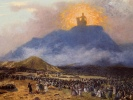

  
[Intangible Textual Heritage](../../../index)  [Bible](../../index) 
[Critical Views](../index)  [Index](index)  [Previous](phai06) 
[Next](phai08) 

------------------------------------------------------------------------

[Buy this Book at
Amazon.com](https://www.amazon.com/exec/obidos/ASIN/B002EVPEBI/internetsacredte)

------------------------------------------------------------------------

  
*Prolegomena to the History of Ancient Israel*, by Julius Wellhausen,
\[1885\], at Intangible Textual Heritage

------------------------------------------------------------------------

p. 121

### CHAPTER IV.

### *THE PRIESTS AND THE LEVITES*.

#### I.

1\. The problem now to be dealt with is
exhibited with peculiar distinctness in one pregnant case with which it
will be well to set out. The Mosaic law, that is to say, the Priestly
Code, distinguishes, as is well known, between the twelve secular tribes
and Levi, and further within the spiritual tribe itself, between the
sons of Aaron and the Levites, simply so called. The one distinction is
made visible in the ordering of the camp in Num. ii., where Levi forms
around the sanctuary a cordon of protection against the immediate
contact of the remaining tribes; on the whole, however, it is rather
treated as a matter of course, and not brought into special prominence
(Num. xviii. 22). The other is accentuated with incomparably greater
emphasis. Aaron and his sons alone are priests, qualified for
sacrificing and burning incense; the Levites are hieroduli (3 Esdras i.
3), bestowed upon the Aaronidæ for the discharge of the inferior
services (Num. iii. 9). They are indeed their tribe fellows, but it is
not because he belongs to Levi that Aaron is chosen, and his priesthood
cannot be said to be the acme and flower of the general vocation of his
tribe. On the contrary, rather was he a priest long before the Levites
were set apart; for a considerable time after the cultus has been
established and set on foot these do not make any appearance,—not at all
in the whole of the third book, which thus far does little honour to its
name *Leviticus*. Strictly speaking, the Levites do not even belong to
the clergy: they are not called by Jehovah, but consecrated by the
children of Israel to the sanctuary,—consecrated in the place of the
first-born, not however as priests (neither in Num, iii., iv., viii.,
nor anywhere else in the Old Testament, is there a single trace of the
priesthood of the first-born), but as a gift due to the priests, as such
being even required to undergo the

p. 122

usual "waving" before the altar, to symbolise their being cast into the
altar flame (Num. viii.). The relationship between Aaron and Levi, and
the circumstance that precisely this tribe is set apart for the
sanctuary in compensation for the first-born, appears almost accidental,
but at all events cannot be explained by the theory that Aaron rose on
the shoulders of Levi; on the contrary, it rather means that Levi has
mounted up by means of Aaron, whose priesthood everywhere is treated as
having the priority. Equality between the two is not to be spoken of;
their office and their blood relationship separates them more than it
binds them together.

Now, the prophet Ezekiel, in the plan of the new Jerusalem which he
sketched in the year 573, takes up among other things the reform of the
relations of the *personnel* of the temple, and in this connection
expresses himself as follows (xliv. 6-16):—"Thus saith the Lord Jehovah,
Let it suffice you of all your abominations, O house of Israel! in that
ye have brought in strangers, uncircumcised in heart and uncircumcised
in flesh, to be in my sanctuary, to pollute it, even my house, when ye
offer my bread, the fat and the blood, and have broken my covenant by
all your abominations. And ye have not kept the charge of my holy
things, inasmuch as ye have set these [1](#fn_80) to be keepers of my charge in my
sanctuary. Therefore, thus saith the Lord Jehovah, No stranger
uncircumcised in heart and uncircumcised in flesh shall enter into my
sanctuary; none, of all that are among the children of Israel. But the
Levites who went away far from me when Israel went astray from me after
their idols, they shall even bear their iniquity, and they shall be
ministers in my sanctuary, officers at the gates of the house and
ministers of the house; they shall slay for the people the
burnt-offering and the thank-offering, and they shall stand before them
to minister unto them. Because they ministered unto them before their
idols, and caused the house of Israel to fall into iniquity, therefore
have I lifted up my hand against them, saith the Lord Jehovah, and they
shall bear their iniquity. They shall not come near unto me to do the
office of a priest unto me, nor to come near to any of my holy things,
but they shall bear their shame and their abominations which they have
committed. And I will make them keepers of the charge of the house, for
all its service, and for all that shall be done therein. But the
priests,

p. 123

the Levites, sons of Zadok, that kept the charge of my sanctuary when
the children of Israel went astray from me, they shall come near to me
to minister unto me, and they shall stand before me to offer unto me the
fat and the blood, saith the Lord Jehovah; they shall enter into my
sanctuary, and come near to my table to minister unto me, and they shall
keep my charge."

From this passage two things are to be learned. First, that the
systematic separation of that which was holy from profane contact did
not exist from the very beginning; that in the temple of Solomon even
heathen (Zech. xiv. 21), probably captives, were employed to do
hierodulic services which, according to the law, ought to have been
rendered by Levites, and which afterwards actually were so rendered.
Ezekiel, it is indeed true, holds this custom to be a frightful abuse,
and one might therefore maintain it to have been a breach of the temple
ordinances suffered by the Jerusalem priests against their better
knowledge, and in this way escape accusing them of ignorance of their
own law. But the second fact, made manifest by the above-quoted passage,
quite excludes the existence of the Priestly Code so far as Ezekiel and
his time are concerned. The place of the heathen temple-slaves is in
future to be taken by the Levites. Hitherto the latter had held the
priesthood, and that too not by arbitrary usurpation, but in virtue of
their own good right. For it is no mere relegation back to within the
limits of their lawful position when they are made to be no longer
priests but temple ministrants, it is no restoration of the *status quo
ante*, the conditions of which they had illegally broken; it is
expressly a degradation, a withdrawal of their right, which appears as a
punishment and which must be justified as being deserved; "they shall
bear their iniquity." They have forfeited their priesthood, by abusing
it to preside over the cultus of the high places, which the prophet
regards as idolatry and hates in his inmost soul. Naturally those
Levites are exempted from the penalty who have discharged their
functions at the legal place,—the Levites the sons of Zadok,—namely, at
Jerusalem, who now remain sole priests and receive a position of
pre-eminence above those who hitherto have been their equals in office,
and who are still associated with them by Ezekiel, under the same common
name, but now are reduced to being their assistants and hieroduli.

It is an extraordinary sort of justice when the priests of the abolished
Bamoth are punished simply for having been so, and conversely the

p. 124

priests of the temple at Jerusalem rewarded for this; the fault of the
former and the merit of the latter consist simply in their existence. In
other words, Ezekiel merely drapes the logic of facts with a mantle of
morality. From the abolition of the popular sanctuaries in the provinces
in favour of the royal one at Jerusalem, there necessarily followed the
setting aside of the provincial priesthoods in favour of the sons of
Zadok at the temple of Solomon. The original author of the
centralisation, the Deuteronomic lawgiver, seeks indeed to prevent this
consequence by giving to the extraneous Levites an equal right of
sacrificing in Jerusalem with their brethren hereditarily settled there,
but it was not possible to separate the fate of the priests from that of
their altars in this manner. The sons of Zadok were well enough pleased
that all sacrifices should be concentrated within their temple, but they
did not see their way to sharing their inheritance with the priesthood
of the high places, and the idea was not carried out (2 Kings xxiii. 9).
Ezekiel, a thorough Jerusalemite, finds a moral way of putting this
departure from the law, a way of putting it which does not explain the
fact, but is merely a periphrastic statement of it. With Deuteronomy as
a basis it is quite easy to understand Ezekiel's ordinance, but it is
absolutely impossible if one starts from the Priestly Code. What he
regards as the original right of the Levites, the performance of
priestly services, is treated in the latter document as an unfounded and
highly wicked pretension which once in the olden times brought
destruction upon Korah and his company; what he considers to be a
subsequent withdrawal of their right, as a degradation in consequence of
a fault, the other holds to have been their hereditary and natural
destination. The distinction between priest and Levite which Ezekiel
introduces and justifies as an innovation, according to the Priestly
Code has always existed; what in the former appears as a beginning, in
the latter has been in force ever since Moses,—an original datum, not a
thing that has become or been made. [1](#fn_81)
That the prophet should know nothing about a priestly law with whose
tendencies he is in thorough sympathy admits of only one
explanation,—that it did not then exist. His own ordinances are only to
be understood as preparatory steps towards its own exactment.

p. 125

2\. Nöldeke, however, interprets the parallelism between the sons of
Aaron and the sons of Zadok in favour of the priority of the Priestly
Code, which, after all, he points out, is not quite so exclusive as
Ezekiel. [1](#fn_82) But, in the first place,
this is a point of subordinate importance, the main thing being that
Ezekiel has to make the distinction between priests and Levites, which
is regarded in the Priestly Code as very ancient. In presence of the
fact that the former introduces as a new thing the separation which the
latter presupposes, the precise degree of the distinction drawn by the
two is of no consequence whatever. In the next place, to bring the sons
of Aaron into comparison with the sons of Zadok, as a proof of their
higher antiquity, is just as reasonable as to bring the tabernacle into
comparison with the temple of Jerusalem for a similar purpose. The
former are priests of the tabernacle, the latter of the temple; but as
in point of fact the only distinction to be drawn between the Mosaic and
the actual central sanctuary is that between shadow and substance, so
neither can any other be made between the Mosaic and the actual central
priesthood. In the Priestly Code the ancient name is introduced instead
of the historical one, simply in order to maintain the semblance of the
Mosaic time; if the circumstance is to be taken as betokening the
earlier origin of the work, then a similar inference must be drawn also
from the fact that in it the origin and character of the Levites is
quite obscure, while in Ezekiel it is palpably evident that they are the
priests thrown out of employment by the abolition of the Bamoth, whom
necessity has compelled to take a position of subordination under their
haughty fellow-priests at Jerusalem. In truth it is, quite on the
contrary, a proof of the post-exilian date of the Priestly Code that it
makes sons of Aaron of the priests of the central sanctuary, who, even
in the traditional understanding (2 Chron. xiii. 10), are in one way or
other simply the priests of Jerusalem. By this means it carries their
origin back to the foundation of the theocracy, and gives them out as
from the first having been alone legitimate. But such an idea no one
could have ventured to broach before the exile. At that time it was too
well known that the priesthood of the Jerusalem sept could not be traced
further back than David's time, but dated from Zadok, who in Solomon's
reign ousted the

p. 126

hereditary house of Eli from the position it had long previously held,
first at Shiloh and Nob, and afterwards at Jerusalem, at what had become
the most prominent sanctuary of Israel.

In a passage of Deuteronomic complexion, which cannot have been written
long before the exile, we read in a prediction made to Eli regarding the
overthrow of his house by Zadok: "I said indeed, saith Jehovah the God
of Israel, that thy house and the house of thy father shall walk before
me for ever; but now I say, Be it far from me, for them that honour me I
will honour, but they that despise me shall be lightly esteemed. Behold,
the days come that I will cut off thine arm and the arm of thy father's
house, . . .and I will raise up for myself a faithful priest who shall
do according to what is in my heart and in my mind; and I will build him
a sure house, and he shall walk before mine anointed for ever" (1 Sam.
ii. 27-36). Here it is the house of Eli, and of Eli's father, that is
the priestly family duly chosen in Egypt; *contrary* to hereditary
title, and contrary to a promise of perpetual continuance, is it deposed
at the higher claims of justice. The faithful priest who is to fill the
vacant place is Zadok. This is expressly said in 1 Kings 2:27; and no
other than he ever had a "sure house" and walked uninterruptedly as its
head and ruler before the kings of Judah. This Zadok, accordingly,
belongs neither to Eli's house nor to that of Eli's father; his
priesthood does not go back as far as the time of the founding of the
theocracy, and is not in any proper sense "legitimate;" rather has he
obtained it by the infringement of what might be called a constitutional
privilege, to which there were no other heirs besides Eli and his
family. Obviously he does not figure as an intermediate link in the line
of Aaron, but as the beginner of an entirely new genealogy; the
Jerusalem priests, whose ancestor he is, are interlopers dating from the
beginning of the monarchical period, in whom the old Mosaic
*sacerdotium* is not continued, but is broken off. If then they are
called in the Priestly Code "sons of Aaron," or at least figure there
among the sons of Aaron, with whom they can only in point of fact be
contrasted, the circumstance is an unmistakable indication that at this
point the threads of tradition from the pre-exilic period have been
snapped completely, which was not yet the case in Ezekiel's time. [1](#fn_83)

p. 127

The relation between the priestly legislation and the Book of Ezekiel,
which has now been shown, gives direction and aim to the following
sketch, in which it is sought to exhibit the individual phenomenon in
its general connection.

#### II.

1\. The setting apart from the rest of the people of an entire tribe as
holy, and the strongly accentuated distinction of ranks within that
tribe, presuppose a highly systematised separation between sacred and
profane, and an elaborate machinery connected with cultus. In fact,
according to the representation given in the Priestly Code, the
Israelites from the beginning were organised as a hierocracy, the clergy
being the skeleton, the high priest the head, and the tabernacle the
heart. But the suddenness with which this full-grown hierocracy
descended on the wilderness from the skies is only matched by the
suddenness with which it afterwards disappeared in Canaan, leaving no
trace behind it. In the time of the Judges, priests and Levites, and the
congregation of the children of Israel assembled around them, have
utterly vanished; there is hardly a *people* Israel,—only individual
tribes which do not combine even under the most pressing necessities,
far less support at a common expense a clerical *personnel* numbering
thousands of men, besides their wives and families. Instead of the
Ecclesiastical History of the Hexateuch, the Book of Judges forthwith
enters upon a secular history completely devoid of all churchly
character. The high priest, who according to the Priestly Code is the
central authority by the grace of God, is here quite left out in the
cold, for the really acting heads of the people are the Judges, people
of an entirely different stamp, whose authority, resting on no official
position, but on strength of personality and on the force of
circumstances, seldom extends beyond the limits of their tribe. And it
is plain that in this we behold not the sorry remains of an
ecclesiastico-political system once flourishing under Moses and Joshua,
now completely fallen into ruins, but the first natural beginnings of a
civil authority which after a course of further development finally led
to the monarchy.

In the kernel of the Book of Judges (chaps. iii.-xvi.) there nowhere
occurs a single individual whose profession is to take charge of the
cultus.

p. 128

\[paragraph continues\] Sacrifice is in
two instances offered, by Gideon and Manoah; but in neither case is a
priest held to be necessary. In a gloss upon 1 Sam. vi. 13 seq. the
divergence of later custom reveals itself. When the ark of Jehovah was
brought back from exile in Philistia upon the new cart, it halted in the
field of Bethshemesh beside the great stone, and the inhabitants of
Bethshemesh, who were at the time busy with the wheat harvest, broke up
the cart and made on the stone a burnt-offering of the kine by which it
had been drawn. After they have finished, the Levites come up (ver. 15)
(in the pluperfect tense) and proceed as if nothing had happened, lift
the ark from the now no longer existent cart, and set it upon the stone
on which the sacrifice is already burning;—of course only in order to
fulfil the law, the demands of which have been completely ignored in the
original narrative. Until the cultus has become in some measure
centralised the priests have no *locus standi;* for when each man
sacrifices for himself and his household, upon an altar which he
improvises as best he can for the passing need, where is the occasion
for people whose professional and essential function is that of
sacrificing for others? The circumstance of their being thus
inconspicuous in the earliest period of the history of Israel is
connected with the fact that as yet there are few great sanctuaries. But
as soon as these begin to occur, the priests immediately appear. Thus we
find Eli and his sons at the old house of God belonging to the tribe of
Ephraim at Shiloh. Eli holds a very exalted position, his sons are
depicted as high and mighty men, who deal with the worshippers not
directly but through a servant, and show arrogant disregard of their
duties to Jehovah. The office is hereditary, and the priesthood already
very numerous. At least in the time of Saul, after they had migrated
from Shiloh to Nob, on account of the destruction by the Philistines of
the temple at the former place, they numbered more than eighty-five men,
who, however, are not necessarily proper blood-relations of Eli,
although reckoning themselves as belonging to his clan (1 Sam. xxii.
11). [1](#fn_84) One sanctuary more is referred
to towards the close of the period of the Judges,—that at Dan beside the
source of the Jordan. A rich Ephraimite, Micah, had set up to Jehovah a
silver-covered

p. 129

image, and lodged it in an appropriate house. At first he appointed one
of his sons to be its priest, afterwards Jonathan ben Gershom ben Moses,
a homeless Levite of Bethlehem-Judah, whom he counted himself happy in
being able to retain for a yearly salary of ten pieces of silver,
besides clothing and maintenance. When, however, the Danites, hard
pressed by the Philistines, removed from their ancient settlements in
order to establish a new home for themselves on the slopes of Hermon in
the north, they in passing carried off both Micah's image and his
priest; what led them to do so was the report of their spies who had
formerly lodged with Micah and there obtained an oracle. It was in this
way that Jonathan came to Dan and became the founder of the family which
retained the priesthood at this afterwards so important sanctuary down
to the period of the deportation of the Danites at the Assyrian
captivity (Judges xvii., xviii.). His position seems very different from
that of Eli. The only point of resemblance is that both are hereditary
priests, Levites so called, and trace their descent from the family of
Moses,—of which more anon. But while Eli is a man of distinction,
perhaps the owner of the sanctuary, at all events in a position of
thorough independence and the head of a great house, Jonathan is a
solitary wandering Levite who enters the service of the proprietor of a
sanctuary for pay and maintenance, and is indeed nourished as a son by
his patron, but by no means treated with special respect by the Danites.

The latter case, it may well be conjectured, more nearly represents the
normal state of matters than the former. An independent and influential
priesthood could develop itself only at the larger and more public
centres of worship, but that of Shiloh seems to have been the only one
of this class. The remaining houses of God, of which we hear some word
from the transition period which preceded the monarchy, are not of
importance, and are in private hands, thus corresponding to that of
Micah on Mount Ephraim. That of Ophra belongs to Gideon, and that of
Kirjathjearim to Abinadab. In fact, it appears that Micah, in appointing
one to minister at his sanctuary for hire, would seem to have followed a
more general practice. For the expression ‏מלא ידו‎, which still
survived as a *terminus technicus* for the ordination of priests long
after they had attained a perfectly independent position, can originally
in this connection hardly have meant anything else than a filling of the
hand with money or its equivalent; thus the priestly office would appear
in the older time to have been a paid one, perhaps

p. 130

the only one that was paid. Whom he shall appoint is at the discretion
of the proprietor: if no one else is available, he gives it to one of
his sons (Judges xvii. 5; 1 Sam. vii. 1),—of a "character indelibilis"
there is of course in such a case no idea, as one can learn from the
earliest example, in which Micah's son retires again from the service
after a brief interval. David, when he removed the ark, intrusted it in
the first instance to the house of Obededom, a captain of his, a
Philistine of Gath, whom he made its keeper. A priest of regular
calling, a Levite, is, according to Judges xvii. 13, a very unusual
person to find at an ordinary sanctuary. Even at Shiloh, where, however,
the conditions are extraordinary, the privilege of the sons of Eli is
not an exclusive one; Samuel, who is not a member of the family, is
nevertheless adopted as a priest. The service for which a stated
minister was needed was not that of offering sacrifice; this was not so
regular an occurrence as not to admit of being attended to by one's
self. For a simple altar no priest was required, but only for a house
which contained a sacred image; [1](#fn_85) this
demanded watching and attendance (1 Sam. vii. 1)—in fact, an ephod like
that of Gideon or that of Micah (Judges viii. 26, 27, xvii. 4) was an
article well worth stealing, and the houses of God ordinarily lay in an
open place (Exodus xxxiii. 7). The expressions ‏שׁמר‎ and ‏שׁרת‎ to
denote the sacred service were retained in use from this period to later
times; and, while every one knows how to sacrifice, the art of dealing
with the ephod and winning its oracle from it continues from time
immemorial to be the exclusive secret of the priest. In exceptional
cases, the attendant is occasionally not the priest himself, but his
disciple. Thus Moses has Joshua with him as his *ædituus* [2](#fn_86) (Exod. xxxiii. 11), who does not quit the
tent of Jehovah; so also Eli has Samuel, who sleeps at night in the
inner portion of the temple beside the ark of the covenant; even if
perhaps the narrative of Samuel's early years is not quite in accordance
with the actual circumstances as they existed at Shiloh, it is still in
any case a perfectly good witness to a custom of the existence of which
we are apprised from other sources. Compare now with this simple state
of affairs the fact that in the Priestly Code the sons of Aaron have
something

p. 131

like the half of a total of 22,000 Levites to assist them as watchers
and ministers of the sanctuary.

Any one may slaughter and offer sacrifice (1 Sam. xiv. 34 seq.); and,
even in cases where priests are present, there is not a single trace of
a systematic setting apart of what is holy, or of shrinking from
touching it. When David "entered into the house of God and did eat the
shewbread, which it is not lawful to eat save for the priests, and gave
also to them that were with him" (Mark ii. 26), this is not represented
in 1 Sam. xxi. as illegitimate when those who eat are sanctified, that
is, have abstained on the previous day from women. Hunted fugitives lay
hold of the horns of the altar without being held guilty of profanation.
A woman, such as Hannah, comes before Jehovah, that is, before the
altar, to pray; the words ‏ותתיצב לפני ײ‎ (1 Sam. i. 9) supplied by the
LXX, are necessary for the connection, and have been omitted from the
Massoretic text as offensive. In doing so she is observed by the priest,
who sits quietly, as is his wont, on his seat at the temple door. The
history of the ark particularly, as Vatke justly remarks (pp. 317, 332),
affords more than one proof of the fact that the notion of the
unapproachableness of the holy was quite unknown; I shall content myself
with the most striking of these. Samuel the Ephraimite sleeps by virtue
of his office every night beside the ark of Jehovah, a place whither,
according to Lev. xvi., the high priest may come only once in the year,
and even he only after the strictest preparation and with the most
elaborate atoning rites. The contrast in the *tone of feeling* is so
great that no one as yet has even ventured to realise it clearly to
himself.

2\. With the commencement of the monarchical period the priests
forthwith begin to come into greater prominence along with the kings;
the advance in centralisation and in publicity of life makes itself
noticeable also in the department of worship. At the beginning of Saul's
reign we find the distinguished Ephraimitic priesthood, the house of
Eli, no longer at Shiloh, but at Nob, in the vicinity of the king, and
to a certain degree in league with him; for their head, Ahijah the
priest, is in immediate attendance on him when arms are first raised
against the Philistines, shares the danger with him, and consults the
ephod on his behalf. Subsequently the *entente cordiale* was disturbed,
Ahijah and his brethren fell a sacrifice to the king's jealousy, and
thus the solitary instance of an independent and considerable priesthood
to

p. 132

be met with in the old history of Israel came for ever to an end.
Abiathar, who alone escaped the massacre of Nob (1 Sam. xxii.), fled
with the ephod to David, for which he was rewarded afterwards with high
honours, but all that he became he became as servant of David. Under
David the regius priesthood began to grow towards the importance which
it from that time forward had. This king exercised unfettered control
over the sanctuary of the ark which stood in his citadel, as also over
the appointment of the priests, who were merely his officials. Alongside
of Abiathar he placed Zadok (and subsequently Ira also), as well as some
of his own sons. For when it is stated in 2 Sam. viii. 18 that the sons
of David were priests, the words must not out of regard to the
Pentateuch be twisted so as to mean something different from what they
say. We also (1 Kings iv. 5) find the son of the prophet Nathan figuring
as a priest, and on the other hand the son of Zadok holding a high
secular office (ver. 2); even at this date the line of demarcation
afterwards drawn between holy and non-holy persons has no existence.
What under David was still wanting to the institution of the royal
worship and the regius priests—a fixed centre—was added by the erection
of the temple under his successor. At the beginning of Solomon's reign
there was still no *Israelite* place of sacrifice such as sufficed for
the greater contingencies; he was compelled to celebrate his accession
at the great Bamah at Gibeon, a town in the neighbourhood of Jerusalem,
which, although it had been subjugated for a considerable time, was
still entirely Canaanite. He now took care to make it possible that his
colossal festivals should be celebrated at his own sanctuary. And next
he made Zadok its priest after having previously deposed and relegated
to his patrimonial property at Anathoth, a village adjoining Jerusalem,
the aged Abiathar, a man of pure and honourable priestly descent, on
account of the support he had given to the legitimate heir to the crown,
thereby bringing to pass the fate with which the once so proud and
powerful family of Eli had in 1 Sam. ii. been threatened. Doubtless
other priests also by degrees attached themselves to the family of
Zadok, and ultimately came even to call themselves his sons, just as the
Rechabites regarded Jonathan ben Rechab, or the "children of the
prophets" one or other of the great prophets, as their father.

Regarding their sanctuaries as their own private property, precisely as
Micah does in the classical instance recorded in Judges xvii., xviii.,
and proceeding quite untrammelled in the appointment and removal

p. 133

of the officials employed, neither do these early kings hesitate in the
least to exercise personally the rights which had emanated from
themselves, and been delegated to others. Of Saul, who indeed was in the
habit of delegating but seldom, and of doing with his own hand all that
required to be done, it is several times mentioned that he sacrificed in
person; and it is clear that this is not brought as a charge against him
in 1 Sam. xiv. and xv. David sacrificed on the occasion of his having
successfully brought the ark to Jerusalem; that it was he himself who
officiated appears from the fact that he wore the priestly ephod—the
*ephod bad*—and at the close of the offering pronounced the benediction
(2 Sam. vi. 14, 18). In the same way was the consecration of the temple
conducted by Solomon; it was he who went before the altar, and after
praying there upon his knees with outstretched arms, rose and blessed
the people (1 Kings viii. 22, 54, 53),—doubtless also it was he who with
his own hands offered the first sacrifice. The priests’ technical skill
is necessary only for inquiring of the oracle before the ephod (1 Sam.
xiv. 18).

3\. These beginnings are continued in the history of the priesthood
after the division of the kingdom. Jeroboam I., the founder of the
kingdom of Israel, is treated by the historian as the founder also of
Israel's worship in so far as the latter differed from the Judæan ideal:
"he made the two calves of gold, and set them up at Bethel and at Dan;
he made the Bamoth-houses and made priests from the mass of the people,
who were not of the sons of Levi, and ordained a feast in the eighth
month and ascended to the altar to burn incense" (1 Kings xii. 28 seq.,
xiii. 33). Here indeed after the well-known manner of pious pragmatism
retrospective validity is given to the Deuteronomic law which did not
come into force until three centuries afterwards, and judgment is thus
passed in accordance with a historically inadmissable standard;
moreover, the facts on which the judgment is based are on the one hand
too much generalised, and on the other hand laid too exclusively to the
charge of Jeroboam. The first king bears the weight of all the sins in
worship of all his successors and of the whole body of the people. But
the recognition of the sovereign priesthood of the ruler, of the
formative influence which he exercised over the worship, is just. The
most important temples were royal ones, and the priests who attended at
them were the king's priests (Amos vii. 10 seq.). When therefore Jehu
overthrew the house of Ahab, he did not extirpate all its members
merely,

p. 134

and its officials and courtiers, but also its priests as well; they too
were servants of the crown and in positions of trust (2 Kings x. 11;
comp. 1 Kings iv. 5). The statement that they were chosen at the
pleasure of the king is therefore to be taken as implying that, as in
David's and Solomon's time, so also later they could and might be chosen
at pleasure; on the other hand, in point of fact the sacred office, in
Dan at least, continued from the period of the Judges down to the
Assyrian deportation hereditary in the family of Jonathan. One must,
moreover, avoid imagining that all the "houses of the high places" and
all the priestly posts [1](#fn_87) belonged to
the king; it was impossible that the government should be so
all-pervading in such matters. At this period most of the sanctuaries
were public, but not therefore as yet on that account royal, and so also
doubtless there were numerous priests who were not servants of the king.
The preponderance of official cultus and of an official *personnel* to
carry it on was counteracted in the northern kingdom by the frequent
dynastic changes and the unattached particularism of the separate
tribes; the conditions may be presumed to have developed themselves with
great variety and freedom, hereditary and unhereditary priests, priests
with independent benefices and others in complete poverty, subsisting
side by side; the variety and the equality of rights enjoyed by all is
the distinguishing mark of the time.

Speaking generally, however, the priesthood has distinctly consolidated
itself as compared with its former condition, and gained not a little
alike in number and in influence; it has become an important power in
public life, without which the nation cannot be imagined. It would
perhaps be somewhat bold to assert this on the strength merely of the
brief and inadequate indications in the Book of Kings, which is chiefly
interested in the extraordinary interventions of the prophets in the
course of Israel's history, but other and more authentic testimonies
justify us in doing so. First of these is the Blessing of Moses, an
independent document of northern Israel which speaks for itself. Here we
read: "Thy Thummim and thy Urim belong to the man of thy friendship,
whom thou didst prove at Massah, for whom thou didst strive at the
waters of Meribah; who saith of father and mother,

p. 135

\[paragraph continues\] I have never seen
them, and acknowledgeth not his brethren nor knoweth his own
children—for they observe thy word and keep thy covenant, they teach
Jacob thy judgments and Israel thy law; they bring savour of fat before
thee and whole burnt sacrifice upon thine altar; bless, O Lord, his
strength, and accept the work of his hands; smite through the loins of
them that rise up against him, and of them that hate him that they rise
not again" (Deut. xxxiii. 8-11). In this passage the priests appear as a
strictly close corporation, so close that they are mentioned only
exceptionally in the plural number, and for the most part are spoken of
collectively in the singular, as an organic unity which embraces not
merely the contemporary members, but also their ancestors, and which
begins its life with Moses, the friend of Jehovah who as its beginning
is identified with the continuation just as the man is identified with
the child out of which he has grown. The history of Moses is at the same
time the history of the priests, the Urim and Thummim belong—one is not
quite sure to which, but it comes to the same thing; every priest to
whom the care of an ephod has been intrusted interrogates before it the
sacred oracle. The first relative clause relating to Moses passes over
without change of subject into one that refers to the priests, so that
the singular immediately falls into plural and the plural back to the
singular. Yet this so strongly marked solidarity of the priesthood as a
profession rests by no means upon the natural basis of family or clan
unity; it is not blood, but on the contrary the abnegation of blood that
constitutes the priest, as is brought out with great emphasis. He must
act for Jehovah's sake as if he had neither father nor mother, neither
brethren nor children. Blind prepossession in people's conceptions of
Judaism has hitherto prevented the understanding of these words, but
they are thoroughly unambiguous. What they say is, that in consecrating
himself to the service of Jehovah a man abandons his natural
relationships, and severs himself from family ties; thus, with the
brotherhood of the priests in northern Israel the case is precisely
similar as with that of the religious guilds of the sons of the
prophets—the Rechabites, and doubtless too the Nazarites (Amos ii. 11
seq.)—also native there. Whosoever chose (or, whomsoever he chose) was
made priest by Jeroboam—such is the expression of the Deuteronomic
redactor of the Book of Kings (1 Kings xiii. 33). A historical example
of what has been said is afforded by the young Samuel, as he figures in
the narrative of his early years contained in

p. 136

\[paragraph continues\] 1 Samuel i.-iii.—a
narrative which certainly reflects the condition of things in Ephraim at
the period of the monarchy. The child of a well-to-do middle class
family at Ramah, in the district of Zuph Ephraim, he is even before his
birth vowed to Jehovah by his mother, and as soon as possible afterwards
is handed over to the sanctuary at Shiloh,—not to become a Nazarite or
one of the Nethinim in the sense of the Pentateuch, but to be a
priest,—for in his ministry he wears the linen ephod, the *ephod bad*,
and even the pallium (1 Sam. ii. 18) [1](#fn_88)
And it is made very plain that the mother's act, in thus giving up her
son, who is properly hers, or (as she expresses it) lending him to
Jehovah for ever (1 Sam. i. 28: ‏מושאל‎ = ‏שמואל‎), is regarded as a
renunciation of family rights. The circumstance that it is by the
parents and not by Samuel himself that the consecration is made makes no
material difference; the one thing is on the same plane with the other,
and doubtless occurred as well as the other, although seldomer. But, on
the other hand, it can hardly have been the rule that any one should
abandon not parents and brethren merely, but also wife and children as
well in order to enter the priesthood; in Deut. xxxiii. 9 this is
adduced only as an extreme instance of the spirit of self-sacrifice. In
any case it is not to be inferred that celibacy was demanded, but only
that the priestly office was often barely sufficient to support the man,
not to speak of a family.

So fixed and influential, so independent and exclusive had the
priesthood become at the date of the composition of the Blessing of
Moses, that it takes a place of its own alongside of the tribes of the
nation, is itself a tribe, constituted, however, not by blood, but by
community of spiritual interests. Its importance is brought into
clearness even by the opposition which it encounters, and which
occasions so vigorous a denunciation of its enemies that one might well
believe the person who committed it to writing to have been himself a
priest. The cause of the hostility is not stated, but it seems to be
directed simply against the very existence of a professional and firmly
organised clergy, and to proceed from laymen who hold fast by the rights
of the old priestless days.

Next to the Blessing of Moses the discourses of Hosea contain our most
important materials for an estimate of the priesthood of Northern

p. 137

\[paragraph continues\] Israel. How
important that institution was for public life is clear from his
expressions also. The priests are the spiritual leaders of the people;
the reproach that they do not fulfil their high vocation proves in the
first place that they have it. Degenerate they are, to be sure; in
Hosea's representation they are seen in the same light as that in which
the sons of Eli appear as described in 1 Sam. ii. 22 seq., from which
description one conjectures the author to have derived his colours from
a state of matters nearer his own day than the period of the judges. The
priests of Shechem are even taxed by the prophet with open highway
robbery (vi. 9), and in one charge after another he accuses them of
taking advantage of their office for base gain, of neglecting its most
sacred duties, and in this way having the principal blame for the ruin
of the people. "Hear the word of Jehovah, ye children of Israel, for the
Lord hath a controversy with the inhabitants of the land, because there
is no truth, nor mercy, nor knowledge of God in the land. (2.) There is
swearing, and lying, and killing, and stealing, and committing adultery;
they use violence and add murder to murder. (3.) Therefore the land
mourneth, and every creature that dwelleth therein languisheth, even to
the wild beasts of the field and the fowls of heaven; and even the
fishes of the sea are taken away. (4.) Yet let no man strive and no man
reprove; for the people do just as their priests. (5.) Therefore shall
ye (priests) stumble on that day, and also the prophets with you on that
night; and I will destroy your kin. (6.) My people are destroyed for
lack of knowledge, because ye yourselves reject knowledge; I will
therefore reject you that ye shall be no longer priests unto me; ye have
forgotten the doctrine of your God, so will I forget your children. (7.)
The more they are, the more they sin against me; their glory they turn
into shame. (8.) They eat up the sin of my people, and they set their
heart on their iniquity. (9.) And it shall be as with the people so with
the priest; I will punish them for their ways and requite them for their
doings. (10.) They shall eat and not have enough, they shall commit
whoredom and shall not increase, because they have ceased to take heed
to the Lord" (Hos. iv. 1-10). [1](#fn_89)

p. 138

\[paragraph continues\] In the northern
kingdom, according to this, the spiritual ascendancy of the priests over
the people seems hardly to have been less than that of the prophets, and
if in the history we hear less about it, [1](#fn_90) the explanation is to be sought in the
fact that they laboured quietly and regularly in limited circles, taking
no part in politics, and fully submissive to the established order, and
that for this reason they attracted less notice and were less talked
about than the prophets who, like Elijah and Elisha, stirred up Israel
by their extraordinary and oppositional action.

4\. In Judah the nucleus of the development was the same as in Israel.
The idea that in Judah the genuine Mosaic priesthood had by

p. 139

the grace of God been maintained, while in Israel, on the other hand, a
schismatic priesthood had intruded itself by the favour of the king and
man's device, is that of the later Judæans who had the last word, and
were therefore of course in the right. The B’ne Zadok of Jerusalem as
contrasted with the B’ne Eli whom they superseded were originally
illegitimate (if one may venture to apply a conception which at that
time was quite unknown), and did not inherit their right from the
fathers, but had it from David and Solomon. They always remained in this
dependent condition, they at all times walked, as 1 Sam. ii. 35 has it,
"before Jehovah's anointed," as his servants and officers. To the kings
the temple was a part of their palace which, as is shown by 1 Kings vii.
and 2 Kings xi., stood upon the same hill and was contiguous with it;
they placed their threshold alongside of that of Jehovah, and made their
door-posts adjoin to His, so that only the wall intervened between
Jehovah and them (Ezek. xliii. 8). They shaped the official cultus
entirely as they chose, and regarded the management of it, at least so
far as one gathers from the epitome of the "Book of the Kings," as the
main business of their government. They introduced new usages and
abolished old ones; and as they did so the priests always bent to their
will and were merely their executive organs. [1](#fn_91) That they were at liberty to offer
sacrifice also is a thing of course; they did it, however, only on
exceptional occasions, such as, perhaps, at the dedication of a new
altar (2 Kings xvi. 12, 13). Even with Jeremiah, who as a rule does not
consider sacrifice and drawing near to Jehovah (Num. xvi 5) as every
man's business, the king as such is held to be also the supreme priest;
for at the beginning of the exile and the foreign domination his hope
for the future is: "Their potentate shall be of themselves, and their
governor shall proceed from the midst of them, and I will cause him to
draw near, and he shall approach unto me; for who else should have the
courage to approach unto me? saith the Lord" (xxx. 21). Ezekiel is the
first to protest against dealing with the temple as a royal dependency;
for him the prerogative of the prince is reduced to this, that it is his
duty to support the public cultus at his own expense.

The distinction between the Judæan and the Israelite priesthood did not
exist at first, but arose out of the course of events. The sheltered and
quiet life of the little state in the south presents a marked

p. 140

contrast with the external and internal conflicts, the easily raised
turmoil, of the northern kingdom. In the latter, the continual agitation
brought extraordinary personalities up to the surface; in the former,
institutions based upon the permanent order of things and supported by
permanent powers were consolidated. [1](#fn_92)

Naturally the monarchy itself benefited most by this stability. The
king's cultus, which in the kingdom of Samaria was in no position to
supersede the popular and independent worship, easily obtained a
perceptible preponderance in the smaller Judah; the king's priesthood,
which in the former was incidentally involved in disaster by the
overthrow of the dynasty, in the latter gained in strength side by side
with the house of David—even Aaron and Amminadab were according to the
Priestly Code related to the royal family, as Jehoiada and Ahaziah were
in actual fact. Thus at an early period was the way paved for the Act of
Uniformity by which Josiah made the king's cultus the official and the
only one. One effect which accompanied the measures he took was
naturally the exclusive legitimation of the king's priesthood at
Jerusalem. But the principle of heredity had already pervaded the other
priestly families so thoroughly that to enter any secular calling was
nowhere expected of them. The Deuteronomic legislator had conferred upon
them the right of carrying on their office at Jerusalem, and of
executing it there on behalf of any one who requested their services;
but this regulation, from the opposition of the B’ne Zadok, was found on
the whole impracticable (2 Kings xxiii. 9), although doubtless some
extraneous elements may at that time have succeeded in making their way
into the temple nobility. The bulk of the priests of the high places who
had been superseded had to content themselves (since they could not now
get rid of their spiritual character) with being degraded among their
brethren at Jerusalem, and with admission to a subordinate share in the
service of the sanctuary (comp. 1 Sam. ii. 36). It was thus, at the
close of the pre-exilic history, that the distinction between priests
and Levites arose to which Ezekiel is at pains to give the sanction of
law.

p. 141

#### III.

1\. On the whole it is easy here to bring the successive strata of the
Pentateuch into co-ordination with the recognisable steps of the
historical development. In the Jehovistic legislation there is no word
of priests (Exod. xx.-xxiii., xxxiv.), and even such precepts as "Thou
shalt not go up by steps unto mine altar, that thy nakedness be not
discovered thereon" (Exod. xx. 26) are directed to the general "thou,"
that is, to the people. With this corresponds the fact that in the
solemn ratification of the covenant of Sinai (Exod. xxiv. 3-8), it is
young men of the children of Israel who officiate as sacrificers.
Elsewhere in the Jehovist Aaron (Exod. iv. 14, xxxii. 1 seq.) and Moses
(xxxiii. 7-11; Deut. xxxiii. 8) figure as the founders of the clerical
order. Twice (in Exod. xix. 22 and xxxii 29) mention is made of other
priests besides; but Exod. xxxii. 29 rests upon Deuteronomy, and even
Exod. xix. 22 can hardly have been an original constituent of one of the
Jehovistic sources.

2\. In Deuteronomy the priests, as compared with the judges and the
prophets, take a very prominent position (xvi. 18-xviii. 22) and
constitute a clerical order, hereditary in numerous families, whose
privilege is uncontested and therefore also does not require protection.
Here now for the first time begins the regular use of the name of
Levites for the priests,—a name of which the consideration has been
postponed until now.

In the pre-exilic literature apart from the Pentateuch it occurs very
seldom. First in the prophets, once in the Book of Jeremiah (xxxiii.
17-22), in a passage which in any case is later than the capture of
Jerusalem by the Chaldæans, and certainly was not written by
Jeremiah. [1](#fn_93) The use of the name is an
established thing in Ezekiel (573 B.C.), and henceforward occurs without
interruption in the writings of the later prophets, a sign that its
earlier absence is not to be explained as accidental, not even in
Jeremiah, who speaks so frequently of the priests. [2](#fn_94) In the historical books the Levites
(leaving out of account

p. 142

\[paragraph continues\] 1 Sam. vi. 15, 2
Sam. xv. 24, and 1 Kings viii. 4, xii. 31) [1](#fn_95) occur only in the two appendices to the
Book of Judges (chaps. xvii., xviii., and xix., xx.), of which, however,
the second is unhistorical and late, and only the first is certainly
pre-exilic. But in this case it is not the Levites who are spoken of, as
elsewhere, but *a Levite*, who passes for a great rarity, and who is
forcibly carried off by the tribe of Dan, which has none.

Now this Jonathan, the ancestor of the priests of Dan, notwithstanding
that he belongs to the tribe of Judah, is represented as a descendant of
Gershom the son of Moses (Judges xviii. 30). The other ancient priestly
family that goes back to the period of the Judges, the Ephraimitic, of
Shiloh, appears also to be brought into connection with Moses; at least
in 1 Sam. ii. 27 (a passage, however, which is certainly
post-Deuteronomic), where Jehovah is spoken of as having made himself
known to the ancestors of Eli in Egypt, and as thereby having laid the
foundation for the bestowal of the priesthood, it is clearly Moses who
is thought of as the recipient of the revelation. Historical probability
admits of the family being traced back to Phinehas, who during the early
period of the judges was priest of the ark, and from whom the
inheritance on Mount Ephraim and also the second son of Eli were named;
it is not to be supposed that he is the mere shadow of his younger
namesake, as the latter predeceased his father and was of quite
secondary importance beside him. But Phinehas is both in the Priestly
Code and in Josh. xxiv. 33 (E) the son of Eleazar, and Eleazar is,
according to normal tradition, indeed a son of Aaron, but according to
the sound of his name (Eliezer) a son of Moses along with Gershom.
Between Aaron and Moses in the Jehovistic portion of the Pentateuch no
great distinction is made; if Aaron, in contradistinction from his
brother, is characterised as *The Levite* (Exod. iv. 14), Moses on the
other hand bears the priestly staff, is over the sanctuary, and has
Joshua to assist him as Eli had Samuel (Exod. xxxiii. 7-11). Plainly the
older claims are his; in the main Jehovistic source, in J, Aaron
originally does not occur at all, [2](#fn_96)
neither is he mentioned in Deuteronomy xxxiii. 8. In the

p. 143

genealogies of the Priestly Code one main branch of the tribe of Levi is
still called, like the eldest son of Moses, Gershom, and another
important member is actually called Mushi, *i.e.*, the Mosaite.

It is not impossible that the holy office may have continued in the
family of Moses, and it is very likely that the two oldest houses in
which it was hereditary, those at Dan and at Shiloh, may have claimed in
all seriousness to have been descended from him. Afterwards, as Deut.
xxxiii. 8 seq. informs us, all priests honoured Moses as their father,
not as being the head of their clan but as being the founder of their
order. The same took place in Judah, but there the clerical guild
ultimately acquired a hereditary character, and the order became a sort
of clan. *Levite*, previously an official name, now became a patronymic
at the same time, and all the Levites together formed a
blood-kinship, [1](#fn_97) a race which had not
received any land of its own indeed, but in compensation had obtained
the priesthood for its heritage. This hereditary clergy was alleged to
have existed from the very beginning of the history of Israel, and even
then as a numerous body, consisting of many others besides Moses and
Aaron. Such is the representation made by Deuteronomist and subsequent
writers, but in Deuteronomy we read chiefly of the *Levites* in the
provincial towns of Judah and of the *priests*, the *Levites* in
Jerusalem, seldom of Levi as a whole (x. 8 seq., xviii. 1) [2](#fn_98)

That the hereditary character of the priesthood is here antedated and
really first arose in the later period of the Kings, has already been
shown in the particular instance of the sons of Zadok of Jerusalem, who
were at first parvenus and afterwards became the most legitimate of the
legitimate. But it is very remarkable how this artificial construction
of a priestly family,—a construction which has absolutely nothing
perplexing

p. 144

in itself—was suggested and favoured by the circumstance that in remote
antiquity there once actually did exist a veritable tribe of Levi which
had already disappeared before the period of the rise of the monarchy.
This tribe belonged to the group of the four oldest sons of
Leah,—Reuben, Simeon, Levi, Judah,—who are always enumerated together in
this order, and who settled on both sides of the Dead Sea, towards the
wilderness. Singularly no one of them succeeded in holding its own
except Judah; all the others became absorbed among the inhabitants of
the wilderness or in other branches of their kindred. The earliest to
find this destiny were the two tribes of Simeon and Levi (in Gen. xlix.
regarded as one), in consequence of a catastrophe which must have
befallen them at some time during the period of the judges. "Simeon and
Levi are brethren, their shepherds’ staves are weapons of slaughter; O
my soul, come not thou into their assembly! mine honour, be thou far
from their band! for they slew men in their anger, and in their
self-will they houghed oxen; cursed be their anger—so fierce! and their
wrath—so cruel! I will divide them in Jacob and scatter them over
Israel!" (Gen. xlix. 5-7). The offence of Simeon and Levi here rebuked
cannot have been committed against Israelites, for in such a case the
thought could not have occurred, which is here emphatically repelled,
that Jacob, that is to say, Israel as a whole, could have made common
cause with them. What is here spoken of must be some crime against the
Canaanites, very probably the identical crime which is charged upon the
two brothers in Gen. xxxiv., and which there also Jacob (ver. 30)
repudiates,—the treacherous attack upon Shechem and massacre of its
inhabitants, in disregard of the treaty which had been made. In Judges
ix. it is related that Shechem, until then a flourishing town of the
Canaanites, with whom moreover Israelite elements were already beginning
to blend, was conquered and destroyed by Abimelech, but it is quite
impossible to bring into any connection with this the violent deed of
Simeon and Levi, which must have taken place earlier, although also
within the period of the judges. The consequences of their act, the
vengeance of the Canaanites, the two tribes had to bear alone; Israel,
according to the indication given in Gen. xlix. 6, xxxiv. 30, did not
feel any call to interfere on their behalf or make common cause with
them. Thus they fell to pieces and passed out of sight,—in the opinion
of their own nation a just fate. In the historical books they are never
again mentioned.

p. 145

It is quite impossible to regard this Levi of the Book of Genesis as a
mere shadow of the caste which towards the end of the monarchy arose out
of the separate priestly families of Judah. The utterance given in Gen.
xlix. 5-7 puts the brothers on an exact equality, and assigns to them an
extremely secular and blood-thirsty character. There is not the faintest
idea of Levi's sacred calling or of his dispersion as being conditioned
thereby; the dispersion is a curse and no blessing, an annihilation and
no establishment of his special character. But it is equally an
impossibility to derive the caste from the tribe; there is no real
connection between the two, all the intermediate links are wanting; the
tribe succumbed at an early date, and the rise of the caste was very
late, and demonstrably from unconnected beginnings. But in these
circumstances the coincidence of name is also very puzzling: Levi the
third son of Jacob, perhaps a mere patronymic derived form his mother
Leah, and Levi the official priest. If it were practicable to find a
convincing derivation of Levi in its later use from the appellative
meaning of the root, then one might believe the coincidence to be merely
fortuitous, but it is impossible to do so. The solution therefore has
been suggested that the violent dissolution of the tribe in the period
of the judges led the individual Levites, who now were landless, to seek
their maintenance by the exercise of sacrificial functions; this lay to
their hand and was successful because Moses them an of God had belonged
to their number and had transmitted to them by hereditary succession a
certain preferential claim to the sacred office. But at that time
priestly posts were not numerous, and such an entrance of the Levites
*en masse* into the service of Jehovah in that early time is in view of
the infrequency of the larger sanctuaries a very difficult assumption.
It is perhaps correct to say that Moses actually was descended from
Levi, and that the later significance of the name Levite is to be
explained by reference to him. In point of fact, the name does appear to
have been given in the first instance only to the descendants of Moses,
and not to have been transferred until a later period to those priests
as a body, who were quite unconnected with him by blood, but who all
desired to stand related to him as their head. Here it will never be
possible to get beyond conjecture.

3 While the clerical *tribe of the Levites* is still brought forward
only modestly in Deuteronomy (x. 8 seq. xviii. 1; Josh. xiii. 14, 33),
it is dealt with in very real earnest in the Priestly Code. The *tribe
of* 

p. 146

\[paragraph continues\] *Levi* (Num. i.
47, 49, iii. 6, xvii. 3, xviii. 2) is given over by the remaining tribes
to the sanctuary, is catalogued according to the genealogical system of
its families, reckons 22,000 male members, and even receives a sort of
tribal territory, the forty-eight Levitical cities (Josh. xxi.). At the
beginning of this chapter we have already spoken of a forward step made
in the Priestly Code, connected with this enlargement of the clergy, but
of much greater importance; hitherto the distinction has been between
clergy and laity, while here there is introduced the great division of
the order itself into sons of Aaron and Levites. Not in Deuteronomy
only, but everywhere in the Old Testament, apart from Ezra, Nehemiah,
and Chronicles, Levite is the priest's title of honour. [1](#fn_99) Aaron himself is so styled in the
often-quoted passage, Exod. iv. 14, and that too to denote his calling,
not his family, for the latter he has in common with Moses, from whom,
nevertheless, it is intended to distinguish him by the style, "thy
brother the Levite." In Deuteronomy we are struck by the deliberate
emphasis laid on the equal right of all the Levites to sacrificial
service in Jerusalem—"The priests, the Levites, the whole tribe of Levi,
shall have no portion or inheritance with Israel; they shall eat the
offerings of Jehovah and his inheritance. . . .And if a Levite come from
any of thy cities out of all Israel, where he sojourned, and come to the
place which Jehovah shall choose, then he shall minister in the name of
Jehovah his God as all his brethren the Levites do who stand there
before Jehovah" (Deut. xviii. 1, 6, 7). Here the legislator has in view
his main enactment, viz., the abolition of all places of worship except
the temple of Solomon; those who had hitherto been the priests of these
could not be allowed to starve. Therefore it is that he impresses it so
often and so earnestly on the people of the provinces that in their
sacrificial pilgrimages to Jerusalem they ought not to forget the Levite
of their native place, but should carry him with them. For an
understanding of the subsequent development this is very important, in
so far as it shows how the position of the Levites outside of Jerusalem
was threatened by the centralisation of the worship. In point of fact,
the good intention of the

p. 147

\[paragraph continues\] Deuteronomist
proved impossible of realisation; with the high places fell also the
priests of the high places. In so far as they continued to have any part
at all in the sacred service, they had to accept a position of
subordination under the sons of Zadok (2 Kings xxiii. 9). Perhaps Graf
was correct in referring to this the prophecy of 1 Sam. ii. 36 according
to which the descendants of the fallen house of Eli are to come to the
firmly established regius priest, to beg for an alms, or to say, "Put
me, I pray thee, into one of the priests’ offices, that I may eat a
piece of bread:" that historically the deposed Levites had no very
intimate connection with those ancient companions in misfortune is no
serious objection to such an interpretation in the case of a
post-Deuteronomic writer. In this way arose as an illegal consequence of
Josiah's reformation, the distinction between priests and Levites. With
Ezekiel this distinction is still an innovation requiring justification
and sanction; with the Priestly Code it is a "statute for ever,"
although even yet not absolutely undisputed, as appears from the
Priestly version of the story of Korah's company. [1](#fn_100) For all Judaism subsequent to Ezra, and
so for Christian tradition, the Priestly Code in this matter also has
been authoritative. Instead of the Deuteronomic formula "the priests the
Levites," we henceforward have "the priests and the Levites,"
particularly in Chronicles, [2](#fn_101) and in
the ancient versions the old *usus loquendi* is frequently
corrected. [3](#fn_102)

p. 148

The copestone of the sacred structure reared by the legislation of the
middle books of the Pentateuch is the high priest. As the Aaronites are
above the Levites so is Aaron himself above his sons; in his person
culminates the development of the unity of worship inaugurated by
Deuteronomy and the agency of Josiah. No figure of such incomparable
importance occurs anywhere else in the Old Testament; a high priest of
pre-eminent sanctity is still unknown to Ezekiel even. Even before the
exile, it is true, the temple worship at Jerusalem had become so
magnificent and its *personnel* so numerous as to render necessary an
orderly division of offices and a gradation of ranks. In Jeremiah's time

p. 149

the priests constituted a guild divided into classes or families with
elders at their head; the principal priest had a potent voice in the
appointment of his inferior colleagues (1 Sam. ii. 36); alongside of him
stood the second priest, the keepers of the threshold, the captain of
the watch as holders of prominent charges. [1](#fn_103) But in the Law the position of Aaron is
not merely superior but unique, like that of the Pope in relation to the
episcopate; his sons act under his oversight (Num. iii. 4); he alone is
the one fully qualified priest, the embodiment of all that is holy in
Israel He alone bears the Urim and Thummim and the Ephod; the Priestly
Code indeed no longer knows what those articles are for, and it
confounds the ephod of gold with the ephod of linen, the plated image
with the priestly robe; but the dim recollections of these serve to
enhance the magical charm of Aaron's majestic adornment. He alone may
enter into the holy of holies and there offer incense; the way at other
times inaccessible (Neh. vi. 10, 11) is open to him on the great day of
atonement. Only in him, at a single point and in a single moment, has
Israel immediate contact with Jehovah. The apex of the pyramid touches
heaven.

The high priest stands forth as absolutely sovereign in his own domain.
Down to the exile, as we have seen, the sanctuary was the property of
the king, and the priest was his servant; even in Ezekiel who on the
whole is labouring towards emancipation, the prince has nevertheless a
very great importance in the temple still; to him the dues of the people
are paid, and the sacrificial expenses are in return defrayed by him. In
the Priestly Code, on the other hand, the dues are paid direct into the
sanctuary, the worship is perfectly autonomous, and has its own head,
holding not from man but from the grace of God. Nor is it merely the
autonomy of religion that is represented by the high priest; he exhibits
also its supremacy over Israel. He does not carry sceptre and sword;
nowhere, as Vatke (p. 539) well remarks, is any attempt made to claim
for him secular power. But just in virtue of

p. 150

his spiritual dignity, as the head of the priesthood, he is head of the
theocracy, and so much so that there is no room for any other alongside
of him; a theocratic king beside him cannot be thought of (Num. xxvii.
21). He alone is the responsible representative of the collective
nation, the names of the twelve tribes are written on his breast and
shoulders; his transgression involves the whole people in guilt, and is
atoned for as that of the whole people, while the princes, when their
sin-offerings are compared with his, appear as mere private persons
(Lev. iv. 3, 13, 22, ix. 7, xvi. 6). His death makes an epoch; it is
when the high priest—not the king—dies that the fugitive slayer obtains
his amnesty (Num. xxxv. 28). At his investiture he receives the chrism
like a king, and is called accordingly the anointed priest; he is
adorned with the diadem and tiara (Ezek. xxi. 31, A.V. 26) like a king,
and like a king too he wears the purple, that most unpriestly of all
raiment, of which he therefore must divest himself when he goes into the
holy of holies (Lev. xvi. 4). What now can be the meaning of this
fact,—that he who is at the head of the worship, in this quality alone,
and without any political attributes besides, or any share in the
government, is at the same time at the head of the nation? What but that
civil power has been withdrawn from the nation and is in the hands of
foreigners; that Israel has now merely a spiritual and ecclesiastical
existence? In the eyes of the Priestly Code Israel in point of fact is
not a people, but a church; worldly affairs are far removed from it and
are never touched by its laws; its life is spent in religious services.
Here we are face to face with the church of the second temple, the
Jewish hierocracy, in a form possible only under foreign domination. It
is customary indeed to designate in the Law by the ideal, or in other
words blind, name of theocracy that which in historical reality is
usually called hierarchy; but to imagine that with the two names one has
gained a real distinction is merely to deceive oneself. But, this
self-deception accomplished, it is easy further to carry back the
hierocratic churchly constitution to the time of Moses, because it
excludes the kingship, and then either to assert that it was kept secret
throughout the entire period of the judges and the monarchy, or to use
the fiction as a lever by which to dislocate the whole of the
traditional history.

To any one who knows anything about history it is not necessary to prove
that the so-called Mosaic theocracy, which nowhere suits the

p. 151

circumstances of the earlier periods, and of which the prophets, even in
their most ideal delineations of the Israelite state as it ought to be,
have not the faintest shadow of an idea, is, so to speak, a perfect fit
for post-exilian Judaism, and had its actuality only there. Foreign
rulers had then relieved the Jews of all concern about secular affairs;
they had it in their power, and were indeed compelled to give themselves
wholly up to sacred things, in which they were left completely
unhampered. Thus the temple became the sole centre of life, and the
prince of the temple the head of the spiritual commonwealth, to which
also the control of political affairs, so far as these were still left
to the nation, naturally fell there being no other head. [1](#fn_104) The Chronicler gave a corresponding
number of high priests to the twice twelve generations of forty years
each which were usually assumed to have elapsed between the exodus and
the building of Solomon's temple, and again between that and the close
of the captivity; the official terms of office of these high priests, of
whom history knows nothing, have taken the place of the reigns of judges
and kings, according to which reckoning was previously made (1 Chron. v.
29, seq.). One sees clearly from Sirach l., and from more than one
statement of Josephus (*e.g.*, *Ant.*, xviii. 4, 3, xx. 1, 11), how in
the decorations of Aaron (where, however, the Urim and Thummim were
wanting; Neh. vii. 65) people reverenced a transcendent majesty which
had been left to the people of God as in some sense a compensation for
the earthly dignity which had been lost. Under the rule of the Greeks
the high priest became ethnarch and president of the synedrium; only
through the pontificate was it possible for the Hasmonæans to attain to
power, but when they conjoined it with full-blown secular sovereignty,
they created a dilemma to the consequences of which they succumbed.

------------------------------------------------------------------------

### Footnotes

[122:1](phai07.htm#fr_80) In ver. 7 for ‏ויפרו‎
read ‏ותפרו‎, in ver. 8 for ‏ותשימון‎ read ‏ותשימום‎, and for ‏לכם‎ read
‏לכן‎, in each case following the LXX.

[124:1](phai07.htm#fr_81) "If by reason of their
birth it was impossible for the Levites to become priests, then it would
be more than strange to deprive them of the priesthood on account of
their faults,—much as if one were to threaten the commons with the
punishment of disqualification to sit or vote in a house of lords"
(Kuenen, *Theol. Tijdschr.*, iii. 465).

[125:1](phai07.htm#fr_82) *Jahrb. f. prot.
Theol.*, 1875, p. 351: "Its doctrine that the Aaronidæ alone are true
priests has its parallel in Ezekiel, who *still more exclusively*
recognises only the sons of Zadok as priests."

[126:1](phai07.htm#fr_83) To satisfy the
Pentateuch it is shown in the Book of Chronicles, by means of artificial
genealogies, how the sons of Zadok derived their origin in an unbroken
line from Aaron and Eleazar. Compare my *Pharisäer u. Sadducäer*, p. 48
seq. This p. 127 point was first observed by
Vatke (p. 344 seq.), then by Kuenen (*Theol. Tijdschr.*, iii. p.
463-509) and lastly by me (*Text der BB. Sam.*, p. 48-51).

[128:1](phai07.htm#fr_84) In 1 Sam. i. seq.,
indeed, we read only of Eli and his two sons and one servant, and even
David and Solomon appear to have had only a priest or two at the chief
temple. Are we to suppose that Doeg, single-handed, could have made away
with eighty-five men?

[130:1](phai07.htm#fr_85) ‏בית אלהים‎, "house of
God," is never anything but the house of an image. Outside of the
Priestly Code, *ephod* is the image, *ephod bad* the priestly garment.

[130:2](phai07.htm#fr_86) ‏משרת משה‎, more
precisely ‏מ״ את ײ את פני משה הכהז‎, 1 Sam. ii. 11.

[134:1](phai07.htm#fr_87) The parallelism
between "Bamoth-houses" and a priestly appointment in 1 Kings xii. 31
seems not to be casual merely. Whilst a Bamah may be a simple altar, a
"Bamoth-house" presupposes a divine image, and renders an *ædituus*
necessary.

[136:1](phai07.htm#fr_88) Comp. Koran, iii. 31:
"I vow to thee that which is in my womb as a devotee of the mosque, to
serve it."

[137:1](phai07.htm#fr_89) In the introductory
words the people are invited to hear what it is that Jehovah complains
of them for; sin prevails to such an extent that the complete ruin of
the country is inevitable (vers. 1-3). With the word "yet" at the
beginning of the following verse the prophet changes the course of his
thought; from the people he passes to the priests; the root of the
general corruption is the want of divine knowledge (the knowledge,
namely, that "I will have mercy and not sacrifice; "compare p. 138 Jer. xxii. 16), and for this the priests are
to blame, whose task it was to diffuse "knowledge," but who, instead of
this for their own selfish interests fostered the tendency of the people
to seek Jehovah's grace by sacrifice rather than by righteousness. For
if it be conceded that it is the priests who are addressed from ver. 6
onwards, then it is not easy to see why a change in the address should
take place between ver. 5 and ver. 6, especially as the co-ordination of
priests with prophets seems more reasonable in ver. 5 than that of
prophets and people. As ver. 4 in this way occupies an intermediate
position between the complaint made against the people in vers. 1-3, and
that against the priests in vers. 5-10, the transition from the one to
the other, indicated by the "yet," must occur in it. Hosea abruptly
breaks off from reproaching the people, "Yet let no man strive and no
man reprove"—why not, the words that follow must explain. In verse 4b
some circumstance must be mentioned which excuses the people, and at the
same time draws down indignation upon the priests who are the subjects
of the following. These considerations necessarily determine the thought
which we are to expect, namely, this—"for the people do just as their
priests." This meaning is obtained by the conjectural reading ‏ועמי
ככמריו‎ instead of ‏ועמככמריב‎. Comp. ver. 9. The remaining ‏יכה‎ must
be deleted. The ordinary view of ver. 4 is hardly worth refuting. The
‏אל יוכח‎, it is said, is spoken from the people's point of view. The
people repel the prophet's reproach and rebuke, because (such is the
interpretation of ver. 4*b*) they themselves have no scruples in
striving *even* with the priest. "Even," for want of subjection to the
priests is held to be specially wicked. But the prophet Hosea would
hardly have considered it a capital offence if the people had withheld
from the priests the respect of which, according to his own language,
they were so utterly unworthy. Moreover, every exegesis which finds in
ver. 4 a reproach brought against the people, leaves in obscurity the
point at which the transition is made from reproach of the people to
reproach of the priests.

[138:1](phai07.htm#fr_90) According to 2 Kings
xvii. 27, 28, the foreign colonies introduced by the Assyrians into
Samaria after it had been depopulated, were at first devoured by lions
because they were ignorant of the right way of honouring the deity of
the land. Esarhaddon therefore sent one of the exiled Samaritan priests,
who fixed his abode at Bethel, the ancient chief sanctuary, and
instructed (‏מורה‎) the settlers in the religion of the god of the
country. This presupposes a definite priesthood, which maintained itself
even in exile for a considerable time.

[139:1](phai07.htm#fr_91) Compare for example 2
Kings xii. 5 seq. (Joash and Jehoiada), xvi. 10 seq. (Ahaz and Urijah),
and, finally, chap. xxii. (Josiah and Hilkiah).

[140:1](phai07.htm#fr_92) The Rechabites, who
arose in the northern kingdom, continued to subsist in Judah, and
Jeremiah prophesied to them that there should never fail them a priestly
head of the family of their founder (xxxv. 19).

[141:1](phai07.htm#fr_93) In the LXX, chap.
xxxiii. 14-26 is wanting. The parallelism between vers. 17-22 and 23-26
is striking. It looks as if David and Levi arose out of a
misunderstanding of the families mentioned in ver. 24, namely, Judah and
Ephraim. In any case ‏ודוד‎ in ver. 26 is an interpolation.

[141:2](phai07.htm#fr_94) Ezek. xl. 46, xliii.
19, xliv. 10, 15, xlv. 5, xlviii. 11-13, 22, 31; Isa. lxvi. 21; Zech.
xii. 13; Mal. ii. 4, 8, iii. 3.

[142:1](phai07.htm#fr_95) Upon 1 Sam. vi. 15 all
that is necessary has been said at [128](#page_128); on 1 Kings viii. 4
see. [43](phai04.htm#page_43). That 1 Kings xii. 31 proceeds from the
Deuteronomic redactor, the date of whose writing is not earlier than the
second half of the exile, needs no proof. The hopeless corruptness of 2
Sam. xv. 24 I have shown in *Text. d. BB. Sam.* (Göttingen, 1871).

[142:2](phai07.htm#fr_96) That Aaron was not
originally present in J, but owed his introduction to tile redactor who
combined J and E together into JE, can be shown best from Exod. vii.
p. 143 x. For Jehovah's *command* to appear
before Pharaoh is in J given to Moses alone (vii. 14, 26 \[viii. 1\],
viii. 16 \[20\], ix. 1, 13, x. 1); it is only in the sequel that Aaron
appears along with him four times, always when Pharaoh in distress
summons Moses and Aaron in order to ask their intercession. But
strangely enough Aaron is afterwards completely ignored again; Moses
alone makes answer, speaking solely in his own name and not in Aaron's
also (viii. 5, 22, 25 \[9, 26, 29\]; ix. 29), and although he has not
come alone; he goes so and makes his prayer in the singular (viii. 8, 26
\[12, 30\], ix. 33, x. 18), the change of the number in x. 17 is under
these circumstances suspicious enough. It appears as if the Jehovistic
editor had held Aaron's presence to be appropriate precisely at the
intercession.

[143:1](phai07.htm#fr_97) The instance of the
Rechabites shows how easily the transition could made.

[143:2](phai07.htm#fr_98) On Deut xxvii. compare
Kuenen, *Theol. Tijdschr.*, 1878, p. 297.

[146:1](phai07.htm#fr_99) Exod. iv. 14; Deut.
xxxiii. 8; Judges xvii. seq.; Exod. xxxii. 26-28; Deut. x. 8 seq., xii.
12, 18 seq. xiv. 27, 29, xvi. 11, 14, xvii. 9, 18, xviii. 1-8, xxiv. 8,
xxvii. 9, 14, xxxi. 9, 25; Josh. iii. 3, xiii. 14, 33, xiv. 3 seq.,
xviii. 7; Judges xix. seq., 1 Sam. vi. 15; 1 Kings xii. 31, Jer. xxxiii
17-22; Ezek. xliv. 8 seq.; Isa. lxvi. 2, Zech. xii. 13, Mal. ii. 4, 8,
iii. 3. Only the glosses 2 Sam. xv. 24, and 1 Kings viii. 4 (compare,
however, 2 Chron. v. 5) can rest upon the Priestly Code.

[147:1](phai07.htm#fr_100) Distorted references
to the historical truth are round also in Num. xvii. 25 and xviii. 23,
passages which are unintelligible apart from Ezek. xliv. Compare Kuenen,
*Theol. Tijdschr.*, 1878, p. 138 seq.

[147:2](phai07.htm#fr_101) Except in 2 Chron.
v. 5, xxx. 27.

[147:3](phai07.htm#fr_102) E.g., Josh. iii. 3
and Isa. lxvi. 21 in the LXX, Deut. xviii. 1 and Judges xvii. 13 in
"Jerome; and many passages in the Syriac. On the carrying out of the new
organisation of the temple *personnel* after the exile, see Vatke, p.
568, Graf (in Merx's *Archiv*, i., p. 225 seq.), and Kuenen
(*Godsdienst*, ii. p. 104 seq.). With Zerubbabel and Joshua, four
priestly families, 4289 persons in all, returned from Babylon in 538
(Ezra iv. 36-39); with Ezra in 458 came two families in addition, but
the number of persons is not stated (viii. 2). Of Levites there came on
the first occasion 74 (ii. 40); on the second, of the 1500 men who met
at the rendezvous appointed by Ezra to make the journey through the
wilderness, not one was a Levite, and it was only on the urgent
representations of the scribe that some thirty were at last induced to
join the company (viii. 15-20). How can we explain this preponderance of
priests over Levites, which is still surprising even if the individual
figures are not to be taken as exact? Certainly it cannot be accounted
for if the state of matters for a thousand years had been that
represented in the Priestly Code and in Chronicles. On the other hand,
all perplexity vanishes if the Levites were the degraded priests of the
high places of Judah. These were certainly not on the whole more
numerous p. 148 than the Jerusalem college,
and the prospect of thenceforward not being permitted to sacrifice in
their native land, but of having slaughtering and washing for sole
duties, cannot have been in any way very attractive to them; one can
hardly blame them if they were disinclined voluntarily to lower
themselves to the position of mere laborers under the sons of Zadok.
Besides, it may be taken for granted that many (and more particularly
Levitical) elements not originally belonging to it had managed to make
way into the ranks of the Solomonic priesthood; that all were not
successful (Ezra ii. 61) shows that many made the attempt, and
considering the ease with which genealogies hoary with age were then
manufactured and accepted, every such attempt cannot have failed.

How then came it to pass that afterwards, as one must conclude from the
statements in Chronicles, the Levites stood to the priests in a
proportion so much more nearly, if even then not quite fully
corresponding to the law? Simply by the "Levitising" of alien families.
At first in the community of the second temple the Levites continued to
be distinguished from the singers, porters, and Nethinim (Ezra ii.
41-58), guilds which from the outset were much more numerous and which
rapidly grew (Neh. xi. 17, 19, 36, xii. 28 seq.; 1 Chron. ix. 16, 22,
25). But the distinction had in fact no longer any actual basis, once
the Levites had been degraded to the rank of temple-servitors and become
Nethinim to the priests (Num. iii. 9). Hence, where the Chronicler, who
is at the same time the author of the Books of Ezra and Nehemiah, is not
reproducing old sources but is writing freely, he regards the singers
also and the porters as Levites. By artificial genealogies of rather a
rough and ready kind the three families of singers, Heman, Asaph, and
Ethan are traced up (1 Chron. vi. 1 seq.) to the old Levitical families
of Kohath, Gershon, and Merari (see Graf, as above, p. 231; and Ewald,
iii. p. 380 seq.). How far the distinction between the Nethinim and the
Levites was afterwards maintained (Josh. ix. 21 seq., I Esdr. i. 3; Ezra
viii. 20) is not clear. It would not be amiss if Ezekiel's intention of
banishing foreigners from the temple found its fulfilment only through
these heathen hieroduli, the Mehunim, the Nephisim, the sons of Shalmai,
and the others whose foreign-sounding names are given in Ezra ii. 43
seq., obtaining admission into the tribe of Levi by artificial
genealogies. A peculiar side light is thrown upon the course of
development by the fact that the singers who in Ezra's time were not yet
even Levites, afterwards felt shame in being so, and desired at least
externally to be placed on all equality with priests. They begged of
King Agrippa II. to obtain for them the permission of the synedrium to
wear the white priestly dress.

[149:1](phai07.htm#fr_103) The Kohen ha-rosh
first occurs in 2 Sam. xv. 27, but here ‏הראש‎ (so read, instead of
‏הרואה‎) comes from the interpolator of ver. 24. So again 2 Kings xii.
11, ‏הכהז הנדול‎, but 2 Kings xii. is from the same hand as 2 Kings xvi.
10 seq. and xxii. seq. Elsewhere we have simply "the priest," compare
besides 2 Kings xix. 2; Jer. xix. 1; 2 Kings xxiii. 4; xxv. 18; Jer. xx.
1; xxix. 25, 26; In 1 Sam. ii. 36 ‏ספחני‎ "incorporate me" shows that
‏כהנה‎ must mean "priestly guild" or "order." In connection with the
name ‏לוי‎ it is noteworthy that ‏ספח‎ is parallel with ‏לוה‎ in Isa.
xiv. 1.

[151:1](phai07.htm#fr_104) Very interesting and
instructive is Ewald's proof of the way in which Zech. vi. 9-15 has been
tampered with, so as to eliminate Zerubbabel and leave the high priest
alone. Just so in dealing with Caliphs and Sultans, the Patriarchs were
and are the natural heads of the Greek and Oriental Christians even in
secular matters.

------------------------------------------------------------------------

[Next: Chapter V. The Endowment of the Clergy.](phai08)
