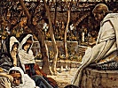

  
[Intangible Textual Heritage](../../../index)  [Bible](../../index.md) 
[Bible Critical Views](../index)  [Index](index)  [Next](scb01.md) 

------------------------------------------------------------------------

[Buy this Book at
Amazon.com](https://www.amazon.com/exec/obidos/ASIN/B002FU5O3Q/internetsacredte.md)

------------------------------------------------------------------------

  
*Self-Contradictions of the Bible*, by William Henry Burr, \[1860\], at
Intangible Textual Heritage

------------------------------------------------------------------------

# Self-Contradictions of the Bible

## by William Henry Burr

#### New York: A. J. Davis & Company

#### \[1860\]

Scanned, proofed, and formatted at Intangible Textual Heritage, July
2007, by John Bruno Hare. This text is in the public domain in the
United States because it was published prior to 1923.

------------------------------------------------------------------------

[Next: Theological Doctrines](scb01.md)
