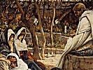

  
[Intangible Textual Heritage](../../../index)  [Bible](../../index.md) 
[Bible Critical Views](../index)  [Index](index)  [Previous](scb02.md) 
[Next](scb04.md) 

------------------------------------------------------------------------

[Buy this Book at
Amazon.com](https://www.amazon.com/exec/obidos/ASIN/B002FU5O3Q/internetsacredte.md)

------------------------------------------------------------------------

  
*Self-Contradictions of the Bible*, by William Henry Burr, \[1860\], at
Intangible Textual Heritage

------------------------------------------------------------------------

# HISTORICAL FACTS

58.

MAN WAS CREATED AFTER THE OTHER ANIMALS.

And God made the *beast* of the earth after his kind, and the *cattle*
after their kind. . . . And God said, Let us make man. . . . So God
*created man* in his own image. (Gen. 1:25, 26, 27.)

MAN WAS CREATED **BEFORE** THE OTHER ANIMALS.

And the Lord God said it is not good that *man* should be alone; I will
make a help-meet for him. And out of the ground the Lord God formed
*every beast* of the field, and *every fowl* of the air, and *brought
them unto Adam* to see what he would call them. (Gen. 2:18, 19.)

 

59.

SEED TIME AND HARVEST WERE NEVER TO CEASE.

While the earth remaineth, *seed time* and *harvest* . . . shall *not
cease*. (Gen. 8:22.)

SEED TIME AND HARVEST **DID CEASE** FOR SEVEN YEARS.

And the seven years of *dearth* began to come. . . . And the *famine*
was over all the face of the earth. (Gen. 41:54, 56.)

For these two years hath *famine* been in the land; and yet there are
*five years* in which there *shall neither be earing* \[archaic term for
"plowing"—JBH\] *nor harvest*. (Gen. 45:6.)

 

60.

GOD HARDENED PHARAOH'S HEART.

But *I* will *harden* his *heart*, that he shall not let the people go.
(Ex. 4:21).

And the *Lord hardened* the *heart* of Pharaoh. (Ex. 9:12.)

PHARAOH HARDENED HIS **OWN** HEART.

But when Pharaoh saw that there was respite, *he hardened* his *heart*,
and hearkened not unto them. (Ex. 8:15.)

 

61.

ALL THE CATTLE AND HORSES IN EGYPT DIED.

Behold, the hand of the Lord is upon thy cattle which is in the field,
upon the *horses*, upon the asses, upon the camels, upon the oxen, and
upon the sheep. . . . And *all the cattle of Egypt died*. (Ex. 9:3, 6.)

ALL THE HORSES OF EGYPT DID **NOT** DIE.

But the Egyptians pursued after them (all the *horses* and chariots of
*Pharaoh*, and his *horsemen*, and his army) and overtook them encamping
by the sea. (Ex. 14:9.)

 

62.

MOSES FEARED PHARAOH.

And Moses *feared*, and said, Surely this thing is known. Now, when
Pharaoh heard this thing, he sought to slay Moses. But Moses fled before
the face of Pharaoh, and dwelt in the land of Midian. . . . And it came
to pass, in process of time, that the king of Egypt died. . . . And the
Lord said unto Moses, in Midian, Go, return unto Egypt; for all the men
are dead which sought thy life. (Ex. 2:14, 15, 23; & 4:19.)

MOSES DID **NOT** FEAR PHARAOH.

By faith he \[Moses\] forsook Egypt, *not fearing* the wrath of the
king. (Heb. 11:27.)

 

63.

THERE DIED OF THE PLAGUE TWENTY-FOUR THOUSAND.

And those that died in the plague were *twenty and four thousand*. (Num.
25:9.)

THERE DIED OF THE PLAGUE BUT **TWENTY-THREE THOUSAND**.

And fell in one day *three and twenty thousand*. (1 Cor. 10:8.)

 

64.

JOHN THE BAPTIST WAS ELIAS.

This is *Elias* which was to come. (Matt. 11:14.)

JOHN THE BAPTIST WAS **NOT** ELIAS.

And they asked him, What then? Art thou *Elias?* and he said I am *not*.
(John 1:21.)

 

65.

THE FATHER OF JOSEPH, MARY'S HUSBAND, WAS JACOB.

And *Jacob begat Joseph*, the husband of Mary, of whom was born Jesus.
(Matt. 1:16.)

THE FATHER OF MARY'S HUSBAND WAS **HELI**.

Being the son of *Joseph* which was the *son of Heli*. (Luke 3:23.)

 

66.

THE FATHER OF SALAH WAS ARPHAXAD.

And Arphaxad lived *five and thirty* years and *begat Salah*. (Gen.
11:12.)

THE FATHER OF SALAH WAS **CAINAN**.

Which was the son of Sala, which was the son of *Cainan*, which was the
son of Arphaxad. (Luke 3:35, 36.)

 

67.

THERE WERE FOURTEEN GENERATIONS FROM ABRAHAM TO DAVID.

So all the generations from *Abraham to David* are fourteen generations.
(Matt. 1:17.)

THERE WERE BUT **THIRTEEN** GENERATIONS FROM ABRAHAM TO DAVID.

Abraham begat Isaac . . . Jacob . . . Judas . . . Phares . . . Esrom . .
. Aram . . . Aminaldab . . . Naason . . . Salmon . . . Booz . . . Obed .
. . Jesse . . . David .. \[13\]. (Matt. 1:2, 3, 4, 5, 6.)

 

68.

THERE WERE FOURTEEN GENERATIONS FROM THE BABYLONISH CAPTIVITY TO CHRIST.

And from the carrying away into *Babylon unto Christ* are *fourteen
generations*. (Matt. 1:17.)

THERE WERE BUT **THIRTEEN** GENERATIONS FROM THE BABYLONISH CAPTIVITY TO
CHRIST.

And after they were brought to Babylon Jechonias begat Salathiel . . .
Zorobabel . . . Abiud . . . Eliakim . . . Azor . . . Sadoc . . . Achim .
. . Eliud . . . Eleazar . . . Matthan . . . Jacob . . . Joseph, the
husband of Mary, of whom was born Jesus \[13\]. (Matt. 1:12, 13, 14, 15,
16.)

 

69.

THE INFANT CHRIST WAS TAKEN INTO EGYPT.

When he arose he took the young child and his mother by night and
departed into Egypt, and was there until the death of Herod. . . . But
when Herod was dead, . . . he took the young child and his mother and
came . . . and dwelt in a city called Nazareth. (Matt. 2:14, 15, 19, 21,
23.)

THE INFANT CHRIST WAS **NOT** TAKEN INTO EGYPT.

And when the days of her purification, according to the law of Moses,
were accomplished, they brought him to Jerusalem, to present him to the
Lord. . . . And when they had performed all things, according to the law
of the Lord they returned . . . to their own city, Nazareth. (Luke 2:22,
39.)

 

70.

CHRIST WAS TEMPTED IN THE WILDERNESS.

And *immediately* \[after Christ's baptism\] the spirit driveth him
*into the wilderness*. And he was there in the wilderness *forty days*
tempted of Satan. (Mark 1:12, 13.)

CHRIST WAS **NOT** TEMPTED IN THE WILDERNESS.

And the *third day* \[after Christ's baptism\] there was a marriage in
Cana of Galilee. . . . Both *Jesus was called* and his disciples *to the
marriage*. (John 2:1, 2.)

 

71.

CHRIST PREACHED HIS FIRST SERMON ON THE MOUNT.

And seeing the multitude he went up into a *mountain*, and when he was
*set* his *disciples came unto him*. And he *opened* his *mouth* and
*taught* them, saying. (Matt. 5:1, 2.)

CHRIST PREACHED HIS FIRST SERMON IN THE **PLAIN**.

And he *came down with them and stood in the plain;* and the company of
his disciples, and a great multitude of people . . . came to hear him. .
. . And he lifted up his eyes on his disciples and said. (Luke 6:17,
20.)

 

72.

JOHN WAS IN PRISON WHEN JESUS WENT INTO GALILEE.

Now, *after that John was put in prison Jesus came into Galilee*
preaching the gospel of the kingdom of God. (Mark 1:14.)

JOHN WAS **NOT** IN PRISON WHEN JESUS WENT INTO GALILEE.

The day following Jesus would go forth *into Galilee*. (John 1:43.)

And after these things came Jesus with his disciples into the land of
Judea. . . . And *John was baptizing* in Enon. . . . For *John was* NOT
YET *cast into prison*. (John 3:22, 23, 24.)

 

73.

CHRIST'S DISCIPLES WERE COMMANDED TO GO FORTH WITH A STAFF AND SANDALS.

And commanded them that they should take nothing for their journey, save
a *staff only;* no scrip, no bread, no money in their purse; but be shod
with *sandals*. (Mark 6:8, 9.)

CHRIST'S DISCIPLES WERE COMMANDED TO GO FORTH WITH **NEITHER** STAVES
NOR SANDALS.

Provide neither gold, nor silver, nor brass in your purses; nor scrip
for your journey, neither two coats, *neither shoes, nor yet staves*.
(Matt. 10:9, 10.)

 

74.

A WOMAN OF CANAAN BESOUGHT JESUS.

And behold, a woman of *Canaan* came out of the same coasts, and cried
unto him, Have mercy on me, O Lord, thou son of David; my daughter is
grievously vexed with a devil. (Matt. 15:22.)

IT WAS A **GREEK** WOMAN WHO BESOUGHT HIM.

The woman was a *Greek*, a *Syrophenician* by nation, and she besought
him that he would cast forth the devil out of her daughter. (Mark 7:26.)

 

75.

TWO BLIND MEN BESOUGHT JESUS.

And behold, *two blind men* sitting by the way-side, when they heard
that Jesus passed by, cried out, saying, Have mercy on us, O Lord thou
son of David. (Matt. 20:30.)

ONLY **ONE** BLIND MAN BESOUGHT HIM.

A certain *blind man* sat by the way-side begging. . . . And he cried,
saying, Jesus, thou son of David, have mercy on me. (Luke 18:35, 38.)

 

76.

CHRIST WAS CRUCIFIED AT THE THIRD HOUR.

And it was the *third hour* and they crucified him. (Mark 15:25.)

CHRIST WAS NOT CRUCIFIED UNTIL THE **SIXTH** HOUR.

And it was the preparation of the passover, and about the *sixth hour;*
and he saith unto the Jews, Behold your king. . . . *Shall I crucify
your king?* (John 19:14, 15.)

 

77.

THE TWO THIEVES REVILED CHRIST.

*The thieves* also, which were crucified with him, cast the same in his
teeth. (Matt. 27:44.)

And *they that were crucified* reviled him. (Mark 15:32.)

ONLY **ONE** OF THE THIEVES REVILED CHRIST.

And *one* of the malefactors which were hanged railed on him. . . . But
the *other* answering *rebuked him*, saying, Dost thou not fear God,
seeing thou art in the same condemnation? (Luke 23:39, 40.)

 

78.

SATAN ENTERED INTO JUDAS WHILE AT THE SUPPER.

And after the sop Satan *entered* into him. (John 13:27.)

SATAN ENTERED INTO HIM **BEFORE** THE SUPPER.

Then entered Satan into Judas, . . . and he went his way and communed
with the chief priests and captains, how he might betray him. . . .
*Then* came the day of unleavened bread when the *passover* must be
killed. (Luke 22:3, 4, 7.)

 

79.

JUDAS COMMITTED SUICIDE BY HANGING.

And he cast down the pieces of silver into the temple, and departed, and
went out and *hanged* himself. (Matt. 27:5.)

JUDAS DID **NOT** HANG HIMSELF, BUT DIED ANOTHER WAY.

And falling headlong he *burst asunder* in the midst, and all his
*bowels gushed out*. (Acts 1:18.)

 

80.

THE POTTER'S FIELD WAS PURCHASED BY JUDAS.

Now, *this man purchased a field* with the reward of iniquity. (Acts
1:18.)

THE POTTER'S FIELD WAS PURCHASED BY THE **CHIEF PRIESTS**.

And the *chief priests took the silver pieces, . . . and bought* with
them the *potter's field*. (Matt. 27:6, 7.)

 

81.

THERE WAS BUT ONE WOMAN WHO CAME TO THE SEPULCHRE.

The first day of the week cometh *Mary Magdalene*, early, when it was
yet dark, unto the sepulchre. (John 20:1.)

THERE WERE **TWO** WOMEN WHO CAME TO THE SEPULCHRE.

In the end of the Sabbath, as it began to dawn towards the first day of
the week, came *Mary Magdalene*, *and the* OTHER MARY to the sepulchre.
(Matt. 28:1.)

 

82.

THERE WERE THREE WOMEN WHO CAME TO THE SEPULCHRE.

When the Sabbath was past, *Mary Magdalene*, and *Mary the mother of
James*, and *Salome*, had brought sweet spices, that that they might
come and anoint him. (Mark 16:1.)

THERE WERE **MORE THAN THREE** WOMEN WHO CAME TO THE SEPULCHRE.

It was *Mary Magdalene and Mary the mother of James, and* OTHER WOMEN
that were with them. (Luke 24:10.)

 

83.

IT WAS AT SUNRISE WHEN THEY CAME TO THE SEPULCHRE.

And very early in the morning, the first day of the week, they came unto
the sepulchre, at the *rising of the sun*. (Mark:16:2.)

IT WAS **SOME TIME BEFORE** SUNRISE WHEN THEY CAME.

The first day of the week, cometh Mary Magdalene, early, *while it was
yet dark*, unto the sepulchre. (John 20:1.)

 

84.

THERE WERE TWO ANGELS SEEN BY THE WOMEN AT THE SEPULCHRE, AND THEY WERE
STANDING UP.

And it came to pass, as they were much perplexed thereabout, behold,
*two men stood* by him in *shining garments*. (Luke 24:4.)

THERE WAS BUT ONE ANGEL SEEN, AND HE WAS **SITTING DOWN**.

For *the angel* of the Lord descended from heaven, and came and rolled
back the stone from the door, and sat upon it. . . . And *the angel*
answered and said unto the women, Fear not. (Matt. 28:2, 5.)

 

85.

THERE WERE TWO ANGELS SEEN WITHIN THE SEPULCHRE.

And as she wept she stooped down and looked into the sepulchre, and
seeth *two angels in white*. (John 20:11, 12.)

THERE WAS BUT **ONE** ANGEL SEEN WITHIN THE SEPULCHRE.

And entering into the sepulchre, they saw a *young man* sitting on the
right side, clothed in a *long white garment*. (Mark 16:5.)

 

86.

CHRIST WAS TO BE THREE DAYS AND THREE NIGHTS IN THE GRAVE.

So shall the son of man be *three days and three nights* in the heart of
the earth. (Matt. 12:40.)

CHRIST WAS BUT **TWO** DAYS AND **TWO** NIGHTS IN THE GRAVE.

And it was the *third hour*, and they crucified him. . . . It was the
preparation, that is, the *day before the Sabbath*. . . . And Pilate. .
. gave the body to Joseph. And he . . . laid him in a sepulchre. . . .
Now, when Jesus was risen *early* the *first day of the week*, he
appeared first to Mary Magdalene. (Mark 15:25, 42, 44, 45, 46; & 16:9.)

 

87.

THE HOLY GHOST BESTOWED AT PENTECOST.

But ye shall receive power after that the Holy Ghost is come upon you. .
. . Ye shall be baptized with the Holy Ghost *not many days hence*.
(Acts 1:8, 5.)

And when the day of Pentecost was fully come they were all of one accord
in one place. . . . And they were *all filled with the Holy Ghost*.
(Acts 2:1, 4.)

THE HOLY GHOST BESTOWED **BEFORE** PENTECOST.

And when he had said this he breathed on them, and said unto them,
*Receive ye the Holy Ghost*. (John 20:22.)

 

88.

THE DISCIPLES WERE COMMANDED IMMEDIATELY AFTER THE RESURRECTION TO GO
INTO GALILEE.

Then said Jesus unto them, Be not afraid; go tell my brethren that they
*go into Galilee*, and there shall they see me. (Matt. 28:10.)

THE DISCIPLES WERE COMMANDED IMMEDIATELY AFTER THE RESURRECTION TO
**TARRY AT JERUSALEM**.

But *tarry ye in Jerusalem* until ye be endued with power from on high.
(Luke 24:49.)

 

89.

JESUS FIRST APPEARED TO THE ELEVEN DISCIPLES IN A ROOM AT JERUSALEM.

And they rose up the same hour and returned to *Jerusalem*, and found
the eleven gathered together. . . . And as they spake, Jesus himself
*stood up in the midst* of them. . . . But they were terrified and
affrighted, and supposed that they had seen a *spirit*. (Luke 24:33, 36,
37.)

The same day, at evening, being the first day of the week, when the
*doors* were *shut*, where the *disciples* were *assembled*, . . . came
Jesus and *stood in the midst*. (John 20:19.)

JESUS FIRST APPEARED TO THE ELEVEN ON A **MOUNTAIN** IN **GALILEE**.

Then the eleven disciples went away into *Galilee*, unto a *mountain*
where Jesus had appointed. And when they saw him they worshipped him,
but some *doubted*. (Matt. 28:16, 17.)

 

90.

CHRIST ASCENDED FROM MOUNT OLIVET.

And when he had spoken these things, while they beheld, he was taken up,
and a cloud received him out of their sight. . . . Then returned they
unto Jerusalem, *from the mount called Olivet*. (Acts 1:9, 12.)

CHRIST ASCENDED FROM **BETHANY**.

And he led them out as far as to *Bethany;* and he lifted up his hands
and blessed them. And it came to pass that while he blessed them, he was
parted from them, and *carried up into heaven*. (Luke 24:50, 51.)

 

91.

PAUL'S ATTENDANTS HEARD THE MIRACULOUS VOICE, AND STOOD SPEECHLESS.

And the men which journeyed with him \[Paul\] *stood speechless,
hearing* a voice but seeing no man. (Acts 9:7.)

PAUL'S ATTENDANTS HEARD **NOT** THE VOICE, AND WERE PROSTRATE.

And they that were with me saw indeed the light and were afraid; but
they *heard not the voice* of him that spake to me. (Acts 22:9.)

And when we were *all fallen to the earth*, I heard a voice. (Acts
26:14.)

 

92.

ABRAHAM DEPARTED TO GO INTO CANAAN.

And Abram took Sarah his wife, and Lot, his brother's son, . . . and
they went forth to go into the land of Canaan, and into the land of
Canaan they came. (Gen. 12:5.)

ABRAHAM WENT NOT KNOWING **WHERE**.

By faith Abraham when he was called to go out into a place which he
should after receive for an inheritance, obeyed; and he went out not
knowing whither he went. (Heb. 11:8.)

 

93.

ABRAHAM HAD TWO SONS.

Abraham had *two sons*; the one by a bond-woman, and the other by a free
woman. (Gal. 4:22.)

ABRAHAM HAD BUT **ONE** SON.

By faith Abraham when he was tried, offered up Isaac, . . . his *only
begotten son*. (Heb. 11:17.)

 

94.

KETURAH WAS ABRAHAM'S WIFE.

Then again Abraham took a *wife*, and her name was Keturah. (Gen. 25:1.)

KETURAH WAS ABRAHAM'S **CONCUBINE**.

The sons of Keturah, Abraham's *concubine*. (1 Chron. 1:32.)

 

95.

ABRAHAM BEGAT A SON WHEN HE WAS A HUNDRED YEARS OLD, BY THE
INTERPOSITION OF PROVIDENCE.

Sarah conceived and bare Abraham a son in his *old age*, at the set time
of which God had spoken to him. (Gen. 21:2.)

And being not weak in the *faith*, he considered not his own body, *now
dead*, when he was a *hundred years old*. (Rom. 4:19.)

Therefore sprang there even from one, and him *as good as dead*, so many
as the stars of the sky. (Heb. 11:12.)

 

ABRAHAM BEGAT **SIX** CHILDREN MORE AFTER HE WAS A HUNDRED YEARS OLD,
WITHOUT ANY INTERPOSITION OF PROVIDENCE.

Then *again* Abraham took a wife and her name was Keturah; and she bare
him *Zimram*, and *Jockshan*, and *Medan*, and *Midian*, and *Ishbak*,
and *Shuah*. (Gen. 25:1, 2.)

 

96.

JACOB BOUGHT A SEPULCHRE FROM HAMOR.

And the bones of Joseph . . . buried they in Shechem, in a parcel of
ground which *Jacob* bought of the sons of *Hamor*, the father of
Shechem. (Josh. 24:32.)

**ABRAHAM** BOUGHT IT OF HAMOR.

In the sepulchre that *Abraham* bought for a sum of money of the sons of
*Emor*, the father of Sychem. (Acts 7:16.)

 

97.

GOD PROMISED THE LAND OF CANAAN TO ABRAHAM AND HIS SEED FOREVER.

And the Lord said unto Abraham, after Lot was separated from him, Lift
up now thine eyes and look from the place where thou art, northward and
southward, and eastward and westward; for *all the land* which thou
*seest*, to *thee* will I *give* it and to *thy seed forever*. . . . For
I will give it unto thee. . . . Unto thee and to *thy seed after thee*.
(Gen. 13:14,15,17;&17:8.)

ABRAHAM AND HIS SEED **NEVER RECEIVED** THE PROMISED LAND.

And he gave him \[Abraham\] *none inheritance* in it, no, not so much as
to set his *foot* on. (Acts 7:5.)

By faith he *sojourned* in the land of promise as in a *strange
country*, dwelling in tents with Isaac and Jacob, the heirs with him of
the same promise. . . . These all died in faith, *not having received
the promises*. (Heb. 11:9, 13.)

 

98.

GOLIATH WAS SLAIN BY ELHANAN.

And there was again a battle in Gob with the Philistines, where
*Elhanan* the son of Jaare-oregim a Bethlehemite, slew \["the brother
of," supplied by the translators\] *Goliath* the Gittite, the staff of
whose spear was like a weaver's beam. (2 Sam. 21:19.)

THE **BROTHER** OF GOLIATH WAS SLAIN BY ELHANAN.

And there was war again with the Philistines, and *Elhanan* the son of
Jair slew Lahmi *the brother of Goliath* the Gittite, whose spear's
staff was like a weaver's beam. (1 Chron. 20:5.)

 

99.

AHAZIAH BEGAN TO REIGN IN THE TWELFTH YEAR OF JORAM.

In the *twelfth* year of Joram, the son of Ahab, king of Israel, did
Ahaziah the son of Jehoram king of Judah begin to reign. (2 Kings 8:25.)

AHAZIAH BEGAN TO REIGN IN THE **ELEVENTH** YEAR OF JORAM.

In the *eleventh* year of Joram the son of Ahab began Ahaziah to reign
over Judah. (2 Kings 9:29.)

 

100.

MICHAL HAD NO CHILD.

Therefore Michal the daughter of Saul, had *no child* unto the day of
her death. (2 Sam. 6:23.)

MICHAL HAD **FIVE** CHILDREN.

The *five sons of Michal* the daughter of Saul. (2 Sam. 21:8.)

 

101.

DAVID WAS TEMPTED BY THE LORD TO NUMBER ISRAEL.

And the anger of the Lord was kindled against Israel, *and he moved*
David against them to say, Go number Israel and Judah. (2 Sam. 24:1.)

DAVID WAS TEMPTED BY **SATAN** TO NUMBER THE PEOPLE.

And *Satan* stood up against Israel and provoked David to number Israel.
(1 Chron. 21:1.)

 

102.

THE NUMBER OF FIGHTING MEN OF ISRAEL WAS 800,000; AND OF JUDAH 500,000.

And Joab gave up the sum of the number of the people unto the king; and
there were in Israel *eight hundred thousand* valiant men that drew the
sword; and the men of Judah *five hundred thousand* men. (2 Sam. 24:9.)

THE NUMBER OF FIGHTING MEN OF ISRAEL WAS **1,100,000;** AND OF JUDAH
**470,000**.

And Joab gave the sum of the number of the people unto David. And all
they of Israel were a *thousand thousand and a hundred thousand*
\[1,100,000\] men that drew sword; and Judah was *four hundred three
score and ten thousand* \[470,000\] men that drew sword. (1 Chron.
21:5.)

 

103.

DAVID SINNED IN NUMBERING THE PEOPLE.

And David's heart smote him after that he had numbered the people. And
David said unto the Lord, *I have sinned* greatly in that I have done.
(2 Sam. 24:10.)

DAVID **NEVER** SINNED, **EXCEPT IN THE MATTER OF URIAH**.

David did that which was *right* in the eyes of the Lord, and *turned
not aside from anything that he commanded him all the days of his life,
save only in the matter of Uriah the Hittite*. (1 Kings 15:5.)

 

104.

ONE OF THE PENALTIES OF DAVID'S SIN WAS SEVEN YEARS OF FAMINE.

So Gad came to David and told him, Shall *seven years of famine* come
unto thee in thy land? (2 Sam. 24:13.)

IT WAS NOT SEVEN YEARS, BUT **THREE** YEARS OF FAMINE.

So Gad came to David and said unto him, Thus saith the Lord, choose thee
either *three* years of famine. (1 Chron. 21:11, 12.)

 

105.

DAVID TOOK SEVEN HUNDRED HORSEMEN.

And David took from him a thousand chariots and *seven hundred*
horsemen. (2 Sam. 8:4.)

DAVID TOOK **SEVEN THOUSAND** HORSEMEN.

And David took from him a thousand chariots and *seven thousand*
horsemen. (1 Chron. 18:4.)

 

106.

DAVID BOUGHT A THRESHING FLOOR FOR FIFTY SHEKELS OF SILVER.

So David bought the threshing floor and the oxen for *fifty shekels of
silver*. (2 Sam. 24:24.)

DAVID BOUGHT THE THRESHING FLOOR FOR **SIX HUNDRED** SHEKELS OF GOLD.

So David gave to Oman for the place *six hundred shekels of gold*. (1
Chron. 21:25.)

 

107.

DAVID'S THRONE WAS TO ENDURE FOREVER.

Once have I sworn by my holiness that I will not lie unto David. His
seed shall endure forever and his *throne* as the sun before me. It
shall be *established forever*. (Ps. 89:35, 36, 37.)

DAVID'S THRONE WAS **CAST DOWN**.

Thou hast made his glory to cease and hast *cast his throne down to the
ground*. (Ps. 89:44.)

------------------------------------------------------------------------

[Next: Speculative Doctrines](scb04.md)
