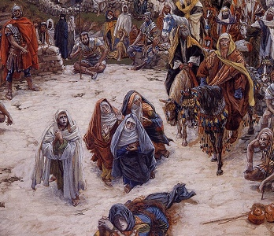

  
[Intangible Textual Heritage](../../../index)  [Bible](../../index) 
[Bible Critical Views](../index) 

------------------------------------------------------------------------

[Buy this Book at
Amazon.com](https://www.amazon.com/exec/obidos/ASIN/093281395X/internetsacredte)

------------------------------------------------------------------------

<table width="75%">
<colgroup>
<col style="width: 50%" />
<col style="width: 50%" />
</colgroup>
<tbody>
<tr class="odd">
<td width="50%" data-valign="TOP"></td>
<td width="50%" data-valign="CENTER"><h1 id="the-worlds-sixteen-crucified-saviors" data-align="CENTER">The World's Sixteen Crucified Saviors</h1>
<h2 id="by-kersey-graves" data-align="CENTER">by Kersey Graves</h2>
<h4 id="section" data-align="CENTER">[1875]</h4></td>
</tr>
</tbody>
</table>

------------------------------------------------------------------------

[Contents](#contents)    [Start Reading](wscs00)

------------------------------------------------------------------------

|                                                                                                                           |
|---------------------------------------------------------------------------------------------------------------------------|
|  |

This is one of the most controversial books about the Christian
narrative of Jesus ever published. Graves tried to gather together all
of what was known at the time about other similar stories of gods who
walked the earth, preached ethical and mystical doctrines, and ended up
as deicides. Today, folklorists have discovered a set of world-wide
themes relating a story of a culture-hero who has a miraculous birth and
tragic death. This is one of the archetypal stories which Jung and
Campbell discussed. It is now considered less shocking that incidents in
religious narrative could be drawn from the global bank of folklore
motifs. This does not lessen the impact, however, on traditional
believers in these narratives as the absolute truth.

So is the need for a deathless hero who saves humanity part of the deep
structure of our brain? Is religion simply filling a psychological need
which is part of being human? This book may be picked apart in its
details; however, it was one of the first to explore this 'big'
question, an answer to which is as pressing today as it was then. The
World's Sixteen Crucified Saviors raised a host of questions, few of
which have yet been adequately answered, over a century later.

There are serious flaws in this book. Graves was apparently not working
from original sources, with the exception of the Bible; he seems to have
relied on books such as Higgins' Anacalypsis, without necessarily citing
them. He muddles Vaishnava Hinduism and Buddhism, two belief systems
with fundamental differences. That said, the traditional narratives of
Krishna and Buddha *do* contain motifs in common with the NT stories of
Jesus.

*Production notes*. This text first appeared on the Internet at another
site, in a slightly defective and added-emphasis version with a
disclaimer on each page. I have corrected the text to reflect the
original book as closely as possible, as per this sites' standards. Some
have criticized Graves for excessive typos (as if this was an
intellectual failing on his part), and there are certainly [a few in
this book](errata). However, I can state definitively after a modern
spell-check of the text that they are not particularly excessive
compared to any given book from this period.

--J.B. Hare, 8/5/2007.

------------------------------------------------------------------------

 [Title Page](wscs00)  
[Preface](wscs01)  
[Contents](wscs02)  
[Explanation](wscs03)  
[Introduction](wscs04)  
[Address to the Clergy](wscs05)  
[Chapter I: Rival Claims of the Saviors](wscs06)  
[Chapter II: Messianic Prophecies](wscs07)  
[Chapter III: Prophecies by the Figure of a Serpent](wscs08)  
[Chapter IV: Miraculous and Immaculate Conception of the Gods](wscs09)  
[Chapter V: Virgin Mothers and Virgin-Born Gods](wscs10)  
[Chapter VI: Stars Point Out the Time and the Saviors’
Birth-Place](wscs11)  
[Chapter VII: Angels, Shepherds, and Magi Visit the Infant
Saviors](wscs12)  
[Chapter VIII: The Twenty-Fifth of December the Birthday of the
Gods](wscs13)  
[Chapter IX: Titles of the Saviors](wscs14)  
[Chapter X: The Saviors of Royal Descent, But Humble Birth](wscs15)  
[Chapter XI: Christ's Genealogy](wscs16)  
[Chapter XII: The World's Saviors Saved from Destruction in
Infancy](wscs17)  
[Chapter XIII: The Saviors Exhibit Early Proofs of Divinity](wscs18)  
[Chapter XIV: The Saviors’ Kingdoms Not of this World](wscs19)  
[Chapter XV: The Saviors Were Real Personages](wscs20)  
[Chapter XVI: Sixteen Saviors Crucified](wscs21)  
[Chapter XVII: The Aphanasia, or Darkness, at the Crucifixion](wscs22)  
[Chapter XVIII: Descent of the Saviors into Hell](wscs23)  
[Chapter XIX: Resurrection of the Savior](wscs24)  
[Chapter XX: Reappearance and Ascension of the Saviors](wscs25)  
[Chapter XXI: The Atonement—Its Oriental or Heathen Origin](wscs26)  
[Chapter XXII: The Holy Ghost of Oriental Origin](wscs27)  
[Chapter XXIII: The Divine “Word” of Oriental Origin](wscs28)  
[Chapter XXIV: The Trinity Very Anciently a Current Heathen
Doctrine](wscs29)  
[Chapter XXV: Absolution, and the Confession of Sins, of Heathen
Origin](wscs30)  
[Chapter XXVI: Origin of Baptism by Water, Fire, Blood, and the Holy
Ghost](wscs31)  
[Chapter XXVII: The Sacrament or Eucharist of Heathen Origin](wscs32)  
[Chapter XXVIII: Anointing with Oil of Oriental Origin](wscs33)  
[Chapter XXIX: How Men, Including Jesus Christ, Came to be Worshipped as
Gods](wscs34)  
[Chapter XXX: Sacred Cycles Explaining the Advent of the Gods, the
Master-Key to the Divinity of Jesus Christ](wscs35)  
[Chapter XXXI: Christianity Derived from Heathen and Oriental
Systems](wscs36)  
[Chapter XXXII: Three Hundred and Forty-Six Striking Analogies Between
Christ and Chrishna](wscs37)  
[Chapter XXXIII: Apollonius, Osiris, Magus, Etc.—Gods](wscs38)  
[Chapter XXXIV: The Three Pillars of the Christian Faith—Miracles,
Prophecies, and Precepts](wscs39)  
[Chapter XXXV: Logical or Common Sense View of the Doctrine of Divine
Incarnation](wscs40)  
[Chapter XXXVI: Philosophical Absurdities of the Doctrine of the Divine
Incarnation](wscs41)  
[Chapter XXXVII: Physiological Absurdities of the Doctrine of the Divine
Incarnation](wscs42)  
[Chapter XXXVIII: A Historical View of the Divinity of Jesus
Christ](wscs43)  
[Chapter XXXIX: The Scriptural View of Christ's Divinity](wscs44)  
[Chapter XL: A Metonymic View of the Divinity of Jesus Christ](wscs45)  
[Chapter XLI: The Precepts and Practical Life of Jesus Christ](wscs46)  
[Chapter XLII: Christ As a Spiritual Medium](wscs47)  
[Chapter XLIII: Conversion, Repentance, and “Getting Religion” of
Heathen Origin](wscs48)  
[Chapter XLIV: The Moral Lessons of Religious History](wscs49)  
[Chapter XLV: Conclusion and Review](wscs50)  
[Notes](wscs51)  
