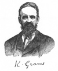
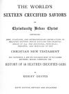

  
[Intangible Textual Heritage](../../../index)  [Bible](../../index) 
[Bible Critical Views](../index)  [Index](index)  [Next](wscs01) 

------------------------------------------------------------------------

[Buy this Book at
Amazon.com](https://www.amazon.com/exec/obidos/ASIN/093281395X/internetsacredte)

------------------------------------------------------------------------

*The World's Sixteen Crucified Saviors*, by Kersey Graves, \[1875\], at
Intangible Textual Heritage

------------------------------------------------------------------------

# THE WORLD'S

## SIXTEEN CRUCIFIED SAVIORS

###### OR

 

###### CONTAINING

##### NEW, STARTLING, AND EXTRAORDINARY REVELATIONS IN RELIGIOUS HISTORY, WHICH DISCLOSE THE ORIENTAL ORIGIN OF ALL THE DOCTRINES, PRINCIPLES, PRECEPTS, AND MIRACLES OF THE

### CHRISTIAN NEW TESTAMENT

###### AND FURNISHING A KEY FOR UNLOCKING MANY OF ITS SACRED MYSTERIES, BESIDES COMPRISING THE

### HISTORY OF 16 HEATHEN CRUCIFIED GODS

###### BY

## KERSEY GRAVES

#### SIXTH EDITION, REVISED AND ENLARGED

#### BOSTON, COLBY AND RICH

#### \[1875\]

This etext prepared at Intangible Textual Heritage, August 2007. Proofed
and formatted by John Bruno Hare. This text is in the public domain in
the United States because it was published prior to January 1st, 1923,
and can be used for any purpose.

[  
Click to enlarge](img/front.jpg)  
  

[  
Click to enlarge](img/title.jpg)  
Title Page  

------------------------------------------------------------------------

[Next: Preface](wscs01)
