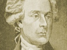

  
[Intangible Textual Heritage](../../index)  [Bible](../index.md) 
[Index](index)  [Previous](jb09)  [Next](jb11.md) 

------------------------------------------------------------------------

[Buy this Book at
Amazon.com](https://www.amazon.com/exec/obidos/ASIN/141790576X/internetsacredte.md)

------------------------------------------------------------------------

[Buy this Book on
Kindle](https://www.amazon.com/exec/obidos/ASIN/B002KCO5UC/internetsacredte.md)

------------------------------------------------------------------------

  
*The Life and Morals of Jesus of Nazareth (the Jefferson Bible)*, by
Thomas Jefferson, \[1902\], at Intangible Textual Heritage

------------------------------------------------------------------------

p. 24

### VI.

*Drives the Traders Out of the Temple*.

AFTER this he went down to Capernaum, he, and his mother, and his
brethren, and his disciples: and they continued there not many days.

2 ¶ And the Jews’ passover was at hand, and Jesus went up to Jerusalem;

3 And found in the temple those hat sold oxen and sheep and doves, and
the changers of money sitting:

4 And when he had made a scourge of small cords, he drove them all out
of the temple, and the sheep, and the oxen; and poured out the changers’
money, and overthrew the tables;

5 And said unto them that sold doves, Take these things hence; make not
my Father's house an house of merchandise.

------------------------------------------------------------------------

[Next: VII. He Baptizes, but Retires into Galilee on the Death of
John](jb11.md)

