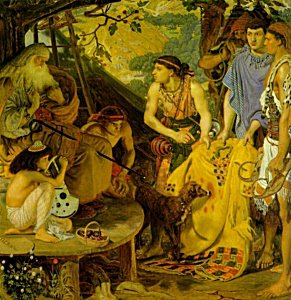

  
[Intangible Textual Heritage](../../index)  [Bible](../index.md) 
[Apocrypha](../../chr/apo/index.md) 

------------------------------------------------------------------------

<table width="80%">
<colgroup>
<col style="width: 50%" />
<col style="width: 50%" />
</colgroup>
<tbody>
<tr class="odd">
<td width="50%" data-valign="CENTER"></td>
<td width="50%" data-valign="CENTER"><h1 id="the-book-of-jubilees" data-align="CENTER">The Book of Jubilees</h1>
<h2 id="translated-by-r.-h.-charles" data-align="CENTER">translated by R. H. Charles</h2>
<h4 id="society-for-promoting-christian-knowledge-london" data-align="CENTER">Society for Promoting Christian Knowledge, London</h4>
<h4 id="section" data-align="CENTER">[1917]</h4></td>
</tr>
</tbody>
</table>

------------------------------------------------------------------------

[Contents](#contents)    [Start Reading](jub00.md)

------------------------------------------------------------------------

*The Book of Jubilees*, probably written in the 2nd century B.C.E., is
an account of the Biblical history of the world from creation to Moses.
It is divided into periods ('Jubilees') of 49 years. For the most part
the narrative follows the familiar account in Genesis, but with some
additional details such as the names of Adam and Eve's daughters, and an
active role for a demonic entity called 'Mastema'. The anonymous author
had a preoccupation with calendar reform, and uses *Jubilees* as a
platform for proposing a solar calendar of 364 days and 12 months; this
would have been a radical departure from [the Jewish
Calendar](../../time/cal/jdate.md), which is lunar-based. There are also a
couple of messianic, apocalyptic passages, although quite a bit less
than the Book of Enoch.

The only complete version of *Jubilees* is in Ethiopian, although large
fragments in Greek, Latin and Syriac are also known. It is believed that
it was originally written in Hebrew. If at times one gets the impression
that you are reading a first draft of Genesis, you are in good company.
R.H. Charles, the translator, a distinguished academic Biblical scholar,
concluded that *Jubilees* was a version of the Pentateuch, written in
Hebrew, parts of which later became incorporated into the earliest Greek
version of the Jewish Bible, the Septuagint.

--John Bruno Hare, July 22, 2004

------------------------------------------------------------------------

 [Title Page](jub00.md)  
[Editors' Preface](jub01.md)  

### Introduction

[Short Account of the Book](jub02.md)  
[Titles](jub03.md)  
[Versions and Original Language](jub04.md)  
[Affinities with Other Literature](jub05.md)  
[The Special Aims and General Character of the Book](jub06.md)  
[Authorship and Date](jub07.md)  
[Bibliography](jub08.md)  

### The Book of Jubilees

[Short Titles, Abbreviations and Brackets Used in this Edition](jub09.md)  
[Erratum](jub10.md)  
[Prologue](jub11.md)  
[God's Revelation to Moses on Mount Sinai](jub12.md)  
[God commands the Angel to write (i. 27-29).](jub13.md)  
[The Angel dictates to Moses the Primæval History: the Creation of the
World and Institution of the Sabbath (ii. 1-33)](jub14.md)  
[Paradise and the Fall (iii. 1-35)](jub15.md)  
[Cain and Abel (iv. 1-12)](jub16.md)  
[The Patriarchs from Adam to Noah; Life of Enoch; Death of Adam and Gain
(iv. 13-33).](jub17.md)  
[The Fall of the Angels and their Punishment; the Deluge foretold (v.
1-20)](jub18.md)  
[The Building of the Ark; the Flood (v. 21-32)](jub19.md)  
[Noah's Sacrifice; God's Covenant with him. Instructions to Moses about
eating of Blood, the Feast of Weeks, etc., and Division of the Year (vi.
1-38).](jub20.md)  
[Noah offers Sacrifice; the Cursing of Canaan: Noah's Sons and Grandsons
and their Cities. Noah's Admonitions (vii. 1-39)](jub21.md)  
[Genealogy of the Descendants of Shem: Noah and his Sons divide the
Earth (viii. 1-30)](jub22.md)  
[Subdivision of the Three Portions amongst the Grandchildren: Oath taken
by Noah's Sons (ix. 1-15)](jub23.md)  
[Noah's Sons led astray by Evil Spirits; Noah's Prayer; Mastêmâ; Death
of Noah (x. 1-17)](jub24.md)  
[The Tower of Babel and the Confusion of Tongues (x. 18-27)](jub25.md)  
[The Children of Noah enter their Districts Canaan seizes Palestine
wrongfully; Madai receives Media (x. 28-36)](jub26.md)  
[The History of the Patriarchs from Reu to Abraham; the Corruption of
the Human Race (xi. 1-15)](jub27.md)  
[Abram's Knowledge of God and wonderful Deeds (xi. 16-24)](jub28.md)  
[Abram seeks to convert Terah from Idolatry; the Family of Terah. Abram
burns the Idols. Death of Haran (xii. 1-14)](jub29.md)  
[The Family of Terah in Haran; Abram's Experiences there; his Journey to
Canaan (xii. 15-31)](jub30.md)  
[Abram with Lot in Canaan and Egypt. Abram separates from Lot (xiii.
1-21)](jub31.md)  
[The Campaign of Chedorlaomer (xiii. 22-29)](jub32.md)  
[God's Covenant with Abram (xiv. 1-20)](jub33.md)  
[The Birth of Ishmael (xiv. 21-24)](jub34.md)  
[The Feast of First-fruits Circumcision instituted. The Promise of
Isaac's Birth. Circumcision ordained for all Israel (xv. 1-34)](jub35.md)  
[Angelic Visitation of Abraham in Hebron; Promise of Isaac's Birth
repeated. The Destruction of Sodom and Lot's Deliverance (xvi.
1-9)](jub36.md)  
[Abraham at Beersheba. Birth and Circumcision of Isaac. Institution of
the Feast of Tabernacles (xvi. 10-31)](jub37.md)  
[The Expulsion of Hagar and Ishmael (xvii. 1-14)](jub38.md)  
[Mastêmâ proposes to God that Abraham shall be put to the Proof (xvi.
15-18)](jub39.md)  
[The Sacrifice of Isaac: Abraham returns to Beersheba (xviii.
1-19)](jub40.md)  
[The Death and Burial of Sarah (xix. 1-9)](jub41.md)  
[Marriage of Isaac and second Marriage of Abraham; the Birth of Esau and
Jacob (xix. 10-14).](jub42.md)  
[Abraham loves Jacob and blesses him (xix. 15-31)](jub43.md)  
[Abraham's Last Words to his Children and Grandchildren (xx.
i-ii)](jub44.md)  
[The Dwelling-places of the Ishmaelites and of the Sons of Keturah (xx.
12-13)](jub45.md)  
[Abraham's Last Words to Isaac (xxi. 1-25)](jub46.md)  
[Isaac, Ishmael and Jacob join in Festival with Abraham for the Last
Time. Abraham's Prayer (xxii. 1-9)](jub47.md)  
[Abraham's Last Words to and Blessings of Jacob (xxii. 10-30)](jub48.md)  
[The Death and Burial of Abraham (xxiii. 1-8)](jub49.md)  
[The decreasing Years and increasing Corruption of Mankind (xxiii.
9-17)](jub50.md)  
[The Messianic Woes (xxiii. 18-25)](jub51.md)  
[Renewed Study of the Law followed by a Renewal of Mankind. The
Messianic Kingdom and the Blessedness of the Righteous (xxiii.
26-32)](jub52.md)  
[Isaac at the Well of Vision: Esau sells his Birthright (xxiv.
1-7)](jub53.md)  
[Isaac's Sojourn in Gerar and Dealings with Abimelech (xxiv.
8-27).](jub54.md)  
[Isaac curses the Philistines (xxiv. 28-33)](jub55.md)  
[Rebecca admonishes Jacob not to marry a Canaanitish Woman. Rebecca's
Blessing (xxv. 1-23)](jub56.md)  
[Jacob obtains the Blessing of the Firstborn (xxvi. 1-35)](jub57.md)  
[Rebecca induces Isaac to send Jacob to Mesopotamia. Jacob's Dream and
View at Bethel (xxvii. 1-27)](jub58.md)  
[Jacob's Marriage to Leah and Rachel; his Children and Riches (xxviii.
i-30)](jub59.md)  
[Jacob's Flight with his Family: his Covenant with Laban (xxix.
1-12)](jub60.md)  
[Jacob, reconciled with Esau, dwells in Canaan and supports his Parents
(xxix. 13-20)](jub61.md)  
[Dinah ravished. Slaughter of the Shechemites. Laws against
Intermarriage between Israel and the Heathen. The Choice of Levi (xxx.
1-26)](jub62.md)  
[Jacob's Journey to Bethel and Hebron. Isaac blesses Levi and Judah
(xxxi. 1-25](jub63.md)  
[Rebecca journeys with Jacob to Bethel (xxxi. 26-32)](jub64.md)  
[Levi's Dream at Bethel; he is appointed to the Priesthood. Jacob
celebrates the Feast of Tabernacles and offers Tithes. The Institution
of Tithes (xxxii. 1-15)](jub65.md)  
[Jacob's Visions. He celebrates the eighth day of Tabernacles. The Birth
of Benjamin and Death of Rachel (xxxii. 16-34)](jub66.md)  
[Reuben's Sin with Bilhah. Laws regarding Incest. Jacob's Children
(xxxiii. 1-23)](jub67.md)  
[War of the Amorite Kings against Jacob and his Sons. Joseph sold into
Egypt. The Death of Bilhah and Dinah (xxxiv. 1-19)](jub68.md)  
[The Wives of Jacob's Sons (xxxiv. 20-21)](jub69.md)  
[Rebecca's Last Admonitions and Death (xxxv. 1-27)](jub70.md)  
[Isaac's Last Words and Admonitions: his Death. The Death of Leah
(xxxvi. 1-24)](jub71.md)  
[Esau and his Sons wage War with Jacob (xxxvii. 1-25)](jub72.md)  
[The War between Jacob and Esau at the Tower of Hebron. The Death of
Esau and Overthrow of his Forces (xxxviii. 1-4)](jub73.md)  
[The Kings of Edom (xxxviii. 15-24)](jub74.md)  
[Joseph's Service with Potiphar; his Purity and Imprisonment (xxxix.
1-13)](jub75.md)  
[Joseph interprets the Dreams of the Chief Butler and the Chief Baker
(xxxix. 14-18](jub76.md)  
[Pharaoh's Dreams and their Interpretation. Joseph's Elevation and
Marriage (xl. 1-13)](jub77.md)  
[Judah's Incest with Tamar; his Repentance and Forgiveness (xli.
1-28)](jub78.md)  
[The Two Journeys of the Sons of Jacob to Egypt (xlii. 1-25](jub79.md)  
[Joseph finally tests his Brethren, and then makes himself known to them
(xliii. 1-24](jub80.md)  
[Jacob, celebrates the Feast of First-fruits and journeys to Egypt. List
of his Descendants. (xliv. 1-34)](jub81.md)  
[Joseph receives Jacob. The Land of Egypt is acquired for Pharaoh.
Jacob's Death and Burial (xlv. 1-16)](jub82.md)  
[The Death of Joseph. The Bones of Jacob's Sons (except Joseph) interred
at Hebron. The Oppression of Israel by Egypt (xlvi. 1-16)](jub83.md)  
[The Birth and Early Years of Moses (xlvii. 1-12)](jub84.md)  
[From the Flight of Moses to the Exodus (xlviii. 1-19)](jub85.md)  
[Regulations regarding the Passover (xlix. 1-23)](jub86.md)  
[Laws regarding the Jubilees and the Sabbath (l. 1-13)](jub87.md)  
