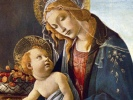

  
[Intangible Textual Heritage](../../index)  [Bible](../index) 
[Index](index)  [Previous](lbob10)  [Next](lbob12) 

------------------------------------------------------------------------

[Buy this Book on
Kindle](https://www.amazon.com/exec/obidos/ASIN/B002LE7A6A/internetsacredte)

------------------------------------------------------------------------

  
*The Lost Books of the Bible*, \[1926\], at Intangible Textual Heritage

------------------------------------------------------------------------

### The APOSTLES’ CREED.

\[It is affirmed by Ambrose "that the twelve Apostles, as skilful
artificers assembled together, and made a key by their common advice,
that is, the Creed; by which the darkness of the devil is disclosed,
that the light of Christ may appear." [1](#fn_109) Others fable that every Apostle inserted
an article, by which the creed is divided into twelve articles; and a
sermon, fathered upon St. Austin, and quoted by the Lord Chancellor
King, fabricates that each particular article was thus inserted by each
particular Apostle

"*Peter*.—1. I believe in God the Father Almighty;

"*John*.—2. Maker of heaven and earth;

"*James*.—3. And in Jesus Christ his only Son, our Lord;

"*Andrew*.—4. Who was conceived by the Holy Ghost, born of the Virgin
Mary;

"*Philip*.—5. Suffered under Pontius Pilate, was crucified, dead and
buried;

"*Thomas*.—6. He descended into hell, the third day he rose again from
the dead;

"*Bartholomew*.—7. He ascended into heaven, sitteth at the right hand of
God the Father Almighty;

"*Matthew*.—8. From thence he shall come to judge the quick and the
dead;

"*James, the son of Alpheus*.—9. I believe in the Holy Ghost, the holy
Catholic Church;

"*Simon Zelotes*.—10. The communion of saints, the forgiveness of sins;

"*Jude the brother of James*.—11. The resurrection of the body;

"*Matthias*.—12. Life everlasting. Amen." [2](#fn_110)

Archbishop Wake says: "With respect to
the Apostles being the authors of this Creed, it is not my intention to
enter on any particular examination of this matter, which has been so
fully handled, not only by the late critics of the Church of Rome,
Natalia Alexander, [3](#fn_111) Du Pin, [4](#fn_112)

p. 92

\[paragraph continues\] &c., but yet more
especially by Archbishop Usher, [1](#fn_113)
Gerard Vossius, [2](#fn_114) Suicer, [3](#fn_115) Spanhemius, [4](#fn_116) Tentzelius, [5](#fn_117) and Sam. Basnage, [6](#fn_118) among the Protestants. It shall suffice
to say, that as it is not likely, that had any such thing as this been
done by the Apostles, St. Luke would have passed it by, without taking
the least notice of it: so the diversity of Creeds in the ancient
Church, and that not only in expression, but in some whole Articles too,
sufficiently shows, that the Creed which we call by that name, was not
composed by the twelve Apostles, much less in the same form in which it
now is." [7](#fn_119)

Mr. Justice Bailey says: "It is not to be
understood that this Creed was framed by the Apostles, or indeed that it
existed as a Creed in their time;" [8](#fn_120)
and after giving the Creed as it existed in the year 600, and which is
here copied from his Common Prayer Book, he says, "how long this form
had existed before the year 600 is not exactly known. The additions were
probably made in opposition to particular heresies and errors."

The most important "addition," since the year of Christ 600, is that
which affirms, that Christ *descended into hell*. This has been proved
not only to have been an invention after the Apostles’ time, but even
after the time of Eusebius. Bishop Pearson says, [9](#fn_121) that the descent into hell was not in
the ancient creeds or rules of faith. "It is not to be found in the
rules of faith delivered by Irenæus, [10](#fn_122) by Origen, [11](#fn_123) or by Tertullian. [12](#fn_124) It is not expressed in those creeds
which were made by the councils as larger explications of the Apostles’
Creed; not in the Nicene, or Constantinopolitan; not in those of
Ephesus, or Chalcedon; not in those confessions made at Sardica,
Antioch, Selucia, Sirmium, &c. It is not mentioned in several
confessions of faith delivered by particular persons; not in that of
Eusebius Cæsariensis, presented to the council of Nice; [13](#fn_125) not in that of Marcellus, bishop of
Ancyra, delivered to Pope Julius; [14](#fn_126)
not in that of Arius and Euzoius, presented to Constantine; [15](#fn_127) not in that of Acacius, bishop of
Cæsarea, delivered into the synod of Selucia; [16](#fn_128) not in that of Eustathius, Theophilus,
and Sylvanus, sent to Liberius; [17](#fn_129)
there is no mention of it in the creed of St. Basil; [18](#fn_130) in the creed of Epiphanus, [19](#fn_131) Gelasius, Damascus, Macarius, &c. It is
not in the creed expounded by St. Cyril, though some have produced that
creed to prove it. It is not in the creed expounded by St.
Augustine; [20](#fn_132) not in that
other, [21](#fn_133) attributed to St.
Augustine in another place; not in that expounded by Maximus
Taurinensis; nor in that so often interpreted by Petrus Chrysologus; nor
in that of the church of Antioch, delivered by Cassianus; [22](#fn_134) neither is it to be seen in the MS.
creeds set forth by the learned Archbishop of Armagh. It is affirmed by
Ruffinus, that in his time it was neither in the Roman nor the Oriental
Creeds." [23](#fn_135)

p. 93

*As it stood An. Dom.* 600*. Copied from Mr. Justice Bailey's Edition of
the book of Common Prayer*.

"*Before the year* 600*, it was no more than this*."—Mr. Justice Bailey. p. 9 *n*.

1 I Believe in God the Father Almighty:

2 And in Jesus Christ his only begotten Son, our Lord;

3 Who was born of the Holy Ghost and Virgin Mary,

4 And was crucified under Pontius Pilate, and was buried;

5 And the third day rose again from the dead.

6 Ascended into heaven, sitteth on the right hand of the Father;

7 Whence he shall come to judge the quick and the dead;

8 And in the Holy Ghost;

9 The Holy Church;

10 The remission of sins;

11 And the resurrection of the flesh, Amen.

*As it stands in the book of Common Prayer of the
United Church of England and Ireland as by law established*.

1 I Believe in God the Father Almighty,
maker of heaven and earth:

2 And in Jesus Christ his only Son, our Lord:

3 Who was conceived by the Holy Ghost, born of the Virgin Mary,

4 Suffered under Pontius Pilate, was crucified, dead and buried;

5 He descended into hell;

6 The third day he rose again from the dead;

7 He ascended into heaven, and sitteth on the right hand of God the
Father Almighty;

8 From thence he shall come to judge the quick and the dead.

9 ¶ I believe in the Holy Ghost;

10 The holy Catholic Church; the communion of saints;

11 The forgiveness of sins;

12 The resurrection of the body and the life everlasting, Amen.

------------------------------------------------------------------------

### Footnotes

[91:1](lbob11.htm#fr_109) Amb. Opera, tom. iii.
Serm. 38, p. 265.

[91:2](lbob11.htm#fr_110) King's Hist. Apost.
Creed, 8vo, p. 26.

[91:3](lbob11.htm#fr_111) Nat. Alex., §1, vol.
i., p. 490, &c.

[91:4](lbob11.htm#fr_112) Du Pin, Biblioth.
Eccles., vol. i., p. 25.

[92:1](lbob11.htm#fr_113) Diatrib. de Symb.

[92:2](lbob11.htm#fr_114) Voss. Dissert. de
tribus Symbolis.

[92:3](lbob11.htm#fr_115) Suicer. Theiaur.
Eccles. tom. ii. Voce συμβολον, p. 1086, &c.

[92:4](lbob11.htm#fr_116) Spanhem, Introd. ad
Hist. Eccles., ii., c. 3.

[92:5](lbob11.htm#fr_117) Ernest. Tentzel.
Exercit. select. Exercit. I.

[92:6](lbob11.htm#fr_118) Sam. Basnage Exercit.
Hist. Crit. ad Ann. XLIV. num. 17, 18.

[92:7](lbob11.htm#fr_119) Wake's Apost.
Fathers, 8vo, p. 103.

[92:8](lbob11.htm#fr_120) Mr. Justice Bailey's
Common Prayer, 1813, p. 9.

[92:9](lbob11.htm#fr_121) Pearson on the Creed,
fol. 1676, p. 225.

[92:10](lbob11.htm#fr_122) Lib. 1, c. 2.

[92:11](lbob11.htm#fr_123) Lib. de Princip. in
Prœm.

[92:12](lbob11.htm#fr_124) Advers. Praxeam., c.
ii., Virgin. veland., c. 1.—De Præscript. advers. Hæres., c. 13.

[92:13](lbob11.htm#fr_125) Theodoret, l. 1, c.
2.

[92:14](lbob11.htm#fr_126) Epiphan. Hæ. es. 72.

[92:15](lbob11.htm#fr_127) Socrat. l. 1, c. 19.

[92:16](lbob11.htm#fr_128) Ibid. l. 2, c. 40.

[92:17](lbob11.htm#fr_129) Ibid. l. 4, c. 12.

[92:18](lbob11.htm#fr_130) Tract. de Fide in
Ascet.

[92:19](lbob11.htm#fr_131) In Anchorat., c.
120.

[92:20](lbob11.htm#fr_132) De Fide et Symbolo.

[92:21](lbob11.htm#fr_133) De Symbolo ad
Catechumenos.

[92:22](lbob11.htm#fr_134) De Incarnat., lib.
6.

[92:23](lbob11.htm#fr_135) Exposit. in Symbol.,
Apost., § 20.

------------------------------------------------------------------------

[Next: The Epistle of Paul the Apostle to the Laodiceans](lbob12)

