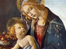

  
[Intangible Textual Heritage](../../index)  [Bible](../index.md) 
[Index](index)  [Previous](lbob22)  [Next](lbob24.md) 

------------------------------------------------------------------------

[Buy this Book on
Kindle](https://www.amazon.com/exec/obidos/ASIN/B002LE7A6A/internetsacredte.md)

------------------------------------------------------------------------

  
*The Lost Books of the Bible*, \[1926\], at Intangible Textual Heritage

------------------------------------------------------------------------

### The EPISTLE of IGNATIUS to the SMYRNÆANS.

#### CHAP. I.

1 *Declares his joy for their firmness in the
Gospel.* 4 *Enlarges on the person of Christ, against such as pretend
that Christ did not really suffer*.

IGNATIUS, who is also called Theophorus, to the church of God the
Father, and of the beloved Jesus Christ, which God hath mercifully
 [4](#fn_1056.md) blessed with every good gift;
being filled with faith and charity, so that this is wanting in no gift;
most worthy of God, and fruitful in saints: the church which is at
Smyrna in Asia; all joy, through his immaculate spirit, and the word of
God.

2 I glorify God, even Jesus Christ, who has given you such wisdom.

3 For I have observed that

p. 186

you are settled in an immovable faith, as if you were nailed to the
cross of our Lord Jesus Christ, both in the flesh and in the spirit; and
are confirmed in love through the blood of Christ; being fully persuaded
of those things which relate  [1](#fn_1057.md)
unto our Lord.

4 Who truly was of the race of David according to the flesh, but the Son
of God according to the will and power of God; truly born of the Virgin,
and baptized of John; that so  [2](#fn_1058.md)
all righteousness might be fulfilled by him.

5 He was also truly crucified by Pontius Pilate, and Herod the Tetrarch,
being nailed for us in the flesh; by the fruits of which we are, even by
his most blessed passion.

6 That he might set  [3](#fn_1059.md) up a token
for all ages through his resurrection, to all his holy and faithful
servants, whether they be Jews or Gentiles, in one body of his church.

7 Now all these things he suffered for us that we might be saved. And he
suffered truly, as he also truly raised up himself: And not, as some
unbelievers say, that he only seemed to suffer, they themselves only
seeming to be. [4](#fn_1060.md)

8 And as they believe so shall it happen unto them; when being divested
of the body they shall become  [5](#fn_1061.md)
mere spirits.

9 But I know that even after his resurrection he was in the flesh; and I
believed that he is still so.

10 And when he came to those who were with Peter,  [6](#fn_1062.md) he said unto them, Take, handle me,
and see that I am not an incorporeal dæmon. And straightway they felt
and believed; being convinced both by his flesh and spirit.

11 For this cause they despised death, and were found to be above  [7](#fn_1063.md) it.

12 But after his resurrection he did eat and drink with them, as he was
flesh; although as to his Spirit he was united to the Father.

#### CHAP. II.

1 *Exhorts them against heretics.* 8 *The danger of
their doctrine*.

NOW these things, beloved,  [8](#fn_1064.md) put
you in mind of, not questioning but that you yourselves also  [9](#fn_1065.md) believe that they are so.

2 But I arm you before-hand against certain beasts in the shape of men
whom you must not only not receive, but if it be possible must not meet
with.

3 Only you must pray for them, that if it be the will of God they may
repent; which yet will be very hard. But of this our Lord Jesus Christ
has the power, who is our true life.

4 For if all these things were done only in shew by our Lord, then do I
also seem only to be bound.

5 And why have I given up myself to death, to the fire, to the sword, to
wild beasts!

6 But now the nearer I am to the sword, the nearer I am to God: when I
shall come among the wild beasts, I shall come to God.

7 Only in the name of Jesus Christ, I undergo all, to suffer

p. 187

together with him; he who was made a perfect man strengthening me.

8 Whom some not knowing, do deny; or rather have been denied by him,
being the advocates of death, rather than of the truth. Whom neither the
prophecies, nor the law of Moses have persuaded; nor the Gospel itself
even to this day, nor the sufferings of every one of us.

9 For they think also the same things of us. For what does a man profit
me, if he shall praise me, and blaspheme my Lord; not confessing that he
 [1](#fn_1066.md) was truly made man?

10 Now he that doth not say this, does in effect deny him, and is in
death. But for the names of such as do this, they being unbelievers, I
thought it not fitting to write them unto you.

11 Yea, God forbid that I should make any mention of them, till they
shall repent to a true belief of Christ's passion, which is our
resurrection.

12 Let no man deceive himself; both the things which are in heaven and
the glorious angels, and princes, whether visible or invisible, if they
believe not in the blood of Christ,  [2](#fn_1067.md) it shall be to them to condemnation.

13  [3](#fn_1068.md) He that is able to receive
this, let him receive it. Let no man's  [4](#fn_1069.md) place or state in the world puff him
up: that which is worth all his faith and charity, to which nothing is
to be preferred.

14 But consider those who are of a different opinion from us, as to what
concerns the grace of Jesus Christ which is come unto us, how contrary
they are to the design of God.

15 They have no regard to charity, no care of the widow, the fatherless,
and the oppressed; of the bond or free, of the hungry or thirsty.

16 They abstain from the eucharist, and from  [5](#fn_1070.md) the public offices; because they
confess not the eucharist to be the flesh of our Saviour Jesus Christ;
which suffered for our sins, and which the Father of his goodness,
raised again from the dead.

17 And for this cause contradicting the gift of God, they die in their
disputes:  [6](#fn_1071.md) but much better would
it be for them to  [7](#fn_1072.md) receive it,
that they might one day rise through it.

18 It will therefore become you to abstain from such persons; and not to
speak with them neither in private nor in public.

19 But to hearken to the prophets, and especially to the Gospel, in
which both Christ's passion is manifested unto us, and his resurrection
perfectly declared.

20 But flee all divisions, as the beginning of evils.

#### CHAP. III.

1 *Exhorts them to follow their bishop and pastors;
but especially their bishop.* 6 *Thanks them for their kindness,* 11
*and acquaints them with the ceasing of the persecution at
Antioch*.

SEE that ye all follow your bishop, as Jesus Christ, the Father; and the
presbytery, as the Apostles. And reverence the deacons, as the command
of God.

2 Let no man do anything of what belongs to the church separately from
the bishop.

3 Let that eucharist be looked upon as well established, which is either
offered by the bishop,

p. 188

or by him to whom the bishop has given his consent.

4 Wheresoever the bishop shall appear, there let the  [1](#fn_1073.md) people also be: as where Jesus Christ
is, there is the Catholic church.

5 It is not lawful without the bishop, neither to baptize, nor  [2](#fn_1074.md) to celebrate the Holy Communion; but
whatsoever he shall approve of, that is also pleasing unto God; that so
whatever is done, may be sure and well done.

6 For what remains, it is very reasonable that we should  [3](#fn_1075.md) repent whilst there is yet time to
return unto God.

7 It is a good thing to have a due regard both to God, and to the
bishop: he that honours the bishop, shall be honoured of God. But he
that does anything without his knowledge,  [4](#fn_1076.md) ministers unto the devil.

8 Let all things therefore abound to you in charity; seeing that ye are
worthy.

9 Ye have refreshed me in all things; so shall Jesus Christ you. Ye have
loved me both when I was present with you, and now being absent, ye
cease not to do so.

10 May God be your reward, from whom whilst ye undergo all things, ye
shall attain unto him.

11 Ye have done well in that ye have received Philo, and Rheus  [5](#fn_1077.md) Agathopus, who followed me  [6](#fn_1078.md) for the word of God, as the deacons of
Christ our God.

12 Who also gave thanks unto the Lord for you, forasmuch as ye have
refreshed them in all  [7](#fn_1079.md) things.
 [8](#fn_1080.md) Nor shall any thing that you
have done be lost to you.

13 My  [9](#fn_1081.md) soul be for yours, and my
bonds which ye have not despised, nor been ashamed of. Wherefore neither
shall Jesus Christ, our perfect faith, be ashamed of you.

14 Your prayer is come to the church of Antioch which is in Syria. From
whence being sent bound with chains becoming God, I salute the  [10](#fn_1082.md) churches; being not worthy to be
called  [11](#fn_1083.md) from thence, as being
the least among them.

15 Nevertheless by the will of God I have been thought worthy of this
honour; not for that I think I have deserved it, but by the grace of
God.

16 Which I wish may be perfectly given unto me, that through your
prayers I may attain unto God.

17 And therefore that your work may be fully accomplished both upon
earth and in heaven; it will be fitting, and for the honour of God,
 [12](#fn_1084.md) that your church appoint some
worthy delegate, who being come as far as Syria, may rejoice together
with them that they are in peace; and that they are again restored to
their former  [13](#fn_1085.md) state, and have
again received their proper body.

18 Wherefore I should think it a worthy action, to send some one from
you with an epistle, to congratulate with them their peace in God; and
that through your prayers they have now gotten to their harbor.

19 For inasmuch as ye are perfect yourselves, you ought to think those
things that are perfect. For when you are desirous to do well, God is
ready to  [14](#fn_1086.md) enable you thereunto.

p. 189

20 The love of the brethren that are at Troas salute you; from whence I
write to you by Burrhus whom you sent with me, together with the
Ephesians your brethren; and who has in all things refreshed me.

21 And I would to God that all would imitate him, as being a pattern of
the ministry of God. May his grace fully reward him.

22 I salute your very worthy bishop, and your venerable presbytery; and
your deacons, my fellow-servants; and all of you in general, and every
one in particular, in the name of Jesus Christ, and in his flesh and
blood; in his passion and resurrection both fleshly and spiritually; and
in  [1](#fn_1087.md) the unity of God with you.

23 Grace be with you, and mercy, and peace, and patience, for evermore.

24 I salute the families of my brethren, with their wives and children;
and the  [2](#fn_1088.md) virgins that are called
widows. Be strong in the power of the Holy Ghost. Philo, who is present
with me salutes you.

25 I salute the house of Tavias, and pray that it may be strengthened in
faith and charity, both of flesh and spirit.

26 I salute Alce my well-beloved,  [3](#fn_1089.md) together with the incomparable
Daphnus, and Eutechnus, and all by name.

27 Farewell in the grace of God.

¶ *To the Smyrnæans from Troas*.

------------------------------------------------------------------------

### Footnotes

[185:1](lbob22.htm#fr_1053.md) Messenger or
Minister.

[185:2](lbob22.htm#fr_1054.md) Vid. Vossius, a
martyr or confessor. Vid. Annot. in loc.

[185:3](lbob22.htm#fr_1055.md) Vid. Vossius
Annot. in Ep. ad. Smyrn. p. 261. See chap. iii. v. 11.

[185:4](lbob23.htm#fr_1056.md) Comp. 1 Cor. vii.
25.

[186:1](lbob23.htm#fr_1057.md) Unto the Lord.

[186:2](lbob23.htm#fr_1058.md) Matt. iii. 15.

[186:3](lbob23.htm#fr_1059.md) Vid. Voss. Annot.
in loc.

[186:4](lbob23.htm#fr_1060.md) *i.e.* Christians.

[186:5](lbob23.htm#fr_1061.md) Incorporeal and
dæmoniac.

[186:6](lbob23.htm#fr_1062.md) Ex. Evang. Sec.
Hebr. See Dr. Grabe Spicileg. tom. ii. p. 26.

[186:7](lbob23.htm#fr_1063.md) Death.

[186:8](lbob23.htm#fr_1064.md) Admonish.

[186:9](lbob23.htm#fr_1065.md) Have so.

[187:1](lbob23.htm#fr_1066.md) Had true flesh.

[187:2](lbob23.htm#fr_1067.md) It is.

[187:3](lbob23.htm#fr_1068.md) Matt. xix. 12.

[187:4](lbob23.htm#fr_1069.md) Vid. Epist.
Interpol.

[187:5](lbob23.htm#fr_1070.md) Vid. Annot.
Coteler. in loc. Or, Prayers.

[187:6](lbob23.htm#fr_1071.md) Vid. Coteler.
Annot.

[187:7](lbob23.htm#fr_1072.md) Love.

[188:1](lbob23.htm#fr_1073.md) Multitude.

[188:2](lbob23.htm#fr_1074.md) Make a love-feast.

[188:3](lbob23.htm#fr_1075.md) Return to a sound
mind.

[188:4](lbob23.htm#fr_1076.md) Does worship.

[188:5](lbob23.htm#fr_1077.md) Vid. Voss. Annot.
in loc.

[188:6](lbob23.htm#fr_1078.md) Unto.

[188:7](lbob23.htm#fr_1079.md) Ways.

[188:8](lbob23.htm#fr_1080.md) Vid. Epist.
Interpol.

[188:9](lbob23.htm#fr_1081.md) Spirit.

[188:10](lbob23.htm#fr_1082.md) All the.

[188:11](lbob23.htm#fr_1083.md) *i.e.* the bishop
of that church.

[188:12](lbob23.htm#fr_1084.md) Vid. Voss. Annot.
in loc.

[188:13](lbob23.htm#fr_1085.md) Bulk, greatness.

[188:14](lbob23.htm#fr_1086.md) Help you.

[189:1](lbob23.htm#fr_1087.md) Vid. Voss. Annot.
in loc.

[189:2](lbob23.htm#fr_1088.md) *i.e.* The
[deaconesses](errata.htm#10.md) See the reason for the name, Voss. Annot.
in loc. Add. Coteler. ib.

[189:3](lbob23.htm#fr_1089.md) See Voss. Annot.
ex Epist. Interpol.

------------------------------------------------------------------------

[Next: The Epistle of Ignatius to Polycarp](lbob24.md)

