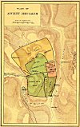

  
[Intangible Textual Heritage](../../index)  [Bible](../index) 
[Index](index) 

------------------------------------------------------------------------

# Bible Maps

The following maps are in the public domain. They were published in 1888
by the American Bible Society.

 [  
Click to enlarge](img/000.jpg)  
Map of the Sinai Peninsula Showing the Journeys of the Israelites from
Egypt to the Promised Land  

 [  
Click to enlarge](img/002.jpg)  
Canaan After the Conquest as Divided Amongst the Tribes  

 [  
Click to enlarge](img/003.jpg)  
The Dominion of David and Solomon  

 [  
Click to enlarge](img/004.jpg)  
The Kingdoms of Judah and Israel  

 [  
Click to enlarge](img/005.jpg)  
Assyria and the Adjacent Lands Illustrating the Patriarchial Period &
the Captivities  

 [  
Click to enlarge](img/006.jpg)  
Palestine in the Time of Christ  

 [  
Click to enlarge](img/007.jpg)  
Plan of Ancient Jerusalem  

 [  
Click to enlarge](img/001.jpg)  
Map Illustrating the Missionary Journeys and Last Voyage of the Apostle
Paul  
