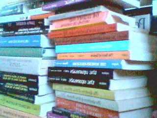

 

### How to Find Books

------------------------------------------------------------------------

  

We get a lot of requests as to how to find books. [Since you can't order
books from this site directly](faq.htm#notabookstore), this page shares
some of our knowledge and some hints about how to find books on the
Internet and beyond.

### Electronic Books on the Internet

The complete text of the book you are looking for may be on the
Internet, just a few mouse clicks away. If it is, you can find it using
these two sites:

[The Online Books Page](https://digital.library.upenn.edu/books/). This
site, which is regularly updated, is a comprehensive index of etexts
which are in the public domain, complete, and freely available.

[Project Gutenberg](https://www.gutenberg.org/catalog/) is the original
volunteer-based etext project. Thousands of high quality, public domain
etexts are available through through this site and its mirror sites.

If the book isn't listed at Online Books or Project Gutenberg, an etext
may turn up through a Wikipedia external link, or by a Google search.
But these will generally be lower quality or less reliable
transcriptions.

### Checking Copyrights Online

Since the purpose of this site is to locate and scan public domain
books, checking the US copyright status is crucial.

A great resource to check all Class A (book) renewals published between
1923 and 1963 (inclusive):

[The Copyright Renewal
Database](https://collections.stanford.edu/copyrightrenewals/bin/search/advanced)

If a book (or any other copyrightable item) was published after 1950,
you can also search the US Copyright office records directly:

[The US Copyright
office](https://cocatalog.loc.gov/cgi-bin/Pwebrecon.cgi?DB=local&PAGE=First)

### Amazon

Please [Visit the Sacred Texts Bookstore](books/index) at Amazon.com. By
purchasing books through this link you will support this continuing work
of this site. Amazon will also allow you to quickly determine whether a
given book is in print, and in some cases whether it is available on the
used market.

### Used Books on the Internet

If the book isn't at Amazon, it may be available used. These are the two
best used book sites on the Internet.

[ABEbooks.com](https://www.abebooks.com/)  
[alibris.com](https://www.alibris.com/)  

### Libraries

Often the book you're looking for isn't online or in print, or available
at a reasonable price. Then it's time to try the libraries. We started
this site from books checked out from the University of California at
Santa Cruz library, although lately many of the books have been acquired
by Interlibrary Loan through the Santa Cruz Public Library system. If
you go the Interlibrary Loan route, you'll first want to establish that
the book exists in one or more libraries. The Interlibrary Loan staff
appreciates it if you walk up with a printout referencing the book
you're looking for--this shows that you've done your homework and saves
them a bit of work. So you'll want to check the major online library
catalogs.

One of the best catalogs on the web is [the MELVYL catalog at the
University of California](https://melvyl.cdlib.org/) (melvyl.cdlib.org).
The UC system has one of the largest collections in the world, and
certainly one of the best and easiest to use interactive catalogs
around.

If the book can't be found in MELVYL, then the other place I check is
the [Library of Congress](https://catalog.loc.gov/). (catalog.loc.gov).
This isn't as feature-rich as MELVYL, but there are often additional
editions listed in it that will confirm the existence of a book or
earlier editions than MELVYL, so it's worth searching.

Also worth a look is the [British Library](https://catalogue.bl.uk/):
this is the online catalog (or catalogue, in 'British') for one of the
oldest and richly stocked libraries in the world.

If a book can't be found in the above three catalogs, there is a strong
chance that it simply doesn't exist.

If you live in California, or are visiting, some of the UC libraries
(notably UCLA and UC Santa Cruz) have open stacks; this means anyone can
walk in off the street and use the library, you don't have to be a
student, faculty member or alumni. Even if you don't live in California,
searching the UC catalog may turn up valuable bibliographic information
about the book. If you *are* an alumni of the UC, consider joining your
Alumni association; it's cheap and you also get a library card.

For fun, look up 'Necronomicon' in MELVYL. You may be surprised at what
you find.

### Used and Independent Bookstores

We also encourage you to patronize used and independent bookstores. The
book you're probably searching for very rarely shows up at the big
chains. The minimum wage chain store clerk will probably look at you
like you're an alien and charge you a stiff premium for special orders.
If you ask for books about magic they'll probably point you to a big
hulking stack of Harry Potter books. The big chains are driving the
smaller bookstores out of business, and the result is less diversity and
higher prices for books.

You'll have much better luck if you patronize the independent,
speciality and used stores. This is because the books at these stores
are stocked by people who care about books, not by bean counters from an
inventory list which overweights the New York Times bestseller list.

Here in Santa Cruz, the whole town is book-crazy. There are three big
bookstores, and a dozen small ones. If you live here, you already know
about these stores. If you visit Santa Cruz, we recommend you take a
look at these stores. If you love books as much as we do, you may want
to move here! Here are four of our favorites, two of which have active
websites. *All addresses with the exception of Gateways Books are Santa
Cruz, CA 95060*

[Bookshop Santa
Cruz](https://www.bookshopsantacruz.com/NASApp/store/IndexJsp)  
*1520 Pacific Ave.* This is the oldest major bookstore in Santa Cruz.
It's fiercely independent and has great atmosphere.

[Logos books](https://www.logosbooksrecords.com/)  
*1117 Pacific Ave.* The largest used bookstore for miles around; a very
magical bookstore, and living proof that chaos theory works. Logos'
basement stacks have provided much of the raw material for sacred-texts
which we didn't check out of UC Santa Cruz or other libraries. I'm there
practically every day.

[Gateways Books](https://www.gatewaysbooks.com/)  
*1126 Soquel Ave, Santa Cruz, CA 95062* This is one of the largest
metaphysical bookstores on the west coast, you can often find quality
used books here as well. Gateways is run by a local Yoga Center, but
gives equal time to all belief systems, including Wicca, Buddhism,
Christianity and so on.

[The Literary Guillotine](https://www.literaryguillotine.com/)  
*204 Locust St.* This is a small used bookstore which specializes in
academic books. It is crammed to the ceiling with obscure and scholarly
books. **Hint:** The owner (who is there nearly every day) has an
encyclopedic knowledge of obscure books and can do offline used
searches, so don't be afraid to chat him up.
