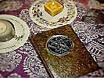

  
[Intangible Textual Heritage](../index)  [Index](index) 
[Previous](bos024)  [Next](bos026) 

------------------------------------------------------------------------

  

sacred-texts \|  Web \| *Powered by*

 

*Sponsored Links:*

------------------------------------------------------------------------

  
*Internet Book of Shadows*, (Various Authors), \[1999\], at Intangible
Textual Heritage

------------------------------------------------------------------------

# Witches' Lesser Banishing Ritual of the Pentagram

#### by Paul Hume

The following text was an addendum to some Wiccan friends of mine
written in 1986. It followed a fairly standard instruction in the Lesser
Banishing Ritual of the Pentagram, with which they were not familiar. We
were feeling out some linking techniques leading to a proposed joint
ritual involving several Wiccans and two ceremonial qabalists (one
Thelemite -- ie. myself, and another). While events conspired to torpedo
this project, some interesting ideas came along on both sides. The goal
was a set of brief rituals meaningful to both traditions which we could
practice individually, thus building up a group current prior to the
date of the proposed rite (Samhain of that year). Herewith my notes on
"The Wiccan Pentagram" ritual which evolved during this project. My
primary source of God Forms was Paul Huson's "Mastering Witchcraft"
which was my main source of information on Wicca at the time (I've done
considerable study elsewhere since).

## Non-Solar symbolism

A ritual can be modified in many ways, to refit it for a different set
of symbols, for example. I have taken the liberty of doing some research
into alternate symbols for the Lesser Ritual of the Pentagram since I
know that you work a lunar-feminine current (Wicca) whereas I use more
solar-masculine symbols in my current (Thelemite). The Qabalistic Cross
This might be used as is, though you could use the English if you don't
feel that the Hebrew is relevant. I am sure you recognize the words as
being similar to the end of the Lord's Prayer in the King James Version:
'Unto thee, the Kingdom and the Power and the Glory, forever! Amen.' I
would point out that this formula was around a long time before Christ,
much less the translators of the Standard Revised Version of the Bible.
If you dislike such a specifically Christian form, it may be replaced
with the words KETHER (KEH-THER), MALKUTH, GEBURAH, GEDULAH (or Crown,
Kingdom, Power, Mercy), the spheres of occult energy that you are
invoking with the Q-Cross. The mental images remain the same. You could
even avoid these Hebrew symbols entirely, using Names and formulae more
suitable to raising the Cone of Power, which is what you are doing here
in Wiccan terms. See the 'Wiccan Cross,' below.

The principle is:

1.  Invoke strongly the presence of the Supreme Creative Principle as
    you conceive it (or in your case, Her) to be. Your Name for the
    Goddess as Creatrix would be most suitable.
2.  Draw down power from this Godhead and project it through your body
    into the Earth. Invoke strongly the Supreme symbol of Creation in
    your Tradition: maybe the God -- as Son of the Goddess and Lord of
    the Trees, and as John Barleycorn, the ever-born and dying One.
3.  Establish on your right side the Active Principle -- Yang -- the
    Projective Energy of the Universe. A God image, I should think.
4.  Establish on yourleft side thePassive Principle -- Yin -- the
    Receiving Energy of the Universe. A Goddess force I feel.
5.  Strongly visualize yourself at the center of these axes between the
    Infinities. This centers you at the middle of the Sacred Space to be
    created -- the still point at the center of the universe.

### The Pentagrams

Again, the pentagram should be used. This symbol is universal to many,
many systems of magick, including Wicca, as you know. The five-pointed
star has supreme power over the Elements: Spirit, Fire, Water, Air and
Earth. It drives off negative influences and attracts positive ones. It
is an essential part of the rite and there is no symbol that can take
its place as effectively.

### The Names

I prefer using the Hebrew God-Names as is. In this connection they
express formulae that govern the Elements and are no more religious than
E=MC squared. However, there are equivalent Wiccan God-Names, which I
describe in the next section, as substitutes for the Archangels. The use
of the same Names to activate the stars and to invoke the Elemental
force is quite in keeping with the Wiccan tradition, which does not use
the same hierarchical system of God-Name, Archangel, Angel, Ruler,
Spirit, etc. that Qabalism does.

### The Archangelic Invocation

Instead of the Hebrew Archangels I described, you could use Wiccan
Deities to invoke the 'pure' form of the Elements.

**AIR-EAST:**  
The Air image in Wicca seems to be masculine and relates to Herne, the
Black Man, the messenger of the Gods, or the Sky Gods: Odin, or Lugh as
the rising Sun God. The God can be imagined as riding through the night
sky, at the head of the Wild Hunt, or rising above the branches of the
world-ash. Instead of the Sword given to Raphael, the God might carry a
staff, spear or wand, which is attributed to Air in most Wiccan
traditions.

**FIRE-SOUTH:**  
The Fire image is definitely masculine and relates to the Horned God:
Cernunnos, Lucifer, call Him what you will. He stands in the hot light
of the noonday sun, radiating fiery energy. He would bear an Athame or
sword, which is the weapon of Fire in most Wiccan styles.

**WATER-WEST:**  
The Water image is the Maiden, the mistress of the Moon and the Tides:
Aradia, Artemis, Venus rising from the waves. Her image is lit by the
silver light of the moon, upon a tranquil reach of water or the foaming
sea. She might hold the chalice, symbol of water (alternatively, the
cauldron might be envisioned).

**EARTH-NORTH:**  
The Goddess in Her aspect as Earth Mother is here: Hertha, Habondia,
Demeter. She stands beneath the golden, life-giving sun surrounded by
the fruits of the Earth. Before her, a platter flows with good things of
the Earth, for the disk/shield/platter is the pentacle, magick
instrument of Earth. These are only bare sketches of the magickal images
that a witch might use to replace the Qabalistic images of the
traditional pentagram ritual. I offer them for what they are worth.

A few points to note:

1.  The phases of the sun used in the Archangelic images (East:Dawn;
    South:Noon; West:Sunset; North:Midnight) are not the same, nor are
    they as important to Wicca. Instead, the poles of day and night are
    established: Night for the East-West axis and Day for the
    North-South axis.
2.  The male-female poles are established with the masculine images
    (Herne and Cernunnos) attributed to the active Elements (Air and
    Fire) and the feminine images (Aradia and Habondia) to the passive
    Elements (Water and Earth). Note that one figure of each gender
    stands in light, and one in darkness. This
    male-female/positive-negative/active-passive polarity is central to
    virtually all systems of magick, eg. the yin/yang symbol in oriental
    systems. I may be betraying solar-phallic tendencies by these
    assignments, and you may want to use different attributions: The
    Maiden can be Air and the Mother switch to Water, with the Hunter
    moving into Earth, for example. Heck, the dual God Forms should
    perhaps be invoked in each quarter. eg. Venus/Adonis imagery in East
    or South, Hertha/Herne in West, etc.

### The Star Of David

The last line of the Invocation refers to a 'six-rayed star' and the
mental work calls for imagining a Star of David. This is not a
specifically Jewish symbol in this context. The six-pointed star, or
hexagram, is the Qabalistic symbol par excellence of initiation and
spiritual illumination. The upward-pointing triangle represents the
aspiration of the magician to the Gods, and the downward-pointing
triangle represents the divine power, flowing down to the world. These
meet at the moment of magick and the interlaced triangles forming the
hexagram symbolize the power of this meeting. Should you prefer not to
use the Star of David, you can replace the mental image with any symbol
showing the meeting of your soul and the power of the Goddess. This can
even be a private symbol, one that is meaningful only to you.
Alternatively, you can just envision the sphere of white light from the
Q-Cross, as a symbol of divine power. Replace the words about the
'six-rayed star' with some descriptive form: 'the seal of the Goddess,'
or 'the sign of my Awakening,' or simply 'the light Divine.'

## Wiccan Pentagram ritual

Rubric \[This is a form of the rite incorporating the changes in
symbolism discussed above\]

**WICCAN CROSS**  
Face East. Touch forehead. Say IO EVOE HERTHA ('Blessed be Hertha,' or
other Name by which you worship the Goddess as Creatrix) Touch solar
plexus or genitals. Say IO EVOE CERNUNNOS ('Blessed be Cernunnos,' or
other name by which you worship the Horned God as the Earth) Touch right
shoulder. Say EKO EKO AZARAK ('Hail, hail force of fire') Touch left
shoulder. Say EKO EKO AMELAK ('Hail, hail to the glory') Extend arms in
form of a cross. Say IO EVOE ('Blessed be.') Clasp hands upon breast and
say 'So mote it be.'

**CIRCLE OF PROTECTION**  
Trace pentagram in East. Say HERNE. Trace circle of protection until
facing South. Trace pentagram in South. Say CERNUNNOS. Trace circle of
protection until facing West. Trace pentagram in West. Say ARADIA. Trace
circle of protection until facing North. Trace pentagram in North. Say
HABONDIA. Finish tracing circle, closing it in the East.

**INVOCATION OF THE GREAT GODS**  
Return to center of circle and face East. Extend arms in form of a
cross. Chant:  
Before me HERNE The Huntsman  
Behind me ARADIA The Maiden  
On my right hand CERNUNNOS, the Horned God  
On my left hand HABONDIA, the Great Mother  
About me flame the pentagrams  
And above me shines the light of the Goddess.

Repeat the Wiccan Cross. Rather than performing this in the rather
measured cadences of Qabalistic Ritual, a form of dancing and chanting
more pleasing to the God-forms of Wicca might profitably be devised.

------------------------------------------------------------------------

[Next: On the Lesser Banishing Ritual of the Pentagram (Tim
Maroney)](bos026)
