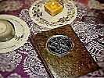

  
[Intangible Textual Heritage](../index)  [Index](index.md) 
[Previous](bos411)  [Next](bos413.md) 

------------------------------------------------------------------------

  

sacred-texts \|  Web \| *Powered by*

 

*Sponsored Links:*

------------------------------------------------------------------------

  
*Internet Book of Shadows*, (Various Authors), \[1999\], at Intangible
Textual Heritage

------------------------------------------------------------------------

              
                                                       Blood  

                Is that you that I hear? 
                Your footsteps on the ground above my head. 
                Your hands apon the headstone that bears my name. 
                You are a dweller in the night!  Beware I bite! 
                On cloak as black as sin, I float, I fly. 
                In hunger burning bright, seaking prey. 
                Life is flowing deep within. 
                I send it bubbling fourth. 
                and then I drink it in again. 
                Another night, never day. 
                Away away, into the dark I flee! 
                where I might hide. 
                waiting for another night. 
                Did you hear? 
                Did you see? 
                Do you flee? 
                Or is that your hand I find near mine? 
                In the dark!  Dwellers in the night! 
                Beware we bite! 
                                                      Similodon 

                                                                                               1897

------------------------------------------------------------------------

[Next: Pandemonium (Sonia Brock)](bos413.md)
