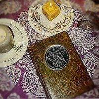

  

[Download complete IBOS in zip format](download.md).

------------------------------------------------------------------------

[Neo-Paganism/Wicca](../pag/index)  [Esoteric and Occult](../eso/index.md) 
[Shamanism](../sha/index)  [Classical Paganism](../cla/index.md) 
[Tarot](../tarot/index.md)  
[The Gardnerian Book of Shadows](../pag/gbos/index.md)  
[OCRT: Neo-Pagan Religious
Traditions](https://www.religioustolerance.org/neo_paga.md) \[External
Site\]  [OCRT: Asatru (Norse
Paganism)](https://www.religioustolerance.org/asatru.md) \[External
Site\]  
  
[Featured Articles](#feature)         [New Articles](#updates.md)        
[Start Reading](#bos.md)

------------------------------------------------------------------------

  

|                                                                                                  |                                                               |
|--------------------------------------------------------------------------------------------------|---------------------------------------------------------------|
|  | The Internet Book of Shadows |

------------------------------------------------------------------------

 

This is a large (+9Mb) collection of articles related to Neo-Paganism
which can be found archived at a number of FTP sites (for instance,
[here](ftp://ftp.lysator.liu.se/pub/religion/neopagan/BOS/).md). This is a
collection of posts to bulletin boards from the late eighties to the mid
nineties, essentially predating the modern Internet. According to a
recent communication, the original editor of this archive was Durwydd
mac Tara at PODS net. We acknowledge Durwydd's hard work to preserve
this archive. For ease of access, we have converted this archive to HTML
using a C program. There are a number of technical difficulties with
this collection including runtogetherwords in many places, problems with
the table of contents and huge inconsistencies in pagination; due to the
volume of this material we have left these intact for now.

We have taken the liberty of removing about twenty-five articles which
were too far 'off topic', posted elsewhere at this site, or had serious
copyright issues. Three articles have been removed at the request of the
authors. Other than the omitted articles we have made no attempt to
alter any of the content.

#### *NOTE ON COPYRIGHTS*

 Practically all of the files below are
copyrighted but redistributable for non-commercial purposes. Consult
each file for particulars.

NOTE: As most of these postings were archived many years ago, we have no
way to contact the authors of any of these documents. Therefore we can't
arrange copyright clearances for any of these pieces or give you the
email addresses of the authors. Some of the may have a web presence and
you may be able to find them by searching for them through search
engines, but because of time limitations we can't directly assist you in
this process.

CD-ROM note: For copyright reasons, none of the files on this page are
included on the sacred-texts CD-ROM, although it does have most of the
public domain files from the [neopagan section](../pag/index.md).

------------------------------------------------------------------------

### Featured Articles

[Pre-Islamic Paganism](../pag/pip.md)  *34,035
bytes*   
[History Of Wicca In England](../pag/wiccahst.txt.md)  *45,031 bytes*   
[Witch Hunt](../pag/burning.md)  *37,517 bytes*
  
[The Runes](../pag/runes.txt.md)  *20,700 bytes*
  
[Ravenbok: The Raven Kindred Ritual
Book](https://www.webcom.com/~lstead/Ravenbok.html.md)  \[External Site\]  
An introduction to Icelandic neo-Paganism.   
[An Investigator's Guide to Allegations Of Ritual Child
Abuse](../pag/lanning.md)  *161,431 bytes*  
written by an FBI agent, this report debunks a contemporary witch hunt.
  
[The Book of the Goddess](../wmn/bog/index.md)  by
Anna Livia Plurabelle \[2002\]  

------------------------------------------------------------------------

 

### Updates and News

We welcome new submissions for the Internet Book of Shadows from the
Neopagan community. [Please write us](https://ith.oarc.science/contact.md)
if you have new material you want to contribute to this page. Mention
'IBOS Submission' in the subject line (so we don't get it confused with
other correspondence). Note that we don't post everything we receive,
only articles similar to the ones below. Intangible Textual Heritage
reserves the right to do minor reformatting on submitted articles.
Please send only HTML or preformatted text files (no PDFs, Word or
WordPerfect files, etc.). The less work it is to incorporate your
article, the better the chance it will be posted. *Attach* your file to
the mail message *in ZIP format* so that it arrives without being
reformatted by mail readers. We do not post copyrighted material (that
is, anything written by you) unless you are the copyright owner and
include a release such as

> This article may be reproduced for non-commercial purposes, providing
> that this original copyright notice stays in place at all times.

------------------------------------------------------------------------

 [The Laws by J. Random Folksinger](jrflaws.md)  
[How to power a magic spell by Black Cat](msg0000.md)  
[What is Magick by David Rankine](msg0001.md)  
[Ethics and Etiquette by Morgaine](msg0002.md)  
[Becoming a Witch by Morgaine](msg0003.md)  
[Self Dedication Explained by David Rankine and Sorita](msg0004.md)  
[A Self Dedication Ritual by David Rankine and Sorita](msg0005.md)  
[How to find a Coven or Group by David Rankine and Sorita](msg0006.md)  
[Book of the Whole](bow.md)  
[Physics and the Basic Principle of Visualization Magick](msg0007.md)  
[Birthing Ritual Chant](msg0008.md)  
[Brujeria](msg0009.md)  
[Gender and Nature in Contemporary NeoPaganism](msg0010.md)  
[A Code Of Ethics for Teachers of the Wicca](msg0011.md)  
[Protection Spell](msg0013.md)  
[Personal Cleansing](msg0014.md)  
[What is Progressive Witchcraft?](msg0015.md)  
[Making Contact with the Lord and Lady](msg0016.md)  
[Wiccan Fundamentalism](msg0017.md)  
[Defending Eclectic Neopaganism](msg0018.md)  
[Thoughts on Bashing Fluffy Bunnies](msg0019.md)  
['He Casts the Circle'](msg0020.md)  
[Cleansing (Rowan Moonstone)](bos000.md)  
[Second Degree Initiation (Gary Dumbauld)](bos001.md)  
[Pagan Ritual for Basic Use](bos002.md)  
[A Circle For Catharsis (Judy Harrow)](bos003.md)  
[Opening (ending) The Circle](bos004.md)  
[Consecration Of Chalice, Athame Or Other Tool](bos006.md)  
[Samhain Ritual For Small Circle (L. A. Hussey)](bos007.md)  
[NROOGD SAMHAIN - 1987 (l.a. Hussey)](bos008.md)  
[The Origins Of Halloween (Rowan Moonstone)](bos009.md)  
[Firestar Beltaine 1986](bos010.md)  
[An Eclectic Circle Ceremony (Durwydd)](bos011.md)  
[A Mabon Outline (anon.)](bos012.md)  
[A Midsummer Celebration (Mike Nichols)](bos013.md)  
[Ceremony Of Initiation (Brad Hicks)](bos014.md)  
[Invocations to Frigg, Baldur, Freyja, Freyr, Brigit, Herne and
Thorr](bos015.md)  
[An Issian Circle Casting (Matrika)](bos016.md)  
[Circles, why use them? (Mel White)](bos017.md)  
[Handfasting (Wedding)](bos018.md)  
[Initiation Into The Coven, Outdoor Version](bos019.md)  
[Neo-Pagan Ritual (Brad Hicks)](bos020.md)  
[A Celebration of May Day (Mike Nichols)](bos021.md)  
[Midwinter Night's Eve: Yule (Mike Nichols)](bos022.md)  
[Winter Solstice Or Yule (Starhawk)](bos023.md)  
[Yule in Britain (Tana)](bos024.md)  
[Witches Lesser Banishing Ritual Of The Pentagram (Paul Hume)](bos025.md)  
[On the Lesser Banishing Ritual of the Pentagram (Tim
Maroney)](bos026.md)  
[Mystical Pentagram](bos027.md)  
[Basic Spell Construction](bos028.md)  
[Tool Blessing Ritual](bos030.md)  
[Dedication Of Altar And Athame (Durwydd)](bos031.md)  
[Beltane: Its History and Modern Celebration in Wicca in
America](bos032.md)  
[Casting The Circle](bos033.md)  
[Technology And The Craft](bos034.md)  
[Wiccan Tool List Master (Seastrider)](bos035.md)  
[All Hallows Eve (Mike Nichols)](bos036.md)  
[Samhain (United Wiccan Church)](bos037.md)  
[Samhain Notes (Farrar)](bos038.md)  
[O.T.O. Samhain Ritual](bos039.md)  
[Two Witches A Modern Craft Fairy-Tale (Mike Nichols)](bos040.md)  
[Wicca from My Point of View (Lady Phoenix)](bos041.md)  
[Witchcraft: The Old Religion Q&A (Dr. Leo Martello)](bos042.md)  
[Wicca, Wicca, Who's Got the Wicca? (Hurn, RMPJ)](bos043.md)  
[Binding A Spell (Farrar & Farrar)](bos044.md)  
[Saxon Wicca Rites (Raymond Buckland)](bos045.md)  
[Wiccan Shamanism (Selena Fox)](bos046.md)  
[Healing Myth (Nihasa)](bos047.md)  
[Candlemas: The Light Returns (Mike Nichols)](bos048.md)  
[Lady Day: The Vernal Equinox (Mike Nichols)](bos049.md)  
[Lammas: The First Harvest (Mike Nichols)](bos050.md)  
[Harvest Home (Mike Nichols)](bos051.md)  
[The Death Of Llew, A Seasonal Interpretation (Mike Nichols)](bos052.md)  
[Spring Equinox Ceremony (Farrar and Farrar)](bos053.md)  
[Smudging: How To Do It -- How Not To Do It (Michelle Haas)](bos054.md)  
[An Introduction to Traditional Wicca (K.A.M.)](bos055.md)  
[Principles of Wiccan Beliefs (American Council of Witches,
1974)](bos056.md)  
[The Wiccan Way (Lady Beckett)](bos057.md)  
[The Charge of the Goddess (D. Valiente)](bos058.md)  
[Satanism vs. Wicca (Diane Vera)](bos059.md)  
[Women vs. Men (Michele Haas)](bos060.md)  
[WHAT IS D.A.W.N.? (Denver Area Wiccan Network)](bos061.md)  
[Glossary Of Terms Commonly Used In Wicca](bos062.md)  
[Ritual For The Healing And Preservation Of Rainforests](bos063.md)  
[What Are Runes (Lokrien)](bos064.md)  
[Models of Magick](bos065.md)  
[The Eight Paths and Other Wiccan Miscellany (Carrie
McMasters)](bos066.md)  
[Balance of the God and Goddess (Adrienne)](bos067.md)  
[Where do we go from here?](bos068.md)  
[Wiccan Path (Madoc)](bos069.md)  
[Sex and Magick (Fra. Apfelmann)](bos070.md)  
[The Riddle Of The Trickster](bos071.md)  
[Notes on Kabbalah (Colin Low)](bos072.md)  
[Footprints in the Chamber - Towards a Quantum Qabbala](bos073.md)  
[The Dark Night of the Soul](bos074.md)  
[Weaving Webs (David Rankine)](bos075.md)  
[Supradimensionality Part I (I.O.T.)](bos076.md)  
[Celtic Craft Reading List (Rowan Moonstone)](bos077.md)  
[The Covenant of the Goddess](bos078.md)  
[Covenant of the Goddess Pledge](bos079.md)  
[Basic Principles Of The Craft (American Council of Witches)](bos080.md)  
[In Grandmother's Lap (RMPJ)](bos081.md)  
[Exegesis On The Wiccan Rede (Judy Harrow)](bos082.md)  
[Witches Creed (Doreen Valiente)](bos083.md)  
[What is Wicca? (Texas Pamphlet)](bos084.md)  
[A Little Less Misunderstanding (J. Brad Hicks)](bos085.md)  
[NeoPagism (Eric S. Raymond)](bos086.md)  
[What is Wicca? (Amber K.)](bos087.md)  
[Re-Thinking The Watchtowers (Mike Nichols)](bos089.md)  
[First Degree, What is it?](bos090.md)  
[Church of All Worlds](bos091.md)  
[What is Shamanism? (Michelle Haas)](bos092.md)  
[Etymology of "Wicca"](bos093.md)  
[Nature Spirit Magick (Larry Cornett)](bos094.md)  
[Mycenaen Mysteries (J. Teller)](bos095.md)  
[Open Circle Ethics (Brandy Williams)](bos096.md)  
[Shamanic Lifeways Fellowship (Michelle Haas)](bos097.md)  
[Pantacle, The (Gary Dumbauld)](bos098.md)  
[Chaos Magic (Mark Chao)](bos099.md)  
[Magickal History (Fra.: Apfelman)](bos100.md)  
[Power Animals (RMPJ)](bos101.md)  
[Crystals, their care and feeding (Matrika)](bos102.md)  
[Ethics and Magick (Warren Stott)](bos103.md)  
[Candle Magic](bos104.md)  
[Cauldrons (Elemental)](bos105.md)  
[Irish Myth Concordance (Mike Nichols)](bos106.md)  
[CELTIC NUMEROLOGY (Mike Nichols)](bos107.md)  
[Bare Bones 3rd Degree (Humor)](bos109.md)  
[Beltane Ritual (Seastrider)](bos110.md)  
[Landmarks of the Craft](bos112.md)  
[Magickal Ethics (Judy Harrow)](bos113.md)  
[Mind Control Techniques (Dick Sutphen)](bos114.md)  
[A Neo-Pagan Filmography (Mike Nichols)](bos115.md)  
[Candlemas (Gwydion)](bos116.md)  
[Opening the Circle](bos117.md)  
[Circle Casting (Avaloian)](bos118.md)  
[Coven Leadership](bos119.md)  
[Blood Sacrifice (Althea Whitebirch)](bos120.md)  
[Ancient Art, The](bos121.md)  
[Ethics and Love Magick (Mike Nichols)](bos122.md)  
[Drawing Down the Moon](bos123.md)  
[Crone Energies (Grey Cat)](bos124.md)  
[Elemental Correspondences](bos125.md)  
[Autarchic Creed](bos126.md)  
[Psychic Attack](bos127.md)  
[Ethics or Etiquette](bos128.md)  
[Dream-News](bos129.md)  
[Dream Life](bos130.md)  
[Dream Problem Solving](bos131.md)  
[Dreams Precognition](bos132.md)  
[Dream Bibliography](bos133.md)  
[Festivals](bos134.md)  
[Fool](bos135.md)  
[Psychic Self-Defense](bos136.md)  
[Divination (RMPJ)](bos137.md)  
[Divination (Bibliography)](bos138.md)  
[Exorcism](bos142.md)  
[EcoMagick](bos143.md)  
[Fundamentals of Human Ecology](bos144.md)  
[The Postures of Ecstasy](bos145.md)  
[Creation Story](bos146.md)  
[Comparison of Wicca and Christianity](bos147.md)  
[Degrees within Covens](bos148.md)  
[Full Deck Tarot Spread](bos149.md)  
[Banes, Bindings, and Mirrors (Judy Harrow, Hugh Read)](bos150.md)  
[Harvest Thoughts (Gary Dumbauld)](bos151.md)  
[Heyokah (RMPJ)](bos152.md)  
[Full Moon Ritual (Seastrider)](bos153.md)  
[Goodwife (Story by L.A. Hussey)](bos154.md)  
[Great Rite, The (Symbolic)](bos156.md)  
[Heal The Earth (a meditation)](bos157.md)  
[Healing (one method)](bos158.md)  
[Homeblessing (Selena Fox)](bos159.md)  
[Imbolc (Solitary Ritual)](bos160.md)  
[Hypnosis 101](bos161.md)  
[Taleisin's thoughts](bos162.md)  
[Magick Vs. Prayer (Salgamma)](bos163.md)  
[Dying God (Ammond ShadowCraft)](bos164.md)  
[Gnosticism](bos167.md)  
[Kali and Modern Physics](bos168.md)  
[Hidden Codes in the Torah](bos169.md)  
[K.A.M.](bos170.md)  
[Keltria (The Henge of)](bos171.md)  
[Ishtar](bos172.md)  
[Five Fold Kiss](bos173.md)  
[Ritual Bath (Sewna Silvara)](bos174.md)  
[Tea Ritual (Sewna Silvara, Triskelion)](bos175.md)  
[Scorpio Dragon (Sewna Silvara)](bos176.md)  
[Descent of The Goddess (Sewna Silvara)](bos177.md)  
[Craft Ethics (J. Crowley)](bos178.md)  
[Computer Blessing (Zahai Stewart)](bos179.md)  
[Charge of the Phone Goddess (Magenta Griffith)](bos180.md)  
[Manhood Rituals (RMPJ)](bos181.md)  
[Coven Offices](bos182.md)  
[Odinism, What is it?](bos183.md)  
[Strings On The Winds (Bardic Fiction)](bos184.md)  
[Circle Purification for Asthmatics](bos185.md)  
[Astral Projection (Monroe Technique)](bos186.md)  
[History (Weyland Smith)](bos187.md)  
[History of Witch Craft](bos188.md)  
[Magick, Physics, & Probability (Hurn)](bos189.md)  
[Magickal Definitions (RMPJ)](bos190.md)  
[Magick Course Outline (Amber K.)](bos191.md)  
[Magickal Laws (after P.E.I. Bonewits)](bos192.md)  
[Mayan Deities (777 Supplement)](bos193.md)  
[Mayday Celebration (Mike Nichols)](bos194.md)  
[Necromancy (reprint)](bos195.md)  
[Quantum Magick (Larry Cornett)](bos197.md)  
[Personal effects of Ritual (Nihasa)](bos198.md)  
[Heretic's Corner (RMPJ)](bos199.md)  
[Open Letter to A New Witch](bos200.md)  
[Maychants (4) (Tanscribed by SeaStrider)](bos201.md)  
[Magickal Stones & Gems](bos202.md)  
[Modern Pagaism, Q&A](bos203.md)  
[A Booklist of Pagan/Magickal Titles](bos204.md)  
[Talespinner's Neopagan Reading List](bos205.md)  
[Witchcraft (Annotated bibliography)](bos206.md)  
[Charge of The Horned God, The](bos207.md)  
[Shamanic Binding (Gaffer Maccluiunn)](bos208.md)  
[Spitual Emergence or Emergency (Paul Seymour)](bos209.md)  
[Monotheism vs. Polytheism (Dan Holdgriewe)](bos210.md)  
[Modern Pagan Persecution (Jonathan Hutchins)](bos211.md)  
[Magick Christians (Alfgar Maharg)](bos212.md)  
[Polarity and Single Sex Covens (Marios)](bos213.md)  
[Evolution of Wiccan Ritual (Paul Hume)](bos214.md)  
[Basic Beliefs of WICCA (C.O.G.)](bos215.md)  
["Condensed" Definition of Wicca (Lady Phoenix)](bos216.md)  
[Origins of the Mandan (Madoc)](bos217.md)  
[Burning Times, The (Marios)](bos218.md)  
[Fortune, The (RMPJ)](bos219.md)  
[Lucid Dreaming (Omni Magazine)](bos220.md)  
[Check List for A Well Working Group (Amber K)](bos221.md)  
[Basic Love Spell](bos222.md)  
[Amazing (Pagan?) Grace](bos223.md)  
[Elements, A Hermetic Summoning (Marios)](bos224.md)  
[Learning Process](bos225.md)  
[High Technology Meets The Ancient Wisdom](bos226.md)  
[Helpful Hints (Humor)](bos227.md)  
[Channeling (Jast)](bos228.md)  
[Elemental Correspondences (from Starhawk)](bos231.md)  
[Candle Colors](bos232.md)  
[Scents and Oils](bos233.md)  
[Modern Paganism: Questions & Answers (C.O.G. Salt Lake City)](bos236.md)  
[Standing Stones Book Of Shadows (Scott Cunninham)](bos238.md)  
[Consciousness & Politics (Carol Moore)](bos239.md)  
[Mothers Day Message](bos240.md)  
[Memory & Perception, a new Model (Paul Seymour)](bos241.md)  
[Some Magical Musical Selections](bos242.md)  
[Chants w/ASCII Notation (L.A.Hussey)](bos243.md)  
[Lilith (BBS Conversation)](bos244.md)  
[Wiccan Information Network](bos245.md)  
[Runic Thorn Ritual (Faunus)](bos248.md)  
[Solitary Moon Rite, Issian (Ellen Cannon Reed)](bos249.md)  
[Quilting and "Craft" (J.M. Cortese)](bos250.md)  
[Sophia and Gnosticism (Terry J. McCombs)](bos251.md)  
[Beltane (The White Bard)](bos252.md)  
[Samhain (The White Bard)](bos253.md)  
[Celtic Bibliography (Annotated, by Eryn Darkstar)](bos254.md)  
[Candlemas (The White Bard)](bos255.md)  
[Salem Anniversary Ritual (Sandy & Diug Kopf)](bos256.md)  
[Elven (Modern Mythic Prose by Par Garou)](bos257.md)  
[Craft Laws (by Lady Sheba)](bos258.md)  
[New Laws (Lady Galadriel, Grove of The Unicorn)](bos259.md)  
[The New Book Of Law, A Commentary (J. Random Folksinger)](bos260.md)  
[Aporrheton 5 (Judy Harrow?)](bos261.md)  
[The Abbreviated Laws (including Comment by J.R.F.)](bos262.md)  
[The Law (Humor)](bos263.md)  
[Karma, The Three-Fold Law (Paul Seymour)](bos264.md)  
[Exegesis on The Wiccan Rede (Judy Harrow)](bos265.md)  
[JOAN on the Witch Laws](bos266.md)  
[Commentary by L.A. Hussey](bos267.md)  
[Craft Ethics Response (M.K.H)](bos268.md)  
[Broken Heart Spell (Healing)](bos269.md)  
[Statement of Principles and Ethics (Lifeway Shamanic
Fellowship)](bos270.md)  
[Dragon, The Last (story by Gerald Decampo)](bos271.md)  
[Circle Casting](bos272.md)  
[On the Number 451 (Ordo Argentum Astrum)](bos273.md)  
[Chaos Magick vs. Thelema](bos274.md)  
[Notes On The Historical Egregore in Magick (I.O.T.)](bos275.md)  
[Nemesis Conjuration (I.O.T.)](bos276.md)  
[Ideology (I.O.T.)](bos277.md)  
[Thunder, Perfect Mind (Tony Ianotti)](bos278.md)  
[Treatise On Mind (The Tigress)](bos279.md)  
[Magickal Training Course (Phil Hansford)](bos280.md)  
[Chaos-sphere](bos281.md)  
[I.O.T. History (The Beginnings)](bos282.md)  
[Chaoism and Chaos Magick (Pete Carroll)](bos283.md)  
["Dark Night of the Soul"](bos284.md)  
[Liber OZMA (Tim Maroney)](bos285.md)  
[Sigil Magick (I.O.T.)](bos286.md)  
[Drugs and Religion -- Snakebite Trips? (Loren Petrich)](bos287.md)  
[Wishing Well (I.O.T.)](bos288.md)  
[Hymns To The Star Goddess (O.T.O.)](bos289.md)  
[Mind, A Treatise on The (The Tigress)](bos290.md)  
[Dragon Trad and the Holy Grail (C.J. Mandrake)](bos291.md)  
[Ritual of the Blessed Motherboard (Discordian Humor)](bos292.md)  
[Prosperity Spell \[Famtrad\] (Rowan Moonstone)](bos293.md)  
["Quarter Calls"](bos294.md)  
[Safe Travel Spell (Rowan Moonstone)](bos295.md)  
[Wiccan Rede, The (J. Taylor, S.O.T.E.G.)](bos296.md)  
[Wicanning Ritual (Earthworld Circle)](bos297.md)  
[Washington Post Article (1991)](bos298.md)  
[The 12 Steps and Shamanism (Matrika, P.A.N.)](bos299.md)  
[Divine Circle Scam](bos300.md)  
[Wiccan Rede (Poetic)](bos301.md)  
[Blessing Prayer (Traditional Gardnerian "Dryghten Prayer")](bos302.md)  
[Meditation Techniques, Basic (Bill Witt)](bos303.md)  
[River of Life Meditation (Gay Clarke)](bos304.md)  
[MONISM (Durwydd Mac Tara)](bos305.md)  
[Bardic Wedding (RowanHart Circle)](bos306.md)  
["Weasel Wicca" (Humor fm. Green Egg)](bos307.md)  
[Rabbit (John Lone Wolf)](bos308.md)  
[Literary Roots of Wicca (Diane Vera)](bos309.md)  
[Satanism 101 (Diaane Vera)](bos310.md)  
[Satanism Defined (Delohine)](bos311.md)  
[Wiccan Rede (Poetic, WCC)](bos312.md)  
[Orphic Invocations of God & Goddess (Phaedra)](bos313.md)  
[EAST](bos314.md)  
[SOUTH](bos315.md)  
[WEST](bos316.md)  
[NORTH](bos317.md)  
[Wiccan History (BTW, Julia Phillips)](bos318.md)  
[What is Wicca (Durwydd Mac Tara)](bos319.md)  
[wiccan Monism (Durwydd MacTara)](bos320.md)  
[AIR - A Meditation (Charis)](bos321.md)  
[Setian Symbolism (T.O.S.)](bos322.md)  
[Perscution, Ancient & Modern (Julia Phillips)](bos324.md)  
[Wheel of The Year (Julia Phillips/Matthew Sandow)](bos325.md)  
[Wheel Visualization (Julia Phillips and Rufus Harrington)](bos326.md)  
[Coven at Pooh Corner (D. Wadsworth)](bos327.md)  
[Wicca and The Art of Motorcycle Maintenance (D. Wadsworth)](bos328.md)  
[Greek and Roman Deities (Thomas Palmer)](bos329.md)  
[Against The Witch Hunters (R. Culain)](bos330.md)  
[Charging Crystals (Ian Kesser)](bos331.md)  
[Tarot Divination (Tuppence)](bos332.md)  
[Dangers of "Magical Thinking" in Magick (Nihasa)](bos333.md)  
[Satanism as Media Hype (News Article)](bos334.md)  
[Why I don't Believe the "Survivors" (R. Moonsone)](bos335.md)  
[Twenty-Two Commandments for the New Age (A. Waldrum)](bos336.md)  
[Risk Assessment for The Craft Community (Weyland Smith)](bos337.md)  
[Peyote & The Supreme Court (News Articles)](bos338.md)  
[Channeling for Fun and Prophet (F.J. McGovern)](bos339.md)  
[Bibliography of Magic in Sci-Df (M. Griffith)](bos340.md)  
[Modified Assyrian Protection Spell (With Commentary)](bos341.md)  
[Rosicrucianism (J. Phillips)](bos342.md)  
[Vernal Equinox Ritual from OZ (Julia Phillips)](bos343.md)  
[Beltane Ritual 1987 (Coven of The Serpents Eye)](bos344.md)  
[Candlemas Ritual 1987 (Coven of The Serpents Eye)](bos345.md)  
[Imbolg '92 (Julia Phillips)](bos346.md)  
[Samhain Ritual 1986 (Coven of The Serpents Eye)](bos347.md)  
[Yule Ritual 1984 (Julia Phillips)](bos348.md)  
["Legitimacy" in the Craft (Khaled Q.)](bos349.md)  
[Descent of The Goddess (G.B.G.)](bos350.md)  
[Descent of The Goddess (Starhawk)](bos351.md)  
[A True History of Witchcraft (Allen Greenfield)](bos352.md)  
[Paganism at the Crossroads (Skytoucher)](bos353.md)  
[Witches Rede of Chivalry (Ed Fitch & Janine Renee)](bos354.md)  
[Autonomatrix Manifesto](bos356.md)  
[Aethyr, On the Nature of (Anthra Andromda)](bos357.md)  
[Dangers of Deity? (a Conversation)](bos358.md)  
[Eight Magicks (Pete Carroll)](bos359.md)  
[Dedication Ritual (Khaled Quicksilver)](bos360.md)  
[Horn Song (Hugh Read)](bos363.md)  
[Pan To Artemis (Hugh Read)](bos364.md)  
[ALOHA! Serge King (Hugh Read)](bos365.md)  
[Burning Times (L.A. Hussey)](bos366.md)  
[Chance (Hugh Read)](bos367.md)  
[To Greyshield, With Love ("Phoenix")](bos368.md)  
[Pagan Awakening (Jeff Bordeaux)](bos369.md)  
[A Call To Lord And Lady (Jeff Bordeaux)](bos370.md)  
[Seeking The Sign To Dragonheim (Jeff Bordeax)](bos371.md)  
[To The Dragons Reborn (Jeff Bordeaux)](bos372.md)  
[Earthdream (Jeff Bordeux)](bos373.md)  
[Elf (Marcus)](bos374.md)  
[LYRA (Hugh Read)](bos375.md)  
[The Goddess is Alive (Unknown)](bos376.md)  
[Hunter's Warning (Jeff Bordeaux)](bos377.md)  
[The Moon Pool (unknown)](bos378.md)  
[Jewel (Shadow Hawk)](bos379.md)  
[The Coming of Lugh (Iarwin)](bos380.md)  
[Night Wind (Shadow Hawk)](bos381.md)  
[A Tree Song (Kipling)](bos382.md)  
[The Cloud Sculptors (Jeff Bordeaux)](bos383.md)  
[A Dreaming Desire (Jeff Bordeaux)](bos384.md)  
[To The Bonfires (Jeff Bordeaux)](bos385.md)  
[Amphitrite (Sourdough Jackson)](bos386.md)  
[Heaven is A Resting Place (Sourdough Jackson)](bos387.md)  
[Prayer Drive (Sourdough Jackson)](bos388.md)  
[ELEGY: James Douglas Morrison (Sourdough Jackson)](bos389.md)  
[Another One For Jim Morrison (Sourdough Jackson)](bos390.md)  
[Beneath The Full Moon (Sourdough Jackson)](bos391.md)  
[Computer Blessing (Zahai Stuart)](bos392.md)  
[Quarters Chant (Damon)](bos393.md)  
[The River (Hugh Read)](bos394.md)  
[Snow (Steve Earl)](bos395.md)  
[The Shaman's Call (Shadow Hawk)](bos396.md)  
[Storm (Shadow Hawk)](bos397.md)  
[A Victim of Ideologies (Jeff Bordeaux)](bos398.md)  
[Shadowhawk](bos399.md)  
[Magical Reveries (Hugh M. Read)](bos400.md)  
[When Saturn Ruled Aquarius](bos401.md)  
[Scarabeus (unknown)](bos402.md)  
[Minerva (Unknown)](bos403.md)  
[Love Is The Law (Unknown)](bos404.md)  
[The Pentagran (Similodon)](bos411.md)  
[BLOOD (Similodon)](bos412.md)  
[Pandemonium (Sonia Brock)](bos413.md)  
[New Words and Old (Kihe Blackeagle)](bos414.md)  
[Spring/Summer Poem (Shadowhawk)](bos415.md)  
[A Healing Spell (unknown)](bos416.md)  
[Banishing The Circle (Devin Storm)](bos417.md)  
[The Fool (Stormy Gael)](bos418.md)  
[Hymn to Artemis (Frater U.' D.')](bos419.md)  
[Today The Moon is There (Hugh Read)](bos420.md)  
[The Witches Ballad](bos421.md)  
[Inquisition](bos422.md)  
[Two Ritual Prayers (Anahita Gula)](bos423.md)  
[Rainbows (Jennifer Holding)](bos424.md)  
[Elements (r.m.p.j.)](bos425.md)  
[Battle Hymn of the Eristocracy (Filk)](bos426.md)  
[The Prettiest One (Filk)](bos427.md)  
[The Lady's Brothel (filk)](bos428.md)  
[Cauldron Chant (Ammond Shadowcraft)](bos429.md)  
[Celtic Circle Dance (Joe Bethancourt)](bos430.md)  
[Descent of The Goddess (D. Mac Tara)](bos431.md)  
[Charge of the God, The (Kyri Comyn)](bos432.md)  
[Charge of the Goddess, The (Kyri Comyn)](bos433.md)  
[Charge of the Horned God \[Rhyming\] (V. West)](bos434.md)  
[Charge of the Goddess \[Rhyming\] (Kalioppe)](bos435.md)  
[Second Ritual for Bast](bos439.md)  
[Beltane Ritual (Lynna Landstreet, W.C.C.)](bos440.md)  
[Yule Carols (Green Egg, Yule '92)](bos441.md)  
[Lammas Ritual , "The Corn Play" (Julia Phillips)](bos442.md)  
[Food For Thought (Some notes for Coven Leaders--Amber K?)](bos443.md)  
[Heirophant, The (Khaled Quicksilver)](bos444.md)  
[\[Removed\]](bos445.md)  
[Egyptian Metaphysics (Michael Poe)](bos446.md)  
[Beltane. 90](bos447.md)  
[Imbolc.90](bos448.md)  
[Lammas.91](bos449.md)  
[Lammas.90](bos450.md)  
[Imbolc.93](bos451.md)  
[MoonAPR.93](bos452.md)  
[MoonAUG.92](bos453.md)  
[MoonFEB.93](bos454.md)  
[MoonJul.92](bos455.md)  
[MoonJUN.92](bos456.md)  
[MoonMAR.93](bos457.md)  
[MoonMay.93](bos458.md)  
[MoonOCT.92](bos459.md)  
[MoonSEP.92](bos460.md)  
[SAMHAIN.91](bos461.md)  
[SAMHAIN.92](bos462.md)  
[YULE.90](bos463.md)  
[Spring Equinox.92](bos464.md)  
[Handfasting (Lady Ardane, Prodigy)](bos466.md)  
[Maiden Story](bos467.md)  
[The Sacred King](bos468.md)  
[The Gifts of The Fool](bos469.md)  
[Death](bos470.md)  
[Rebirth](bos471.md)  
[Creation](bos472.md)  
[The Triple Goddess (Kalioppe)](bos473.md)  
[Dion Fortune & Gardnerian Wicca (C.S. Clifton in W.o.W.)](bos474.md)  
[Temples, Covens, & Groves - Oh My! (Khaled Q.)](bos475.md)  
[Feminine Current in the G.D. (Peregrine, in WoW)](bos476.md)  
[Warriorship (Swein Runestaff W.o.W.)](bos478.md)  
[Glenn Innes Standing Stones](bos479.md)  
[Beyond Reason (Aries, W.o.W.)](bos480.md)  
[Pagan Unity Ritual (W.o.W. \#5)](bos481.md)  
[Blessing my New Home](bos483.md)  
[Bowhunter's Prayer to Dianna (Kalioppe)](bos485.md)  
[Spirituality](bos486.md)  
[Creation Mystery, Part II](bos487.md)  
[Discoveries](bos489.md)  
[Song (Vivienne West)](bos491.md)  
[Pagan Churches (Julia Phillips)](bos492.md)  
[Searching (Carol Neist, W.O.W. \#8)](bos493.md)  
[Leave it Out, Leviticus (Aries, W.O.W. \#8)](bos496.md)  
[Being The Green Book Of Song](bos498.md)  
[Wiccan Rede, The](bos499.md)  
[Witch's Ballad, The](bos500.md)  
[King Henry (Child \#32)](bos502.md)  
[Lord Of The Dance](bos503.md)  
[Celtic Circle Dance](bos504.md)  
[Circles](bos505.md)  
[Spring Strathspey](bos506.md)  
[Bedlam Bells](bos507.md)  
[Burning Times/Chant](bos508.md)  
[Yule Songes](bos509.md)  
[Blessed Be Again!](bos510.md)  
[Stand Up, Stand Up For Odin](bos511.md)  
[Nude](bos512.md)  
[Fairies Love Song](bos513.md)  
[Bard's Song, The](bos514.md)  
[All Thru The Night](bos515.md)  
[Two Magicians](bos516.md)  
[John Barleycorn](bos517.md)  
[False Knight Upon The Road, The (Child \#3)](bos518.md)  
[Nottamun Town](bos519.md)  
[Cambrian Dream](bos520.md)  
[She Moved Thru The Faire](bos521.md)  
[Song Of Wandering Aengus, The](bos523.md)  
[Childish Edda, The](bos524.md)  
[Valkyrie Song, The](bos525.md)  
[God Is Alive, Magic Is Afoot](bos526.md)  
[Real Old Time Religion, That](bos527.md)  
[High Holiday Song, The](bos528.md)  
[Labeling Wiccans (Lucie)](bos529.md)  
[Judeopagan Menopause Ritual (Randronoth)](bos530.md)  
[Asatru Blot (Lewis Stead)](bos531.md)  
[Celtic Deities/Origins (Lorax)](bos532.md)  
[Walking With My Friends (Masochistic Maiden)](bos533.md)  
[Firefawn (Masochistic Maiden)](bos534.md)  
[A Dragon Tale (Kalioppe)](bos535.md)  
[The Goddess Movement (Denver Post)](bos536.md)  
[Funeral Rites (Oz Caliburn)](bos537.md)  
[To Wiccen Or Not To Wiccen...... (article by Vivienne West)](bos539.md)  
[Tools, etc. (Phoenix Whitebirch)](bos541.md)  
[Solitary Neophyte Ritual (C.M.)](bos542.md)  
[Lady's Prayer, The](bos543.md)  
[GAEA Hypothesis (Green Egg)](bos544.md)  
[A Greek System of Chakras](bos545.md)  
[GREEK LBRP](bos546.md)  
[The Farmer And The Goddess - A Modern Story Of Rebirth
(Kalioppe)](bos547.md)  
[Keeper of Wisdom, The (Kalioppe)](bos549.md)  
[Imbolg Ritual (Kalioppe)](bos550.md)  
[Samhain Ritual (Kalioppe)](bos551.md)  
[Neo-Pagan Theology (Cyprian)](bos552.md)  
[Pagan Musings (Tony Kelly, Selene Community, Wales,1970)](bos553.md)  
[The Story of The Pit](bos554.md)  
[The Jesus Story](bos555.md)  
[Sybillyne Tradition of Wicca](bos556.md)  
[UEA '93 Main Ritual (Rowan Moonstone)](bos557.md)  
[Covenant of the Goddess, History (Michael Thorn)](bos558.md)  
[A Christian Speaks (J.C. Taylor)](bos559.md)  
[Kill A Tree (Humorous Song)](bos560.md)  
[Lord of The Ants ("filk" by Karl Lembke](bos561.md)  
[Circles (song, "Anon")](bos562.md)  
[Great Rite (Vivienne West)](bos563.md)  
[Ishtar, Inanna, & Ancient Astrology (Valkyrie)](bos564.md)  
[Mazes in Myth (Valkyrie)](bos565.md)  
[NeoPlatonism (Deborah Kest)](bos566.md)  
[Rune Poem, A linguistic Analysis by Steph Parker](bos567.md)  
[An Australian Aboriginal Myth (WoW \#10)](bos568.md)  
[Bylaws](bos569.md)  
[A Pagan Sacrament of Holy Communion (Morning Glory Zell)](bos570.md)  
["Earthmom"](bos571.md)  
[The Church of All Worlds, a Brief History](bos572.md)  
[Neo-Paganism: An Old Religion for a New Age (Otter G'Zell)](bos573.md)  
[Neo-Pagan Witchcraft vs. Satanism](bos574.md)  
[Where The Hell Is The Church Of All Worlds (CAW, Australia)](bos575.md)  
[What is Myth? (Web of Wyrd, \#10)](bos576.md)  
[Generic Pagan Funeral for a Elder Woman (She-Wolf)](bos577.md)  
[Christmas Past (Eric Maple, via Julia Phillips)](bos580.md)  
[A Yule Mythos](bos581.md)  
[The Legend Of The Maiden](bos582.md)  
[Candlemas Ritual](bos583.md)  
[Herbal "Quick Reference"](bos584.md)  
[House Blessing (She Wolf)](bos585.md)  
[House Blessing notes (Scott Cunningham)](bos586.md)  
[Warriors](bos587.md)  
[Dedication Pledge (Judy Harrow)](bos588.md)  
[Mead, Brew of The Gods! (Lewis Stead)](bos589.md)  
[In Defense of Excellence (Adrienne, Quicksilver, Ottawa)](bos590.md)  
[Badgers](bos591.md)  
[Imbolc at the Covenstead (Erin)](bos592.md)  
[Invocation of Lord and Lady (Ritual)](bos593.md)  
[Yule Ritual (Georgian)](bos594.md)  
[Yule Ritual (She Wolf)](bos595.md)  
[Wine Blessing, All Female (Lynna Landstreet, WCC)](bos596.md)  
[Altars, Misc Thoughts (Chris Olmstead)](bos597.md)  
[What is Shamanism (Eliade)](bos598.md)  
[Traveling Chant (Julia Phillips)](bos599.md)  
[Bridal Blessing (Julia Phillips)](bos600.md)  
[Child Blessings](bos601.md)  
[Santa (Tane Jackson)](bos602.md)  
[Halloween, A Witches Thoughts (Cecylina Brightsword)](bos603.md)  
[Money Tree Spell (Rowan Moonstone)](bos604.md)  
[Spell for contacting a friend (Rowan Moonstone)](bos605.md)  
[Coming of Age ritual (notes by Malakus)](bos606.md)  
[LUPERCALIA (She Wolf)](bos607.md)  
[Stones, A Short Catalog](bos608.md)  
[The Three-Fold Goddess (Eileen Turner)](bos610.md)  
[Being A Witch in Britain Today (James Pengelly, WOW \#10)](bos611.md)  
[Ritual Theory and Technique (Colin Low)](bos612.md)  
[Shamanism (Internet FAQ)](bos613.md)  
[Rite of Passage, Modern Female (Lady Shyra)](bos615.md)  
[Temple Of Set (Lillith Aquino)](bos618.md)  
[Descent Into Confusion (Robert Hughes, WOW)](bos619.md)  
[Wicca vs. Paganism (David Piper)](bos621.md)  
[Raven Kindred Ritual (Asatru)](bos623.md)  
[Bulb Planting Earth Chant (Eileen)](bos624.md)  
[Reclaiming The God (Women's Ritual)](bos625.md)  
[T.O.P.Y. Is](bos626.md)  
[What is Paganism (Bay Area Pagan Alliance)](bos627.md)  
[Principia Discordia](bos628.md)  
[Handfasting (CAW)](bos629.md)  
[Beltane Ritual (ADF)](bos630.md)  
[Brigit of the Celts (Unknown)](bos631.md)  
[Finer Points of Ritual (Mike Nichols)](bos632.md)  
[Editorial, Web of Wyrd \#10 (Julia Phillips)](bos633.md)  
[PR Flyer (Raven, Milwaukee CUUPS)](bos634.md)  
[Coven, The (Julia Phillips)](bos635.md)  
[TOS Symbology](bos637.md)  
[SET](bos638.md)  
[Asatru Resources](bos639.md)  
[ADF Ritual \#1](bos640.md)  
[Pagan Manners (Grey Cat)](bos641.md)  
[Planetary Hours (Andrew Kettle)](bos642.md)  
[Initiation (D. Valiente)](bos643.md)  
[Initiation (Crowther)](bos644.md)  
[Altered States and Ritual (Web of Wyrd \#7)](bos645.md)  
[Berserkir (Mike Howard, W o W \#7)](bos647.md)  
[Karma & Quantum Mechanics](bos648.md)  
["The Knots of Death"](bos649.md)  
[Memorial Day Ritual (HPF, She-Wolf)](bos650.md)  
[Celtic Workshop (from Internet)](bos651.md)  
[How to use Magick with a straight face](bos652.md)  
[Nine Noble Virtues (Norse)](bos653.md)  
[Dark Moon Ritual](bos654.md)  
[Brigit, Two Prayers](bos655.md)  
[House Cleansing Ritual (David Piper)](bos656.md)  
[Celtic Centering Ritual](bos657.md)  
[Candle Blessing (Coven of New Gwynedd)](bos658.md)  
[Covens and Witches (Julia Phillips)](bos659.md)  
[Group Ethics Essay (Raven)](bos660.md)  
[Wiccan Ethics & The Wiccan Rede (David Piper)](bos661.md)  
[Charge of the God 1 and 2 (Siobhan)](bos662.md)  
[For A Few Myths More (WofW \#7)](bos663.md)  
[Handfasting Ritual Notes](bos664.md)  
[Handfasting, Celtic](bos665.md)  

