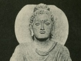

  
[Intangible Textual Heritage](../../index)  [Buddhism](../index.md) 
[Index](index)  [Previous](ami01)  [Next](ami03.md) 

------------------------------------------------------------------------

[Buy this Book on
Kindle](https://www.amazon.com/exec/obidos/ASIN/B002G1ZZEM/internetsacredte.md)

------------------------------------------------------------------------

  
*Amitabha, A Story of Buddhist Theology*, by Paul Carus, \[1906\], at
Intangible Textual Heritage

------------------------------------------------------------------------

p. 9

### THE NOVICE.

Charaka the novice lived with his
brethren in peace, and his senior, the venerable Subhûti, was proud of
his learned disciple, for he was patient, docile, modest, earnest, and
intelligent, and proved all these good qualities by an abnormally rapid
progress. He learned the Sutras perfectly and soon knew them better than
his teacher. He had a sonorous voice, and it was a pleasure to hear him
recite the sacred formulas or chant the verses proclaiming the glorious
doctrine of the Blessed One. To all appearances the Brotherhood had made
a good acquisition; but if the venerable Subhûti could have looked into
the heart of Charaka he would have beheld a different state of things,
for the soul of the novice was full of impatience, dissatisfaction, and
excitement. The life of a monk was so different from what

p. 10

he had expected and his dearest hopes found no fulfilment.

Charaka had learned many beautiful sentiments from the mouth of his
teacher; some of them fascinated him by the melodious intonation of
their rhythm, some by the philosophical depth of their meaning, some by
their truth and lofty morality. How delighted was he with the lines;

"Earnestness leads to the State Immortal  
 Thoughtlessness is dreary Yama's portal.  
 Those who earnest are will never die,  
 While the thoughtless in death's clutches lie."[4](ami16.htm#an_4.md)

How powerfully was he affected by the following stanza:

"With goodness meet an evil deed,  
 With lovingkindness conquer wrath,  
 With generosity quench greed,  
 And lies, by walking in truth's path."[5](ami16.htm#an_5.md)

But sometimes he was startled and had difficulty in understanding the
sense. He wanted peace, not tranquilisation; he wanted Nirvâna, its
bliss, and its fulness, not extinction. And yet sometimes it seemed as
if the absolute obliteration of his activity were expected of him:

p. 11

"Only if like a broken gong  
 Thou utterest no sound:  
 Then hast thou reached Nirvana,  
 And the end of strife hast found."[6](ami16.htm#an_6.md)

Yet Charaka said to himself: "It is only the boisterous noise that must
be suppressed, not work; only evil intention, not life itself; the
weeds, not the wheat." For it is said:

"What should be done, ye do it,  
 Nor let pass by the day:  
 With vigor do your duty,  
 And do it while you may."[7](ami16.htm#an_7.md)

Not life, but error and vice, must be attacked. Not existence is evil,
but vanity, anger, and sloth:

"As fields are damaged by a bane,  
 So ’tis conceit destroys the vain.  
 As palaces are burned by fire,  
 The angry perish in their ire.  
 And as strong iron is gnawed by rust,  
 So fools are wrecked through sloth and lust."[8](ami16.htm#an_8.md)

What ambition was beaming in the eyes of Charaka! The venerable Subhûti
thought, there is but one danger for this noble novice: it is this, that
the brethren may discover his brightness and spoil him by flattery.
Instead

p. 12

of freeing himself from the fetters of the world, he may be entangled in
the meshes of a spiritual vanity, which, being more subtle, is more
perilous than the lust of the world and of its possessions. Then he
recited to Charaka the lines:

"No path anywhere  
Leadeth through the air.  
The multitude delights  
In sacrificial rites.  
Throughout the world  
Ambition is unfurled:  
But from all vanity  
Tathagatas are free."[9](ami16.htm#an_9.md)

Charaka knew that there were fools among men considered saints, who
claimed to walk through the air. He was not credulous, but when told
that to attempt the performance of supernatural deeds was vanity, his
ambition revolted against the idea of setting limits to human invention.
Man might find paths through the air as well as over water; and he
submitted to the sentiment only because he regarded it as a form of
discipline by which he would learn to rise higher. So he suppressed

p. 13

his ambition, thinking that if he only abode his time he would find
himself richly rewarded by the acquisition of spiritual powers which
would be a blessing forever, an imperishable treasure that could not be
lost by the accidents of life and would not share the doom of compounds
which in due time must be dissolved again. He was yearning for life, not
for death, for a fulness of melody and a wealth of harmony, not for' the
stillness of the broken gong. He had seen the world and he knew life in
all its phases. He disdained loud noise and coarse enjoyments but he had
not left his home and wandered into homelessness to find the silence of
the tomb. A chill came over him, and he shrank from the ideal of
sainthood as though it were the path to mental suicide. "No, no!" he
groaned, "I am not made to be a monk. Either I am too sinful for a holy
life, or the holiness of the cloister is not the path of salvation."

------------------------------------------------------------------------

[Next: The God Problem](ami03.md)
