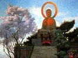
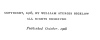

  
[Intangible Textual Heritage](../../index)  [Buddhism](../index.md) 
[Index](index)  [Next](bai01.md) 

------------------------------------------------------------------------

[Buy this Book at
Amazon.com](https://www.amazon.com/exec/obidos/ASIN/076614531X/internetsacredte.md)

------------------------------------------------------------------------

  
*Buddhism and Immortality*, by William Sturgis Bigelow, \[1908\], at
Intangible Textual Heritage

------------------------------------------------------------------------

### The Ingersoll Lecture, 1908

# BUDDHISM AND IMMORTALITY

###### BY

## WILLIAM STURGIS BIGELOW

#### BOSTON AND NEW YORK

#### HOUGHTON MIFFLIN COMPANY

#### The Riverside Press, Cambridge

#### \[1908\]

  [  
Click to enlarge](img/title.jpg.md)  
Title Page  

 
[  
Click to enlarge](img/verso.jpg.md)  
Verso  

Published October, 1908

Scanned, Proofed and Formatted at Intangible Textual Heritage by John
Bruno Hare, February 2008. This text is in the public domain because it
was published prior to 1923.

p. 1

THE INGERSOLL LECTURESHIP

*Extract from the will of Miss Caroline Haskell
Ingersoll, who died in Keene, County of Cheshire, New Hampshire, Jan.
26, 1893*.

*First*. In carrying out the wishes of my late beloved father, George
Goldthwait Ingersoll, as declared by him in his last will and testament,
I give and bequeath to Harvard University in Cambridge, Mass., where my
late father was graduated, and which he always held in love and honor,
the sum of Five thousand dollars ($5,000) as a fund for the
establishment of a Lectureship on a plan somewhat similar to that of the
Dudleian lecture, that is—one lecture to be delivered each year, on any
convenient day between the last day of May and the first day of
December, on this subject, "the Immortality of Man," said lecture not to
form a part of the usual college course, nor to be delivered by any
Professor or Tutor as part of his usual routine of instruction, though
any such Professor or Tutor may be appointed to such service. The choice
of said lecturer is not to be limited to any one religious denomination,
nor to any one profession, but may be that of either clergyman or
layman, the appointment to take place at least six months before the
delivery of said lecture. The above sum to be safely invested and three
fourths of the annual interest thereof to be paid to the lecturer for
his services and the remaining fourth to be expended in the publishment
and gratuitous distribution of the lecture, a copy of which is always to
be furnished by the lecturer for such purpose. The same lecture to be
named and known as "the Ingersoll lecture on the Immortality of Man."

------------------------------------------------------------------------

[Next: Buddhism and Immortality](bai01.md)
