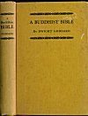
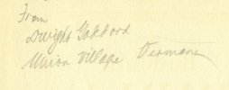
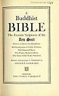

  
[Intangible Textual Heritage](../../index)  [Buddhism](../index) 
[Index](index)  [Next](bb01) 

------------------------------------------------------------------------

p. 1 p. 2

# A BUDDHIST BIBLE

p. 3

# A Buddhist BIBLE

##### The Favorite Scriptures of the

##### Zen Sect

##### History of Early Zen Buddhism

##### Self-Realisation of Noble Wisdom

##### The Diamond Sutra

##### The Prajna Paramita Sutra

##### The Sutra of the Sixth Patriarch

##### Edited, Interpreted & Published by

## DWIGHT GODDARD

### MDMXXXII

### THETFORD, VERMONT

#### \[1932\]

#### \[FIRST EDITION\]

p. 4

### COPYRIGHT 1932 BY DWIGHT GODDARD

###### scanned at Intangible Textual Heritage, August 2004. John Bruno Hare, redactor. This text is in the public domain because it was not renewed at the US Copyright Office in a timely fashion, as required by law. These files may be used for any non-commercial purpose, provided this notice of attribution is left intact.

[  
Click to enlarge](img/cover.jpg)  
Front cover and spine  

[  
Click to enlarge](img/goddard.jpg)  
inscription from Dwight Goddard on page 2  

[  
Click to enlarge](img/title.jpg)  
Title Page  

------------------------------------------------------------------------

[Next: Dedication](bb01)
