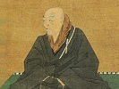

  
[Intangible Textual Heritage](../../index)  [Buddhism](../index) 
[Index](index)  [Previous](bups22) 

------------------------------------------------------------------------

[Buy this Book at
Amazon.com](https://www.amazon.com/exec/obidos/ASIN/B0028Y4KM0/internetsacredte)

------------------------------------------------------------------------

  
*Buddhist Psalms*, by S. Yamabe and L. Adams Beck, \[1921\], at
Intangible Textual Heritage

------------------------------------------------------------------------

p. 92

The following advertisements appeared at the end of the original text.
they are included for completeness.

THE WISDOM OF THE EAST

SERIES

Edited by L. Cranmer-Byng and Dr. S. A.
Kapadia

THE SERIES AND ITS PURPOSE

This Series has a definite object. It is, by means of the best Oriental
literature—its wisdom, philosophy, poetry, and ideals —to bring together
West and East in a spirit of mutual sympathy, goodwill, and
understanding. From India, China, Japan, Persia, Arabia, Palestine, and
Egypt these words of wisdom have been gathered.

NEW VOLUMES.

BUDDHIST PSALMS. Translated from the Japanese of Shinran Shōnin by S. Yamabe and L. Adam
Beck. 3/6 net.

THE SECRET ROSE GARDEN OF SA’D UD DIN MAHMŪD SHABISTARĪ. Rendered from
the Persian, with an Introduction, by Florence
Lederer. 3/6 net.

THE RHYTHM OF LIFE. Based on the Philosophy of Lao-Tse. By Henri Borel. Translated by M. E. Reynolds. 3/6 net

*INDIAN*

THE RELIGION OF THE SIKHS. By Dorothy
Field. 3/6 net.

BUDDHIST SCRIPTURES. A Selection Translated from the Pāli with
Introduction by E. J. Thomas, M.A. 3/6 net.

THE HEART OF INDIA. Sketches in the History of Hindu Religion and
Morals. By L. D. Barnett, M.A., Litt.D.,.
Professor of Sanskrit at University College, London. 3/6 net.

BRAHMA-KNOWLEDGE: An Outline of the Philosophy of the Vedānta. As set
forth by the Upanishads and by Sankara. By L. D.
Barnett, M.A., Litt.D., Professor of Sanskrit at University
College, London. 3/6 net.

p. 93

THE BUDDHA'S "WAY OF VIRTUE." A Translation of the Dhammapada. By W. C. D. Wagiswara and K. J. Saunders, Members of the Royal Asiatic
Society, Ceylon branch. 3/6 net.

THE PATH OF LIGHT. Rendered for the first time into English from the
Bodhi-charyāvatāra of Sānti-Deva. A Manual of Mahā-Yāna Buddhism. By
L. D. Barnett, M.A., Litt.D.
3/6 net.

LEGENDS OF INDIAN BUDDHISM. Translated from "L’Introduction à l’Histoire
du Buddhisme Indien" of Eugène Burnouf, with an Introduction by Winifred Stephens. 3/6 net.

THE WAY OF THE BUDDHA. Selections from the Buddhist texts, together with
the original Pāli, with Introduction by Herbert
Baynes, M.R.A.S. 3/6 net.

*IRANIAN (Persian, Pehlvi, Zend, etc.)*

THE DIWAN OF ZEB-UN-NISSA. The First Fifty Ghazals Rendered from the
Persian by Magan Lal and Jessie Duncan Westbrook. With an Introduction
and Notes. 3/6 net.

THE RUBA’IYÁT OF HÁFIZ. Translated with Introduction by Syed Abdul Majid, LL.D. Rendered into English Verse by L. Cranmer-Byng. 2/6 net.

THE SPLENDOUR OF GOD. Being Extracts from the Sacred Writings of the
Bahais. With Introduction by Eric
Hammond. 3/6 net.

THE TEACHINGS OF ZOROASTER, and the Philosophy of the Parsi Religion.
Translated with Introduction by Dr. S. A.
Kapadia, Lecturer, University College, London. and Edition, 3/6
net.

THE PERSIAN MYSTICS.

I. Jalálu’d-dín Rumí. By F. Hadland
Davis. 3/6 net.

H. Jámí By F. Hadland Davis. 3/6 net.

THE BUSTĀN OF SA’DI. From the Persian. Translated with Introduction by
A. Hart Edwards. 3/6 net.

SA’DI’S SCROLL OF WISDOM. By SHAIKH SA’DI. With Introduction by Sir
Arthur N. Wollaston, K.C.I.E. 2/6 net. With Persian Script added.
3/6 net.

THE ROSE GARDEN OF SA’DI. Selected and Rendered from the Persian with
Introduction by L. Cranmer-Byng. 2/6 net.

*ARABIC*

THE POEMS OF MU‘TAMID, KING OF SEVILLE. Rendered into English Verse by
Dulcie Lawrence Smith. With an
Introduction. 2/6 net.

ABU’L ALA, THE SYRIAN. By Henry Baerlein.
3/6 net.

p. 94

THE ALCHEMY OF HAPPINESS. By Al Ghazzali.
Rendered into English by Claud Field. 3/6
net.

THE AWAKENING OF THE SOUL. From the Arabic of Ibn Tufail. Translated with Introduction by
Paul Brönnle, Ph.D. 2/6 net.

THE RELIGION OF THE KORAN. With Introduction by Sir Arthur N. Wollaston, K.C.I.E. 2/6 net.

ARABIAN WISDOM. Selections and Translations from the Arabic by John Wortabet, M.D. 2/6 net.

THE SINGING CARAVAN. Some Echoes of Arabian Poetry By Henry Baerlein. 3/6 net.

THE DIWAN OF ABU’L-ALA. By Henry
Baerlein. 2/6 net.

*HEBREW*

ANCIENT JEWISH PROVERBS. Compiled and Classified by A. Cohen, late Scholar of Emmanuel College,
Cambridge. 3/6 net.

THE WISDOM OF THE APOCRYPHA. With an Introduction by C. E. Lawrence, Author of "Pilgrimage," etc.
3/6 net.

*CHINESE*

A FEAST OF LANTERNS. Rendered with an Introduction by L. Cranmer-Byng, Author of "A Lute of Jade,"
"The Odes of Confucius," etc. 3/6 net.

YANG CHU'S GARDEN OF PLEASURE. Translated from the Chinese by Professor
Anton Forke. With an Introduction by
H. Cranmer-Byng. 2/6 net.

TAOIST TEACHINGS. From the Mystical Philosophy of Lieh Tzŭ. Translated
by Lionel Giles, M.A. 3/6 net.

A LUTE OF JADE. Being Selections from the Classical Poets of China.
Rendered with an Introduction by L.
Cranmer-Byng. and Edition. 3/6 net.

THE CLASSICS OF CONFUCIUS.

I. The Book of Odes (Shi-King). By L.
Cranmer-Byng. 2/6 net.

II\. The Book of History (Shu-King). By W. Gorn
Old. 2/6 net.

THE SAYINGS OF CONFUCIUS. A new Translation of the greater part of the
Confucian Analects, with Introduction and Notes by Lionel Giles, M.A. (Oxon.), Assistant in the Department of
Oriental Books and Manuscripts of the British Museum. 3/6 net.

p. 95

THE CONDUCT OF LIFE; or, The Universal Order of Confucius. A translation
of one of the four Confucian Books, hitherto known as the Doctrine of
the Mean. By, Ku Hung Ming, M.A. (Edin.). 2/6 net.

THE BOOK OF FILIAL DUTY. Translated from the Chinese of the Hsiao Ching
by Ivan Chên, First Secretary to the
Chinese Legation. 2/6 net.

THE SAYINGS OF LAO TZŬ. From the Chinese. Translated with Introduction
by Lionel Giles, of the British Museum.
2/6 net.

MUSINGS OF A CHINESE MYSTIC. Selections from the Philosophy of Chuang
Tzŭ. With Introduction by Lionel Giles,
M.A. (Oxon.), Assistant at the British
Museum. 3/6 net.

THE FLIGHT OF THE DRAGON. An Essay on the Theory and Practice of Art in
China and Japan, based on Original Sources. By Laurence Binyon. 3/6 net.

*JAPANESE*

THE SPIRIT OF JAPANESE ART. By Yone
Noguchi. 3/6 net.

THE SPIRIT OF JAPANESE POETRY. By Yone
Noguchi. 3/6 net.

THE WAY OF CONTENTMENT. Translated from the Japanese of Kaibara Ekken by
Ken Hoshino. 3/6 net.

THE MASTER-SINGERS OF JAPAN. Being Verse Translations from the Japanese
Poets. By Clara A. Walsh. 3/6 net.

WOMEN AND WISDOM OF JAPAN. With Introduction by S. Takaishi. 2/6 net.

*EGYPTIAN*

ANCIENT EGYPTIAN LEGENDS. By Margaret A.
Murray. 3/6 net.

THE BURDEN OF ISIS. Being the Laments of Isis and Nephthys. Translated
from the Egyptian with an Introduction by James
Teackle Dennis. 2/6 net.

THE INSTRUCTION OF PTAH-HOTEP AND THE INSTRUCTION OF KE’GEMNI. The
Oldest Books in the World. Translated from the Egyptian with
Introduction and Appendix by Battiscombe
Gunn. 2/6 net.

*Editorial Communications should be addressed to  
*The Editors Of The Wisdom Of The East
Series,  
50A, Albemarle Street, London, W.I

LONDON: JOHN MURRAY, ALBEMARLE STREET, W,

 
