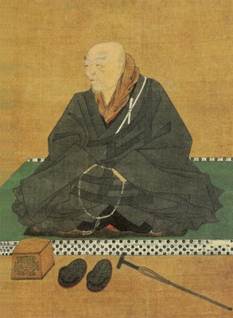

  
[Intangible Textual Heritage](../../index)  [Buddhism](../index.md) 

------------------------------------------------------------------------

[Buy this Book at
Amazon.com](https://www.amazon.com/exec/obidos/ASIN/B0028Y4KM0/internetsacredte.md)

------------------------------------------------------------------------

<table width="75%">
<colgroup>
<col style="width: 50%" />
<col style="width: 50%" />
</colgroup>
<tbody>
<tr class="odd">
<td width="50%" data-valign="TOP"></td>
<td width="50%" data-valign="CENTER"><h1 id="buddhist-psalms" data-align="CENTER">Buddhist Psalms</h1>
<h2 id="by-s.-yamabe-and-l.-adams-beck" data-align="CENTER">by S. Yamabe and L. Adams Beck</h2>
<h4 id="section" data-align="CENTER">[1921]</h4></td>
</tr>
</tbody>
</table>

------------------------------------------------------------------------

[Contents](#contents)    [Start Reading](bups00.md)    [Page
Index](pageidx)    [Text \[Zipped\]](bups.txt.gz.md)

------------------------------------------------------------------------

|                                                                                                                           |
|---------------------------------------------------------------------------------------------------------------------------|
|  |

This entry in the Wisdom of the East series consists of a translation of
the Jodo-Wasan, the Psalms of the Pure Land. This text is by Shinran
Shonin, the 10th century Japanese monk who founded Shin Buddhism, a
branch of Pure Land Buddhism. This is one of the most popular sects of
Buddhism in Japan, centering around devotional practices as the way to
enlightenment.

------------------------------------------------------------------------

 [Title Page](bups00.md)  
[Table of Contents](bups01.md)  
[Introduction](bups02.md)  
[Lauding the Infinite One](bups03.md)  
[Of Paradise](bups04.md)  
[Concerning the Great Sutra](bups05.md)  
[Concerning the Sutra of the Meditation](bups06.md)  
[Concerning the Lesser Sutra](bups07.md)  
[Of the Many Sutras Concerning the Infinite One](bups08.md)  
[Concerning the Welfare of the Present World](bups09.md)  
[Of Thanksgiving for Nagarjuna, the Great Teacher of India](bups10.md)  
[Of Thanksgiving for Vasubandh, the Great Teacher of India](bups11.md)  
[Of Thanksgiving for Donran, the Great Teacher of China](bups12.md)  
[Concerning Unrighteous Deeds](bups13.md)  
[Concerning Doshaku-Zen](bups14.md)  
[Concerning Zendo-Daishi](bups15.md)  
[Concerning Genshin-Sozu](bups16.md)  
[Concerning Honen Shonin](bups17.md)  
[Of the Three Periods](bups18.md)  
[Concerning Belief and Doubt](bups19.md)  
[In Praise of Prince Shotoku](bups20.md)  
[Wherein with Lamentation I Make my Confession](bups21.md)  
[Additional Psalms](bups22.md)  
[Advertisements](bups23.md)  
