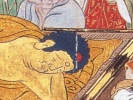

  
[Intangible Textual Heritage](../../index)  [Buddhism](../index) 
[Wisdom of the East](../../woe/index)  [Index](index) 
[Previous](busc00)  [Next](busc02) 

------------------------------------------------------------------------

  
*Buddhist Scriptures*, by E.J. Thomas, \[1913\], at Intangible Textual
Heritage

------------------------------------------------------------------------

p. 3 p. 4 p. 5

### CONTENTS

|                                    |                                                                                                                              |                                 |
|------------------------------------|------------------------------------------------------------------------------------------------------------------------------|---------------------------------|
|                                    |                                                                                                                              | PAGE |
|                                    | Introduction                                                                                  | [9](busc03.htm#page_9)          |
|                                    |    The Buddhist Scriptures                                                                                                   | [16](busc03.htm#page_16)        |
|                                    |    Christian Parallels                                                                                                       | [19](busc03.htm#page_19)        |
| CHAPTER |                                                                                                                              |                                 |
| I.                                 | The Dream of Queen Māyā                                                                       | [23](busc04.htm#page_23)        |
| II\.                               | The Birth of Gotama                                                                           | [26](busc05.htm#page_26)        |
| III\.                              | The Four Signs                                                                                | [29](busc06.htm#page_29)        |
| IV\.                               | The Great Renunciation                                                                        | [32](busc07.htm#page_32)        |
| V.                                 | The Chain of Causation                                                                        | [37](busc08.htm#page_37)        |
| VI\.                               | The Beginning of Buddha's Preaching                                                           | [40](busc09.htm#page_40)        |
|                                    |    The Discourse of setting in motion the Wheel of the Doctrine (The Middle Path. The Four Truths. The Noble Eightfold Path) | [43](busc09.htm#page_43)        |
| VII\.                              | The Ordination of Yasa                                                                        | [45](busc10.htm#page_45)        |
|                                    |    The Formula of the Three Refuges                                                                                          | [45](busc10.htm#page_45)        |
|                                    | p. 6                                                                                                |                                 |
| CHAPTER |                                                                                                                              | PAGE |
| VIII\.                             | The Ten Commandments                                                                          | [52](busc11.htm#page_52)        |
| IX\.                               | The Fire Discourse                                                                            | [54](busc12.htm#page_54)        |
| X.                                 | The Weaver's Daughter                                                                         | [57](busc13.htm#page_57)        |
|                                    |     Dhammapada 174 and Commentary                                                                                            | [62](busc13.htm#page_62)        |
| XI\.                               | The Questions of Mālunkyāputta                                                                | [64](busc14.htm#page_64)        |
| XII\.                              | The Questions of Uttiya                                                                       | [68](busc15.htm#page_68)        |
| XIII\.                             | The Questions of Vacchagotta                                                                  | [71](busc16.htm#page_71)        |
| XIV\.                              | Birth-Story of the Blessings of the Commandments                                              | [75](busc17.htm#page_75)        |
| XV\.                               | Birth-Story of King Mahāsīlava                                                                | [80](busc18.htm#page_80)        |
| XVI\.                              | Birth-Story of the City with Four Gates                                                       | [90](busc19.htm#page_90)        |
| XVII\.                             | The Pig-Faced Ghost                                                                           | [97](busc20.htm#page_97)        |
| XVIII\.                            | The Jewel Discourse                                                                           | [99](busc21.htm#page_99)        |
| XIX\.                              | Dhaniya The Herdsman                                                                          |                                 |
|                                    |     Dhammapada 153, 154                                                                                                      | [104](busc22.htm#page_104)      |
|                                    |     Note on parallels to the New Testament                                                                                   | [107](busc22.htm#page_107)      |
|                                    | p. 7                                                                                                |                                 |
| CHAPTER |                                                                                                                              | PAGE |
| XX\.                               | Buddha's Visit to Chunda                                                                      | [109](busc23.htm#page_109)      |
| XXI\.                              | The Death of Buddha                                                                           | [112](busc24.htm#page_112)      |
| XXII\.                             | The Non-Existence of Individuality                                                            | [118](busc25.htm#page_118)      |
|                                    |     Formula of the thirty-two parts of the body                                                                              | [120](busc25.htm#page_120)      |
| XXIII\.                            | Non-Individuality and Moral Responsibility                                                    | [123](busc26.htm#page_123)      |

------------------------------------------------------------------------

[Next: Editorial Note](busc02)

