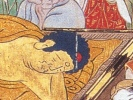

  
[Intangible Textual Heritage](../../index)  [Buddhism](../index.md) 
[Wisdom of the East](../../woe/index)  [Index](index.md) 
[Previous](busc16)  [Next](busc18.md) 

------------------------------------------------------------------------

  
*Buddhist Scriptures*, by E.J. Thomas, \[1913\], at Intangible Textual
Heritage

------------------------------------------------------------------------

p. 75

### XIV

### BIRTH-STORY OF THE BLESSINGS OF THE COMMANDMENTS

The Jātaka consists of about five hundred
stories of the previous lives of Buddha. Each story is introduced by
some incident occurring in the Master's life as Buddha, such as the
backsliding of a brother, or some act of merit among the faithful.
Buddha then tells a story of the past, in which the actors in the
previous life are usually the same as those whom he is exhorting, and in
which Buddha himself as the Bodhisatta always occurs. It is one of the
ten powers of a Buddha (see note, [p. 90](busc19.htm#page_90).md) that he
remembers all his former existences. The stories of the past are often
folk-tales and beast-fables, much older in origin than Buddhism itself;
and consequently the connection between the individuals in the past and
in the present may be very slight. The Bodhisatta is sometimes a
tree-god or other divinity, who merely witnesses the events, and recites
the verses. The stories are not parables, but they hold the same place
in the Buddhist moral teaching as do the parables of the New Testament
in the Gospels. A birth-story always concludes with one or more verses.
It is these verses, the utterances of Buddha, which are the sacred text,
the stories themselves being the commentary, explaining how the verses
came to be spoken.

The transference of merit which is recorded in the following birth-story
is a feature that is not prominent in early Buddhism, but which becomes
very important in the teaching as to Bodhisattas in Mahāyānism. The
doctrine rests

p. 76

upon a truth, for no one who thinks of what he owes
to the devotion of parents, or to the example of others, can call
himself morally a self-made man.

This story the Master told while living
at Jetavana about a faithful lay-disciple. Now this faithful, joyful,
noble disciple, going one day to Jetavana, came in the evening to the
bank of the river Aciravati. As the boatman had drawn up his boat on
shore and had gone to listen to the doctrine, the disciple saw no boat
at the ferry, and, taking joy in meditating on the Buddha, he walked
across the river. His feet did not sink in the water. [1](#fn_3.md) As though on dry ground he went until he had
reached half-way, when he saw waves. Then his ecstasy in meditating on
the Buddha became less, and his feet began to sink, but he again
strengthened his ecstasy in meditating on the Buddha, and, passing over
the surface of the water, entered Jetavana, saluted the Master, and sat
on one side. The Master exchanged friendly greetings with him, and
asked, "Disciple, as you came on the road did you come with little
fatigue?" He replied, "Master, I took joy in meditation on the Buddha,
and, receiving support on the surface of the water, I have arrived as
though walking on dry ground." The Master said, "Layman, not you only,
on remembering the virtues of the Buddha, received support, but long
before, when a ship was wrecked in mid-ocean,

p. 77

laymen remembered the virtues of the Buddha, and received support." On
being asked by the disciple, he told a story of the past.

"Long ago, in the time of the perfectly enlightened Buddha Kassapa, a
brother who had entered the First Path embarked in a ship with a barber
who was a householder. The barber's wife said, 'Sir, let his welfare and
ill be your care,' and put the barber in the hands of the disciple. Now
on the seventh day afterwards the ship was wrecked in mid-ocean. The two
men alighted on one plank and reached an island. There the barber killed
birds, cooked and ate them, and offered them to the lay-disciple. The
disciple said, 'Enough for me,' and would not eat. He thought, 'In this
place there is no support for us except in the three refuges,' and fixed
his mind on the virtues of the three jewels. [1](#fn_4.md) Now as he was thinking, a nāga [2](#fn_5.md) king who had been born on that island
changed his body into the form of a great ship. An ocean god was the
pilot. The ship was filled with the seven kinds of precious stones.
There were three masts of sapphire, the anchor was of gold, the ropes of
silver, the planks golden. The ocean god stood in the ship, and called,
'Does any one want to go to Jambudīpa?'

p. 78

\[paragraph continues\] The lay-disciple
said, 'We wish to go.' 'Then come and embark.' He embarked and called
the barber. The ocean god said, 'It is going for you, not for him.'
'Why?' he asked. 'He does not practise the virtues of the commandments,
that is the reason. I have brought it for you and not for him.' 'Very
well, I give him a share in my almsgiving, in my keeping of the
commandments, and in the powers I have developed.' The barber said,
'Sir, I accept with joy.' 'Now I will take him,' said the god, and,
putting him on board, brought both men over the ocean and came to the
river at Benares. By his supernatural power he produced wealth in the
house of both of them, and said, 'You should keep company with the wise,
for if this barber had not kept company with this lay-brother he would
have perished in mid-ocean'; and, telling the virtue of keeping company
with the wise, he spoke these verses:

Behold, this is the fruit of faith,  
Of virtue and of sacrifice,  
A nāga in a vessel's form  
Conveys the faithful layman home.

Then with the good keep company,  
And with the good associate,  
For through his friendship with the good  
The barber comes in safety home.

"Thus the ocean god standing in the air declared the doctrine and
admonished them, and, taking the nāga king, went to his own abode."

p. 79

The Master, after reciting this declaration of the doctrine, made known
the truths, and showed the connection of the birth. At the conclusion of
the truths the lay-disciple was established in the path of those who are
re-born once again. "At that time the layman who had entered the First
Path [1](#fn_6.md) attained Nirvana, Sāriputta was
the nāga king, and I was the ocean god." (*Jat*. No. 190.)

------------------------------------------------------------------------

### Footnotes

[76:1](busc17.htm#fr_3.md) Cf. St. Peter walking on
the sea, Matt. xiv. 28.

[77:1](busc17.htm#fr_4.md) See the Jewel Discourse
below.

[77:2](busc17.htm#fr_5.md) Nāgas were superhuman
beings represented in Indian sculptures as hooded snakes with several
heads. They were capable of assuming any form.

[79:1](busc17.htm#fr_6.md) The First Path, or first
stage of the Noble Eightfold Path, is "entering the stream," conversion.
The second stage is that of those who will only be re-born once in this
world; the third, that of those who will not be re-born in this world,
but only in a higher existence; the fourth, that of the Arahat, the
fruit or second degree of which is Nirvana.

------------------------------------------------------------------------

[Next: XV. Birth-Story of King Mahāsīlava](busc18.md)

