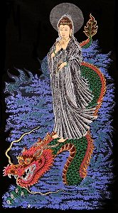

  
[Intangible Textual Heritage](../../index)  [Buddhism](../index) 

------------------------------------------------------------------------

[Buy this Book at
Amazon.com](https://www.amazon.com/exec/obidos/ASIN/B0029LHUYM/internetsacredte)

------------------------------------------------------------------------

<table width="75%">
<colgroup>
<col style="width: 50%" />
<col style="width: 50%" />
</colgroup>
<tbody>
<tr class="odd">
<td width="50%" data-valign="TOP"> 
Kwan-yin as a sea Goddess [Public Domain Image]</td>
<td width="50%" data-valign="CENTER"><h1 id="chinese-buddhism" data-align="CENTER">Chinese Buddhism</h1>
<h2 id="by-joseph-edkins" data-align="CENTER">by Joseph Edkins</h2>
<h4 id="section" data-align="CENTER">[1893]</h4></td>
</tr>
</tbody>
</table>

------------------------------------------------------------------------

[Contents](#contents)    [Start Reading](cbu00)    [Page
Index](pageidx)    [Text \[Zipped\]](cbu.txt.gz)

------------------------------------------------------------------------

|                                                                                                                           |
|---------------------------------------------------------------------------------------------------------------------------|
|  |

I first visited a Chinese Buddhist temple in Shanghai. As a Californian,
I was much more familiar with Zen Buddhism, so this was something
entirely new to me. Instead of an aesthetics of austerity and clean
lines, this was Baroque and mysterious. The temple was filled with
statues of Buddhas, gods, goddesses and demons. I was reminded of the
Hindu temples of India, or the cathedrals of Mexico.

As I transcribed this book, that first collision with Chinese Buddhism
came back to me. Edkins' book is a comprehensive survey of Chinese
Buddhism. He gives the historical background of the introduction of
Buddhism into China, and its subsequent evolution, including biographies
of the Buddhist Patriarchs. There are extensive descriptions of Chinese
Buddhist geography and cosmology, the calendar of festivals, temple
architecture, and the vast array of entities which are represented in
sacred spaces. Of interest is his discussion of Kwan-yin, the Chinese
Madonna, who began as a male Buddha and evolved into a goddess figure.
There is a critical [essay on Feng-shui](cbu26), with details of this
form of Chinese geomancy and how it developed. He enumerates dozens of
Chinese Buddhist sacred texts, and provides translations of some
excerpts. Edkins was a skilled linguist and explains how Sanskrit terms
were transferred into Chinese. He also discusses Confucian, Taoist and
other Chinese belief systems.

Edkins was a Christian missionary, and his primary concern at times
appears to be how to *convert* Chinese Buddhists. But the sheer amount
of facts which he includes here far outweigh the occasional polemic
sidebar. This volume, which is still in print over a century later, is a
valuable reference work for anyone studying Chinese Buddhism, as well as
a snapshot of China in the late 19th century.

—J.B. Hare, February 27, 2007

------------------------------------------------------------------------

 [Title Page and Front Matter](cbu00)  
[Advertisements](cbu01)  
[Preface to Second Edition](cbu02)  
[Preface](cbu03)  
[Contents](cbu04)  
[Introduction](cbu05)  
[Chapter I: Life of Shakyamuni Till His Appearance at Benares as a
Teacher](cbu06)  
[Chapter II: Life of Buddha From His Appearance as a Teacher at Benares
to the Conversion of Rahula](cbu07)  
[Chapter III. From the Commencement of Rahula's Religious Life Till the
Near Approach of the Nirvana](cbu08)  
[Chapter IV. Last Discourses and Death of Buddha](cbu09)  

 

[Chapter V. The Patriarchs of the Northern Buddhists](cbu10)  
[Chapter VI. Sketch of the History of Buddhism in China](cbu11)  
[Chapter VII. The Schools of Chinese Buddhism](cbu12)  
[Chapter VIII. On Chi-K‘ai and the T‘ien-T‘ai School of
Buddhism](cbu13)  
[Chapter IX. The Buddhist Moral System](cbu14)  
[Chapter X. The Buddhist Calendar](cbu15)  
[Chapter XI. Relation of Buddhism to the Older Hindoo
Mythology](cbu16)  
[Chapter XII. The Buddhist Universe](cbu17)  
[Chapter XIII. The Extended Universe of the Northern Buddhists](cbu18)  
[Chapter XIV. Buddhist Images and Image Worship](cbu19)  
[Chapter XV. Monasteries At P‘u-To](cbu20)  
[Chapter XVI. Buddhist Processions, Associations, Pilgrimages, and
Ceremonies for the Dead](cbu21)  
[Chapter XVII. Buddhist Literature](cbu22)  
[Chapter XVIII. The Leng-Yen-King.—First Chapter](cbu23)  
[Chapter XIX. The Ekashloka Shastra](cbu24)  
[Chapter XX. Effect of Buddhism on the Philosophy of the Sung
Dynasty](cbu25)  
[Chapter XXI. Feng-Shui; or, the Wind and Water Superstition of the
Chinese](cbu26)  
[Chapter XXII. Buddhist Phraseology in Relation to Christian
Teaching](cbu27)  
[Chapter XXIII. Notice of the Wu-Wei-Kiau, a Reformed Buddhist
Sect](cbu28)  
[Chapter XXIV. Buddhism and Tauism in their Popular Aspects](cbu29)  
[Chapter XXV. On the Use of Sanscrit by the Chinese Buddhists](cbu30)  
[Chapter XXVI. Books and Papers That May be Consulted for the Study of
Chinese Buddhism](cbu31)  

### Alphabetical Index of Proper Names and Subjects

[A-E](cbu32)  
[F-M](cbu33)  
[N-R](cbu34)  
[R-Z](cbu35)  

 

[Alphabetical Index of Titles of Books Mentioned in this Work](cbu36)  
