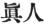
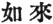
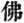
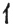
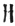
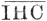

  
[Intangible Textual Heritage](../../index)  [Buddhism](../index) 
[Index](index)  [Previous](chj10)  [Next](chj12) 

------------------------------------------------------------------------

[Buy this Book at
Amazon.com](https://www.amazon.com/exec/obidos/ASIN/B0029LHTGG/internetsacredte)

------------------------------------------------------------------------

  
*The Creed of Half Japan*, by Arthur Lloyd, \[1911\], at Intangible
Textual Heritage

------------------------------------------------------------------------

p. 76

### CHAPTER IX

The Call from China

We will assume, then, that Christian
preachers visited India somewhere about A.D. 45, and that the story of
St. Thomas having been martyred near Mathura, on the Jumna, in Central
India, or at Mailapûr, on the Tamil coast, about A.D. 51 (this being the
year traditionally assigned for his martyrdom), is not an absolutely
improbable one. These men would have brought no Christian books with
them; they would have their own memories of the things that they had
seen or heard, and they may have had, or have made, *logia*, or short
pithy sayings of or about Christ, such as have recently been found in
Egypt, and such as St. Matthew is supposed to have jotted down before
composing his Gospel. And they possibly had some converts.

Now, in the year 64 A.D., the Chinese Emperor Ming-ti had a dream. On
several successive nights there stood before him a man in golden
raiment, holding in his hand a bow and arrows, pointing him to the west.
The emperor was much moved by his vision, and, divining its purpose,
determined to send men to the west to seek for the *mabito* [1](#fn_105) (
) "the true man" of his vision. There was at this
moment no commanding figure in Buddhism to whom the words could apply.
As’vaghosha might have

p. 77

been such a man, but As’vaghosha is connected with the reign of Kanishka
(*circa* A.D. 120), and his days were not yet. But there had lately
been, and in the faith of his followers there still spiritually was,
such a Man, and it is quite within the bounds of reason to suppose that
rumours of such a person had reached the Chinese court at Lôyang. We
have only to consider that the active silk trade between China and the
luxurious early empire of Rome was in the hands of the Jews, whose
headquarters were in Antioch; that these Jews had colonies and trade
posts all along the route to the distant East; that their furthest
outpost was at Kaifongfu, in Honan, where a miserable colony of their
descendants still subsists to bear witness to a buried past; that Jews
from Parthia were amongst those who were impressed by the events of the
day of Pentecost;—we have only to consider these things to understand
how extremely probable it was that rumours of the *mabito* should reach
China. The Roman Empire had good roads; the Parthians had inherited good
roads from the Persians and the Seleucid Greeks; China under the Han was
a progressive military power, and must have had them. The journey from
Antioch to the Chinese capital at Lôyang would not occupy more than a
year and a half, and already thirty years had elapsed since the
Crucifixion and Pilate's testimony to the *mabito*—Ecce Homo!

Further, although it was not until the year A.D. 75 or so that the great
Chinese general Panchao started on the great military expedition which
brought the Chinese arms victoriously to the shores of the Caspian Sea,
and made the Celestial Empire for a few years almost the next-door
neighbour of Rome, it is certain that the Central Asian troubles which
caused that expedition were already brewing, and the solution of them
was already occupying the

p. 78

minds of Chinese statesmen. We can hardly imagine such a great
expedition being planned without some previous study of the actual
conditions of the countries concerned, and we can readily understand
that such an inquiry might bring the fact of Christ to the cognizance of
the officials. The inquiry might have led them to an explanation of the
"Great One Descending Man," looked for by the Jews of Kaifongfu. [1](#fn_106)

At any rate, Ming-ti, warned by his dream, sends his commissioners to
the West. There were eighteen of them, their names, or at least some of
them, are given, and they start for India. According to the most
authentic form of the story, [2](#fn_107) they
never reached India, for on the road they met two monks toiling over the
mountain passes, and leading a white horse laden with the *impedimenta*
of their journey. The names of these two travellers were Kaśyapa Matanga
and Dharmaraksha, or Gobharana. The white horse was laden with
Scriptures and Buddhist images, and they were on their road to China to
preach the gospel. Buddhism had now been in the world for five centuries
at least, and had, as we have seen in a previous chapter, amply
recognized its calling as a world-religion. One is tempted to ask with
wonder, Why should China, so nearly related to northern and
north-western India, have been left so long without a preacher?

There was something about these men—possibly the white horse—which
satisfied the Chinese commissioners that they had found what they
wanted. They turned back with their newly made acquaintances to the
Chinese capital, where the missionaries were well received and lodged in
a monastery which still exists, the oldest in China, the celebrated
*Pomash* (Jap. *Hakubaji*), the oldest existing temple in China, "the
Monastery of the White

p. 79

\[paragraph continues\] Horse." It is
evident that the White Horse made a great impression on China, an
impression which apparently reached Japan as well. [1](#fn_108)

Kaśyapa Matanga and Dharmaraksha reached China in A.D. 67. Three years
later, in A.D. 70, they both died. They had had but a short sojourn in
China; but it was not altogether a fruitless one. The "Bukkyō Mondō Shū"
gives us, in the chapter from which I have already quoted, certain
particulars of their workings. They at once attracted many inquirers
(coming as they did in answer to an Imperial dream, they could not well
have done otherwise), and the Taoists and Confucianists were at once
stirred up to jealousy. Their enemies applied to the emperor, and
Ming-ti, desirous of doing what was right, appointed a day for a public
discussion. Not much could be done in that line, however; for the one
side knew no Chinese, and the other no Sanskrit. But there were other
tests which the missionaries and their friends stood triumphantly.
Buddhist relics refused to be broken by sledge-hammers, Buddhist books
emitted a gentle light and refused to be burned in the fire, and the two
Buddhist monks compelled the attention of a large audience by speeches
in Sanskrit, which, strangely enough, every one understood. There are
echoes, as it were, in this story, of Elijah and the priests of Baal, of

p. 80

the Children in the Furnace, of the Pentecostal experience, which are
very strange. We shall find the same story as to the relics in Japan,
and the Buddhists of Ceylon claim the same thing for their Tooth of
Buddha.

Four books are put to the credit of these two missionaries in Nanjo's
"Catalogue of Tripitaka," of which, however, only one survives. One of
the best books is said to have been a life of Buddha, which some have
identified with the "Buddha caritâ" [1](#fn_109) of [As’vaghosha](errata.htm#1), an
impossibility, seeing that the day of As’vaghosha had not yet come. The
book that survives, that has weathered the many vicissitudes of Chinese
history, the fires [2](#fn_110) and other
catastrophes, is known as the "Sūtra of the Forty-Two Sections." It is
not in the form of a dialogue as are most other Sūtras, but is merely a
collection of short pithy sayings of "the Buddha," loosely strung
together, and provided with a short introduction setting forth the place
and time at which Buddha is supposed to have spoken them. It has been
conjectured (though I believe there is no definite authority for the
conjecture) that the missionaries, finding handbooks in use with short
extracts from the writing of Confucius, conceived the idea of composing
a similar book with extracts from the Buddhist Sūtras, and that the
"Sūtra of the Forty-Two Sections" was the result. It may be so. The book
has undergone many editions and revisions, and any one who knows the
East knows that the Chinese are adepts in the culinary

p. 81

art. It is a possible belief that we have in the "Sutra of the Forty-Two
Sections" a collection of *logia*, containing short pithy sayings of the
Master, and prepared for the use of missionaries such as were Kaśyapa
Matanga and Dharmaraksha, working in a new land without proper books in
the vernacular; but a conjecture has before this been made that these
two men were not Buddhist missionaries, but Christians, disciples of St.
Thomas, who is still, I believe, to this day commemorated in Nestorian
liturgies as the Apostle of India *and China*. *Qui per alium facit per
se facit*.

The reasons available are as follows*:—*

1\. It is known that there were such *logia* among early Christians. I
believe I am right in saying that there are no similar *logia* in the
whole range of Buddhist Sutra literature, except those which were
compiled about this period for like purposes.

2\. The fact that we have in the "Pistis Sophia" the introduction of a
Buddhist Sutra, taken by some Gnostic *cordon bleu* and served with
suitable garnishings as the introduction to a book concerning Christ,
seems to suggest the feasibility of the reverse process, and that a
Christian book might similarly be taken by some Chinese literary cook
and served up to the devout in China as a Buddhist book, with a suitable
introduction to give local colour and tone.

3\. The *main* contents of the book will be found, *on the whole*, to be
not in disagreement with Christian doctrines, and far more suitable for
Christian purposes than the Epistle of St. James (which has been claimed
as a Buddhist writing) would be for the use of disciples of S’akyamuni.

4\. We shall see, from a study of Buddhist art, that whereas the early
Buddhist sculptures invariably treat

p. 82

the Master as absent, thus carrying out the spirit of the Sanskrit title
for Buddha, *i.e.* the *Tathāgata*, "the one that went thus (as he
said)," in the post-Christian art of Gandhāra, he is always represented
as a Being that is present amongst his disciples, and, being present,
very often depicted in Greek or Græco-Roman costume. The "one that had
gone" had been changed to "the one that had come," whose Presence
(παρουσία) was recognized by his followers. This first mission to China,
the first *official* introduction, be it remembered, of a new faith to
China (for whatever Buddhism there had been before this time must have
been quite unofficial), must be held responsible for the invention of
suitable "characters" through which to introduce to the Chinese literati
the idea of the Tathāgata. And the characters they chose ( ), the Chinese *Julai*, the
Japanese *Nyorai*, convey the idea of the parousia. "He that comes thus
(as was expected)," the Great One Descending Man of the Kaifongfu Jews.
It is a very significant change.

5\. Still more significant is the character which must have been
introduced to represent Buddha (
), the Chinese *Fo*, the Japanese *hotoke*. The
component parts of this character are said to represent a man ( ) with a bow ( ) and arrows ( ); and we may suppose the two
missionaries to have said to the people of Lôyang (the ancient capital
of China), "We have come to tell you of the *Mabito*, of the true man,
of the man with the bow and arrow whom your Emperor saw in his vision."
It is possible (for there were Greeks living in India, as we have seen)
that under the Indian names of these two missionaries there may have
lurked a Greek nationality. At any rate, the character they chose is
capable of another signification, besides the one usually given—the
three first letters of the *name* of the Perfect Man, our cherished

p. 83

\[paragraph continues\] Christian
monogram,  , the man with
the bow and arrows! [1](#fn_111)

6\. We may suppose this character for Buddha to have been introduced to
China about the year 68 A.D. There are many competent scholars who
assign to the year 67 A.D. the composition of the Book of Revelation. In
that book the author, after a rapid survey of the Churches under his
immediate Apostolic guidance, and after a vision of God in His glory,
proceeds to tell his readers the things that must shortly come to pass.
The immediate future is a sealed book with many seals which none but the
Lamb may open. The first seal is broken (Rev. vi. 2), and St. John is
told to come and see "*a white horse, and he that sat on it had a bow,
and a crown was given unto him, and he went forth conquering and to
conquer*."

There are Christians who say that the New Testament is a book that is
all fulfilled, that the end of which Christ spoke in His discourse on
the Mount of Olives was accomplished at the siege of Jerusalem, and that
we should think of the saints who took part in that first resurrection
as already gathered around Christ in the heavenly places. One of the
signs given was that the Gospel of the Kingdom should be first preached
unto all nations for a witness, and then the end should come. It is
certain that Christianity reached England and Spain and the lands of the
furthest West about the same time that the White Horse reached China. If
we could trace the Ethiopian Eunuch or the labours of other Apostles, we
might be astonished to find how far to the south the gospel travelled in
those early days. For a thing which is really a gospel requires no
elaborate machinery or organization to push it

p. 84

on. It is recognized as "good news," and it travels from mouth to mouth.

The White Horse in the Apocalypse was followed by others, red, black,
pale, the symbols of War, of Famine, of Death. Nothing was done by the
Buddhists of India to follow up this mission of the White Horse—a fact
which seems to point to its not having been a Buddhist mission at all,
for the Buddhists would surely not have neglected to follow up so
gracious an invitation from so powerful a monarch as Ming-ti. But
suppose it to have been a Christian preacher that went to China, and we
may, in the confusions that followed in Europe and Asia, find abundant
reasons for the cessation of Christian missionary effort. The seed had
been scattered very widely—the testimony had been delivered, by St. Paul
before Nero, by some unknown preacher before the Great Han Emperor. Then
the labourers fell asleep, and the enemy came to sow the tares. Those
first men were sent forth only to give a testimony, and when the
testimony had been delivered the End of the Age came. [1](#fn_112)

------------------------------------------------------------------------

### Footnotes

[76:1](chj11.htm#fr_106) Murakami, "Handbook of
Buddhism," p. 290. The story will be found in the S.P.C.K. "Handbook of
Chinese Buddhism."

[78:1](chj11.htm#fr_107) See above, [p.
50](chj07.htm#page_50).

[78:2](chj11.htm#fr_108) Bukkyō Kakushu Kōyō,"
vol. i. chap. i. p. 4.

[79:1](chj11.htm#fr_109) In "Bukkyō Mondō Shu,"
vol. i. p. 34, in a discussion on As’vaghosha as the patron saint of
silk-culture (he is so considered in the provinces of Shinshu and
Echigo, and perhaps elsewhere in Japan), there is a mention of
As’vaghosha in connection with the White Horse. He is said to have
appeared as a thousand white horses, to have made a thousand white birds
sing, to have assumed the forms of countless silkworms, to have spun
thousands of cocoons, to have saved many thousands of living creatures.
The Shingon speaks of him as an incarnation of Vairoc’ana, who, in the
days of his flesh, was the Eighth Patriarch of Buddhism. There are
several temples in Japan in which a white horse is constantly kept.

[80:1](chj11.htm#fr_110) In "Sacred Books of
the East," vol. xlix. Bukkyō Mondo Shu (*l.c.*) correctly gives
As’vaghosha's approximate date as "during the sixth century after the
Nirvana."

[80:2](chj11.htm#fr_111) Chinese history has
several "bibliothecal catastrophes," as they are termed, when, by order
of the Government, all books were burned except a few favoured ones on
practical subjects. But these catastrophes sometimes occurred at a time
when China was divided into several kingdoms, and then of course they
did not apply to the whole empire.

[83:1](chj11.htm#fr_112) Compare what has been
said above of the "Divine Name of the Six Letters."

[84:1](chj11.htm#fr_113) A good translation of
the Sutra of the Forty-Two Sections will be found in "Sermons by a
Buddhist Abbot." Chicago, Open Court, 1905.

------------------------------------------------------------------------

[Next: Chapter X. Buddhism just before the Coming of
Christianity](chj12)
