  
[Intangible Textual Heritage](../../index)  [Buddhism](../index.md) 
[Index](index)  [Previous](chj11)  [Next](chj13.md) 

------------------------------------------------------------------------

[Buy this Book at
Amazon.com](https://www.amazon.com/exec/obidos/ASIN/B0029LHTGG/internetsacredte.md)

------------------------------------------------------------------------

  
*The Creed of Half Japan*, by Arthur Lloyd, \[1911\], at Intangible
Textual Heritage

------------------------------------------------------------------------

p. 85

### CHAPTER X

Buddhism just before the Coming of
Christianity

It is my intention in this chapter to
estimate as far as I can the condition of Buddhism just before the
coming of Christianity to India, and consequently just before the first
visible development of the Greater Vehicle. This will clear the ground
for the consideration of the Mahāyāna itself in later chapters.

Our most trustworthy guides for the dark period between As’oka and
Christ are the remains of ancient Buddhist temples of the earlier or
Persian period of Indian art. From these [1](#fn_113.md) we may gather that long before the dawn
of the Christian era Buddhism had, for all practical intents and
purposes, formulated for itself a demi-god in S’akyamuni, whom it
worshipped with far more fervour than the Greeks worshipped Herakles,
whom in Asia they identified with S’akyamuni. Round Herakles in Greece
many myths formed themselves; the person of S’akyamuni was likewise
enveloped in a robe of legends and sayings, and it comes to a Christian
reader as an unpleasant and unwelcome shock to find S’akyamuni provided
with stories very similar to those which have always endeared to us the
Nativity and Infant life of Christ our Saviour. There is

p. 86

no use for us to try and blink the fact. It stands there in the
clear-cut stone monuments of India that pre-Christian India believed in
Buddha as a Being whose Birth was supernatural, the result of a
spiritual power overshadowing the mother; as one whose Birth was
rejoiced over by angels and testified to by an aged seer; as one who had
been tempted by the Evil One and had overcome; as one whose life had
been one of good deeds and holy teachings; as one who had passed into
the unseen, leaving behind him a feeling of longing regret for him who
had thus gone away. [1](#fn_114.md)

Buddhism was also by this time provided with books, or at least with a
body of doctrines orally embodied in set forms, and recited by the monks
with that verbal exactness for which the Indians have always been so
famous. On one of his rock inscriptions, in the edict at Bairât in
Rajputâna, As’oka mentions the names of seven such Sūtras, of which five
have been identified as still existing in the Pali Sutta Pitakam, [2](#fn_115.md) while the sixth and seventh have been
with considerable reason supposed to be, respectively, the germ of the
Vinaya Pitakam, or books of Discipline, and the First Sermon delivered
by Buddha after his Enlightenment. Shortly after As’oka's death, about
B.C. 200 (and therefore before the accession of Pushyamitra), on the
rail around the stupa of Barhut, [3](#fn_116.md)
are inscribed the "names of pious Buddhists," who are described as
"reciters," "versed in the Dialogues," "versed in the Baskets," and
"versed in the Five Collections," [4](#fn_117.md)
and

p. 87

these inscriptions bear witness to the continual tradition of these oral
records. And, finally, if we may trust the Ceylon Chronicles, these oral
records were committed to writing in Ceylon about 40 B.C., and thus the
Hīnayāna books assumed their stereotyped form.

We may assume, further, that the pre-Christian Buddhism, possessing the
books, possessed also the doctrines of Hīnayāna Buddhism, such as it is
still to be found in Ceylon and other Buddhist countries of the Southern
School. It does not fall within the scope of this work to give an
account of these doctrines. The student will find them admirably
summarized in books like Hardy's "Manual of Buddhism," or Warren's
"Buddhism in Translation." [1](#fn_118.md) But it
is also certain that while the doctrinal standards had been faithfully
handed down until the time came for them to be committed to writing,
there had also been a steady downward tendency in the life of the
Buddhist Church, accompanied by a corresponding relaxation of the
firmness with which the doctrines of Buddha were held. This downgrade
movement has been graphically described for us in the "Ten Dreams of
Kaśyapa," which may be taken as coming to us from the latter end of this
period of Buddhist decay. [2](#fn_119.md)

According to that book, the great disciple Kaśyapa, who is reckoned by
north and south alike as the first Patriarch of Buddhism after the death
of S’akyamuni, had ten dreams: (1) An elephant, having squeezed its body
through a narrow door, failed to get its tail through. (2) Thirsty men
were seen running away from a fountain

p. 88

of water which pursued them. (3) A measure of pearls was given as
payment for a mess of porridge. (4) A load of costly sandal-wood was
sold at the price of common fuel logs. (5) A garden full of flowers and
fruits was stripped by thieves. (6) Elephants during the rutting season,
when they are usually fierce and pugnacious, were driven away by a knot
of little children. (7) A dirty monkey was seen covering another monkey
with dirt. (8) A monkey was crowned and anointed as king. (9) A piece of
cloth was torn into eighteen pieces. (10) A crowd of people were
quarrelling in the streets. [1](#fn_120.md)

The dreams had their interpretations, and in those interpretations we
may see the gradual decay of the institutions which S’akyamuni had
founded, and which As’oka had been at such trouble to propagate. (1) The
disciples had, in obedience to their master's commands, left their homes
to follow him, but the surrender had not been complete. The elephant's
tail had refused to pass through the door, and presently the monks made
new homes for themselves, and became attached to their comfortable
monasteries, as they had once been to their mansions and villas. (2) The
disciples were like a well, bubbling over with the water of life; but
the laity had no thought of religion, and possibly a contempt, more or
less openly expressed, for the comfortable recluse. So the fountain had
to pursue thirsty men, who, while perhaps craving for the truth, were
yet unwilling to quench their thirst at that particular fountain. (3)
Thus there resulted a

p. 89

cheapening of religious instruction. In their anxiety to win adherents,
the preachers tickled the ears of their audience with the highest
truths, when the simpler ones would have been more suitable; and in
return for the measure of pearls they offered received but a poor meed
of gratitude—a mess of porridge. (4) In the same way, the fear of losing
disciples caused the monks to tolerate the existence of heresy in the
community; the teachings of heretics were esteemed as highly as those of
the orthodox—sandalwood was sold at the same price as common fuel. (5)
The monasteries were rich and well endowed with lands and estates. The
revenues should have been for the poor; the monks used them for their
own profit. (6) Good disciples (the rutting elephants) were driven away
by worthless ones (children). As early as the days of As’oka complaints
were made of this, the better sort of monks preferring to retire rather
than be forced into religious contact with worthless and evil brethren.
(7) These worthless men were like dirty monkeys, covered with mud. They
threw the dirty mud of slander at their fellows, and so made them appear
as dirty as they were themselves. (8) Then, having got rid of the worthy
monks, they proceeded to elect superiors of their own type in the
monasteries, till it came that the monkey was anointed as king. (9) Thus
it came to pass that the Buddhist community, which, like Christ's
garment, had once been a seamless vesture of whole cloth, had been torn
and rent into eighteen pieces, corresponding to the eighteen sects [1](#fn_121.md)

p. 90

into which the Hīnayāna had been torn. (10) And the result of
sectarianism was religious strife.

p. 91

One of the most important books for the study of the Dark Period is the
so-called "Questions of King Milinda," of which there is an English
version by Professor Rhys Davids in the "Sacred Books of the East."
Menander (for that is the proper reading of Milinda) was one of the
Greek princes that ruled in India during the last century before Christ.
The book fixes its own date, for it alludes to S’akyamuni's prophecy
that his religion would not last for more than 500 years after his
death, and yet betrays no consciousness of the fact that it had already
lasted beyond that period. We may take it, therefore, that the five
centuries had not quite elapsed when the book was written, and may place
the composition of it somewhere about the time "of the Flavian Emperors
of Rome." [1](#fn_122.md)

The book has been called the "Irenæus" of Buddhism. The Pali Pitakas are
"immanent" in its pages, just "as the New Testament is immanent in the
pages of Irenæus." It bears a strong testimony to the existence and
nature of the Hīnayāna books, as also to the Hīnayāna doctrine, and,
better than any other book, enables us to see what was the state of
Buddhist thought at the end of its first period, when the Age of the
Upright Law (as it has since been called) was all but over, and the Age
of Image Law was about to be introduced. [2](#fn_123.md)

The author of the book speaks of the period of Five Hundred years as
being the duration of S’akyamuni's teachings in the world. The Five
Centuries were just elapsing, when the new faith of Christ came into the

From this it would seem that the Mahāsānghika (Great Minster) School of
the Hīnayāna has continued itself in Ceylon.

p. 92

world. There was everything to fill a Buddhist monk possessing a
statesman's mind, one capable of taking a wide outlook over the world,
with anxiety as to the future. India was a political cypher, divided
among weakling princes. On its north-western frontier lay the dreaded
Scythian, whose invasion of the land would certainly not be delayed for
many years to come. He was very possibly a Buddhist, but his Buddhism,
already mixed with alien elements, was not of the same type as that of
Magadha. If he came, he would not help the poor distracted Hīnayānist;
if he only threatened to come, he was still a Buddhist and an alien
enemy, and the patriotism of India was asserting itself by a return to
the old Indian gods whom [As’oka](errata.htm#3.md) had persuaded it to lay
aside. Go away he certainly would not. Is it to be wondered at that at
such a time our monk should turn his thoughts to him that had "thus
gone"? I have already, in a previous chapter, spoken of the change that
comes over the Buddhist architecture, and of the significant change in
the Chinese word for the Tathāgata. I will now quote from another of the
Pali Sūtras, one which surely referred not merely to the Buddha that
once was and now had gone, but much more to him that was to come, and
whose coming was to give new hope of life. [1](#fn_124.md)

"Ananda, the future Buddha, is mindful and conscious when he is born
with the Tushita Body… . [2](#fn_125) (he.md) is
mindful and conscious when he vanishes from the Tushita Body and
descends into his mother's womb… When he vanishes from the Tushita Body
and descends into his

p. 93

mother's womb, then, in the world of the angels, of Māra, of Brahmā,
unto the philosophers and Brahmans, princes and peoples, there appears a
splendour, limitless and eminent, transcending the angelic might of the
angels," etc.

Words such as these, written in all probability before the birth of
Christ, and applicable to the Nativity of S’akyamuni as it lives in
Buddhist legend and belief, do not at all necessarily imply that the
Nativity stories of the New Testament are merely faked-up fables,
borrowed from an older cycle of fiction. Rather they show that when He
was born, in the way in which His birth is recorded, He was fulfilling
more than one prophecy. It is thus that it behoves a Divine Saviour *to
be born;* that is the testimony of Isaiah, of Virgil, of the Buddhist
Sūtra, of many another great teacher that has appeared. It was part of
the stock-in-trade (if I may so call it) of S’akyamuni; it was also a
part of the stock-in-trade of Christ. If Christ's superhuman credentials
had gone no further than the Nativity cycle, Christ would in no sense
have differed from S’akyamuni. But Christ's claim of supernatural
testimony went farther than S’akyamuni's. He claims our allegiance not
merely because "He was conceived of the Holy Ghost, and born of the
Virgin Mary," but more especially so because, having been crucified and
slain, He rose again the third day from the dead. It is on the
Resurrection that St. Paul bases Christ's claim to be the Son of God; it
is this that makes Him unique in religious history. This places Christ
at the head of all things in the religious world; its absence puts
S’akyamuni into his proper place, a place in which he may yet claim the
ungrudging respect of Christian people. It constitutes him a great
witness and forerunner of Christ, and no Japanese can be offended at
having him placed in such a seemingly humble position, for it is the
place

p. 94

which they themselves assign to him when they say, with their own poet,
that the sole reason for S’akyamuni's appearance in the world was that
he might point men to Amitābha. [1](#fn_126.md)

p. 95

------------------------------------------------------------------------

### Footnotes

[85:1](chj12.htm#fr_114.md) *E.g.* those at
Amarâvati, Ajânta, Sanchi, Barhut, Gayā, Nalanda, etc. For a convenient
summary reviewing all that has been written on the subject, see
Grünwedel, "Buddhistische Kunst in Indien" (Museum für Völkerkunde,
Berlin). Also Rhys Davids’ "Buddhist India."

[86:1](chj12.htm#fr_115.md) See, *e.g.*, "Buddhist
and Christian Gospels," by A. J. Edmunds. I have used the Tokyo (1905)
edition with notes by M. Anesaki.

[86:2](chj12.htm#fr_116.md) Edmunds and Anesaki,
*l.c.*, p. 2. See above, [p. 42](chj06.htm#page_42.md).

[86:3](chj12.htm#fr_117.md) *Ibid*., p. 3. The
writers also refer to Ferguson's "History of Indian and Eastern
Architecture" (London, 1876), p. 5, and to Cunningham, "The Stupa of
Barhut."

[86:4](chj12.htm#fr_118.md) I.e. The Five Nikayas,
or, as they are termed in the [Mahāyāna](errata.htm#2.md), the Five Agamas.
Professor Anesaki has given the Asiatic Society of Japan an exhaustive
comparative study of the Pali Nikayas and Sanskrit Agamas.

[87:1](chj12.htm#fr_119.md) *Cf*. also Neumann's
"Die Reden Gotamo Buddhas." I have also learned very much from Léon
Feer's Buddhist articles in the *Journal Asiatique*.

[87:2](chj12.htm#fr_120.md) See *J.R.A.S* for
1893, p. 512. The dreams are found in Thibetan; also in Nanjo's
Catalogue, 543, 631, 632 (connected with Prasenajit). They have likewise
made their way into Russian folklore.

[88:1](chj12.htm#fr_121.md) It is a testimony to
the early existence of a schism in Buddhism that the two lists of
patriarchs of the Northern and Southern Schools respectively agree only
in one name—that of Kaśyapa, the immediate successor of S’akyamuni. This
implies that the two parties went each its own way immediately after
Kaśyapa's death, which occurred not long after that of S’akyamuni.
As’oka possibly tried to effect a reunion, and may indeed have had some
temporary success.

[89:1](chj12.htm#fr_122.md) I here give the
eighteen Hīnayāna sects as found in Japanese books. There were two main
divisions which were ṃade very early, some would have it as early as the
Council of the Grotto immediately after S’akyamuni's death, others at
the Second Council of Vais’āli, a hundred years later. According to this
view, the Mahāsānghikas, who were the liberally inclined amongst the
monks, being unable to communicate any longer with the conservative
Sthaviras, broke loose and p. 90 formed
themselves into separate communities outside the limits of the Magadhan
kingdom. In this way the germs were planted out of which later grew the
two Vehicles. The *Mahāsānghikas* (*Daishūbu*,  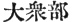) were divided into (i)
*Issetsubu* ( 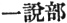), (ii)
*Sesshusebu* ( 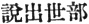), (iii)
*Kei-in-bu* ( 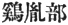), (iv)
*Tamonbu* ( 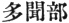), (v)
*Setsu-ge bu* ( 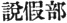), (vi)
*Seitasanbu* ( ), (vii)
*Seisanjubu* ( 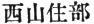), (viii)
Hokusanjūbu ( 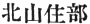).

The *Sthaviras* ( 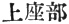) were
not so numerously subdivided. Their sub-sects were (ix) *Setsuissaiubu*
( 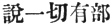), (x) *Tokushibu*
( 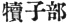), (xi) *Hōjōbu* ( 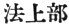) (xii) *Kenchōbu* ( 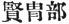), (xiii) *Shōryōbu* ( 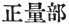), (xiv) *Mitsurinsanbu* ( 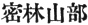), (xv) *Ketabu* ( 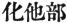) (xvi) *Hōzōbu* ( 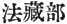), (xvii) *Onkōbu* ( 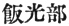), (xviii) *Kyōryōbu* ( 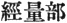).

Murakami enumerates twenty sects by reckoning in a parent Sthavira and a
parent Mahāsānghika sect. Some of these sects, *e.g.* those in which the
character  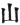, *san*
("mountain"), appears, were most probably local. No. ix., known in
Sanskrit as Sarvāstivādins, were the most powerful. It was for this sect
that Kanishka erected the great stupa for Buddha's relics lately
unearthed near Peshawur. No. xvi, the Dharmaguptas, were very strong on
the Vinaya, and through it exercised much influence in China. Nothing is
known about the majority of the sects here enumerated. It must not be
supposed that the Hīnayāna disappeared before the rising Mahāyāna. It
continued side by side with its rival, not only in India, but also in
China and Japan. It seems probable, however, that the Mahāyāna
ultimately absorbed many of the Mahāsānghika subjects.

The following extract from a Burmese book (quoted by Edmunds and
Anesaki, *op. cit.*, p. 5) deserves a thought*:—*

"In the time of the king named Nāgo the Robber, when the whole of Ceylon
was vexed by the fear of the bad monks, the monks who kept up the
Tripitaka went to India (compare No. 6 of Kaśyapa's dreams). Those monks
who did not go thither, but stayed at home, being vexed by fear of
famine, tightened their waistbands, encased their bodies in sand, and
kept up the Tripitaka. … When the fear of bad monks was appeased, the
monks came back from India, and, together with the monks who had stayed
in Ceylon, they reconciled the Tripitaka with the recension of the Great
Minster (Mahāsanghikā), and when the two p. 91
were made harmonious, they established them. Then when they were
established, they kept them up in Ceylon only."

[91:1](chj12.htm#fr_123.md) Edmunds and Anesaki,
p. 4. The date coincides with the dawn of the new era in the religious
history of the world.

[91:2](chj12.htm#fr_124.md) This is the
chronological theory adopted by Japanese Buddhism.

[92:1](chj12.htm#fr_125.md) I quote from the
"Dialogue on Wonders and Marvels," given by Edmunds and Anesaki, pp.
54–60.

[92:2](chj12.htm#fr_126.md) The Tushita Heaven,
one of the lower heavens in the Buddhist cosmology, is one in which
beings with *form* can appear. The Highest Heaven is beyond form, and
consequently beyond thought.

[94:1](chj12.htm#fr_127.md) See my "Shinran and
His Work" (Tokyo, 1910), p. 47.

A good instance of the moral bankruptcy of the Hīnayāna at this period
will be found in the "Katha Vatthu," translated by Rhys Davids in
*J.R.A.S*, 1892. Also in the *Jātaka* stories (published in English by
the Cambridge University Press). Æsop esteemed these rightly in making
them the basis of many of his fables, and they have left their traces in
much of the folklore of many peoples in Asia and Europe. But the
religion which produced them must first have lost a large part of its
moral vigour. They do not speak the language of men who are terribly in
earnest about some teaching of faith. One cannot imagine Tertullian or
Augustine gravely telling a Jātaka story. The "Katha Vatthu" contains a
discussion, from the standpoints of the various Hīnayāna sects, of
certain questions concerning Buddhist philosophy, ethics, and
discipline. On very few of these questions were the answers given
unanimously in the same sense. Here are some of the questions—

"Is there, in the truest and highest sense, a soul?" "No." \[To this
question two sects gave an affirmative answer. One of these sects must
have been that of the Sarvāstivādins, for the existence of the soul was
one of their tenets.\]

"Does the universe exist?" "No; there is nothing that is not transient."
\[But here again the Sarvāstivādins affirmed the real existence of the
universe.\]

"Can an Arhat fall from grace? Can he be guilty (unwittingly or through
diabolic temptation) of indecency? Can he have ignorance, doubt, or
error? Is there moral restraint among the gods?" "To all these
questions, No" \[unanimous\].

"Is the Noble Path self-existent? or the Chain of Causation? or the Four
Noble Truths? or Nirvana?" Again "No." \[And yet these four things are
the very groundwork of S’akyamuni's personal teachings. The very
foundations of the Buddhist Faith had gone!\]

"Is Nirvana a virtuous (moral) state?" "No."

There are also some very interesting points raised in what we may
perhaps call "Buddhology."

"Was Buddha a true man? "Yes," \[said most of the sects; but one sect
affirmed that this was not so. The Buddha had remained all the time in
the Tushita Heaven, and that which appeared upon p.
95 earth was only a phantom. It was exactly what, at that very
moment, heretics further west were saying about Christ!\].

"Did Buddha himself preach the Law?" "No," said one sect; he never
preached. It was Ananda that preached. \[It was Ananda, it will be
remembered, whose memory supplied so many of the Sūtras after the death
of S’akyamuni\].

"Did the Councils alter S’akyamuni's doctrines or make it afresh?"
\[With one dissentient voice they all agreed that they had so tampered
with the deposit of the Faith.\]

"If there should be another Buddha, would it be possible for him to be
born out of India?" "Impossible," said they all; "a Buddha can only be
born within the limits of Jambudvīpa." \[And accordingly the Japanese,
who want to have their share in everything that is great, have extended
the limits of Jambudvīpa (*Ichi-Embudai*) to include China and Japan as
well.\]

The lowest depth was reached by the question, "Were the Buddha's
excretions of exceeding sweet savour?" And to this some answered one
thing, and some another.

------------------------------------------------------------------------

[Next: Chapter XI. As’vaghosha](chj13.md)
