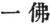
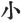
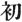
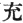
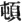
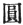

  
[Intangible Textual Heritage](../../index)  [Buddhism](../index) 
[Index](index)  [Previous](chj13)  [Next](chj15) 

------------------------------------------------------------------------

[Buy this Book at
Amazon.com](https://www.amazon.com/exec/obidos/ASIN/B0029LHTGG/internetsacredte)

------------------------------------------------------------------------

  
*The Creed of Half Japan*, by Arthur Lloyd, \[1911\], at Intangible
Textual Heritage

------------------------------------------------------------------------

p. 105

### CHAPTER XII

Nāgārjuna

We may consider that As’vaghosha, a
native apparently of Saketa, and for many years a resident of
Pataliputra or Benares (probably the latter), brought into the newly
formed, or reformed, Mahāyāna a certain Magadhan or Central Indian
element. We may suppose that a sage of his wisdom, learning, and
reputation would do much to strengthen the dying cause of Hīnayāna
Buddhism in the very land of its birth, by raising it to a higher level
of aim and endeavour, and to nobler because truer views of life and
duty.

But the Kushan or Indo-Scythian rulers, in their newly awakened zeal for
the propagation of a religion with which seemed to be bound up their
hopes of the over-lordship of the fair peninsula of Jambudvīpa, where
they might rule in peaceful possession, no matter what might be the
disturbances raised by Huns and Alani on their far distant Central Asian
frontiers, were by no means contented with spiritual influence on the
Ganges plains alone. All India, they might reasonably argue, ought to be
won to the reformed Buddhism of which they were the acknowledged heads,
as the possessors of Buddha's Begging-bowl. If India could thus be won
to spiritual allegiance, the temporal allegiance would not be far off.
Only, to win all India, there must be a religious platform which all
India could accept.

p. 106

In Nāgārjuna they found a man admirably suited for the carrying out of
their designs of recommending their enlarged faith to the spiritual
conscience of India. A Brahman by birth, he was born, somewhere about
the beginning of the second century, [1](#fn_141) in Southern India. As a Brahman, he was
one of the hereditary exponents and custodians of religion and faith,
but seems at first to have had but scanty reverence for his privileges.
He went the way of "gilded youth," threw himself into a life of
dissipation, and thoughtlessly profaned his birthright. But one night he
and three of his companions broke into the palace of the Rajah, partly
for robbery, partly for intrigue with the ladies of the princely harem,
and were discovered. Nāgārjuna managed to escape in safety, but his
three companions were taken and killed.

This was the turning-point in his career. Why had he been saved, while
his companions, no more culpable than himself, had been overtaken by the
vengeance of man, if not of Heaven? He recognized in his escape the hand
of some unseen Providence, and from that moment determined to walk
worthy of his sacerdotal birthright.

But the Brahmanism of the day (we must remember that it was not yet the
reformed and elevated Brahmanism which at a later date drove Buddhism
out of India) failed to satisfy him, and he turned to Buddhism. This
too—it was the distracted Hīnayāna—failed to give him rest. He read
books without end, yet arrived not at the truth, until at last he went
as a wandering religionist to the country of the Nāgas, among the
Himalayas, where he found peace and guidance.

p. 107

A Japanese writer, [1](#fn_142) in whose
conscientious scholarship I have learned to put much confidence, says
that his first journey was to a shrine of Ādi-Buddha ( ), whom Japan looks upon as
Amitābha, the Supreme and Original Buddha, from whom, as from a source,
comes everything that is called Light in the human mind. Ādi-Buddha is
essentially a Himalayan cult, and it would be among those mountains, if
anywhere, that Nāgārjuna would meet with such a teaching. At this shrine
he made the acquaintance of a Bodhisattva of the name of Mahānāga
(Dai-ryū), who taught him the faith in Amida Buddha, and finding him an
adept in spiritual understanding, conducted him to the Palace of the
Dragons (Nāgas) under the sea, and there revealed to him treasures of
wisdom and doctrine which had been kept hidden for long generations, but
which could now be communicated to men, inasmuch as the destined [2](#fn_143) expounder of the secret doctrine had at
length appeared.

From the Himalayas Nāgārjuna went again to the south of India. Here he
had a similar experience, one which we should be justified in treating
as being the same as the one mentioned in the previous paragraph were it
not that the treatment of the Japanese Mahāyāna requires that we should
consider them as separate phenomena. In Southern India he is said to
have found an Iron Tower (a shrine of some sort, we may suppose, like
the shrine of St. Thomas at Mailapûr) in which dwelt an aged Bodhisattva
of the name of Vajrasattva (Jap. Kongōsatta). Vajrasattva was the
authorized exponent of a teaching which emanated from a Buddha named
Vairoc’ana, who was greater than S’akyamuni.

p. 108

\[paragraph continues\] Vairoc’ana claimed
to be the *one*, the *original* Buddha, just as Amitābha did; and yet
the two seemed to be different. Nāgārjuna listened with sympathy:
Vajrasattva recognized that his spiritual successor had arrived,
committed the secret Teachings to hint, and gave him the rite of
Abhis’ekha, a rite which is half Baptism and half Ordination.

We shall presently come back to these points. For the present we will
merely summarize what we have said, and remind the reader that Nāgārjuna
had personally "sampled" very much of the religious thought of India. He
had been a Brahmanist and a Hīnayānist. He had then become a Mahāyānist,
and since his conversion to that faith he had come into contact not only
with the faith in Amitābha, but with faith in Vairoc’ana, with the
Dragon's Palace, with the Iron Tower, with the Nāgas, and with the
religionists whose special symbol is the Vajra.

He then retired to South India, where he spent the rest of his days in
writing books and evangelization. The Japanese historians whom I have
read say nothing about his connection with Kanishka's Council; they say
that after long and successful labours he died at Kośala, in the
northern portion of South India.

He was a voluminous writer (the reader will find a long list of his
works in the pages of Nanjo's "Catalogue of the Tripitaka"), and his
influence on Northern Buddhism has been so great that one is not
astonished to read that he was revered by many as a second Buddha, a
teacher whose authority equalled that of S’akyamuni himself.

He may be said to have settled, for Buddhism, the long-disputed question
of the existence of the soul, which had troubled generations of Buddhist
thinkers.

p. 109

Buddhists had long been divided into *Astikas* and *Nāstikas*, the one
party maintaining, with the Sarvāstivādins and others, the existence of
the soul, the reality of life after death, the existence of an Oversoul,
and the other denying all these things, and in some cases even allowing
to material substances no more than a phenomenal existence. Nāgārjuna's
philosophy mediated between the two views. The Madhyamika system, of
which he was the interpreter, taught that the soul might be said to
exist or not to exist, according to the way in which you looked at it.
The soul of the individual is like the wave of the sea, it has an
apparent separate existence for a moment, then it disappears in the body
of the ocean once more. It was never a distinct entity. So with the
Buddhas: they appear in the world, and we look upon them as individual
Beings. But that is all only apparent. Buddhas and Saviours are but
waves that appear on the surface of the ocean of God's love. They come
and they go, and men talk of their deaths or their Nirvanas; but the
ocean of God's love is unchanged. Only the surface waves have changed.
It was thus that Nāgārjuna was able to recognize the essential oneness
of Amitābha, of Vairoc’ana, of S’akyamuni. It was thus that the Mahāyāna
faith, of which he was the great doctor, was able to adapt itself to the
Taoism of China, to the Shinto of Japan. It was thus that the Buddhist
gnosis of the second century tried to overthrow the Christian faith of
the Catholic Church. Docetism is nothing but the Madhyamika doctrine
applied to the problem of getting rid of the offence of the Cross and
the uniqueness of Christ.

Nāgārjuna did not reject the teachings of either Astikas or Nāstikas. He
divided Truth into two parts, an apparent truth and a true truth, a
distinction which is constantly cropping up in Japanese Buddhism. The
one, *Zokutai*, is

p. 110

\[paragraph continues\] "truth by general
consent," the truth as held by Nāstikas, who believed that nothing
existed. The other, *Shintai*, is "true truth," the fulfilment of truth,
which was to make perfect that which the Astikas held in part only. The
one is the absolute Truth, the other is the Truth adapted to the mental
and spiritual circumstances and capacities of the hearers. The
distinction is to be found in every Buddhist sect in Japan; it underlies
the distinction between the two classes of hearers in Manichaeism. Was
it not the whole contention of the Gnostics that ordinary Christianity
was but a form of *Zokutai*, a "truth by common consent," and that they
themselves were the possessors of the *Shintai*, "the true Truth," the
perfect Gnosis?

Nāgārjuna is further credited in Japan with having taught that there are
two ways of life, the one a road of difficulty and pain (*nangyōdō*),
the other one of ease and pleasure. In the first, the aspirant after
salvation takes the hard road of asceticism, of fastings and penance,
etc., and thus labours to work out his own salvation; in the second, he
throws all his own efforts aside, puts his faith in One who has effected
salvation for him, and so, like a ship with a stout sail and a
favourable wind, attains the haven of his hopes. [1](#fn_144) It is for this reason that Nāgārjuna is
considered by all the Amitābha sects in Japan as the great Founder,
after S’akyamuni, of their Faith. For, in deed, the "Faith in Another"
is Faith in Amida. Amida is the One Original Buddha (*ichi-Butsu*,
*hon-Butsu*), besides whom there is none other, and who has had no
beginning. He has manifested himself time and again to men; in the
*Sukhūvati Vyūha*, for instance, there is a list given of eighty-one
such manifestations. At the last

p. 111

he manifests himself as a person whom the Japanese call Hōzō Biku, makes
a vow for the salvation of man, and works it out until he has
established a Paradise where he himself reigns in power, and into which
all may enter who have the faith to call upon him. Nāgārjuna does not
claim to have invented this doctrine. He claims to have found it, and we
know that the doctrine must have existed in India before A.D. 147, for
we know that in that year the Sukhāvati Vyūha was taken by two men,
Anshikao and Lokaraksha, to China. We may safely say that Amidaism was a
portion of the faith of Mahāyāna Buddhism from the middle part of the
second century. Before that time our notices of it are somewhat vague.
Nāgārjuna may be considered, by his clearly announced doctrine of
salvation by Faith, to have laid, as far as Indian Buddhism is
concerned, the foundation of that Third Vehicle which may be said to be
the One and True Mahāyāna. [1](#fn_145)

p. 112

Nāgārjuna is also treated by Japanese Buddhists as having been the first
man to bring into Buddhism a set of doctrines known as the Avatasaṃka or
Kegon. The Kegon no longer exists in Japan as a separate organization,
but its views still influence a great many writers, and the Kegon Sūtras
have had more influence on Japanese and Chinese religious art than any
other set of the Sūtras of the Mahāyāna.

According to the Sanron [1](#fn_146) traditions
(the Sanron is another sect, now extinct as a separate organization,
which claimed Nāgārjuna for its founder), there were three collections
of the Buddhist Scriptures made immediately after S’akyamuni's death.
The orthodox party made one, within the cave of Rājagriha; the
Mahāsaṇghikas made another, outside the cave or in another
cave-monastery not far off. In the meantime, Manjuśri (or Ananda?
*supra*, Chap. III.) and Maitreya, who never appear in Hīnayāna books as
disciples of S’akyamuni, but who are very active debaters in the
Mahāyāna Sūtras, formed a third collection which contained true Mahāyāna
books. The volumes of this collection had been gradually coming down
into the plains for some years, from their hiding-places among the
Himalayas and by the Anavatapta Lake, and thus, little by little, had
been sown in men's hearts, as they were able to bear them, the doctrines
of the Mahāyāna as expounded by the Kegon. To Nāgārjuna the honour had
been reserved of bringing the whole collection to light

p. 113

through the kindness of the great Nāga sage at the Shrine of
Ādibuddha. [1](#fn_147)

But the world was not worthy of this high doctrine collected by Manjuśri
and Maitreya. The Avataṃsaka Scriptures consist of six different texts.
Two of these have never been written. They have been "kept," says
Nanjo, [2](#fn_148) "by the power of the
*dharanī* or holding of the great Bodhisattvas, and not written down
upon palm-leaves." The third and fourth were kept in the Dragon Palace
under the sea, [3](#fn_149) and not "committed
to the men of Jambudvīpa." The fifth was taken from the Dragon Palace by
Nāgārjuna and transmitted to the men of India. A portion of it was taken
to China by Anshikao and his companions. [4](#fn_150) The sixth reached China between

p. 114

\[paragraph continues\] 317–420 A.D.,
having been translated by Buddhabadra. It is said that As’vaghosha knew
something about it, and that Nāgārjuna fully understood it. No other
Indian teacher is connected with it, nor does it appear in China in a
developed form until the commencement of the Tang period. In the same
period, early in the eighth century, the Kegon reached Japan, where it
had considerable vogue, but was afterwards swallowed up and amalgamated
by the all-embracing Tendai.

The Kegon claims to be the first of S’akyamuni's preachings. It purports
to have been delivered, during the first week after his Enlightenment,
to seven assemblies in Heaven and Earth, all of which he addressed
simultaneously without leaving his seat under the Bo-tree. It was
delivered in a supernatural manner, and thus it came to pass that
S’ariputra, Maitreya, Manjuśri, and other disciples of a much later
date, came to be spiritually present at it. It was followed by teachings
adapted to ordinary people, whom he led by five stages to the perfection
which he had found in the spiritual hearers of his first teachings. The
five stages are (1) "smallness," the doctrines of Hīnayāna, based on the
Four Truths and the Twelvefold Chain of Causation, as explained in the
Agamas; (2) "beginning," *i.e.* of the Mahāyāna, in which the disciple
is shown the unreality of things; (3) the "perfection," *i.e.* of the
Mahāyāna, which consists in the realization of the existence of the
Bhūtatathāta, or the impersonal God; (4) "suddenness," *i.e.* the direct
attainment of the knowledge of God by straight and direct intuition; and
(5) "completion," or the absolute identity between God and the
soul. [1](#fn_151) Thus step by step, according
to the Kegon doctrines, were the believers led

p. 115

to the accomplishment of that perfection which S’akyamuni had seen
before him at the moment of his Enlightenment. The doctrine was
certainly held in China and Japan. It has a Gnostic flavour. Whether
Nāgārjuna actually held it or not, I am not prepared to say.

The story of the visit to the Iron Tower is rejected by all sects in
Japan except the Shingon, who make it the basis of their own teachings,
and Nichiren, who was always plainspoken, did not hesitate to call Kōbō
Daishi the "prize-liar of Japan" (*Nihon no dai mōgo*) for maintaining
the truth of the story. I have already advanced reasons for believing
that the Shingon is a form of Egyptian Gnosticism, closely allied with
Basilidianism and the ancient religion of Egypt, and brought to Southern
India by Egyptian merchants during the first century of our era. I need
not repeat what I said. I should, however, add that the Japanese Shingon
retains what many other sects have discarded—the practice of a species
of Baptism, known as Kwanjo. It is administered with water, it may be
reiterated; it is considered efficacious against disease; it may be
administered vicariously on behalf of the dead. [1](#fn_152) As regards its mode of administration,
if the student will give himself the trouble to read what Irenæus (lib.
I. cap. xxi.) says of the Baptism administered by the Marcosians, he
will see a picture of the Shingon administration, with its manual
gestures, its mystic incantations, and even its opobalsamum or liquid
unguents.

The truest disciples of Nāgārjuna [2](#fn_153)
were to be found in

p. 116

the *Hossō* sect, founded by Hiouen Thsang after his return to China
from his pilgrimage tours in India. Hiouen Thsang was a worthy follower
of S’akyamuni, a painstaking scholar, and a man of judgment. We shall
have to consider his personality and doctrines later on. The sect which
he founded has ceased to have any organic existence in Japan.

------------------------------------------------------------------------

### Footnotes

[106:1](chj14.htm#fr_142) There is no definite
date to be given for Nāgārjuna, about whom, as about As’vaghosha, there
are many legends. But he took part in Kanishka's Council (so it is
said), and in that case his birth must have taken place about the time I
have assigned for it.

[107:1](chj14.htm#fr_143) Tada Kanae,
"Shōshingekōwa," p. 225.

[107:2](chj14.htm#fr_144) In the Lankāvatāra
Sutra (Jap. Ryōgakyō) Shaka is made to prophesy the appearance of
Nāgārjuna six hundred years after his Nirvana.

[110:1](chj14.htm#fr_145) See my "Shinran and
His Work," p. 51. I have in that book very fully discussed the doctrinal
bearings of the Faith in Amida.

[111:1](chj14.htm#fr_146) Japanese very often
divide the doctrines of S’akyamuni into three Vehicles. These are
sometimes called the Hīnayāna, the Apparent Mahāyāna (*i.e.* of the
Abhidharmas), and the True Mahāyāna (in which there is always salvation
by faith, though the object of faith may be Amida, Vairoc’ana,
S’akyamuni, or all the Buddhas). At other times they are also spoken of
as the Vehicles of S’ravakas, Pratyekabuddhas, and Bodhisattvas, and
this is the view taken in the Saddharmapundarika.

If we turn to Irenæus, whom we may consider a somewhat younger
contemporary of Nāgārjuna's, we get the first mention of the Ophites, a
Buddho-gnostic sect, known by various names, such as Naassenes, Peratæ,
Marcosians, etc., all of whose doctrines are very similar. Perhaps the
best account of these sectaries will be found in Hippolytus, "Ref. omn.
Hær.," bk. v. These men, he says, assert that the beginning of all
things is "a Man and the Son of Man" (a term which will apply either to
Amida, or to Christ, or to S’akyamuni); that he has three
bodies—spiritual, psychic, material (which is true both of Amida and of
S’akyamuni); that he has three natures—one that of the blessed man
above, of Adamas (Sans. Ajita), which is true of Amida; a second a
mortal one, below on earth; and a third, which is above and has no king
over it (Hippolytus, *op. cit.*, bk. v. pp. 150–151, ed. Migne). This
"Man and the Son of Man" has appeared in various parts of the p. 112 earth, each part having its own gods and
saviours and godlike men. Such a one was Jesus, surnamed Christ, a Man
with three natures, three bodies, three powers, who came upon earth in
the days of Herod (pp. 176–7).

The Ophites also maintained that there were three churches—spiritual,
psychic, material—an arrangement which again suggests the three Vehicles
of the Mahāyāna.

[112:1](chj14.htm#fr_147) Nanjo, "Twelve
Buddhist Sects," p. 51, etc.

[113:1](chj14.htm#fr_148) See Introduction to
Saddh. in *S.B.E.*, vol. xxi. p. 1. The Gandhavyūha is another name for
Kegon. The Nāgas were tribes of Indians who worshipped the serpent
(*nāga*), and always appear as the protectors of Buddhism. The terms
*Ophite* and *Naassene* are etymologically the same as Nāga; and it is
noteworthy that while Nāgārjuna is getting his inspiration from a Nāga
sage, the Ophites in the Roman Empire (see Irenæus, p. 110, ed. Migne)
should be proclaiming in a like manner the "Wisdom of the Serpent." In
"Asiatic Researches," vol. x. p. 83 foll., mention is made of a
Christian king in India, Vijaya, who lived A.D. 77, and was very
possibly a Gnostic. He is spoken of as a Takshaka, a caste connected
with the Nāgas. Christ is also spoken of as a Takshaka, "a carpenter,"
and the Takshaka Brahmans are supposed to have been Christians
originally. That there were Christians in India we know from the fact
that Pantænus, the predecessor of Clement in the Catechetical School at
Alexandria, found Christian communities and the Gospel of St. Matthew
there in A.D. 189.

[113:2](chj14.htm#fr_149) Page 57.

[113:3](chj14.htm#fr_150) In the Manichæan Acts
of Thomas, Thomas builds a celestial palace, which is fully described in
a poem by Sarug (see *Z. d. m. G.*, xxv. 321, xxviii. 584). It is
apparently a palace in the sea, for the words occur, "Ist es möglich
ohne Grundlagen im Meere zu bauen?" The connection of the word Takshaka
(see previous note) with Christians on the one hand, and Nāgas on the
other, suggests the possibility that the poem is dealing with some of
the common folklore material used by Buddhists and Gnostics alike.

[113:4](chj14.htm#fr_151) Nanjo's "Cat.
Tripitika," No. 102.

[114:1](chj14.htm#fr_152) These stages are Sho
( ), Shi ( ), Jū ( ), Ton ( ), En ( ), they are of considerable
importance in the study of Tendai.

[115:1](chj14.htm#fr_153) I think this will be
found to throw much light on St. Paul's words in 1 Cor. xv. 29. The
Sanskrit word is Abhis’ekha.

[115:2](chj14.htm#fr_154) Perhaps it would be
profitable to; note that, according to Shingon writers, Nāgārjuna lived
to be three hundred years old. For one century he was a heretic (*i.e.*
Brahmanist and Hīnayānist): for one century he taught the exoteric
Mahāyāna; for another century he was the apostle of the esoteric
Buddhism of the Shingon. A man who lives for three p. 116 hundred years may have several opportunities
for radical changes of opinion.

------------------------------------------------------------------------

[Next: Chapter XIII. The Missionaries of the Han](chj15)
