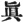
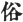
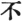

  
[Intangible Textual Heritage](../../index)  [Buddhism](../index.md) 
[Index](index)  [Previous](chj18)  [Next](chj20.md) 

------------------------------------------------------------------------

[Buy this Book at
Amazon.com](https://www.amazon.com/exec/obidos/ASIN/B0029LHTGG/internetsacredte.md)

------------------------------------------------------------------------

  
*The Creed of Half Japan*, by Arthur Lloyd, \[1911\], at Intangible
Textual Heritage

------------------------------------------------------------------------

p. 168

### CHAPTER XVII

Buddhism reaches Japan

Buddhism reached Japan from Korea, and
not at first from China.

Korea, in the age which we have been considering, was not as large a
country as it is now. The whole of the district, from the Yalu river,
which forms the present boundary of the Korean Empire, to the Tatong
river, halfway between Wiju and Seoul, belonged to China. The rest of
the peninsula was divided into three independent kingdoms: Koma, which
occupied the eastern slopes, from the Tumen in the north down almost to
the extreme south of the peninsula; Kudara, which occupied the whole of
the western slopes from the Chinese frontier to the extreme south; and
the small kingdom of Shiragi in the south-eastern corner of the
peninsula, on the side nearest to Japan. The southernmost province of
Shiragi was the province of Mimana, which may be said to have been at
one time practically a Japanese colony.

Buddhism had reached the kingdom of Koma in A.D. 372, the missionary
having been sent from Singanfu by the ruler of the Former Thsin (A.D.
350–394). A ruler of the Eastern Tsin (317 to 420) had sent an Indian
priest, Marananda, to preach the Gospel of Buddha in Kudara in the year
384. Shiragi had received the doctrine from the neighbouring kingdom of
Koma in

p. 169

\[paragraph continues\] A.D. 424. The
well-known propensity of the Buddhist priesthood for political intrigue
and amateur statecraft makes it highly probable that the rival rulers of
the Thsin and the Tsin, casting about for any straw with which to
support their tottering dynasties, made use of the Buddhist missionaries
for political purposes to gain allies for themselves in Koma and Kudara,
both of which kingdoms touched the Chinese frontiers. As to the exact
nature of the Korean Buddhism we have no accurate information. The
division into sects in China was still new, and sectarian lines were not
very clearly defined. The doctrine still wore its Indian and
predominantly Hīnayānistic character; Vasubandhu, Asangha, and other
great teachers of Mahāyāna had possibly not been born when Buddhism
reached Korea. [1](#fn_211.md) There are
indications to show that much attention was paid to the Vinaya
discipline, and that whatever speculation there was ran along the lines
laid down by the Kusha, Sanron, and Jōjitsu sects (see Chapter XVI.).

Korea and Japan were by no means strangers to one another. As early as
B.C. 32 (if there is any confidence to be put in the early records of
Japan) the little province of Mimāna or Kara, oppressed by Shiragi, had
appealed to Japan for aid. The reigning emperor, Sujin Tennō, became its
protector, and the prestige of the Japanese name was so great that Japan
was able not only to turn Mimana into a Japanese dependency, but to keep
it as such for several centuries. Korean influence upon Japan may have
begun even then, for in the reign of the next emperor, Suinin, about the
dawn of the Christian era, we find the beginnings of rice culture in
Japan, and an attempt to elevate and ennoble the native worship of the
Kami, which may have been due to the influence

p. 170

of a foreign religion. [1](#fn_212.md) In A.D. 2
Suinin is said to have abolished the custom of burying alive the wives,
concubines, and retainers of deceased rulers and nobles, and to have
substituted the burial of clay figures, a practice which led to the
Japanese pottery industry.

In the year A.D. 202 the great Japanese heroine, Jingu Kōgō, made her
famous expedition to Korea, and established the Japanese ascendency not
only over Shiragi, but likewise over the sister kingdoms of Koma and
Kudara, an ascendency which it would probably have been impossible to
establish had it not been for the fact that the great dynasty of the Han
was at that period tottering to its fall. In the confusions which
followed that catastrophe (A.D. 220), none of the transient Chinese
kingdoms was powerful enough to be able to pay much attention to Korea.

Jingu Kōgō's son and successor, Ōjin Tennō, subsequently deified by his
countrymen as Hachiman, the God of War, and at a still later period
adopted into the Buddhist Pantheon as an incarnation of one of the great
Buddhas, made great use of his suzerainty over Korea by importing from
that country horses and arms, tailors and sempstresses, smiths and
artisans. His successor, Nintoku (311–399), who was obliged to fit out
an expedition to Shiragi in order to maintain his rights, followed in
the footsteps of his father. He had been instructed in the doctrines of
Confucius and Mencius by the Chinese sage Wani, whom his father had
engaged as a tutor to the Imperial family, and Japanese historians
always speak

p. 171

of Nintoku with deep respect as a man of singular virtue and nobility.
Nintoku introduced silkworm breeding into Japan, and it is a significant
fact as showing a possibly earlier existence of Buddhism in this country
that in the silk districts the patron deity of sericulture is the
Buddhist saint As’vaghosha. [1](#fn_213.md)

In the year A.D. 522, a Chinese priest named Shiba Tatsu, a subject of
the Liang (502–557), made an attempt to establish a mission in Yamato,
which failed. The Liang ruled in the south of China. Their first
emperor, Wu-ti, was a powerful ruler who extended the dominions of his
house to the sea-coast on tile east, and did much to foster trade and
commerce. In his reign the Chinese began to be a seafaring people, and
Chinese ships visited the Bay of Bengal, Ceylon, the west coast of
India, and even penetrated as far as the Persian Gulf. [3](#fn_215.md) Wu-ti, during the earlier years of his
reign (502–549), was a great patron of Confucianism; in his later years
he alienated his Confucian subjects by his zeal for Buddhism, which he
adopted with all the ardour of a convert. In the north of China, his
most powerful rival was the kingdom of the Wei, ruled over by a queen,
Hushi, who, like Wu-ti, was a zealous Buddhist, much to the disgust of
her Confucianist subjects, who objected to the worship of S’akyamuni on
the ground that he was only a deified man, and not a god like Tientei,
the ruler of Heaven. In the end they dethroned their queen and threw her
into the Hoangho. [2](#fn_214.md)

The Wei [3](#fn_215) influence (386–584.md) would
naturally be great in the Korean states which touched their boundaries.

p. 172

\[paragraph continues\] Shiba Tatsu passed
through Korea on his way to Japan. It is highly probable that he came on
a semi-political mission which failed. Neither Korea nor Japan cared for
an alliance with the distant Liang, whose fortunes were apparently bound
up with the personality of one man. Wu-ti's death in 549 was practically
the end of his house and dynasty.

But Shiba Tatsu's mission may very possibly have suggested a reason why
the Korean kingdoms should seek to strengthen themselves by an alliance
with Japan. Korea was practically a Buddhist realm. Both Wei and Liang,
though ruled over by sovereigns with Buddhist propensities, had powerful
aristocracies which were strongly anti-Buddhist. Had either of these
kingdoms gained the ascendency in the Peninsula a grievous persecution
would have followed, ending perhaps in the overthrow of Korean
dynasties. [1](#fn_216.md) Japan was as yet
neither Buddhist nor Confucian. If she could be won over to the faith,
the immediate future at least would be secured from danger.

Accordingly, in 545, and again in 552, [2](#fn_217.md) King Seimei of Kudara sent presents to
the Emperor of Japan—images of Buddha and Sacred Books—together with a
recommendatory letter in which he pointed out the excellences of the
Buddhist religion, as well as its evident destiny to travel constantly
eastward from the land of its origin. The presents received but a
doubtful welcome. One

p. 173

noble family, that of Soga no Iname, whose household had possibly been
already converted to Buddhism, advised the sovereign to accept the gift.
Another section of the nobility, headed by Mononobe no Okoshi and
Nakatomi no Kanako, was furiously opposed to having any dealings with a
new religion which could not be brought into the country without offence
to the national gods. The Emperor temporized. He entrusted the care of
the images and books to Soga no Iname, as though to allow those who
would to adopt the new religion, [1](#fn_218.md)
without committing himself to any definite line of action in this
respect. Soga housed the idols in his own villa, which he converted into
a place of worship. Soon after this a pestilence broke out, which was
taken to denote the anger of the native gods. Soga's temple was
destroyed by a mob, and the great statue of the Buddha thrown into the
canal at Naniwa. Then followed another portent—a flash of lightning from
a cloudless sky, which set fire to the Imperial Palace. This was clearly
a token of the anger of the Hotoke. [2](#fn_219.md) The offending statue was fished out of
the river, and reverently placed in a suitable abode, and the Emperor,
as a further act of reparation, caused two images to be carved in wood
and set up at Hoshino. This was the first beginning of the glyptic arts
in Japan. At the same time he sent a prudent message to the King of
Kudara, asking him to send no more Buddhist bonzes or images, but
requesting to be supplied with physicians, apothecaries, soothsayers,
almanack-makers, and artisans, and promising in return to supply him
with munitions of

p. 174

war. [1](#fn_220.md) This last clause looks very
much as though an offensive and defensive alliance had been really the
aim of the King of Kudara.

The bonzes and images, however, continued to come. It cost a civil war
and many a riot before Buddhism became a permanent institution. It
possibly cost even more, for there was something suspicious about the
death of the Emperor Sujun (592), if not about those of his
predecessors, Bidatsu (586) and Yomei (587); but the proselytizing zeal
of the Korean Court and their supporters in Japan (whose numbers may
have increased with the opposition raised by the Kami-worshippers) knew
no discouragement. Architects, wood-carvers, and almanack-makers came.
Books on geography and astronomy, which the Buddhists, from their
wide-reaching connections, were most fitted to teach, books on magic,
and almanacks, of which they had almost a monopoly, came, and were
eagerly received by the Japanese, who have always had a desire to know.
But priests came too, and nuns, and in their hands were books, relics,
and sacred images of Maitreya, of Amitābha with his two
companions, [2](#fn_221.md) of Kwannon the Deity
of Mercy, so that by the death of Shōtoku Taishi there were 46 temples
and nearly 1400 monks and nuns composing the staff of Buddhist missions.
Many sacred books came also, for

p. 175

we find Shōtoku Taishi lecturing on the "Hokekyō, Yuima Kyō," and
"Shomangyo" (the last two, books of the Vinaya), and there must have
been many others.

During the whole of this period of Korean influence the cause of
Buddhism in Japan found a doughty champion in the Crown Prince, Shōtoku
Taishi (572–621), a rare personage, who united in himself the qualities
of a general, a statesman, a theologian, and a mission-preacher. A more
important factor in the progress made by the religion was the fact that
Buddhism in Japan soon attracted the enthusiastic adherence of the
women. In 577 the King of Kudara sent over a nun, who must have been a
very good mission worker. In 584 several Japanese women were admitted to
the Order. In 588 a band of Japanese nuns went over to Korea to study.
In 590 they returned, bringing with them the disciplinary rules of the
Vinaya, and were well received by the people of Naniwa (Ōsaka), who
built them a convent and allowed them to receive many postulants. It is
probable that these pious women, teaching the comparatively simple
doctrines contained in the Vinaya books, did much more to recommend the
faith of Buddha to their countrymen than did the Mantra priest with his
incantations and magic, or the ordinary bonze with his Kusha, Sanron, or
Jōjitsu speculations.

The Vinaya books are divided into four sets. They represent the
disciplinary books of the four Hīnayāna sects, Sarvāstivādins,
Dharmaguptas, Vibhās’ikas, and Mahis’akas—which alone had any connection
with Chinese missions. What the precise differences between these
traditions were we know not, and which tradition found its way through
Korea to Japan, we cannot tell. Possibly there was not much to choose
between them; but the lesson to be learned from the four divisions is
worth

p. 176

remembering. For, if the Discipline might be altered a little, it might
also be altered much, and if it might be altered much, it might also be
abolished entirely. In later years, Shinran Shōnin's reforms practically
swept away the whole discipline, and we may presume that it was by
arguments such as these that he justified his action. But be that as it
may. The pious women of Japan took kindly to the definite rules of
Vinaya Buddhism, and their adherence to the new religion was of immense
importance. There were not wanting signs of the need of discipline
amongst religious communities, even in those early days. [1](#fn_222.md)

The fashionable form of religious metaphysics was that adopted by the
Sanron sect, which commenced its Japanese existence in the year 624,
three years after the death of Shōtoku. This sect professed to accept
the whole of the Buddhist Canon so far as it existed in China in those
days. [2](#fn_223.md) The diseases of the human
mind were many and various, so they said, and the prescriptions for so
many diseases must be many also. The object of Buddha's teaching was to
destroy error and establish the truth: the one implied the other, for
the destruction of error left truth in its place, and when all errors
were destroyed truth would have the field all to itself. But to set to
work to establish positive truth would of necessity involve the
establishment of error. \[There can, therefore, never be such a thing as
a positive and infallible Revelation of Truth.\] Truth was of two kinds,
absolute ( ) and apparent
( ), and error, though
infinite in its possibilities, might all be summed up under eight great
heads. There

p. 177

were errors connected with positive views of Life and Death, about
Oneness and Multiplicity, about the Determinate and the Indeterminate,
about Going and Coming. [1](#fn_224.md) Place the
word "No" ( ) in front of
each of these eight notions, and the Truth would be clear. "No Life and
No Death, No Oneness and No Multiplicity, No Determinate and No
Indeterminate, No Going and No Coming." The Universe and the Microcosm,
Man, are nothing but negations.

Speculations such as these, the products of the hairsplitting Indian
mind, had no charm for the practical Japanese intellect, and the Sanron
sect [2](#fn_225.md) was never more than a shadow
among the Buddhist denominations in Japan. If it had not been for the
simple faith of the Japanese women, who took the Buddha of the Vinaya
books as their model, with his plain, straightforward directions as to
the religious life of the believer, it is possible that Buddhism might
have had to wait some years longer before gaining the ear of the
Japanese people. The lesson is one not to be thrown away.

------------------------------------------------------------------------

### Footnotes

[169:1](chj19.htm#fr_212.md) Takakusu gives for
Vasubandhu's date A.D. 445.

[170:1](chj19.htm#fr_213.md) It is not impossible
that this may have been Buddhism. A.D. 64 marks the *official*
recognition of Buddhism in China, not its popular acceptance, and there
is an early Japanese tradition that at a very early period certain
*Ratai no hito* brought an image of Kwannon to Japan, which they set up
at Kumano-ura for worship ("Bukkyo Seiten," App., p. 12).

[171:1](chj19.htm#fr_214.md) See "Bukkyō Mondō
Shū," pp. 14–24.

[171:2](chj19.htm#fr_216.md) Kaeuffer, "Geschichte
Ostasiens," vol. ii. p. 397.

[171:3](chj19.htm#fr_217.md) There were three Wei
dynasties, all in the north of China: (1) Northern Wei, 386–534; (2)
Western Wei, 534–557; (3) Eastern Wei, 534–550.

[172:1](chj19.htm#fr_218.md) The straits to which
Buddhism in China was at this time reduced may be seen in the fact,
noticed by Kaeuffer, that about 555 an attempt was made forcibly to
unite Buddhism and Taoism, in a common enterprise against the powerful
Confucianists—a foreshadowing of Ryōbu Shinto. The attempt failed
because the Taoist priests objected to having their heads shaved, and
the failure only made things worse.

[172:2](chj19.htm#fr_219.md) This must be
considered as the date of the official introduction of Buddhism.

[173:1](chj19.htm#fr_220.md) The Emperor would
scarcely have adopted this course had not Iname been backed by a
considerable number of influential sympathizers.

[173:2](chj19.htm#fr_221.md) *Hotoke*, the
Japanese term for a Buddha.

[174:1](chj19.htm#fr_222.md) In preparing this
chapter I have largely consulted the historical sections of Rein's
"Japan," which remains a standard work. For the Buddhist part I am much
indebted to the painstaking chronology published by my friend, Dr. Hans
Haas, of Heidelberg, in *Mitteilungen der Gesellschaft für Natur and
Völkerkunde Ostasiens*, vol. xi. 3 (Berlin: Behrend & Co., Unter den
Linden 16).

[174:2](chj19.htm#fr_223.md) The statue of
Amitābha, with Avalokiteśvara and Mahāsthamaprāpta, sent over by the
King of Kudara, in 552, is said to be now at the Zenkōji Temple at
Nagano. See Satow and Hawes, "Handbook of Japan," p. 289.

[176:1](chj19.htm#fr_224.md) See Haas, "Chronology
of Buddhism, A.D. 623 and 628," in *Mitteilungen der deutschen
Gesellschaft far Natur and Völkerkunde Ostasiens*.

[176:2](chj19.htm#fr_225.md) See Nanjo, "Cat.
Trip.," Introd., p. xviii.

[177:1](chj19.htm#fr_226.md) "Murakami," p. 446.
The words are Shō-metsu-ichi-i-dan-jō-ko-rai ( ).

[177:2](chj19.htm#fr_227.md) For the meaning of
Sanron see previous chapter.

------------------------------------------------------------------------

[Next: Chapter XVIII. The Crown Prince Shōtoku Taishi](chj20.md)
