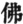

  
[Intangible Textual Heritage](../../index)  [Buddhism](../index.md) 
[Index](index)  [Previous](chj23)  [Next](chj25.md) 

------------------------------------------------------------------------

[Buy this Book at
Amazon.com](https://www.amazon.com/exec/obidos/ASIN/B0029LHTGG/internetsacredte.md)

------------------------------------------------------------------------

  
*The Creed of Half Japan*, by Arthur Lloyd, \[1911\], at Intangible
Textual Heritage

------------------------------------------------------------------------

p. 259

### CHAPTER XXII

The Buddhism of the Gempei Period [1](#fn_360.md)

It is very difficult to describe in a
short paragraph, or even in one long chapter, the complicated period of
Japanese history which has for its central point of interest the fierce
wars waged with such relentless bitterness between the rival families of
the Taira and Minamoto and their respective factions. It would be beyond
the scope of the present work to try to do so. We must content ourselves
with a brief mention of some of the leading features of the period, so
far as they are concerned with the history of Japanese religion.

During the ninth and tenth centuries the supreme power in Japan lay
practically in the hands of the great family of the Fujiwaras, who,
under one title or another, monopolized all the great offices of State,
and kept the emperors, always their creatures, and very often connected
with them by ties of marriage and affinity, in a state of absolute
subjection. Occasional attempts were made to destroy the Fujiwara
monopoly. Sugawara Michizane, [2](#fn_361.md)

p. 260

now worshipped as Tenjin, and famous alike for book-learning, political
science, archery, and loyal devotion, made such an attempt in the reigns
of Uda Tennō (887897) and his successor Daigo (898–930). A few years
later (933), Taira Masakado, aided by one of the Sumitomo branch of the
Fujiwara themselves, tried to break through the tyranny of the regent,
and raised a rebellion which it took some time and energy to quell, and
which has a special significance from the fact that its leader aimed at
the Imperial Crown for himself. But such attempts always proved
abortive, and, during the whole of the period in question, the ship
which bore the fortunes of the Fujiwaras rode triumphantly over all
waves and came through all storms.

The nominal captain of the Fujiwara vessel was always the Emperor. But
it was never forgotten in practice that his command was merely nominal.
The real power lay in the hands of the first lieutenant, and for fear
the captain should seek to assert his authority, or in any way interfere
with the working of the ship, it was necessary to keep him happy and
amused in many harmless

p. 261

and innocent ways. The luxury which the Fujiwaras encouraged was no mere
wanton display, no simple seeking after pleasure. It was adopted with a
view to a practical end, and besides succeeding in its immediate
purpose, led to other and far-reaching results. The Fujiwaras became the
liberal patrons of arts and letters. The pictures for which Japan is so
justly famous; her music, poetry, and dramatic art, those creations
which are held so vividly to portray the character of the sentimental
yet strangely matter-of-fact Japanese people;—all owe their development
mainly to the artistic instincts of this gifted and powerful family, and
for these things, at least, Japan owes them a lasting debt of
gratitude. [1](#fn_362.md)

It is to be noted here that the arts and letters of early medieval Japan
are all Buddhist, or, at least, are so thoroughly impregnated and
saturated with the spirit of that religion that it is impossible to
understand their inner beauties without some knowledge of the Faith
which inspired the artists. The Emperor Kwammu had moved his capital
from Nara to Kyōto to be free from the intervention of the meddling
priesthood in matters of State, and Dengyō had founded his monastery
upon Hieizan in the hopes of finding a quiet spot where he might be free
from "earth's many voices." The event was quite the opposite of what
either of these men expected. [2](#fn_363.md) The
Tendai reforms turned Japanese Buddhism into a wide-spreading
organization with far-reaching ramifications. The Fujiwaras knew how to
use that organization for their own ends, and the Buddhist

p. 262

priesthood in their hands became a political machine. The monks were the
votaries of art and science; they composed the songs, painted the
pictures, laid out the gardens, and designed the palaces in which the
luxuriously trained court found its pleasures and forgot its feebleness,
and when the captain of the ship, as sometimes happened, began to know
too much, and to stir about on his soft cushions, some monastery would
furnish a convenient desert island upon which the restless skipper might
be marooned. [1](#fn_364.md)

Sometimes a skipper, more long-headed than the rest, did not wait to be
marooned, but shut himself up voluntarily in his own cabin, as it were,
and continued to direct the ship of State, from the safe shelter of some
monastery, through the person of some infant son or grandson, whom he
put on the throne instead of himself, and for whom he acted as guardian
or regent. Such was the course adopted, *e.g.*, by the Emperors
Shirakawa and Toba, [2](#fn_365.md) and it seemed
quite natural in a country like Japan, where the "power behind the
throne" has always been so potent a reality. An ex-Emperor, living in a
monastery, and from thence directing the affairs of State in the name of
his immature son or grandson, would seem to be an ideal state of things
from the point of view of an ambitious priesthood. But the Fujiwaras
understood the principle of *divide et impera*. The Nara

p. 263

monasteries were jealous of the new-fangled growths on the slopes of
Mount Hiei; the Hieizan household was encouraged to go in for domestic
feuds. The appointment of a *Zashū*, or Archbishop, of the Tendai
community, chosen not from the monks of the Mother House of Hieizan, but
from the inmates of the daughter institution at Ōtsu—the Onjōji, or
Miidera—gave the signal for a strange civil war within the fold of the
Tendai itself. Hieizan and Miidera became the headquarters of two
warring armies, with a military organization of *tera-samurai*, or
temple knights, and train bands of fighting men. The other large temples
followed suit, and the lay people of Japan had the undesirable
privilege, several times during these centuries, of beholding armies of
"religious" persons engaging in fratricidal strife, killing, burning,
and laying waste.

In the mean time there was growing up in Japan an upper middle class,
closely connected with the aristocracy, and yet independent of them, and
corresponding very nearly to our English gentry.

It had been the practice, both of the Fujiwara and also, from time to
time, of the Emperors themselves, to raise money for political or
religious purposes by the sale of certain patents (not unlike the
baronetcies of King James I.), known as *shō-en*, which conferred upon
their holders the privilege of possessing their estates free from
Imperial taxation and exempt from the jurisdiction of the provincial
governors. Some of the Emperors, *e.g.* Gosanjo (1069), had set their
faces against this practice; but needy and religious-minded rulers, such
as Shirakawa (1073) and Toba (1108), had been very lavish in the
granting of these patents, and the holders of these privileges became an
important element in the State. They formed the main support of the
rival factions of Taira and

p. 264

\[paragraph continues\] Minamoto, and even
after Yoritomo's formal and successful organization of their scattered
members, continued to be, as *samurai*, down to our own times, the true
backbone of the Japanese nation. [1](#fn_366.md)

Independent, freedom-loving, fairly educated, addicted to martial
exercises and the outdoor sports which have been the pastime of the
country gentleman in all ages and climes, these men had absolutely
nothing but contempt for the sickly sentimentalism of the fashionable
priests, with their legends and repetitions, and their somewhat
hypocritical prohibitions against hunting and fighting. That they were
not devoid of religious feeling we shall see in another chapter. For the
present let us note merely that they were coming into prominence as a
social and religious element, qualified to exercise a determining
influence on the destinies of their country.

I have already, in a previous chapter, referred to the social miseries
of the country during the period of which many writers speak as though
it had been the golden age of Japanese history. With equal justice might
we speak of the reign of King Stephen, or the long-protracted miseries
of the Wars of the Roses, as having been the golden age of our English
history. The miseries of the people, naturally passed over by
chroniclers whose eyes were concentrated upon the precincts of the
Imperial Palace, were truly great. They cannot have been anything else.

I have also spoken, in my last chapter, of the pathetic figure of the
*Odori-nembutsu*, the poor, half-witted, princely priest, dancing his
way through the country, with the monotonous *nembutsu* constantly upon
his lips, in the hope

p. 265

of thus awakening in the hearts of the people that sense of belief in a
Power higher than ourselves, which is man's strongest rock of confidence
in the hour of misery and sorrow. This is the place for me to stop my
narration, and to give my readers a digression (I fear it may be a long
one) on the subject of the *nembutsu*.

*Nembutsu* means "thinking of Buddha"; the Nembutsu to which I refer is
the popular Japanese contraction for the phrase *Namu-Amida-butsu*,
which is half Sanskrit and half Chinese, and means "Glory to the Buddha
Amitābha," the Buddha to whom I have already so often referred in the
course of this present work.

Amitābha, "the Buddha of Infinite Light," or Amitayus, "the Buddha of
Infinite Life" (the two are identical in Japan, though, I believe,
treated as distinct personages in Thibet), is preached in certain
Sūtras [1](#fn_367.md) of

p. 266

the Mahāyāna, to which I have already had occasion to refer, as the
Supreme Being of a certain section of Buddhists. Amida is without
beginning and without end, all love, wisdom, benevolence, and power. He
is the Father [1](#fn_368.md) of all the world and
of all sentient beings. In

p. 267

ages incalculably remote he appeared in various forms among men, all his
incarnations being to bring salvation to mankind. In his last
incarnation he appeared as the Bhikshu Hōzo (Dharmakāra), and as such
registered a vow that should the Perfect Consummation of the Buddhahood
ever be in his power, he would not accept deliverance unless such
deliverance should also mean the salvation of suffering mankind. In
fulfilment of that vow he endured much suffering and many agonies, but
he triumphed in the end, and the fruit of his labours has been the
opening of a Paradise in a Pure Land, into which all may enter who call
upon his name with Faith. [1](#fn_369.md) Other
Buddhas also have spoken of Paradise; [2](#fn_370.md) Amida alone can speak of it as *my*
Paradise.

Amida is *Ichi-butsu*, the One Buddha, and besides Him there is none,
for all the other Buddhas and Bodhisattvas and gods, in whom men trust,
are but temporary and partial manifestations of the Great Father, whose
Vow (a Christian might call it his *Will*) is that all mankind should be
saved—saved from the miseries of existence, from all those universals of
misery which S’akyamuni disclosed to a suffering world, and placed in
that Paradise where there is nothing to hinder or to hurt the soul ou
its upward path to that Perfection which comes from the Beatific Vision
of Amida Himself. [3](#fn_371.md)

p. 268

Amida is One and Indivisible, but He has several names, and two of the
names by which He is known amongst men have become personified with a
quasi-separate existence as His Sons, and sit, the one on His right, the
other on His left, in His Kingdom. The right represents His Wisdom, the
left His Mercy; the latter is occupied by His Son Avalokites’vara, or
Kwannon, "the Lord that looked down," incarnate again and again for man
and his salvation; the former, personified as Mahāsthāmaprāpta, or
Seishi, whose gift to man is, significantly, not salvation, but
life. [1](#fn_372.md)

To grasp this salvation, wrought out for man by Amida, and brought to
him by Kwannon and Seishi, nothing is needed but Faith—no works of the
Law, no austerities, penances, or devotions, no resolutions of
amendment, no futile strivings, no repentance—nothing but Faith. It
sounds an immoral doctrine, a kind of antinomianism, yet it is not
exactly immoral as expounded, at least by its latest preachers, the
school of Shinran and his disciples. For faith brings salvation, the
realization of salvation arouses the gratitude of the heart, and the
grateful heart, knowing what it is by nature and what it has become by
grace, becomes so filled with the expansive power of a deep love that it
turns the good deeds, the austerities, the devotions, from being
fruitless attempts at obtaining a salvation which is practically beyond
man's attainment into the joyful formulæ through which the new life
imparted to the soul finds its expression.

Shinran Shōnin (A.D. 1174 to 1268), the founder of the

p. 269

\[paragraph continues\] Shinshu sect, who
claimed for his teachings the authority of a Vision of Avalokites’vara
himself, [1](#fn_373.md) has left behind him,
amongst other works, a poem entitled the "Shōshinge," which is even now
in common use in the family devotions of pious Shinshu households. A
writer to whom I am very much indebted for the insight which he has
given me into the thoughts and aspirations of the band of Buddhist
reformers who owe their inspiration to the life and teachings of the
late Mr. Kyōzawa, [2](#fn_374.md) has written a
commentary on the poem, which, while being up to date, as coming from a
modern scholar, yet represents the very thoughts of Shinran, the last
great patriarch of mediæval Amidaism in Japan.

Mr. Tada's book, following the lines of Shinran's poem, gives us, first,
a series of chapters on the Doctrine of Amida; on the connection between
Amida and S’akyamuni, on the history, authenticity, and genuineness of
the Sūtras on which the Amidaists build their Faith (he considers them
genuine records of S’akyamuni's teachings secretly and unofficially
handed down in South India during the five centuries of silence which
followed S’akyamuni's death, but brings no proof for his statements),
and then proceeds to treat, in several chapters, of the Invocation of
Amida's Sacred Name and of the New Life of courage, enthusiasm, and hope
which comes to us through prayer and adoration.

p. 270

\[paragraph continues\] He then devotes
another series of chapters to the consideration of seven great names
which Shinran had selected as embracing the whole history of Amidaism
from its first inception to Shinran's time, and, having thus surveyed
the whole of the ground covered by the Shōshinge, proceeds to base
thereon a concluding exhortation to his readers on present duties and
prospects.

The names are selected from India, China, and Japan. The Indian
patriarchs are Nāgārjuna and Vasubandhu; those from China, Donran,
Dōshaku, and Zendō; those from Japan, Genshin and Genkū. Each name has
two chapters devoted to it, one biographical and one doctrinal, and the
author has cleverly constructed his doctrinal chapters in such a way as
to show that there has been a regular and consistent development all the
way from Nāgārjuna to Shinran, who brought the system to its
perfection. [1](#fn_375.md)

Thus in Nāgārjuna the doctrine is vague: no mention is made of the
Sūtras which tell of Amida, but Nāgārjuna dies with his face set to the
Western Paradise, and there are passages in his works which foreshadow
the doctrine. In Vasubandhu, we get a step further: the mystic teacher
knows of the book which contains the description of Paradise, and,
whilst not giving himself up wholly, to the exclusion of every other
cult, to the worship of Amitābha, still puts Amitābha at the top of the
Buddhist pantheon. In the chapters on the Chinese Patriarchs we are
shown how one of them was attracted to Amidaism by its simplicity. The
multiplicity of the doctrines in the other books had confused his mind;
here was something easy and intelligible and within his reach. The other
had been long seeking for the Elixir of Life, had dabbled in

p. 271

medicine and in magic, and had several times imagined himself to be on
the point of discovering the formula wherewith to cheat death, yet his
search had been in vain. In a moment of despondency arising from one of
his numerous failures he came across Bodhiruci, a Buddhist priest of
fame. "What?" said Bodhiruci, "you are seeking for eternal life? I will
give you the secret." And handing him the books which contained the
descriptions of Amida's Paradise and of salvation through faith in His
Name, he bade him read and believe. The man did so, and in due course
became one of the most successful of the Apostles of Amida in China.

In Japan, the Shinshuist notes with pride that the first image sent over
by the King of Kudara in the sixth century was one of Amida, with his
satellites, Kwannon and Seishi. The first Japanese patriarch on
Shinran's list, Genshin, [1](#fn_376.md) was
attracted, as had been one of his Chinese predecessors, by the
simplicity of the doctrine and its adaptability to the needs of simple
persons. Ere Genshin died the troubles of Japan had begun, and in the
midst of those troubles the sound of Nembutsu from many a troubled heart
was a cry of pathetic and half-despairing faith. Such was the cry of the
Odorinembutsu, to whom we have already alluded, and that of Ryonen
Shōnin, [2](#fn_377.md) to whom Amida appeared in
a vision

p. 272

and bade him leave the Hieizan monastery, as being a den of thieves.
Ryonen and the Odori-nembutsu [1](#fn_378.md) both
became founders of small sects, which, however, never succeeded in
winning a very large amount of popularity. It is the merit of Genkū,
better known as Hōnen Shōnin, to have successfully established a
definite sect of the Pure Land in Japan; of Shinran, his greater
disciple, to have brought the system to its perfection.

Genkū was converted by a death-scene. It was in the time of the Civil
Wars; and Genkū's father was attacked by bandits in his house, and after
a brave defence, mortally wounded. The mother and her child escaped to a
place of safety, and when the bandits had cleared off, returned to the
house, where they found the father dying. "You must forgive your
enemies, my son," said the dying man; "there is no end to vengeance and
vendetta, for wrath begets wrath, and only forgiveness can heal it." The
lesson sank into the boy's mind; he became a monk, and might have risen
to high honour in the wealthy and purse-proud Tendai sect, had he not
preferred the simplicity of his Amida faith to the noisy worldliness of
Hieizan. [2](#fn_379.md) He suffered for his
convictions, yet succeeded in establishing a sect known as the
Jōdo, [3](#fn_380.md)

p. 273

which still reveres him as its founder. The memory of his father's death
seems to have remained with him all his life, for the Amidaism which he
taught was *ars moriendi* rather than *ars vivendi*. "At the hour of
death, … good Lord deliver us" is practically the cry of the Jōdo
believer, and if at that solemn hour his faith in Amida is pure and
clear, and the Nembutsu rises to his lips, he believes that Amida will
come to save him, [1](#fn_381.md) no matter what
may have been the character of his previous life. In the meanwhile, the
Jōdoist, if he is sincere and earnest, does not neglect the spiritual
duties of his religion. They cannot save him (no more can any good
works), but they help to create and keep alive in him that faith in
Amida which is of such prime importance to him at the psychological
moment. But after all, when the hour of death comes, the centurion
Cornelius would be no better off than the dying thief, in Genkū's
teaching.

Shinran, on the contrary, saw that the dying thief was an exception to
the rule of salvation. Like his master, Genkū, he made Faith in Amida's
Vow the absolute and only essential to salvation, but the Faith
requisite is not of the death-bed variety. It must be the Faith of a
lifetime, and where that Faith exists nothing more is necessary. [2](#fn_382.md) Penances, austerities, abstinence from
flesh

p. 274

or marriage, works of piety and charity—none of these things will save a
man, but the man who has realized the truth of his salvation through the
mercies of Amida, will, out of joy and gratefulness, do more than he
would ever have done merely as a means to gaining salvation for himself.
To this doctrine of salvation by Faith the Shinshu sect bas remained
constantly faithful. I have often been told that Shinran was acquainted
with Christian doctrines when he framed the system of Jōdo Shinshū. From
what I have been able to put before my readers in the course of this
history, I think we may say that the probabilities are that he
was. [1](#fn_383.md)

------------------------------------------------------------------------

### Footnotes

[259:1](chj24.htm#fr_362.md) *Gempei* is the name
given to the period of the great Civil Wars between the families of
Minamoto (in Sinico-Japanese *Gen*) and Taira (*Hei*). In this chapter I
mean the term to include, roughly, the period between the outbreak of
the so-called Hōgen war (1156) and the establishment of the Hōjō Regents
at Kamakura about 1200. But the term must be treated as very elastic.

[259:2](chj24.htm#fr_363.md) *Sugawara Michizane*
(845–903), the son of an obscure but talented family, exercised a very
great influence over the Emperor Uda (889–897), and laboured with great
diligence to break the power of the p. 260
Fujiwaras and raise the prestige of the Imperial Family. He persuaded
his master to abdicate in favour of his son, Daigo (898–930), under
whose reign he continued his political designs, being much aided therein
by the ex-Emperor, who had abdicated on purpose to be able to work with
more freedom for the attainment of his aims. The Fujiwara, however,
contrived, in 901, to poison the Emperor Daigo's mind by false charges
against Michizane, who was banished to Izu in spite of all the efforts
made on his behalf by the ex-Emperor. He died two years later, constant
in his faithfulness to the master who had treated him so ungratefully.
He has since been deified, and is worshipped in various localities as
*Kan Shōjō*, *Tenjin*, *Temmangū*, etc. He was a celebrated archer. Her
Majesty the Empress has a very pretty poem which tells how he rose
straight from his writing-table, took a bow, and hit a difficult mark to
show that, book-worm though he was accused of being, he was still able
to do manly service for his master.

[261:1](chj24.htm#fr_364.md) Articles in the
*Hansei Zasshi*, vol. xii., on the luxury of the Fujiwara period.

[261:2](chj24.htm#fr_365.md) Nichiren, however,
represented the almost simultaneous foundations of Kyōto and Hieizan as
having been the result of a conspiracy between Dengyō and the Emperor
for bringing the Buddhist Church into political dependence upon the
Crown.

[262:1](chj24.htm#fr_366.md) The list of Japanese
emperors during this period shows a majority of names of sovereigns who
came to the throne as infants in succession to deposed predecessors, and
who were forced in their turn to abdicate as soon as they reached
manhood or wanted to exert their powers.

[262:2](chj24.htm#fr_367.md) Shirakawa reigned
A.D. 1078 to 1086; Toba, 1108 to 1123. Shirakawa did not, however, die
until 1129, and Toba lived until 1156. There was a time when three
ex-Emperors were all alive at the same time, eating out their hearts in
early retirement, whilst one of their number helped to pull the wires
for their baby kinsman on the throne.

[264:1](chj24.htm#fr_368.md) Minamoto Yoritomo,
the first of the Minamoto Shōguns (11471199), organized the Kamakura
Bakufu, round which he gathered the military elements of the country,
away from the influence of the Court and priesthood. He is often spoken
of as *Kamakura dono*. See next chapter.

[265:1](chj24.htm#fr_369.md) These Sūtras are
known in Sanskrit as the greater and Lesser *Sukhūvati Vyūha*, and the
*Amitāyur-dhyāni Sūtra*, the two former extant both in Sanskrit and
Chinese, the last in Chinese only. All three claim to be Sūtras spoken
by the Buddha himself, but no trace of them can be found prior to A.D.
147, when Anshikao and his associates took one of them to China—not from
India, but from Central Asia—nor is there any written evidence of a
belief in Amida before the times of As’vaghosha and Nāgārjuna, say about
the latter end of the first century A.D. Shortly after commencing this
chapter I had an interview with a Buddhist priest, now deceased, whose
conversation on this subject was extremely interesting. According to
him, no Buddhist Sūtras, whether Mahāyāna or Hīnayāna, were reduced to
writing for the first five centuries after Buddha's death. (There is
some support for this view in Singhalese tradition, though it does not
quite agree with the evidence of As’oka's inscriptions.) From the
beginning of the sixth Buddhist century began the writing down of the
various Sūtras, which had till then been traditional only. Oral
tradition is, however, extremely liable to corruption and change, and
thus there had arisen discrepancies, between North and South in general,
and between different parts of the North in particular. In this way, he
said, had been framed the two Vehicles; but it could not be affirmed
that either of them was older than the other. The literary forms in
which both Vehicles are enshrined are coeval, and both are late, as late
as the p. 266 Christian era. No Christian
controversialist could ask for more generous concessions than these.

It may be of interest to some of my readers to know that since the end
of 1910, I have been engaged, together with some Buddhist friends in
Tokyo, on a work of translation of early Buddhist documents which may
lead to some interesting developments. Our present immediate objective
is to work out a translation into some European language of all the
Indian books translated into Chinese during the Han period, *i.e.* A.D.
147 and A.D. 220. When these have been translated (it will take several
years to accomplish), we hope that we shall be able to give to the world
a tolerably complete picture of what Buddhism was like when first
introduced into China. We also hope that we may be able to throw some
light on Gnosticism and the developments of Christian heresy during the
second and third centuries.

But more interesting matter for translation will probably be found in
the works of Japanese theologians of the eleventh, twelfth, and
thirteenth centuries, a field as yet untouched by European research. We
are learning to-day to see that Christ's work was far larger than
anything that our forefathers of even a century ago ever dreamt of, and
to comprehend that each nation will contribute and is contributing its
quota to the Perfect Temple of the Future, and that no Spiritual
Building can be expected to be final which does not make adequate
allowance for the glory and honour of all nations to be brought in.

[266:1](chj24.htm#fr_370.md) Mr. Tada Kanae, in
his excellent volume of "Lectures on the *Shōshinge*" (pp. 54, 56), says
that Amida may also be called the Creator, inasmuch as he established
the Law of Cause and Effect through which the Universe came into
existence. Some Buddhists, however, are not willing to grant this. They
say that the law came into action automatically from the very nature of
Shinnyo, and that in no case are we justified in considering Amida as a
Creator. That he is the Father is freely admitted by all *Shinshuists*.
A Japanese theologian (I think I may give Dr. Anezaki that title, though
he is a Buddhist) pointed out to me a short time ago that the first
draft of the Nicene Creed ran, πιστεύω εἰς ἕνα Θεὸν Πατέρα παντοκράτορα
πάντων ὁρατῶν τε καὶ ἀοράτων: "I believe in one God, the Father,
Almighty Ruler of all things visible and invisible," and, according to
Rufinus, there was a similar omission of p.
267 an expression of belief in a Creator in the Creed of the
Church of Aquileia ("Lib. post-Nicene Fathers," vol. iii. p. 541).

[267:1](chj24.htm#fr_371.md) See "S.B.E.," vol.
xlix., and my "Praises of Amida," Introd., pp. 1, 2.

[267:2](chj24.htm#fr_372.md) *E.g.* Yakushi
(Bhaishajyarāja).

[267:3](chj24.htm#fr_373.md) According to the Pure
Land books, there is a nine-graded Vision of Amida vouchsafed to the
soul in Paradise, and the Vision itself, as it grows in intensity, has a
purifying effect on the soul. I may point out that the eighty-one
previous Buddhas in the Sukhāvati Vyūha are but an amplification of this
ninefold Amida, which again is an amplification of a Trinity.

[268:1](chj24.htm#fr_374.md) I learned this in
conversation with a Buddhist priest. I can but repeat here what I have
said elsewhere, that the Ophite Gnostics who appeared in the same
localities and at the same time as the original Amida Buddhists, held
identical language about Christ.

[269:1](chj24.htm#fr_375.md) It is said that two
points in the Buddhist discipline caused Shinran a great deal of anxious
reflection—celibacy, and the abstinence from flesh. He claimed that
Avalokites’vara had appeared to him in a vision, and had taught him that
these points were not of the Essence of religion. Shinshu believers all
eat meat, and the Shinshu clergy are free to marry.

[269:2](chj24.htm#fr_376.md) Kyōzawa, a Shinshu
priest, who died but a few years ago, may be said to have given
Shinshuism a new impetus, in a direction almost Christian. His memory is
still venerated by a group of very earnest Shinshu priests. I give a
translation of the *Shōshinge* in my "Shinran and His Work."

[270:1](chj24.htm#fr_377.md) Mr. Tada gives the
dates of the seven as follows; (1) Nāgārjuna, about A.D. 150; (2)
Vasubandhu, *circ*. A.D. 440; (3) Donran, *circ*. A.D. 356; (4) Dōshaku,
A.D. 553; (5) Zendō, A.D. 614; (6) Genshin, A.D. 943; and finally Genkū
(Hōnen), A.D. 1130–1213.

[271:1](chj24.htm#fr_378) *Genshin* (942–1017.md),
born in Yamato, of the Urabe family, became a member of the Hieizan
community, being a disciple of Ryōgen, from whom he learned something
about Amitābha, which he afterwards made into the principle of his life
and teaching.

[271:2](chj24.htm#fr_379.md) *Ryonen Shōnin*
(1072–1132), founder of the so-called *Yūdzūnembutsu* sect, which is
still in existence. He was a monk of Hieizan; was warned by a stranger,
whom he took to be Amida, to flee from the "den of thieves" in which he
was living, and to turn the Nembutsu into an intercessory prayer.
*Ichinin, issainin, issainin, ichinin, ichigyō, issaigyō; issaigyō,
ichigyō*, "One man for all men, all men summarized in *One;* one
devotion for all, all devotions summed up in one."

[272:1](chj24.htm#fr_380.md) *Kūya*, the
Odori-nembutsu, is looked upon as the founder of the small sect of Ji,
which is, however, more generally identified with the name of Ippen-Oshō
(1239–1289). Ippen, like Kūya, was an itinerant preacher, and to this
day the head of the Ji sect, which has its chief temple at Fujisawa on
the Tokaido, is supposed to spend all his time in itineracy. *Cf*. the
Nestorian institution of the *periodeutes*, or itinerant preacher.

[272:2](chj24.htm#fr_381.md) For a sympathetic
account of the "Buddhist St. Francis," as Hōnen has been called, see
Prof. Anezaki's paper in the *Transactions of the International Congress
of the History of Religions* (Oxford: 1908). When Hōnen was first sent
to Hieizan, his parish priest wrote of him to the Abbot of the
monastery, "I am sending you a miniature of Manjuśri."

[272:3](chj24.htm#fr_382.md) His chosen place of
retirement was Kurodani, near Kyoto.

[273:1](chj24.htm#fr_383.md) In Jōdo circles, when
a believer lies dying, a picture of Amida is hung up on the wall in some
conspicuous place where the patient can easily see it. From the picture
a cord is taken to the bed and fastened to the dying man's wrist, so
that when the supreme agony comes he may take fast hold of Amida and not
let go till he stands in safety on the other side. The practice is quite
analogous to that of holding the crucifix before the eyes of the dying.

[273:2](chj24.htm#fr_384.md) There is a well-known
scene in the life of Shinran. Whilst still one of Hōnen's disciples,
there was a dispute as to Salvation. Shinran maintained that Faith was
necessary as well as the Invocation of the Name; the others maintained
that Invocation alone sufficed. All sided against Shinran except one
layman. During the discussion Hōnen entered the room, and at once
declared himself on the side of Shinran.

[274:1](chj24.htm#fr_385.md) We have seen how
close was the contact between Amidaism and Christianity in the China of
the Tang period, when Zendō and Olopen worked side by side in Singanfu,
and again later, when Prajṇā and the Deacon Adam were collaborators in
the translations of religious works. We can hardly say of Zendō and
Prâjnā that they were ignorant of Christianity. Neither can we say it of
the Nara Court at the time when the Nestorian physician Rimitsu came
over and was honoured with official rank. Nor again can we say it of
Kōbō Daishi, or of Dengyo, the Japanese founders of the Shingon and
Tendai. The former was at Singanfu and was a friend of Prajnā the
collaborator; the latter had been at Singanfu, where he must have seen
the celebrated Singanfu monument. The greater part of his time in China
he spent on Mount Tendai as a student of religion, and the Chinese
Tendai had been amongst the great instigators of the persecution against
Zendō and the Nestorians. Zendō's books came over to Japan more than
once between 796 and 858, and Zendō's books contain some very striking
Pauline echoes. And what are we to say of Kūya's answer, when questioned
of the glory of the life to come, "What I shall be I know not now: I
shall know hereafter"? Or of Genshin's metal mirror, "in which he could
see his face darkly"? Or of Kakuhan's definition of Butsu ( ), "He is higher than the
territorial prince, higher than the Emperor, higher than the Brahma, and
He is a Trinity"? Or of Myōe's refusal of an offer of wealth, "I have
food and raiment; I am content"? The Spirit of Christianity breathes in
these men; there was spiritual affinity if even there was no physical
contact. The whole of Shinran's system, his permission of clerical
marriage, his hereditary episcopates, savours strongly of Nestorianism.

------------------------------------------------------------------------

[Next: Chapter XXIII. The Buddhism of Kamakura](chj25.md)
