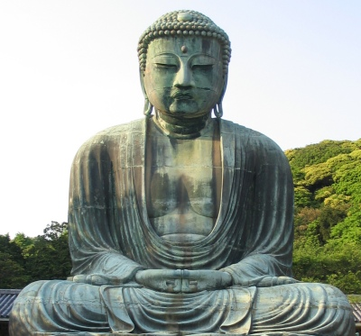

  
[Intangible Textual Heritage](../../index)  [Buddhism](../index) 

------------------------------------------------------------------------

[Buy this Book at
Amazon.com](https://www.amazon.com/exec/obidos/ASIN/B0029LHTGG/internetsacredte)

------------------------------------------------------------------------

<table width="75%">
<colgroup>
<col style="width: 50%" />
<col style="width: 50%" />
</colgroup>
<tbody>
<tr class="odd">
<td width="50%" data-valign="TOP"></td>
<td width="50%" data-valign="CENTER"><h1 id="the-creed-of-half-japan" data-align="CENTER">The Creed of Half Japan</h1>
<h2 id="by-arthur-lloyd" data-align="CENTER">by Arthur Lloyd</h2>
<h4 id="section" data-align="CENTER">[1911]</h4></td>
</tr>
</tbody>
</table>

------------------------------------------------------------------------

[Contents](#contents)    [Start Reading](chj00)    [Page
Index](pageidx)    [Text \[Zipped\]](chj.txt.gz)

------------------------------------------------------------------------

|                                                                                                                           |
|---------------------------------------------------------------------------------------------------------------------------|
|  |

This is a scholarly study of the evolution of Mahayana Buddhism in
Japan. Lloyd was particularly interested in how Eastern religions
interacted with those in the west. A Christian clergyman and long-time
resident in Japan at the turn of the 20th century, Arthur Lloyd felt
that Buddhism has much in common with Christianity, including possible
historical links. In this book he discusses doctrinal and narrative
parallels between Mahayana Buddhism and early Christian, Gnostic, and
Manichean beliefs.

The book is particularly strong in its exposition of the various
Buddhist sects in Japan, with extensive material on Nichiren, including
a translation of the Namudaishi and the Rissho Ankoku ron, two important
Nichiren texts. He also discusses the Amida (Pure Land), Shingon and Zen
schools. The historical account covers one and a half millennia of
Japanese history, from the first entry of Buddhism in the fifth century
via Korea, through the Nara, Heian, Gempei, Kamakura, Muromachi and the
Tokugawa periods. If you are looking for a comprehensive volume which
covers the development of modern Japanese Buddhism, this is an essential
reference. This is also a great read for religious studies students and
others interested in Buddhism and the development of eastern
religions.--J. B. Hare, November 26th, 2008.

------------------------------------------------------------------------

 [Title Page](chj00)  
[Preface](chj01)  
[Contents](chj02)  
[Chapter I. Mahāyāna](chj03)  
[Chapter II. The Stage on which S’akyamuni made his Appearance](chj04)  
[Chapter III. The Buddha and his Greatest Disciple](chj05)  
[Chapter IV. The Pre-Christian Expansion of Buddhism](chj06)  
[Chapter V. Pusityamitra](chj07)  
[Chapter IV. The New Testament in Touch with the East](chj08)  
[Chapter VII. Alexandria and Antioch at the Time of Christ](chj09)  
[Chapter VIII. The Legend of St. Thomas](chj10)  
[Chapter IX. The Call from China](chj11)  
[Chapter X. Buddhism just before the Coming of Christianity](chj12)  
[Chapter XI. As’vaghosha](chj13)  
[Chapter XII. Nāgārjuna](chj14)  
[Chapter XIII. The Missionaries of the Han](chj15)  
[Chapter XIV. Dharmagupta](chj16)  
[Chapter XV. Manichæism](chj17)  
[Chapter XVI. China in the Third, Fourth, and Fifth Centuries](chj18)  
[Chapter XVII. Buddhism Reaches Japan](chj19)  
[Chapter XVIII. The Crown Prince Shōtoku Taishi](chj20)  
[Chapter XIX. Buddhism during the Nara Period](chj21)  
[Chapter XX. Heian Buddhism](chj22)  
[Chapter XXI. “Namudaishi”](chj23)  
[Chapter XXII. The Buddhism of the Gempei Period](chj24)  
[Chapter XXIII. The Buddhism of Kamakura](chj25)  
[Chapter XXIV. Nichiren and the Earlier Sects](chj26)  
[Chapter XXV. “Risshō Ankoku Ron”](chj27)  
[Chapter XXVI. The Mongols](chj28)  
[Chapter XXVII. The Buddhism of the Muromachi Age](chj29)  
[Chapter XXVIII. The Period of the Catholic Missions](chj30)  
[Chapter XXIX. The Buddhism of the Tokugawa Period](chj31)  
[Chapter XXX. Recapitulation](chj32)  
[Index](chj33)  
