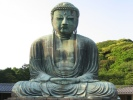

  
[Intangible Textual Heritage](../../index)  [Buddhism](../index.md) 
[Index](index)  [Previous](cob01)  [Next](cob03.md) 

------------------------------------------------------------------------

[Buy this Book on
Kindle](https://www.amazon.com/exec/obidos/ASIN/B002G99O9G/internetsacredte.md)

------------------------------------------------------------------------

  
*The Creed of Buddha*, by Edmond Holmes, \[1919\], at Intangible Textual
Heritage

------------------------------------------------------------------------

p. ix

### CONTENTS

 

|      |                                   |                           |
|------|-----------------------------------|---------------------------|
| I    | EAST AND WEST                     | [1](cob03.htm#page_1.md)     |
| II   | THE WISDOM OF THE EAST            | [20](cob04.htm#page_20.md)   |
| III  | THE PATH OF LIFE                  | [42](cob05.htm#page_42.md)   |
| IV   | THE TEACHING OF BUDDHA            | [60](cob06.htm#page_60.md)   |
| V    | A MISREADING OF BUDDHA            | [98](cob07.htm#page_98.md)   |
| VI   | THE SILENCE OF BUDDHA             | [135](cob08.htm#page_135.md) |
| VII  | THE SECRET OF BUDDHA              | [158](cob09.htm#page_158.md) |
| VIII | THE BANKRUPTCY OF WESTERN THOUGHT | [203](cob10.htm#page_203.md) |
| IX   | LIGHT FROM THE EAST               | [231](cob11.htm#page_231.md) |

 

------------------------------------------------------------------------

[Next: Chapter I. East and West](cob03.md)
