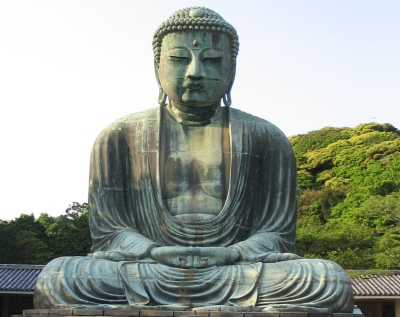

  
[Intangible Textual Heritage](../../index)  [Buddhism](../index.md) 

------------------------------------------------------------------------

[Buy this Book on
Kindle](https://www.amazon.com/exec/obidos/ASIN/B002G99O9G/internetsacredte.md)

------------------------------------------------------------------------

<table width="75%">
<colgroup>
<col style="width: 50%" />
<col style="width: 50%" />
</colgroup>
<tbody>
<tr class="odd">
<td width="50%" data-valign="TOP"></td>
<td width="50%" data-valign="CENTER"><h1 id="the-creed-of-buddha" data-align="CENTER">The Creed of Buddha</h1>
<h2 id="by-edmond-holmes" data-align="CENTER">by Edmond Holmes</h2>
<h4 id="nd-ed.-1919" data-align="CENTER">[2nd ed., 1919]</h4></td>
</tr>
</tbody>
</table>

------------------------------------------------------------------------

[Contents](#contents)    [Start Reading](cob00.md)    [Page
Index](pageidx)    [Text \[Zipped\]](cob.txt.gz.md)

------------------------------------------------------------------------

|                                                                                                                           |
|---------------------------------------------------------------------------------------------------------------------------|
|  |

Edmond Holmes, a Pantheist, reviews Buddhist theology and critiques
Western conceptions (or misconceptions) of fundamental concepts such as
Nirvana. In this book Holmes attempts to get back to the core of what
Buddha taught, not necessarily what is considered orthodox. His
interpretation is thought-provoking.

------------------------------------------------------------------------

 [Title Page](cob00.md)  
[Preface](cob01.md)  
[Contents](cob02.md)  
[Chapter I. East and West](cob03.md)  
[Chapter II. The Wisdom of the East](cob04.md)  
[Chapter III. The Path of Life](cob05.md)  
[Chapter IV. The Teaching of Buddha](cob06.md)  
[Chapter V. A Misreading of Buddha](cob07.md)  
[Chapter VI. The Silence of Buddha](cob08.md)  
[Chapter VII. The Secret of Buddha](cob09.md)  
[Chapter VIII. The Bankruptcy of Western Thought](cob10.md)  
[Chapter IX. Light From the East](cob11.md)  
