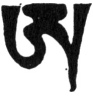

  
[Intangible Textual Heritage](../../index)  [Buddhism](../index.md) 
[Index](index)  [Previous](ettt01)  [Next](ettt03.md) 

------------------------------------------------------------------------

  
*Esoteric Teachings of the Tibetan Tantra*, by C.A. Musés, \[1961\], at
Intangible Textual Heritage

------------------------------------------------------------------------

p. 1 p. 2 p. 3

# Part I: Seven Initiation Rituals of the Tibetan Tantra

### CHAPTER ONE

### THE INITIATION RITUAL OF THE FIERCE GURU

|                    |
|--------------------|
|  |

From the Treasury of Consciousness[1](ettt02.htm#an_n_1:1.md) of the Heavenly Dharma, and among the profound
Teachings of the Whisper Succession, this is the Initiation of the
Fierce Guru, the most secret of the secret, the Four Inner Teachings
condensed in one initiation ritual.

All the practice of the Initiation of the Fierce Guru (Padmasambhava)
can be summarized into three performances.

(The preparations for the initiation by the guru:)

Instantaneously one's self becomes the Fierce Guru,

Red in color, with one face and two arms.

In his right hand, he holds a vajra,

And in his left, he holds a scorpion[2](ettt02.htm#an_n_1:2.md).

At the five parts of his body[3](ettt02.htm#an_n_1:3.md) stand the five deities in armor.

Upon the crown of his head there is a Garuda bird, the king of all
creatures.

His right arm embraces the Great Red Mother,

And he sits on the cushion of the Sun-Lotus, which is covered with the
corpse of a demon.

From the three places[4](ettt02.htm#an_n_1:4.md)
of the Father and Mother Buddha Shine forth infinite rays of light,

After they have shone on all sentient beings and blessed them,

They invite the Wisdom Buddha to come down from above,

p. 4

And all merge with him; thus the guru attains the Initiation.

*Oṃ Ah Tsiga Nitsi Namobigawadi* [\*](#fn_0.md) *Hūṃ
Au Hūṃ Pai!*

The Front Arising Buddha \[so named because arising through the power of
the Ritual Vase in front of the candidate\], the Fierce Guru, red in
color,

Has one face and two arms.

In his right hand is the vajra, in his left the scorpion.

All the wrathful adornments are complete on him.

At the five places are fixed five Skull-Rosary Holders of the Fierce
Buddha[5](ettt02.htm#an_n_1:5.md);

And in his heart-center stand the five gods with armor bright.

On the top of his head stands a Garuda bird, the king of all creatures.

In his arms, he holds the Red Mother.

He is the only director of the four
inheritances[6](ettt02.htm#an_n_1:6.md), the
wrathful one.

In all the corners and directions stand the ten wrathful ones.

In the four directions are manifest the Four Great Kings.

In his heart-center appears a thunderbolt-grasping Buddha,

Also holding the Heavenly-Iron-Made wheel of many spokes.

From the center of the wheel shines the red word *Hūm*.

The main incantation encircles the *Hūm* word.

The seeds of the retinue deities, together with the red *Hūm* word,

p. 5

Radiate the great beams of light which invite the initiation Buddhas to
descend.

For this one should render offerings, obeisance, and praise.

*Oṃ Ah Tsi Ne Tsi Name Babawadi Hūṃ Ah Pai, Ba-tsa Hūṃ Yauga Hūṃ!*

(And then repeat the foregoing prayer once more.)

The Front Arising Buddha… \[A gap in the manuscript here.\]

All the grace and blessing of the Buddhas are embodied in the Front Vase
\[which helps concentrate the power of the Gtor-ma as a Leyden-jar type
of receptacle\].

*Oṃ Ah Hūṃ Ahtsi Gani Gana moBagawadi Hūṃ Pai.*

*Au Hūṃ Pai*

The Gtor-ma instantaneously becomes the Fierce Guru,

With three faces and six arms.

The right face is white, the left blue.

Beneath is the curved knife, the skull and blood.

The vajra and the scorpion are in the two lower arms;

In his hands, he also holds the sword and the stick.

His body glows red as the burning flame.

The Six Ornaments adorn him.

He stretches one foot and bends the other;

The two feet are spread wide apart.

The five Lotus-born deities remain at the five places.

His left arm hugs the Blue Mother-Buddha.

From her heart the seed-word radiates beams of light,

Through which the Wisdom Buddha is invited to descend.

*Oṃ Ah Hūṃ Hre Ahtsi Nitsi Ganamobagawadi Hūṃ Hūṃ Pai Ah Hūṃ Hūṃ Pai.
Ba-tsa Hūṃ Yagha Hūṃ Ragsha Hūṃ*.

p. 6

(Toward the Front Vase and Gtor-ma one should practice the initiation
incantation, repeating as aforesaid. Perform the eight
offerings[7](ettt02.htm#an_n_1:7)..md)

*Oṃ Ah Hūṃ Guru Dasasariwa Ra Ahmarda Banemta Gagta Kahe Ah Gm*…

*Hūṃ!* Subdue all beings in the Three Kingdoms.

He is the Vajra, Victor over female demons, the Bhagavad,

Standing in a black-red blazing flame.

He has three eyes, wide open, angry!

His two feet, far apart as in running, trample the corpse of the female
demon;

To the scorpion holder, the Fierce Guru, I render obeisance and praise.

(Then the disciples perform the Cleansing
Ritual[8](ettt02.htm#an_n_1:8.md) and the
Mandala Offering.)

Now, I am going to relate to you a brief history of this initiation. In
the Pure Land of *A*og-min resided the Buddha
All-Perfect[9](ettt02.htm#an_n_1:9.md) with the
five Divisional Buddhas and infinite Bodhisattvas encircling him. Before
Bodhisattva Avalokiteshvara, Buddha All-Perfect urged Buddha Amida to
preach the *Tantra of the Fierce Guru*, called the *Origin of the
Light*, and to preach also the *Tantra of Expelling the Spirit of the
Prideful One*. Immediately all the devils of disease, non-men demons,
and MaSran demons became fiercely angry. They raised the
Eight-Divisional Demonic Forces as a sweeping storm. Thereupon
Bodhisattva Avalokiteshvara went before the Lotus-Born Guru
(Padmasambhava) and urged him, saying:

"This is the time to subdue the Eight Divisions of Demons in this world.
This is the time for you the Fierce Guru to display your miracle
powers."

p. 7

Thereupon the Lotus-Born transformed himself into the body of the Fierce
Guru. (He cried:)

"[*Śri!*](errata.htm#0.md) This is the roaring voice of the Great Powerful
One!  
 I now conquer you, the Eight-Divisional Demons!" \[i.e. the demons of
the eight divisions of space.\]

(By his saying this all demons were conquered.)

"After the subjugation—*Samaya Hūṃ Pai!*"

(Thus the demons were commanded to observe the precepts.)

"I am the combined body of all Buddhas, the Wrathful One!  
 Who else is more powerful than I?  
 All the potentialities of the Tathagatas converge in me.  
 I am the most powerful of the forceful ones.  
 What I desire is the hearts of the Eight-Divisional Demons!  
 What I like to eat and drink is their flesh and blood!"

With fiery anger he wrenched out the hearts of all the Eight-Divisional
Demons, and crushed them on the plain. Afterward he revived them and
said:

"When hungry I am the being who eats the flesh of the male demons. When
thirsty, I drink the blood of the she-demons. When active, I tear the
double-sexed demons to pieces."

After saying this, he ate all the hearts of the Eight Divisional Demons
who had committed sinful deeds. At the time of eclipse, he collected all
the sinful flesh and blood of the demons into a huge heap as a
sacrificial food to benefit the scorpions[10](ettt02.htm#an_n_1:10.md) and ate them all. Thereupon, the Eight-Divisional
Demons called for help and begged for forgiveness. Then he agreed that
at every eclipse time he would

p. 8

provide blood and flesh to the Eight-Divisional demons in the Three
Regions, and thereby prohibited them from killing sentient beings. In
order to prevent them from further slaughter, he gave them the Krum
Ga[11](ettt02.htm#an_n_1:11.md), the Chief
Mandala's food \[Note the personification of the mandala\]. Whoever
among the demons should break the rules, he declared, would be punished
and offered as sacrificial food to the numerous scorpions.

Thereupon, all demons assembled together to witness the flesh-adornment.
Those who had broken the rules were sent as sacrificial food to the
scorpions. The offenders all cried and begged for mercy, but to no
avail. They became frenzied and howled loudly; but they had no choice
but to walk toward their destiny. The Eight-Divisional Demons then
brought the moonlight, presented it to the fire by holding Dagiratsa
fast, and then offered it to the Krum-Ga Principal Mandala as
sacrificial food to the assembly[12](ettt02.htm#an_n_1:12.md).

At the Four Relative Times[13](ettt02.htm#an_n_1:13.md), the Eight-Divisional Demons all assembled
together by order of the Wrathful One. The Wrathful One then asked:

"Who has committed sinful deeds? Who has afflicted the sentient beings?
Who has troubled the servants of Buddhist temples? Who has offended the
precepts? Who has violated my rules?"

He then looked at the faces of the demons; those who had cheated him, he
tore apart. He uttered the Main
Incantation[14](ettt02.htm#an_n_1:14.md) of
Hayagriva[15](ettt02.htm#an_n_1:15.md) and
wielded his mental power of Thunderbolt Holder (Vajrahetu) to cut the
demons into pieces and to put all the demons who had damaged the
Buddhist religion into the Fire Sacrifice as an offering to be burned.
The troublemakers and those who had impeded the cause of Dharma—these he
made living sacrificial food

p. 9

for the scorpions. As for all those who afflicted the servants of the
temple, he used his Wheel to cut them up and his weapons to chop them
into pieces. All the sinful demons who had harmed sentient beings became
food for the scorpions. Thus he subdued all the Eight Divisions of
Demons. He bound them to the precepts, admonished them not to harm any
Buddhist and not to incite any kind of trouble. He also ordered them to
assist the servants of the temples: on the tenth of every month, they
should come before the Fierce Guru and attend the Congregation of the
Sacred Offering[16](ettt02.htm#an_n_1:16.md),
help to set in motion the Wheel of Dharma; and for the benefit of
sentient beings they should fight against those demons who make harm.

The Fierce Guru then said:

"Oh! you pitiful demons! Now, I safeguard you.  
 Though you are the lokas of Ghost,  
 Eventually you will all become the Great Blissful Body;  
 You will all become the perfect Buddha."

This is stated in the *Tantra of the Blood-Drinking Wrathful One*,
*Drag-b’o-g’rag-*a*tung-rol-b’ah-rgyud*. Though there are many different
Treasures \[sacred or revealed books\] and lineages of the teaching of
the Fierce Guru, this one belongs to the Whisper Succession of the
Heavenly Dharma Treasury.

As said in the *Sutra of the Fountain of the Noble Dharma:*

"The Bodhisattvas, the perfect Bodhisattvas, are able to procure
abundant hidden teachings from the walls, woods, caves, and from Heaven
Circles, even at a time when Buddha is no longer in the world."

The Incarnation of Buddha \[in the Tibetan youth\] Mi-gyur-rdo-rje was a
demon-subduer; this was prophesied in many Treasury Dharmas. When he was
thirteen years old,

p. 10

in the Black month of the Fowl year, he saw the Fierce Guru appear in
the forest many times. The Fierce Guru himself conferred the Tantra
instructions and practice, together with the various teachings necessary
to the Incarnation of Buddha. Therefore this teaching has the advantage
of being a near-succession one[17](ettt02.htm#an_n_1:17.md) and of possessing an unusual benevolent power
(grace). In comparison with other teachings, the teaching of the Fierce
Guru is an easier and faster way to attain the Siddhis (yogic
accomplishments) and Signs[18](ettt02.htm#an_n_1:18.md), as said in the *Tantra of the Fierce Act*
(*Drag-b’o prang-lashi-rgyud*):

"This teaching is greater than others; the Accomplishments and Signs are
also greater. If one practices this teaching for seven days, no doubt he
will attain both the Common and Superior
Accomplishments[19](ettt02.htm#an_n_1:19.md)."

If one recites ten thousand times the Main Incantations' Inner
Narration, he will be immune from sickness; if one recites it only one
hundred times, he will subdue the Ghost[20](ettt02.htm#an_n_1:20.md); if one recites it two hundred thousand times, he
will become a gem-like *Brgyal-bseng*, enlightened Master. For those
well-gifted ones, only one hundred recitations will bring all the Eight
Kinds of Demons to bow before them; they shall wear the war dress and
subjugate all evils; they shall have faith and practice devotions
continually. These various accomplishments are pledged as stated in the
aforementioned Tantra.

It is also stated in this same Tantra:

"One who practices this teaching shall attain both Common and
Super-Accomplishments. He shall become a Gem-like person as
Padmasambhava."

In the Fierce Instruction, Padmasambhava said:

"If one [continuously](errata.htm#1.md) recites the incantation, his sins
will

p. 11

gradually be cleansed and his obstacles removed; he shall never separate
from his Guru; the Buddhas in the Three Times will assemble around him
like the gathering clouds; the devas and angels will all circle around
him. His power will be great enough to spellbind the ghosts and demons;
the Eight Kinds of Demons will serve him as slaves; the ocean-like
Guards of Dharma (Samaya-Holders) will give him the knowledge of things
to come, and also will instruct him and preach to him. They will also
tell him both the good and bad outcomes. All the ghosts and spirits will
become his messengers. He can destroy his enemies and conquer hindrances
if he wishes. With one thought he can subjugate heretics. His
accomplishments are beyond measure and words. In the future life he will
be born in the Pure Land of *A*o-rgyng (the Pure Land of Padmasambhava).
The Father and Mother Guru will protect him as their own son. The merits
of this teaching are indeed inconceivable. As from all directions the
clouds gather, the rain of accomplishments will fall upon him. Is there
any teaching more profound than this? To subjugate the enemy, this is
the sharpest; to annihilate obstacles, this is the quickest. It is the
nearest way to accomplishments; the precepts are easier. The
preparations for offering are simple, the power is great, and the merits
are many.

"If one possesses this treasure, the devas and ghosts will offer him
their lives and hearts. He will influence and charm people; his
merits[21](ettt02.htm#an_n_1:21.md) will become
great; prosperity and good omens always follow him; all his wishes will
be granted; the signs of Siddhis and
performance[22](ettt02.htm#an_n_1:22.md) will
come fast; his power will be as great as
Herugas[23](ettt02.htm#an_n_1:23.md), great
enough to subdue the male and female spirits. The accomplishment is
easier and the incantation more effective. There is

p. 12

no question about the profoundness of this teaching; even those
evil-possessed monks who practice this teaching will \[overcome
themselves and attain the accomplishment of
Mahamudra[24](ettt02.htm#an_n_1:24.md). Such a
profound teaching one can hardly find anywhere else. If you do not
believe what I say, you may look for yourself.

"Hard it is to find an easy yet powerful teaching like this! Hard it is
to find an immaculate teaching like this! Hard it is to find a teaching
without a defect; one which can bestow the transcendental
accomplishments and bring forth the great powers. This teaching is the
treasury of both the mundane and transcendental accomplishments; it is a
teaching for those easy-going, leisure-pursuing seekers who are lovers
of pleasure. It is a teaching and practice for lustful seekers; and also
for those who have compassion and yearnings for serving sentient beings;
for those who want to practice Dharma as well as for those who want
power. It is a helpful teaching for lustful and fame-desiring monks to
practice; it is also a teaching for faithful and sincere disciples; for
congregation-attendants; for unrestrained and passionate yogis to
practice; a helpful teaching for credulous and enemy-despising yogis to
practice; and also for those people you should consider as brothers in
Dharma, the protectors of the Treasury.

"Yet you should spread this teaching with great caution. It should be
kept secret from both sinful and Dam Med[25](ettt02.htm#an_n_1:25.md) persons; from sophisticated and foulmouthed
persons. This teaching should not be given to skeptical and defamatory
persons; it should not be bestowed upon heretical and insincere persons.
It should not be given to the thief of Dharma or to those disciples who
do not observe the precepts. Keeping this sacred teaching from such
persons is a

p. 13

rule you should observe. You should not be idle but should cooperate
with your brothers in the Vajrayana[26](ettt02.htm#an_n_1:26.md)." So the Guru says.

Now, to obtain this profound and solemn initiation, you disciples should
follow me in reciting the following prayers three times:

"I concentrate my mind and sincerely pray to the Three
Pillars[27](ettt02.htm#an_n_1:27.md) and all
Buddhas. I pray to the Fierce Guru with his retinues. I pray that you
grant me the profound initiation."

Now follow me in reciting the Take-in-Refuge Prayer together with the
Vows of Bodhisattva in front of the Fierce Guru and all Buddhas.

"I take refuge in the Three Precious Ones;  
 I confess all my sins and evil deeds.  
 I offer my sympathetic joy for all virtues of sentient beings.  
 I pray the Buddhas and Bodhisattvas to protect me and remember me.  
 From now until the day of my attainment of Buddhahood,  
 I submit myself completely to the care of the Buddhas and
Bodhisattvas.  
 For the sake of benefiting self and others,  
 I now take the Vow of Bodhisattva.  
 As a servant I render my service to all sentient beings;  
 For the good of all beings I hope the day of Enlightenment will come
soon!"

(Recite this prayer three times and use the holy grass of the vase to
bless the disciples.)

Now you should visualize the Wisdom Buddha and follow my instruction:

Instantaneously the disciples all become the Fierce Guru:

p. 14

Three faces, six arms; the right face is white, the left blue.

The first two arms hold the curved knife and the human skull full of
blood;

Below them, the second pair of arms hold the Vajra and the scorpion;

The last two arms hold the sword and the rod.

His body is red in color, burning like fire:

Adorned with all the fierce elements he stands,

One foot stretching, the other curved.

In the Beyond-Measure Palace on his head

Sits a white Padmasambhava with one face, and two hands holding the iron
shackles,

Also adorned with various silk ornaments.

In the center of the Golden Circle in the throat

Sits a red Padmasambhava with one face, and two hands holding the iron
chain.

In the center of the Weapon Circle in the heart

Sits a purple-brown Padmasambhava with one face, and two hands holding a
wheel,

With adornments over his body.

In the six-edged center of the Dharma-producing Chakra in the navel

Sits a yellow Padmasambhava with one face, his two hands holding a rope.

In the center of the black triangle in the secret parts

Sits a green Padmasambhava with one face, and two hands holding a curved
knife.

His left arm embraces the Mother, green in color with

One face, her two arms holding the curved knife with all fierce
adornments.

From her heart the seed-word (*Śri*) radiates a great light;

p. 15

The light passes through the southwest direction of *Rgva-yab-gling*
(the Pure Land)

And falls upon the body of Padmasambhava, touching his heart.

Instantaneously, from the heart of Padmasambhava springs a Fierce Guru

With myriads of Outer, Inner, Secret, and Most Secret
Buddhas[28](ettt02.htm#an_n_1:28.md) around
him;

With great roars and sounds of thunder, they all descend here,

And, entering your body, they dissolve in you.

Thus should you visualize. Now blow the trumpet and play all musical
instruments. \[Pray thus:\] play all musical instruments.

"*Hūṃ!* The Outer, Inner, Secret, Most Fierce Gurus,

Pray come down and bless us!

Pray grant the highest Initiation to us, your faithful and well-destined
disciples;

Pray dispel the evil-persuaders and smash the hindrances to longevity.

"*Oṃ Ah Hūṃ Guru Gorda Sarva Samaya Oṃ Ba-tsa Ah We Sha Ya Ah Ah!*"
(Recite many times.)

"*Di Tsha Ban Tsar!*" (Recite to retain the Buddhas.)

Thus by the grace of the initiation, a pure foundation (for further
advancement) is laid. Now, in order to attain further initiations,
follow me and recite the following prayers:

"I sincerely pray to the Three Pillars and all Buddhas,  
 I sincerely pray to the Fierce Guru and his retinues,  
 I beseech you to grant me the Outer, Inner, Secret, and Most Secret
Initiations."

In response to this prayer, the Buddhas in front of you

p. 16

all send forth from their bodies the Outer, Inner, Secret, and Most
Secret Fierce Gurus in large and small forms, and they all enter into
you and unite with you. Thus should you visualize:

*Hūṃ!* This is the Outer Practice, the Outer Fierce Guru:

He Has three faces and six arms.

I now put his image on you, on the disciple's head;

Thus the initiation of the Fierce Guru is attained by you.

*Oṃ Ah Hūṃ Guru Gorda Ga Ya Ah Bi Di Tsa Hūṃ!*

*Hūṃ!* This is the Inner Practice, the Inner Guru:

He has three faces and four arms.

I now put his image on your, the disciple's, head;

Thus the initiation of the Fierce Guru is attained by you.

*Oṃ Ah Hūṃ Guru Gorda Ga Ya Ah Bi Di Tsa Hūṃ!*

*Hūṃ!* This is the Most Secret Practice, the Most Secret Fierce Guru:

His two arms embrace the *Yum* \[consort\], red in color.

I now put this image on your, the disciple's, head;

Thus the initiation of the Fierce Guru is attained by you.

*Oṃ Ah Guru Gorda Ga Ya Ah Bi Di Tsa Hūṃ!*

(Thereupon throw the flowers.)

*Hūṃ!* The conqueror of the Three
Kingdoms[29](ettt02.htm#an_n_1:29.md) and
demons, the Lord of all Vajras!

He is reddish-black, with his three fierce eyes wide open.

He tramples upon the body of a demon with his two feet.

May the Fierce Guru and all Buddhas grant us the Blessing!

After attaining the Outer, Inner, Secret, and Most Secret Initiations
\[the four lower tantric initiations\], one should ask for the
Initiation of Vase. The disciples are to recite the following prayers:

"I pray the Three Pillars and all Deities; p.
17  
 I pray the Fierce Guru and his retinues;  
 With sincerity and great yearning  
 I beg you to grant me the Initiation of Vase."

(The initiating guru holds the Vase in his hand.)

This Vase, in its outer symbolic aspect, is made of invaluable gems; in
its inner aspect it symbolizes the Beyond-Measure Palace made of
*Gnam-lchags*[30](ettt02.htm#an_n_1:30.md); it
is infinitely spacious. In this Beyond-Measure Palace sit numerous
Outer, Inner, Secret, and Most Secret Fierce Buddhas. From their bodies
flow out the streams of nectar which enter your body through the Divine
Gate of the head. The Great Bliss-Wheel (Chakra) of the Head, the
Dharma-Wheel of the Heart, the Transformation-Wheel of the Navel
\[related respectively to the [Sambhogakaya](errata.htm#2.md), Dharmakaya,
and Nirmanakaya, higher bodies of the buddha-state\], and all parts of
the body from the crown of the head down to the soles of the feet are
full of the blessing nectar. You should regard it thus \[as the
initiating guru holding the ritual Vase speaks\]:

*Hūṃ!* This is the *Gnam-lchags* made in the Beyond-Measure Palace

Where the Fierce Guru abides.

I now enact this for you, and place them \[these streams of nectar\] on
your head.

The Initiation of the Fierce Guru is thus given to you!

*Oṃ Ah Guru Gorda Cuba Ahbi Ditsa Hūṃ!*

Oh! by the force of this initiation, your four
hindrances[31](ettt02.htm#an_n_1:31.md) are
cleared and Four Initiations obtained; you also have attained the
capability of practicing the Four Paths, the capacity of realizing the
Four Bodies[32](ettt02.htm#an_n_1:32.md)… The
nectar continues to flow and enter your body, until the nectar is so
overflowing that it gushes out of your head and becomes

p. 18

an image of Buddha Amida, which remains on the top of your head as an
adornment.

(Sprinkle the holy water over the disciples, and throw the flowers.)

*Hūṃ!* The Lord who conquers the Three Kingdoms…

He is reddish-black…

He tramps upon the body of a demon…

May the Fierce Guru and all Buddhas grant us the blessing!

(Recite the prayer of benediction as before.)

Now follow me in reciting the prayers for the Initiation of Symbols.

(The guru holds the Thunderbolt in his hand.)

This is the Nine-Spoked Thunderbolt of the Fierce Guru, made of
*Gnamlchags*, and with the Buddhas on its prongs.

*Hūṃ Gu Rum Gu Phi!*

This Thunderbolt has nine perfections; the fire of wisdom burns within
it. By obtaining the Initiation of this Vajra, the eight-four-thousand
kleśas will all be destroyed. No one will be able to harm you if you
attain this Initiation. You will achieve the stability (of meditation).
You shall therefore contemplate the Vajra Principle; the transcendental
Wisdom of the Voidness.

*Hūṃ!* This is the Symbol of the Hand of the Fierce Guru,

The Gnam-lchags-made Thunderbolt!

I now place it on your head;

Thus, you are given the Initiation of the Fierce Guru.

*Oṃ Ah Hūṃ Guru Gorda Ba-tsa Ah Bi Ditsa Hūṃ!*

(Thereupon the Guru holds the sword.)

Now, I shall grant you the Initiation of the Symbol of the
Wisdom-Sword[33](ettt02.htm#an_n_1:33.md) of
the Fierce Guru. This Wisdom

p. 19

\[paragraph continues\] Sword can cut the
inner Clinging of Ego and also cut off the gates of Saṃsara. You should
therefore be granted the Initiation of the Wisdom Sword.

*Hūṃ!* This is the Hand Symbol of the Fierce Guru, The blazing Sword of
Wisdom.

I now place it on your head;

Thus, to you is given the initiation of the Fierce Guru.

*Oṃ Ah Guru Gorda Dani Ahbi Ditsa Hūṃ!*

(Thereupon, the Guru holds the Curved Knife.)

Now another Hand Symbol of the Fierce Guru, the Gnam-lchags-made Curved
Knife. This, the wild thunderbolt, symbolizes the Five
Wisdoms[34](ettt02.htm#an_n_1:34.md) of Buddha.
It has a five-ribbed thunderbolt handle. Because the nature of being is
away from playwords[35](ettt02.htm#an_n_1:35.md) the center part of the knife is broad; to
elucidate the sole oneness (of the absolute truth) it has one sharp
blade. By merely attaining the Initiation of this Symbol, one is able to
realize the nature of being which is away from playwords; thus he
attains the Five Wisdoms of Buddha and is able to annihilate the
eighty-four thousand kleśas. Thus should you think.

*Hūṃ*! This is the Hand Symbol of the Fierce Guru,

The Thunderbolt curved-knife.

I now place it on your head;

Thus, to you is given the Initiation of the Fierce Guru.

*Oṃ Ah Guru Gorda Gida Ahbi Ditsa Hūṃ!*

(Thereupon the Guru holds the scorpion \[usually only a picture\] in his
hand.)

Now, another Hand Symbol of the Fierce Guru, the transformed
Gnam-lchags-made scorpion. It has nine heads, nine mouths, nine eyes,
nine stings. The right sting touches the top of the universe, the left
one touches the bottom of the earth. The body flames with the fire of
hell.

p. 20

\[paragraph continues\] By merely touching
the scorpion to your head, all the sins, obstacles, mishaps, and
demon-enemies of your body, mouth, and mind are all hungrily swallowed
by this scorpion. From now on, all the demons and enemies who attempt to
afflict you will only re-afflict themselves. They will all be subdued by
you. Thus should you think.

*Hūṃ*! This is the Hand Symbol of the Fierce Guru,

The heaven-made scorpion with nine heads,

I now place it on your head;

Thus to you is given the Initiation of the Fierce Guru.

*Oṃ Ah Guru Gorda Racha Ah Bi Ditsa Hūṃ!*

(Thereupon the Guru holds the human skull in his hand.)

This is another symbol of the Fierce Guru, the Wisdom-Ga-ba-la (human
skull) with the adorned metal cover (adornment) on it. This skull is
filled with the cardinal heart-blood of the just-slaughtered Four
Demons. By attaining this Initiation of Skull, you will be able to
realize the truth of the Wisdom of Non-Existence; the Five
Poisons[36](ettt02.htm#an_n_1:36.md) will
naturally be dissolved into the universal essence (Dharmadatu); the
blood-ocean of Saṃsara will thus be dried up. You should now think of
these merits.

*Hūṃ!* This is the hand-symbol of the Fierce Guru,

The heaven-made Human Skull.

I now pray to the Fierce Guru and his retinues and all deities,

With my deepest sincerity and concentration I pray thee: Grant me now
the Inner Initiation.

Moved by your sincere prayers, the Father and Mother Fierce Guru bring
forth a sound of agreement, by which all the Buddhas and the Three
Pillars are invited to descend here. They all enter into your mouth and
become

p. 21

the nectar-like Bodhi Heart[37](ettt02.htm#an_n_1:37.md) (absorbed in you). By embracing this Ga-ba-la
\[skull\] and touching it with your head you cause the nectar to flow
out from it; the stream of nectar enters into your body from the divine
head-opening[38](ettt02.htm#an_n_1:38.md) until
the nectar fills every part of your body. By the power of this nectar, a
burning-like blissful feeling and warmth is generated within you; thus
the Initiation of Wisdom[39](ettt02.htm#an_n_1:39.md) is attained by you. You should meditate on this
teaching. Thus you will attain also the Precious Initiation of
Longevity. (Thereupon, the Guru holds the Nectar \[in the skull\] in his
hand.)

*Hūṃ!* This is the Non-Outflow[40](ettt02.htm#an_n_1:40.md) nectar!

I now place it on your head;

Thus the Initiation of the Fierce Guru is given to you.

Hoping that with little effort you will attain the

Three Bodies of Buddha.

*Oṃ Ah Guru Gorda Ahmer Daga Ya Waga Tsi Tsa Sarva Ahbi Ditsa Hūṃ!*

(Throw the flowers.)

*Hūṃ!* The Lord who conquers the Three Kingdoms—

He is reddish black—

He tramps upon the body of a demon—

May the Fierce Guru and all Buddhas grant us the blessing.

(*Recite the prayer of benediction as before*.)

Now, although the main section of the Initiation is completed, a Gtor-ma
initiation still is to be given; because it is said that if the
Initiation of the Gtor-ma is not received, there will be delay and
difficulties in attaining the Mundane \[or lesser\] Siddhis.

Though you have attained the main Initiation, however, if you do not
have the Initiation of the Gtor-ma, the mundane

p. 22

accomplishment will be delayed, therefore we should perform the
Initiation of the Gtor-ma.

This Gtor-ma is identical with the Fierce Guru and all Outer, Inner, and
Secret Buddhas. They all assemble here like the gathering storms, with
great power and roaring sounds. By dint of my sincere prayer they all
vaporize (melt into light) and enter into the body through the divine
Head-opening. The Fierce Guru's body, mouth, and mind become one with
yours. In this mood, you should repose your mind in the non-active and
relaxed state. (This is the essence of the Teaching of Mahamudra.)

I pray the Dharmakaya Buddha Amida, the Sambhogakaya the All-Merciful
One, the Nirmanakaya Padmasambhava. I pray the Outer, Inner, Secret, and
Most Sacred Fierce Mother and Father Gurus. I pray the Sow-Mother of the
Three Lineages; I pray the Fierce Manjuśri, the great Yama, the Lord of
the Fierce Hayagriva, the Powerful Vajrapani, the transformation body of
the Mother of Music: the Fierce Black Mother, the
Accomplishments-bestower, the Burning Fierce Afflicter white and black,
the dragon subduer Great Eagle, the Fierce Vajra, the Fierce Jewels, the
Fierce Lotus, the Fierce Accomplishments, the upper Fierce Hūṃ Gara, the
east Fierce Victors, the southeast Fierce Blue Club Holder, the north
Fierce Yama, the southwest Fierce Fire Refuge, the west Fierce King
Hayagriva, the northwest Fierce Inconquerable, the north Fierce Demon
Holder, the northeast Fierce Three Kingdom Winner, the lower
Great-Power-Fierce One, the Four Great Guards of the Gate, the
Illumination Holder Fierce Gurus and all Deities—to all of you I pray. I
pray you to bestow the initiations to these disciples and to grant them
your grace. I pray you to protect them from the detriment

p. 23

of Chal Sen, Dam Si, and Eight-Divisional Demons; also protect them from
injury, nervous malady, madness, ulcers, and all illness and diseases. I
pray you to expel the damaging power of wicked ghosts, the inducements
of the Misleader, and possible harms done by evil spirits. I pray you to
protect these disciples’ body, mouth, and mind; grant them shelter, and
hide them.

*Oṃ Ah Hūṃ Shri Ahtsiga Netsiga Namo Baghawade Hūṃ Hūṃ Pai Ah Hūṃ Hūṃ
Pai Ba-tsa Hūṃ Hūṃ Pai Ba-tsa Hūṃ Yaga Hūṃ Ragsha Hūṃ Oṃ Ahtsiga Nitsiga
Namo Bagawade Hūṃ Ah Pai Ba-tsa Hūṃ Yacha Hūṃ Racha Hūṃ Oṃ Ahrtsiga
Netsiga Namo Bhagawade Hūṃ Ah Hūṃ Pai Gaya Waga Tsida Ba-tsa Racha,
Racha!*

(Throw the flowers.)

*Hūṃ!* May all the Gurus and all the Buddhas in the past, present, and
future

Grant us the blessing and prosperity through their body, mouth, and
mind.

May all the accomplishments be granted to us. May all the tutelary
deities fulfill all our wishes.

May all Mother Guards destroy all malicious enemies. May the Ocean-like
Oath-Holders bestow happiness and prosperity.

These are the Outer, Inner, Secret, and Most Secret Initiations of the
Fierce Guru given one by one in a concise manner. This initiation is a
profound yet symbolic one. Though it is not very clear in the
distinction of the Four Successive Initiations, it has the implied
meaning of the Four Initiations. Therefore you may consider that by it
you have obtained all of the four
initiations[41](ettt02.htm#an_n_1:41.md).

The teaching of the Fierce Guru in other sects than this one is
generally perilous, for, if one does not practice the

p. 24

\[paragraph continues\] Peaceful
Incantation of Padmasambhava for a long period, or does not recite it in
a great amount, one will be liable to excite the enmities and troubles
and see many frightening visions. However, this teaching is different.
Because the Outer Practice and Secret Practice of this teaching are
amalgamated with each other, it is safe yet powerful; even beginners can
practice it.

As for the advantages of reciting the invocation of the Fierce Guru, the
Guru Padmasambhava himself said: "If one wants to receive the special
grace from Buddha and achieve the accomplishments fast, he should then
practice the meditation of the Fierce Guru. I have all the merits that
the Buddhas have. The outer and inner incantations of the Fierce Buddha,
the blessing and siddhi of all male and female
Sky-Travelers[42](ettt02.htm#an_n_1:42.md), the
jewel-like virtues and benefits are all found in me. If one merely
practices my meditation and prays to me, he will see all Buddhas and
Bodhisattvas; he will achieve all the Outer and Inner accomplishments of
Tantra; he will be able to give the blessing of initiation and
accomplishments to others; the female Guards will gather around him; all
the protectors of Dharma will serve him as ushers; his orders will be
obeyed; his instructions will be carried out by the Guards. Solely by
practicing this teaching and meditating on me one will attain all the
merits and accomplishments. By prayer and meditation on me, one will
achieve his wishes."

This is the essence of meditation practice,

This is the teaching of the Fierce Guru.

It is blessed by all the Buddhas,

And blessed by all Outer and Inner Deities of Mandalas.

It is the concentration of the powers of all Buddhas.

If one recites the incantation one hundred times,

p. 25

He will be cleared of the evil sins and hindrances.

If one recites the incantation one thousand times,

He will be delivered from the outer and inner obstacles.

If one recites the incantation ten thousand times,

He will dominate the Eight-Divisional Demons.

If one recites the incantation one hundred thousand times,

He will attain the transcendental accomplishment.

By merely hearing the name of the Fierce Guru and thinking of it,

He will be protected from the evil spirits.

You should recite the incantation and practice this meditation. Now
follow me in reciting the following prayer:

Whatever the admonishments our master has given to us,

We will follow and obey and practice.

From this moment on, please, always remember us!

I offer you my whole being and all my possessions,

Pray have pity on me and consider me as your disciple!

Pray be my shelter and refuge at all times!

At the ending of this Initiation ceremony, the disciples should offer
the Mandala \[and say\]:

*Samaya Cha Cha Cha Chawa Gudaya!*

The foregoing initiation practice was given by the incarnation lama,
Mi-rgyur-rdo-rje, the Immutable Vajra. When he was thirteen years old,
on the tenth day of the Black Month of the Fowl Year, he actually
appeared (before the eyes of the people) as the Fierce Guru
Padmasambhava himself, with all adornments and dressings. The Outer,
Inner, Secret, and Most Secret Initiations are usually to be given
separately and practiced separately; however, it is said, in some
special occasion the Guru may put all four

p. 26

initiations into a condensed one. This teaching is revealed from the
treasury after a well-prepared sacrificial ceremony.

If [\*](#fn_1.md) there is any mistake or error in
this work, I beg the forgiveness and pardon from the Guards and Deities.
By the merits of carrying out this work, I hope that the tradition of
the Treasury Finding will be growing, that the Treasury Finders will
have no obstacles, and that all sentient beings will gain great benefits
and happiness.

p. 27

##### NOTES

[1](ettt02.htm#an_r_1:1.md). The treasures of
Wisdom recorded in universal consciousness, to which access can be had
by enlightened beings such as the original author of these texts,
Mi-rgyur-rdor-rje.—*Ed*.

[2](ettt02.htm#an_r_1:2.md). The scorpion
represents both sin and the demonic forces which tried to prevent
Padmasambhava from introducing the teachings of the true Dharma into
Tibet. As the Fierce Guru grasping the scorpion, Padmasambhava manifests
his power and triumph over both the immoral and irrational forces of the
universe.

[3](ettt02.htm#an_r_1:3.md). The five Chakras or
psychic centers in the human body.

[4](ettt02.htm#an_r_1:4.md). The psychic centers
in the forehead, throat, and heart.

[5](ettt02.htm#an_r_1:5.md). Another name for
the Fierce Guru.

[6](ettt02.htm#an_r_1:6.md). The reference is
not clear but probably refers to the four lineages of Buddhism: the
Sravakayana, teachings for Gotama Buddha's direct disciples;
Pratekayana, for those who realize the truths of Buddhism intuitively
through their own efforts; Bodhisattva teachings, for those aspiring to
Buddhahood; Tantricism, for those following the esoteric doctrines.

[7](ettt02.htm#an_r_1:7.md). Eight Offerings:
incense for burning; powdered incense for rubbing the body; lights
(candles); fruits; flowers; food; music; and water.

[8](ettt02.htm#an_r_1:8.md). Cleansing Ritual: a
special incantation which is used to purify the mandala.

[9](ettt02.htm#an_r_1:9.md). Buddha All-Perfect;
a reference to the Adi Buddha who, according to a tradition of the Red
School, was the first human being to become enlightened (here, tradition
diverges from the orthodox view of the Adi Buddha).

[10](ettt02.htm#an_r_1:10.md). Scorpions;
swallowers of evil.

[11](ettt02.htm#an_r_1:11.md). Krum-ka:
transcendental sacrificial food.

[12](ettt02.htm#an_r_1:12.md). This is an
enigmatic statement; the text is not explicit.

[13](ettt02.htm#an_r_1:13.md). The four seasons
comprise the greater circle or wheel of time, while the divisions of
sunrise, noon, sunset, and midnight form the lesser wheel. The meaning
and observances connected with these times i4 highly important in the
practice of Tantricism.

[14](ettt02.htm#an_r_1:14.md). Before beginning
any Tantric practice, it is customary to recite incantations to dispel
any untoward influences.

p. 28

[15](ettt02.htm#an_r_1:15.md). The Tibetan
transliterates the Sanskrit *v* as *w*, since the Tibetan alphabet does
not possess a *v*. We have reinserted y as the correct spelling of this
important name. *Ed*.\]

[16](ettt02.htm#an_r_1:16.md). Congregation of
the Sacred Offering: the 10th of the month, according to the lunar
calendar, is considered a particularly auspicious time for those
practicing Tantric yoga to congregate, make offerings to the angels and
deities, and receive the grace-waves necessary for success in their
practices.

[17](ettt02.htm#an_r_1:17.md). An important
Tantric tradition is that an esoteric teaching should have a "warm" or
"close" succession to be most effective. If the teaching is handled too
long by humans it becomes "cold" losing its initial strength to transmit
power. This particular initiation ritual was revealed to the incarnation
lama, Mi-rgyur-rdo-rje. A close disciple of his recorded it sometime
later.

[18](ettt02.htm#an_r_1:18.md). Evidence of
mystical development.

[19](ettt02.htm#an_r_1:19.md). Common =
worldly; Superior = transcendental. See footnote 28, Chapter IV.

[20](ettt02.htm#an_r_1:20.md). According to
Tibetan [traditions](errata.htm#3.md), ghosts and demons manifest through
the negative (Yin) aspect of universal forces while human beings belong
to the positive (Yang) aspect of such forces. For this reason, ghosts
and demons are much more likely to be seen in Tibet and other
little-populated regions where their manifestation is not blotted out by
the positive auras from large aggregations of human beings.

[21](ettt02.htm#an_r_1:21.md). All virtues and
fortunes.

[22](ettt02.htm#an_r_1:22.md). Miracle powers.

[23](ettt02.htm#an_r_1:23.md). Tantric Buddhas.

[24](ettt02.htm#an_r_1:24.md). Mahamudra (The
great Symbol): A Tibetan teaching, analogous to Chinese Zen, which seeks
enlightenment directly through realization of the "pure essence of
mind." \[A more correct meaning, without the intellectualistic flavor of
"mind" would be given by "pure essence of consciousness."\]

[25](ettt02.htm#an_r_1:25.md). Oath-breakers.

[26](ettt02.htm#an_r_1:26.md). The Tantric
(esoteric) Brotherhood, [analogous](errata.htm#4.md) to the Sangha
(exoteric) Brotherhood of general Buddhism.

[27](ettt02.htm#an_r_1:27.md). Tibetan
*Rtsa-wa-gsums;* can be translated as *Three Pillars* or *Three
Foundations*. (1) Foundation of Blessing, from one's

p. 29

personal Guru. (2) Foundation of Accomplishment, from practicing the
yoga of a tutelary deity. (3) Foundation of Career, through appeals for
guardianship and protection in wordly affairs from special "guardian
deities" such as Mahakala.

[28](ettt02.htm#an_r_1:28.md). The Buddhas of
the four types of initiation.

[29](ettt02.htm#an_r_1:29.md). Three Kingdoms:
World of Desire, World of Form, World of the Formless.

[30](ettt02.htm#an_r_1:30.md). Gnam-lchags;
"falling from heaven" or "heaven-made." According to tradition certain
ritual objects made of heavenly material are allowed to fall upon the
earth, where they are discovered and venerated. The Vajra or thunderbolt
of the Fierce Guru, referred to subsequently in the text, is one of
these objects.

[31](ettt02.htm#an_r_1:31.md). Sometimes called
the four devils: illness; interruptions; kleśas; death.

[32](ettt02.htm#an_r_1:32.md). The Trikaya body
of Buddha plus the Dharmadhatu (universal body).

[33](ettt02.htm#an_r_1:33.md). The sword,
representing the sharp cutting power of discrimination, is always of
Wisdom in the hands of Manjuśri.

[34](ettt02.htm#an_r_1:34.md). Four of these
Wisdom Accomplishments of the Buddha are: Wisdom of Performance, of
Observation, of Equanimity, of the Great Dharmadhatu Mirror. This fourth
one has some bearing also on the Tantric.

[35](ettt02.htm#an_r_1:35.md). *Playwords:* the
affirmative, arbitrary, limited notions of human beings which might be
represented as a long, sharp-pointed knife. In contradistinction to
these concepts, the all-inclusive enlightened view of reality is
symbolized by a knife whose blade is broad and well-rounded (curved).

[36](ettt02.htm#an_r_1:36.md). The Five
Poisons: the five kleśas.

[37](ettt02.htm#an_r_1:37.md). Tantricists
borrow and adopt exoteric Buddhist terminology for their own purposes.
Originally Bodhi-heart referred to a special quality of devoutness;
here, however, in connection with the nectar, it means fluid or
secretion—source of energy and compassion.

[38](ettt02.htm#an_r_1:38.md). Crown of head.

[39](ettt02.htm#an_r_1:39.md). The third type
of initiation; the first two being Initiation of

p. 30

\[paragraph continues\] Vase and Inner
(Secret) Initiation. The fourth initiation is that of Mahamudra.

[40](ettt02.htm#an_r_1:40.md). The universal
process in Saṃsara is a process of reciprocal interchange of energies in
which nothing in the universe can maintain its energy very long but must
lose it or have it renewed. In the world of Saṃsara everything
"leaks"—is filled only to become empty again; there exists not stability
or true "conservation of energy."

[41](ettt02.htm#an_r_1:41.md). The translator
is very skeptical and critical about this statement, unless the teaching
of the third and fourth initiations are given separately in a secret
manner.

[42](ettt02.htm#an_r_1:42.md). *Sky Travelers:*
Tib. Db’a-wo or Mka-*a*gro. \[Usually Mka-*a*gro-ma. This term refers to
goddesses or accomplished yogis who without effort can traditionally
traverse whole mountain ranges and travel in both the physical skies and
the heights of consciousness. *Ed*.\]

------------------------------------------------------------------------

### Footnotes

[4:\*](ettt02.htm#fr_0.md) "In the name of the
Lord." This expression, in varying states of orthographical corruption,
occurs throughout the mantric liturgies of the MS. *Ed*.

[26:\*](ettt02.htm#fr_1.md) From now to the end of
this concluding section it is the original compiler and amanuensis of
the teachings of Mi-rgyur-rdo-rje who speaks to us personally. See pp.
9-10. *Ed*.

------------------------------------------------------------------------

[Next: Chapter Two: The Initiation Ritual of the Fierce Guru With
Phurba](ettt03.md)

