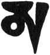

  
[Intangible Textual Heritage](../../index)  [Buddhism](../index) 
[Index](index)  [Previous](ettt03)  [Next](ettt05) 

------------------------------------------------------------------------

  
*Esoteric Teachings of the Tibetan Tantra*, by C.A. Musés, \[1961\], at
Intangible Textual Heritage

------------------------------------------------------------------------

p. 48

### CHAPTER THREE

### THE INITIATION RITUAL OF THE ALL-MERCIFUL ONE[1](ettt04.htm#an_n_3:1)

|                    |
|--------------------|
|  |

Obeisance to Guru Devadike.

Pray grant me all Siddhis *Hūṃ!*

This is the Fourth Initiation \[of the Tantric Scheme\], the Initiation
of the All-Merciful One.

The Mandala should be arranged as before[2](ettt04.htm#an_n_3:2). The Gtor-ma should be made as the pomegranate in
shape and placed in the center of the Mandala. On the right side a glass
rosary is placed; on the left side three fossil shells; in the front
many precious ornaments; on the west side a white vase bound with
ribbons. On the top of the Gtor-ma, the
Tsag’li[3](ettt04.htm#an_n_3:3) is installed.

(The aforesaid articles are arranged in preparation for the ceremony. At
the time of performing the Initiation, the Vase Ritual and Gtor-ma
Ritual may be performed according to the general rules. In the
preparation practice for the Initiation, the guru should meditate on the
proceeding once: visualize the Self, Front, and Vase as all
instantaneously united with the Wisdom Ones[4](ettt04.htm#an_n_3:4), and recite the incantation not less than one
hundred times. If one wants to practice a more comprehensive and
elaborate ceremony, he should perform the Three
Purifications[5](ettt04.htm#an_n_3:5).)

One should visualize as follows:

In front of me is the Vase-Buddha[6](ettt04.htm#an_n_3:6), the All-Merciful One.

He is white in color with four arms and one face.

He folds his two palms together with his central arms.

p. 49

The two outer arms hold separately the lotus and the rosary.

His two feet join together in the Diamond Sitting
Posture[7](ettt04.htm#an_n_3:7).

All the precious ornaments adorn his body.

Robed in magnificent clothes of silk,

He sits solemnly on the cushion of the Lotus-Moon.

*Oṃ Ma Ni Be Mi Hūṃ*, the All-Merciful One is here!

*Sa Ma Ya, Jia Jia Jia!*

Recite and visualize as follows:

In the heart-center of the Vase-Buddha before me, there is a white word,
[*Śri*](errata.htm#7) standing straight on the moon disc and encircling
the *Śhri* clockwise are the Six Words. From these Words emanate rays of
light shining into the ten directions. Among all the Bodhisattvas, the
rays of light choose the All-Merciful One and entreat him, with all
Buddhas and Bodhisattvas, to descend here. Because the All-Merciful One,
Avalokiteśvara, is extremely compassionate. He is the special tutelary
Buddha of Tibet. Practicing his meditation makes it easier to attain the
grace of bliss. He is nearer to us than other Buddhas. Padmasambhava
said, "In the time of defilements, Avalokiteshvara is the most
compassionate one. Especially to us, the Kham
Pa[8](ettt04.htm#an_n_3:8), the Six Words of
Incantation are most beneficial and appropriate. The All-Merciful One,
His Holiness Avalokiteśvara, is the intimate patron deity of the Snow
Country[9](ettt04.htm#an_n_3:9). His Dharma,
especially, has a close affinity to the people of Kham. Therefore, in
the region of Kham, one sees that men and women alike all recite the Six
Words Incantation diligently." This was prophesied by Padmasambhava
himself.

About the benefits of remembering and meditating on

p. 50

the All-Merciful One, *The Thousand-Arms-and-Thousand-Eyes-True-Words
Tantra* says, "If one takes the initiation and recites the incantation
of Avalakiteśvara, his sins will all be cleansed and his obstacles
removed. He will obtain the infinite
merits[10](ettt04.htm#an_n_3:10); after his
death he will go to the Pure Land (of Buddha Amida)." In *The Sutra of
the Ten Countenances*, one reads, "The All-Merciful One himself said,
'If one think of me and call my name, whatever his wishes may be, all
will be granted. All injuries to him will be prevented, sins and
hindrances will be obliterated; all his fears will be conquered. This
man is liberated from the evils and obstacles, and well protected under
my shelter. His merits and talents will be promoted. He is hid from all
ominous signs and afflictions.'"

In *The Various-Winds-and-Waters Sutra* (*Chu-rlung-snga-tsogs-mdo*) it
is also said, "In the future time, any good man or good woman who has
heard the merits of the All-Merciful One will gradually exhaust his or
her kleśas; the Great Five Unceasing Sins and their like will be
exhausted. If one has nothing in his mind but the All-Merciful
One[11](ettt04.htm#an_n_3:11) and meditates
on the merits of Avalokiteśvara for only one month, he will be able to
see the All-Merciful One as well as Buddha Amida face to face. He will
thus never regress on the Path of Bodhi[12](ettt04.htm#an_n_3:12). He will recollect his lives in the past, follow
the teachings he has heard, and wherever he is born will corn across
Dharma. He will never depart from Buddhism, and will attain great wealth
and enjoy great happiness. Wherever he stays no demons nor illness can
seriously harm him."

The *Magnificent Casket Sutra* states: "Gotama Buddha says, 'Whoever
thinks of Avalokiteshvara will attain to happiness; he will be freed
from the sufferings of birth,

p. 51

age, illness, and death. He will go to the happy Pure Land to see Buddha
Amida. Those devoted to the All-Merciful One will have no Samsaric
sufferings in their bodies, no leśas in their minds; hunger and thirst
cannot threaten them, nor will they undergo ordeal in the womb. With
sincere devotion growing in their hearts, they will then be born in the
lotus[13](ettt04.htm#an_n_3:13). Those
relying on the Victorious Master Avalokiteshvara to be their tutelary
Buddha will always be able to go to Buddha's paradise and remain
there.'"

The benefits and profit of the Six Sacred Words are thus stated in *The
Sutra of the Hundred-and-Eight Symbols:* "Tathagata Buddha says, 'Those
good men and good women who contemplate Avalokiteshvara and recite the
Six Sacred Words: *Oṃ Mani Padme Hūṃ*, will never fall into the lower
Lokas or the Unceasing Hell. Whoever takes this incantation in his mind
and recites it with sound, his body becomes immune from leprosy, ulcer,
Bra Gyan and Bas Lhag diseases[14](ettt04.htm#an_n_3:14), tuberculosis, asthma, and all kinds of disease.
Immediately after death, he will be born in the Happy Pure Land.
Wherever he is born he will never be separated from the All-Merciful
One.'"

Again, *The Magnificent Casket Sutra* states: "The Majestic Red Buddha
says, 'That good man or good woman who recites these Six Sacred Words
will attain the following benefits: his valor and spirit will never
diminish, his wisdom will grow, he will become a man with great
compassion and kindness, he will complete the Six
Paramitas[15](ettt04.htm#an_n_3:15) in his
everyday activity. He will become the King of
Turning-the-Mystic-Holding-Wheel[16](ettt04.htm#an_n_3:16). He will become a Bodhisattva of Non-Regression.
He will eventually attain the perfect, peerless Buddhahood.'"

This initiation practice was revealed by Buddha Amida

p. 52

to His Holiness Mi-rgyur-rdo-rje in the (year of the) Fire Monkey,
Dragon Month, when he was twelve years old. This initiation was bestowed
upon me \[the original lama-scribe. *Ed*.\] by two Living Buddhas;
therefore it is a very recent late and close one with great blessing
power. Dakinis[17](ettt04.htm#an_n_3:17)
vowed to give special protection to this instruction. Therefore,
together with sincerity and respect you should feel happiness and joy
for this opportunity.

The guru says, "You should think that I and the Initiation Symbols are
the real embodiment of Avalokiteshvara. With this confidence and
devotion follow me in reciting the following prayers:

"I pray to all the Buddhas in the past, present, and future.

Especially I pray to the All-Merciful One!

I pray thee to grant me the invaluable Initiation!

I take refuge in the Three Precious Ones.

I confess to you all the sinful deeds I have done.

I raise my sympathetic joy unto all merits and virtues of the sentient
beings.

Forever I shall bear the Three Precious Ones in my mind,

From now on till the time of my attaining the Buddhahood,

I devote and submit myself, my whole being, to all Buddhas!

For the sake of benefiting self and others,

I hereby take the oath for the Devotion for
Bodhi[18](ettt04.htm#an_n_3:18).

After the growing of the Heart for Bodhi,

I render my service to all beings as a humble servant.

With joy and vigor I practice the Action of Bodhi.

In order to benefit all the sentient beings,

I sincerely pray the day of my attaining Bodhi will come soon!"

p. 53

(Repeat not less than three times, using Ku Sha grass to bless the
disciples.)

Now, the disciples should practice the visualization of the Arising
Buddha. Follow my instructions and visualize them. (The guru reads
loudly and slowly.)

"All of you become Avalokiteśvara, the All-Merciful One.

His body is white in color and he has only one face.

His four arms are poised in the following manner:

The palms of the two center arms are folded together.

One arm holds a rosary, and one holds a lotus branch.

The two feet entwine in the Diamond Sitting Posture.

The rare ornaments adorn his body.

Arrayed in silks, he sits solemnly on the cushion of the Sun-Moon-Lotus.

"In such manner you visualize the Arising Buddha. Now you should
meditate on the three places from which to draw the wave of grace and
blessing:

"Visualize in your forehead a white *Oṃ* word standing straight;

A red Ah word stands in the forepart of the throat;

A blue *Hūṃ* word stands in your heart.

In the very center of your heart is a moon disc;

Upon the white moon disc stands a white *Śri* word.

The Six Sacred Words circle the *Śri* word.

Because of inviting the Wisdom-Buddha to come here,

From the *Śri* word emanate infinite rays of light.

These rays of light shine forth to the Pure Land of Happiness,

Also shining forth south toward the Holy
Potala[19](ettt04.htm#an_n_3:19).

There by numerous forms of Avalokiteśvara, big as mountains, small as
mustard seeds,

p. 54

With the Six Sacred Words, and the white *Śri* word in their bodies,

As snow falling, they all descend here.

They enter your body like the rainfall and penetrate deep in you."

(Play all musical instruments. All chant in rhythm.)

"*Hūṃ!* I think, I think of the All-Merciful One!

Listen! the All-Merciful One and Buddhas rise up,

From the Great Place of the South the Buddhas arise!

With retinues and assemblies they descend here.

Well dressed is the crown of the head,

The precious ornaments are as glossy as sun rays.

Accompanied with music and dance, you come here.

Your grace and blessing are beyond human apprehension.

Without any closefistedness, you grant us the Siddhis.

From the great place full of wonder,

With an unlimited compassion you come down here.

I pray thee with my utmost sincerity and yearning

Grant me your grace and blessing!

Pray thee, embrace me in your care under your boundless compassion!

Pray look after me and bestow on me the Siddhis.

Come here, thou gracious one!

Safeguard me, you compassionate one!

Oh, father Guru himself is the All-Merciful One!

To whom I pray with one single thought (concentrated attention).

May all the wishes of ours be granted!

*Oṃ Ah Hūṃ Śri Svaha! Oṃ Mani Padme Hūṃ! Be Tsa Ah Bi Sha Ya Ah Ah!*"

(Play musical instruments; then place the Vajra on the

p. 55

head. Visualize the Wisdom Buddha becoming steady.)

*Di Tsha Be Tsa!*

(Hold the vase in hand and read the following words.)

*Hūṃ!* the Beyond-Measure Palace

Where the All-Merciful One and his retinue abide,

Whereby the Four Initiations of Vase I wish to attain.

(Place the symbol on disciple's head.)

*Oṃ Mani Be Mi Hūṃ Ga La Shu Kura Sar Jia, Tsa Tu Ah Bi Di Tsa Hūṃ!*

(Give the water in the Vase to disciples and let them drink it. Then
hold the Gtor-ma in hand and read as follows.)

*Hūṃ!* This Gtor-ma itself is the embodiment of Avalokiteshvara.

His myriad retinues are also contained within it.

To you my disciples, the Four Initiations of Avalokiteshvara

Are now completely being given!

I pray Buddha Amida, the Dharmakaya,

I pray Bodhisattva Avalokiteshvara, the Sambhogakaya,

I pray the teacher Padmasambhava, the Nirmanakaya,

I pray the Dakini and the Victorious Ocean Wisdom,

Ye-shes-mtsho-rgyal,

I pray the twenty-eight followers and one-hundred-and-one Treasure
Finders,

I pray all accomplished Illumination
Holders[20](ettt04.htm#an_n_3:20).

Pray the All-Merciful One, Lord of [Transiency](errata.htm#8), One with
the Eyes of Compassion,

Mighty being! Also pray all the accompanying holy beings to bless this
disciple of Diamond Vehicle, and grant them the Initiation!

p. 56

Pray to cleanse the Hindrance of Passion, Hindrance of
Knowledge[21](ettt04.htm#an_n_3:21), and all
Habitual Thinking for them forever!

Pray forever close the gate of Sanmara and Lower Path for them!

Pray bestow your gracious blessing to them and deliver them to the West
Pure Land at the moment of their departure!

*Oṃ Mani Padme Hūṃ! Gaya Waga Tsida Sarva Ahbi Aitsi Hūṃ!*

(Recite this incantation three times. Hold the image in hand and read.)

*Hūṃ!* Pray the All-Merciful One and his accompanied Deities,

Grant you, the disciples, the complete Four Initiations.

(Place the image on the disciple's head.)

*Oṃ Mani Padme Hūṃ Gaya Ah Bi Ai Tsa Hūṃ!*

(Holding the Vase, Vajra, rosary, and conch in hand read the following
prayers.)

*Hūṃ!* Pray the All-Merciful One grant you, the well-destined disciples,
the Initiation of Body, Mouth, and Mind.

*Oṃ Mani Padme Hūṃ, Gaya Waka TsiDa Kica Ah Bi Ai Tsa Hūṃ!*

(Place all the symbols on disciple's head. Throw the flowers and sing
the benediction psalm and dedications.)

*Hūṃ!* May all the gurus who possess the
Trikaya[22](ettt04.htm#an_n_3:22) grant us
the blessing and prosperity.

May the tutelary Buddha, Deities, and Dakinis grant us the blessing and
prosperity!

May all the Guardians of Dharma, the Ocean-like
Samaya[23](ettt04.htm#an_n_3:23) Holders
bless us.

p. 57

Among the ocean-like teachings in the Mind-Treasury of Heavenly Dharma
in the Whisper-Succession there are forty initiation teachings. This
one, the Initiation of Avalokiteshvara with Six Sacred Words, is one of
them. From now on you should always submit yourself to your tutelary
Buddha, the All-Merciful One, and recite the Six Sacred Words regularly;
therefore follow me in taking this oath.

From now on, till the time of my attaining Buddhahood, I will regard the
All-Merciful One as my tutelary Buddha.

*Sa Maya Narayan!*

p. 58

##### NOTES

[1](ettt04.htm#an_r_3:1). *The All-Merciful
One:* Avalokiteśvara, patron Bodhisattva of Tibet.

[2](ettt04.htm#an_r_3:2). The ritual
containing these instructions is missing from the manuscript.—*Ed*.

[3](ettt04.htm#an_r_3:3). *Tsag’-li:* A
miniature flag with the device of a mandala or mantram, one of the
Tantric ornaments.

[4](ettt04.htm#an_r_3:4). *Wisdom Ones:*
Those Buddhas that give life to the Front Vase, manifestations of the
coming Buddhas. See Note 5, Chapter 4.

[5](ettt04.htm#an_r_3:5). *Three*
[*Purifications*](errata.htm#9): The ceremony of purifying the body,
mouth, and mind.

[6](ettt04.htm#an_r_3:6). *Vase-Buddha:* See
Note 2, Chapter 4.

[7](ettt04.htm#an_r_3:7). *Diamond Sitting
Posture:* Traditional cross-legged posture of the Buddhas.

[8](ettt04.htm#an_r_3:8). *Kham Pa:* People
of Kham, or East Tibet.

[9](ettt04.htm#an_r_3:9). *Snow Country:*
Another name for Tibet.

[10](ettt04.htm#an_r_3:10). *Infinite
merits:* Buddhist term for all virtues.

[11](ettt04.htm#an_r_3:11). This refers to
deep Samadhi in which the thought-flow is stopped.

[12](ettt04.htm#an_r_3:12). *Path of Bodhi:*
The way to Buddhahood.

[13](ettt04.htm#an_r_3:13). *Born in the
lotus:* A term of the Pure Land Sutras referring to those advanced
beings having a higher birth than from the womb.

[14](ettt04.htm#an_r_3:14). *Bra Gyan and
Bas Lhag diseases:* Unknown diseases.

[15](ettt04.htm#an_r_3:15). *Six Paramitas:*
Six perfections of Buddhist philosophy.

[16](ettt04.htm#an_r_3:16). *Mystic
Holding-Wheel:* The ruler of a Golden Age holds a golden wheel and rules
through love; the king of a Silver Age rules through fear; the king of
an Iron Age, whose symbol is the iron wheel, rules through violence.
(Asoka is identified with the last type of ruler.)

[17](ettt04.htm#an_r_3:17). *Dakinis:*
*Tantric goddesses*.

[18](ettt04.htm#an_r_3:18). *Oath for the
Devotion for Bodhi:* The Bodhisattva's vow.

[19](ettt04.htm#an_r_3:19). *Holy Bodala:*
Pure Land of Kwan Yin, traditionally located in this world in a region
of the Chinese coast, Chekiang province.

[20](ettt04.htm#an_r_3:20). *Illumination
Holders:* Tantric yogis.

[21](ettt04.htm#an_r_3:21). One freed of the
passions may yet have *Hindrance of Knowledge*,

p. 59

not being omniscient. Such a one is an arhat, but not yet a fully
enlightened being—Buddha.

[22](ettt04.htm#an_r_3:22). *Trikaya:* The
Three Bodies of Buddha.

[23](ettt04.htm#an_r_3:23). *Samaya* here
means the Tantric precepts

------------------------------------------------------------------------

[Next: Chapter Four: The Initiation Ritual of Hayagriva Buddha, The
Green Rta-Mgrin's Initiation Ceremony From the Treasury of
Percipience](ettt05)

