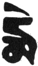

  
[Intangible Textual Heritage](../../index)  [Buddhism](../index) 
[Index](index)  [Previous](ettt06)  [Next](ettt08) 

------------------------------------------------------------------------

  
*Esoteric Teachings of the Tibetan Tantra*, by C.A. Musés, \[1961\], at
Intangible Textual Heritage

------------------------------------------------------------------------

p. 92

### CHAPTER SIX

*From the Treasury of Heaven This is*

### THE SUPERB INITIATION RITUAL

### OF AHM GTSUG[1](ettt07.htm#an_n_6:1) VAJRAPĀṆI

|                    |
|--------------------|
|  |

*Obeisance to Vajrapani!*

For the performance of the Initiation Ritual of Vajrapani general
preparations are required, and the Vase and Gtor-ma should be arranged.

The yogi should think that both he and the front Gtor-ma instantaneously
become Vajrapani, whose hair is as white as a shell, appearing in a form
of Drang Strong[2](ettt07.htm#an_n_6:2). His
right hand lifts up in a threatening manner of conquering all the
hindrances, and his left hand holds the bell in front of his breast as a
sign of attracting and increasing longevity, merits, and prosperities.

His body is greenish-grey adorned with silk scarves;

He wears a tiger-skin apron at the lower part of his body.

He stretches the left leg and bends the right.

Vajrapani stands vividly on the lotus-moon.

A *Hūṃ* word stands on the moon disc in his heart center;

Circling the *Hūṃ* word clockwise is the garland of Mantra,

From it emanate beams of light to the ten directions,

Inviting all Vajrapanis, the Masters of Tantra,

To come down here, entering into both the front Gtor-ma and the yogi's
body.

The nectar in the vase now is overflowing.

*Oṃ Ba-tsa Pani Nama Hūṃ!*

p. 93

(Recite this Mantra several hundred or thousand times, or recite it as
much as one can. After the recitation of Mantra, the Eight-Offerings
ritual should be performed.)

(Then, the guru addresses the disciples:)

Now, I am going to impart to you the initiation of Vajrapani, the Son of
Buddha Samantabhadra. In fact, Vajrapani is identical in essence with
Buddha Samantabhadra, who is considered to be the First Buddha or The
Buddha, who came into being before all other Buddhas. Vajrapani has
different forms, as clearly stated in the *Tantra of
One-Hundred-and-Eight Praisings*. These different forms can be
classified as the Wrathful Ones, the Peaceful Ones, and the
Wrathful-Peaceful Ones. This initiation belongs to the Wrathful-Peaceful
form. According to the *Heart Treasury of the Heavenly Dharma*,
Vajrapani has thirteen different [ ](errata.htm#12) forms; this
Vajrapani is the one appearing in the form of Ahm Gtsug. He is not known
heretofore on earth.

At one time, Vajrapani transformed himself as a sage deity (Tib. Drang
Srong) named Gon-b’a-skyes, and engaged himself in deep Samadhi at the
west side of Mount Sumeru. At that time Buddha Rnam-gzigs came to this
world. When he was about to manifest the manner of realizing the Perfect
Enlightenment, numerous demons, together with their great armies, came
to afflict him. They threw myriads of weapons like rain to hurt the
Buddha. The Buddha then waved his Dharma-rope as the eagle flaps its
wings, and said:

"O wrathful Drang Srong, please come here to subdue these demons!"

As soon as Buddha had spoken, from the west side of Mount Sumeru the
deity Gon-b’a-skyes, holding a nine-spoked

p. 94

thunderbolt in his hand, with his whole body enveloped in great flames,
descended from the sky and conquered all demons. The numerous Buddhas
and Bodhisattvas were much pleased. Thereupon they blessed Vajrapani and
named him the Thunderbolt-Holder, the Master of the Cosmos, and handed
him the thunderbolt as the symbol of initiation. Then Vajrapani said to
the Buddha, "O my Lord Bhaghavan! I am the protector of all Buddhas in
the three times; I was the protector of the seven Buddhas in the past; I
am the protector of the present Buddha and will be the protector of the
nine-hundred-and-ninety-two[3](ettt07.htm#an_n_6:3) Buddhas in the future. I shall be their protectors
until all of the one thousand Buddhas in this Kalpa have completed their
missions. I shall protect them from all hindrances. I have besought the
Buddhas in the past to preach the Dharma, and shall beseech the Buddhas
in the future to preach the Dharma; also I shall beseech all the present
Buddhas to preach the Dharma. I pray you, the Perfect One, grant me your
blessings."

Then said the Buddha, "You have been blessed as both Bodhisattva and
Wrathful Deity by all the Buddhas in the past. The Buddhas-to-come will
also bless you in both of these two forms. Now, I shall also bless you.
You will become the master of all the great devas. You should emancipate
all sentient beings from Saṃsāra and from miseries."

So this is the story of the origination of Vajrapani of Drang Srong
form. His Mantra is unique and superb. *Oṃ* symbolizes the Five Buddhas
and Five Wisdoms. *Batsa pani nama* means "pay homage to Vajrapani".
*Hūṃ* is the word that destroys all the sufferings. Says the *Tantra of
the Supreme Origination of Vajrapani:*

"If the disciple renders one obeisance to Vajrapani, he attains

p. 95

more merits than he would have secured through rendering numerous
obeisances to myriads of Buddhas as many as the total grains of sands in
ninety-two million Ganges Rivers. Thus, we know if he recites the mantra
of Vajrapani with faith once only, he attains more merit than he will
attain through paying homage to Buddhas as many as the total grains of
sand in millions of Ganges Rivers. If he relies on Vajrapani as his
Yidam Buddha and recites the Mantra, he will surely be protected by
Vajrapani from all hindrances. No demons can hurt him, all illness will
be cured, his merits will be increased and prosperity augmented. All his
wishes will be fulfilled. Thus, the benefits of practicing this ritual
are beyond description, nothing can afflict those who practise it.

The practitioner of this ritual will also accomplish all the four
performances, namely, the Performance of Subduing, of Increasing, of
Attraction, and of Conquering. He will encounter no obstacles.
Therefore, one should always rely on Vajrapani, take him as one's
shelter and refuge. Also, those who have chronic diseases will be cured
through reciting the Mantra of Vajrapani.

Now, you should all think that these initiation symbols prepared for you
are all Vajrapanis themselves, and follow me in reciting the prayers:

"I pray to gurus and to the Three Precious ones and to the Yidam
Buddhas,

Especially, I pray Vajrapani.

Please grant me the superb initiation."

\[Recite this prayer three times.\]

The guru then addresses the disciples:

Follow me and recite the prayer of Raising the Bodhi Heart:

p. 96

"I take refuge in the Three Precious Ones.  
 I confess all my sinful doings and transgressions  
 To all virtuous deeds of sentient beings,  
 I raise the sympathetic joys.  
 I devote my heart to Buddhas and to the Enlightenment.  
 Till the day of my final enlightenment,  
 I take refuge in Buddha, Dharma, and Sangha.  
 For the sake of benefiting self and others I aspire to Bodhi.  
 From now on I will serve all sentient beings;  
 And practice all Actions of Bodhi with earnestness and joy.  
 For the sake of benefiting all beings,  
 May I come to the realization of Perfect Enlightenment."

All you disciples should think that you have now become the Ahm Gtsug
Vajrapani,

Appearing in a form of Drang Srong,

Holding in his hand the skull;

His braided hair is as white as the seashell.

His right hand holds the thunderbolt upflung toward the sky;

That is the symbol of subduing all hindrances.

The left one holds the bell in front of his breast;

That is the symbol of increasing longevity, merits, and prosperity.

His body is greenish-grey, adorned with silk scarves.

On the lower part of his body

He wears an apron made of tiger-skin.

He stretches his left leg and bends his right leg.

Vividly and distinctly he stands on the lotus-moon disc.

On the moon-disc at his heart-center there is a *Hūṃ* word.

p. 97

Clockwise encircling the *Hūṃ* word is the garland of Mantra.

From this garland of Mantra emanate infinite beams of light,

Inviting the numerous Vajrapanis from the Pure Lands in ten directions.

Thus, the beyond-number-Vajrapanis all come down here,

They all enter into you and unite with you.

\[The guru says:\]

*Hūṃ!* All the Vajrapanis in Ahm Gtsug form, Pray come down here and
bless us!

Pray vouchsafe my disciples your supreme initiation! Pray protect them
from all evils and hindrances of life!

Recite the main incantation:

*Oṃ Ba-tsa Ah Wei Sha Ya Ah Ah!*

Recite this incantation many times, and play the musical instrument.

The guru then puts the thunderbolt on the head of disciples and says the
following Mantra:

*Déé Tsha Ba-tsa!*

Now in order to attain the main initiation the disciples should follow
the guru in reciting this prayer:

I pray to gurus, the Three Precious Ones,

The Yidam Buddha and all deities.

Especially I pray to the Ahm Gtsug Vajrapani.

I pray you grant me the Initiation of Body, of Speech, Of Mind, of
Merit, and of Performance.

The guru then holds the Vase in his hand and says:

"This is the Vase of Initiation; adorning its surface are the precious
stones; its body is light, its neck long; it is

p. 98

full of the sacred water. It is decorated with the heavenly clothes; a
blue silk scarf is also fastened on its neck. In the inner part of the
Vase stands the Buddha Vajrapani in his Beyond-Measure Palace. From the
body of Buddha Vajrapani gush out streams of nectar flowing into your
body through the Gate of Heaven in your head. Thus the defilements of
your body are purified, and all the four hindrances of mouth are
cleansed. Therefore, you should understand that you have now received
the four initiations and also attained the capability of realizing the
Buddha's body \[in future time\].

*Hūṃ*, this Vase itself is the Beyond-Measure-Palace!

In it the great Ahm Gtsug Vajrapani resides.

Now, I put it upon your head

And impart you the Initiation of Vajrapani.

*Oṃ Betsapani Nama Hūṃ Grum Bha Ahbi Ahi Tsa Hūṃ!*

Also recite "O, the Braided-Hair Vajrapani… till… \[text obscure and
broken here\]

Through the power of the body of Lord Vajrapani,

May I attain the blessing and prosperity".

You have now attained the Body Initiation of Vajrapani; all the
hindrances of sickness and demonic afflictions of your body are thus
purified. From now on you will be able to meditate on the Body of
Vajrapani, and you will have the capability of attaining the supreme
body of Vajrapani with its perfection of the Thirty-two Signs and Eighty
Beatifications.

Then the guru holds the white shell in his hand and says:

From the throat of the Front-Buddha in the shell emanate infinite beams
of light,

Shining upon the Pure Lands of all Buddhas in all directions,

p. 99

And attracting the merits of speech of all Buddhas, including the sixty
voices of Perfection,

Through which the eighty-four thousand Dharmas were introduced.

This shell symbolizes the expression of all Buddhas,

The clockwise curves on its surface are a symbol of prosperity.

It also has the eight signs of auspiciousness.

Spontaneously this shell broadcasts the voice of Dharma.

Now, you should think that the waves of the voice of Dharma delivered
from this shell all enter into your throat.

*Hūṃ!* This is the shell which perfectly represents the expression of
Buddha Vajrapani,

I now put it upon your throat

And impart to you the Initiation of Speech of Vajrapani. Recite the main
Mantra and add: *Shan Kha Lam Ah Be Ahi Tsa Mong!* Then repeat the basic
prayer:

"O Lord Vajrapani  
 Manifesting in a form with braided hair…  
 Through the power of speech of Lord Vajrapani,  
 May I attain the blessing and prosperity."

The hindrances of your speech are now cleared; thus, you have attained
the power of expression and the capability of achieving the unique sixty
merits of the voice of Buddha.

Then the guru holds the thunderbolt in his hand and says:

"From the Heart-Center of Vajrapani emanate infinite beams of light
shining upon Buddha's Pure Land in the ten directions and attracting
numerous thunderbolts with five spokes, which symbolize the wisdom of
Buddha, to

p. 100

come down here. All these thunderbolts then enter into your heart and
unite with you.

*Hūṃ!* This thunderbolt itself is Vajrapani,

Possessing all qualities of Buddha's wisdom.

I now put it upon your heart

And impart to you the complete Initiation of Wisdom. Recite the main
incantation and add: *Ba-tsa Ah Bi Ahi Tsa Mong!*

Also recite the basic prayer: "O, Lord Vajrapani…

Through the power of wisdom of Lord Vajrapani

May I attain the blessing and prosperity."

Now you have attained the Initiation of Wisdom; thus, the hindrances
that block your mind are cleared; from now on hundreds and thousands of
Samadhis will grow within you.

Then the guru holds the picture of Vajrapani in his hand and says:

"This picture clearly represents Buddha Vajrapani himself. From it
emanate infinite beams of light shining upon the Pure Lands in the ten
directions, and attracting numerous Vajrapanis from the eternal Heaven
Aog-min and also from the Pure Land of the North to come down here.
These Vajrapanis are in different sizes and numerous forms: the large
ones are as big as Mount Sumeru, and the small ones are as tiny as
mustard seeds. Now you should think that all these Vajrapanis enter into
you and merge with you.

*Hūṃ!* This picture is Vajrapani himself

I now put it upon your head

And impart to you the Initiation of Merits of Vajrapani. Recite the main
incantation and add: *Gaya Ahbi Ahi Tsa Mam!*

  [  
Click to enlarge](img/pl02.jpg)  
PLATE II  

Folio 10 (ii) *recto* (Muses MS, vol. II), the
second of two folios bearing the same number. The Holy Thunderbolt,
Vajra or rDorje, symbolic of the power of wisdom, especially in its most
potent or esoteric form; and hence symbolic of the entire Tibetan Tantra
(rGyud) or Vajrayāna.

p. 101

Also recite the main prayer:

"O, Lord Vajrapani…  
 Through the power of the merits of Vajrapani  
 May I attain the blessing and prosperity!"

Now you have received the Initiation of Merits; thus the hindrances that
cause the degeneration of merits are cleared. From now on you will be
able to increase all your merits and wisdoms.

Then the guru holds the Gtor-ma in his hand and says:

This Gtor-ma itself is Vajrapani; from it emanate infinite beams of
light in white, yellow, red, and green, shining upon you and merged with
you. Thus, from now on you will be able to perform the Four Acts without
any difficulties or hindrances.

*Hūṃ!* This Gtor-ma itself is Vajrapani;

I now put it in your hands,

And impart to you the Initiation of Performances.

Recite the main Mantra and add: *Shandan Sudam Sashang Maraya Bendha
Ahbi Ahi Tsa Mang;* also recite the main prayer:

"O, Lord Vajrapani…  
 Through the power of the performance of Vajrapani  
 May I attain the blessing and prosperity!"

This Gtor-ma itself is identical with Buddha Vajrapani, the Master of
the Esoteric Teachings. From it emanate infinite beams of light shining
upon Buddha's Pure Lands in the ten directions, attracting hundreds of
thousands of Buddha Vajrapanis, large and small, from the Aog-min Heaven
and also from the north side of Mount Sumeru, together with infinite
Garlands of Mantra and five-spoked thunderbolts to come down here. They
all enter into your

p. 102

heart, and eventually they are transformed into lights and merge with
you.

"O, the Dharmakaya Samantabhadra,

The Sixth Buddha, the Great Rdo-rje-chang,

The Guru Padma Sambhava and the Dakini Ye-shes-mtsho-rgyal,

The Gurus Bal-ji-sen-ge and Mi-rgyur-rdo-rje,

All the demon conquerors and all gurus in the lineage,

And then the beyond-number Buddhas in the universe,

Buddha Vajrapani, the host-Buddha of this initiation, in numerous
numbers and forms,

I beseech all of you!

1 pray you bless my disciples!

I pray you protect them from all kinds of demons and sickness from the
planets[4](ettt07.htm#an_n_6:4)… \[and\]
epilepsy,

I pray you increase their merits and advance their meditation
experiences.

I pray you safeguard them from the miseries of Saṃsara and all fears.

*Oṃ Ba-tsa Pani Nama Hūṃ Balinda Gaya Waga Tsida Ahdirdana Samaya Tsa
Hūṃ Bam Ho!*

Now you have well received the initiation; hence you should rely on
Vajrapani as your Patron Buddha.

At the end of this initiation the disciples all say to the guru:

"We shall obey all your instructions and follow all your admonishments."

p. 103

##### NOTES

[1](ettt07.htm#an_r_6:1). *Ahm Gtsug:* This
word is obviously a mistake made by the copyist. The translator presumes
that this word should be spelled Ahm Gtsigs, which means using the upper
teeth to press the lower lip when one is in despair or anger. [\*](#fn_5)

[2](ettt07.htm#an_r_6:2). *Drang Srong:* The
sages, hermits, or anchorites. Also means the *Rishi*, the deific sages
who can perform miracles.

[3](ettt07.htm#an_r_6:3). According to
Buddhist tradition, one thousand Buddhas will appear in this world in
this Kalpa. Eight Buddhas have already appeared, therefore the
Buddhas-to-come total nine hundred and ninety-two.

[4](ettt07.htm#an_r_6:4). That is,
astrologically indicated illnesses.—*Ed*.

------------------------------------------------------------------------

### Footnotes

[103:\*](ettt07.htm#fr_5) The editor disagrees
here. The same (Gtsug) spelling is repeated in the ritual consistently.
The editor believes this to be a technical tantric term designating one
of the thirteen forms of Vajrapani, and specifically the one with the
braided hair.—*Ed*.

------------------------------------------------------------------------

[Next: Chapter Seven: A Compendium of the Initiation Rituals of
Performance or All-Accomplishing Wisdom Presided Over by
Amoghasiddhi](ettt08)

