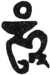

  
[Intangible Textual Heritage](../../index)  [Buddhism](../index) 
[Index](index)  [Previous](ettt07)  [Next](ettt09) 

------------------------------------------------------------------------

  
*Esoteric Teachings of the Tibetan Tantra*, by C.A. Musés, \[1961\], at
Intangible Textual Heritage

------------------------------------------------------------------------

p. 104

### CHAPTER SEVEN

### \[A COMPENDIUM OF

### THE INITIATION RITUALS OF

### PERFORMANCE OR

### ALL-ACCOMPLISHING WISDOM

### PRESIDED OVER BY AMOGHASIDDHI\][1](ettt08.htm#an_n_7:1)

##### FOLIO 1

|                    |
|--------------------|
|  |

*Picture:* Buddha Amoghasiddhi (Tibetan *Don-yod-grub-pa*, meaning
Buddha of Performance).

This Buddha abides in the north of the Mandala. He is the fifth Buddha
of the Five Buddhas of Tantricism and usually belongs to the last of the
initiation series[2](ettt08.htm#an_n_7:2).

*Text*

*Hūṃ!* This is the Bhagavan, Buddha of Performance.

I now give to you, the well-destined disciples, his initiation.

Have faith and devotion toward him!

Through the power of his speech and wisdom,

Your envious nature naturally dissolves and becomes his holy body.

May you attain the complete initiation of Amoghasiddhi.

*Dagarma Abhi Ditsa Ah!*

If you understand, O disciples, that everything is the manifestation of
consciousness,

Or that consciousness makes everything,

Then you will truly attain the Initiation of the Dissolution of the
Envious Nature.

(And you should know that) the green wisdom-light symbolizes the Buddha
of Performance, himself.

p. 105

##### FOLIO 2

*Picture:* Very unclear; presumably it is the robe which Buddha wears.

*Text*

Buddha's body feels no cold,

But following the fashion of sentient beings—

Needing this and needing that—

Buddha, likewise, robes himself.

Putting on this Buddha's robe, you will become resplendent:

*Ahdi Sabuya Svaha*.

##### FOLIO 3

*Picture:* The Tiger-skin apron and ornaments for the Fierce Buddha.

*Text*

You should think that you offer the Tiger-skin apron and ornaments to
the Fierce One.

*Hūṃ!* Although Buddha's mind is fearless,

He wears these terrifying ornaments

On his wrathful body

To cleanse the sins of sentient beings

And bring them to the Path of Liberation.

By your wearing this Tiger-skin apron and fierce ornaments,

The demons will be conquered and all your fears routed.

*Oṃ! Sher Bi Yo Di Sar Su Yy Svaha!*

##### FOLIO 4

*Picture:* The Fiery Water[3](ettt08.htm#an_n_7:3) \[which conquers both cold and heat\]

p. 106

*Text*

(The Guru hands over the picture of the Fiery Water to they disciple.)

*Hūṃ!* This is the protection from heat and cold—the Fiery Water with
qualities of both warmth and coolness.

I now impart to you well-destined disciples, this initiation.

You will be immune to the cold and heat-torments of Hell;

Thus you will be forever freed from the sufferings of Hell.

*Du Da Ha Da Ha Sarwa Nara Gade Heru Hūṃ Pai!*

(see note, Folios 26-41, [p. 115](#page_115))

##### FOLIO 10

*Picture:* The Five Wheels.

*Text*

*Hūṃ!* These are the Precious Wheels

The Cross Symbols[4](ettt08.htm#an_n_7:4) on
the human heart.

I now impart this initiation to you, good disciples.

May you attain the Initiation of the Five Wheels.

*Batsa Matna Bema Garma Ah Be Ditsi Ah!*

##### SECOND FOLIO 10

(as marked in Tibetan on the folio. Ed.)

*Picture:* The Thunderbolt.

*Text*

*Hūṃ!* This is the Precious Wheel—the Cross Symbols of the lotus on the
human heart.

I now impart this initiation to you, good disciples, May you attain the
Initiation of the Five Wheels.

*Batsa Darna Bema Garma Ah Be Ditsi Ah!*

##### FOLIO 11

*Picture:* A water vase, a hat, a thunderbolt, a bell, and a Buddha.

p. 107

*Text*

The Vase Initiation is the annihilation of Hate.

The Initiation of Head-Adornment is the subduing of the Pride-poison.

The initiation of Thunderbolt is the destroying of the Lust-poison.

The Initiation of Bell is the conquering of Enviousness and Arrogance.

The Initiation of Name is the dispelling of the Ignorance-Darkness.

I now bestow upon you the Initiation of Eternity.

*Hūṃ Batsa Ah Dar Shu Jana Samaya Ahbi Yi Tsa Mum!*

(Use the water vase.)

Sar Rana Jarna Sobhawa Ahbi Yitsa Mum!

(Use the thunderbolt.)

Da Di Cha Ah Bu Di Jana Sadna Batsa Ahbi Yi Tsa Mum!

(Use the bell.)

Oṃ Dar Tri Da Ma Di Ahme Jaha Batsa Ahbi Yi Tsa Mum!

(Use the thunderbolt and bell.)

### FOLIOS 12–13

*Picture:* The Yab-Yum (literally Father-Mother) of All-Perfection or
Adi Buddha Yab-Yum.

*Text*

*Hūṃ!* to you well-gifted disciples

I now grant the Initiation of Adi Buddha Yab-Yum. With the annulment and
purification of the "mind complex", May you attain the Initiation of the
Immense Dharmakaya.

*Darmakaya Ahbe Yitsa Oṃ Ah Hūṃ Hri!*

(Then the Guru makes the wish for the disciples.)

O, well-gifted disciples: Through attaining the Initiation

Of Adi Biddha Yab-Yum, your mind will be purified in the

p. 108

\[paragraph continues\] Dharmadathu (the
universal whole). May you thus attain the Initiation of the Immense
Dharmakaya.

(Then the Guru bestows the Pointing-Out
Practice[5](ettt08.htm#an_n_7:5) upon the
disciples.)

O, well-destined disciples: You should not think that the so-called
Yab-Yum Adi Buddha is other than the Alaya Bodhi
Heart[6](ettt08.htm#an_n_7:6) of your own
mind. Oh! the aware thinker at this very moment, bright, radiantly
aware, transparent, itself is the absolute body of Adi Buddha, the
original, the primordial Immutable Shelter.

The awareness of your own mind, devoid of any characteristics and
substantialities, the lightning awareness itself is the Mother Adi
Buddha: its over-flowing manifestation and play. The versatile actor
itself is the Father Adi Buddha: Now, recognize it and become acquainted
with it!

##### FOLIOS 14–15

*Picture:* The Five Buddhas.

*Text*

(Thereupon the Initiation of the Five Father Buddhas of the Five Groups
is given as follows:)

*Hūṃ!* To you well-gifted disciples,

I now impart the Initiation of the Five Buddhas in the Five Groups.

Your Five Aggregations \[the skandhas or five modes of consciousness\]
will thus be purified.

May you obtain the Initiation of the Universal

Reward Body (Sambhogakaya)!

*Oṃ Hūṃ So Ahm Ha Sambhogaya Ahbi Aitsa Ah!*

(The Guru blesses as follows:)

Having received the Initiation of the Five Buddhas, I wish that all your
Five Aggregations will be purified and that

p. 109

the Initiation of the Universal Reward Body be attained by you.

(The Guru now executes the Pointing-Out Practice.)

O well-gifted disciples: The so called Five Buddhas are nothing else but
your own Five Skandhas. The non-extinct but purified \[natures\] of your
own Five Skandhas are the Five Buddhas themselves:—The non-extinct but
all-manifest Form, clear and vivid, is the Buddha of All Manifestations.
(Tib. Rnam-b’ar-snang-mdzad; Skt. Vairochana). The non-extinct but
all-manifest Feeling (Tib. Rin-chen-byun-gnas; Skt. Ratnasambhava) clear
and vivid, is the Buddha of Treasury. The non-extinct but all-manifest
Conception (Tib. *A*dushes), clear and vivid, is the Buddha of Infinite
Light. The non-extinct but all-manifest Volition, clear and vivid, is
the Buddha of All-Performance. The non-extinct but all-manifest
Consciousness, clear and vivid, is the Buddha of the Diamond-Mind. This,
you should understand.

##### FOLIO 16

*Picture:* The Five Mother-Buddhas or the Five Goddesses.

*Text*

*Hūṃ!* To you well-destined disciples.

I now impart the Initiation of the Five Mother-Buddhas.

Having purified but not abolished the five elements,

May you this attain this Initiation of the Five Mother-Buddhas.

*Mum Lam Mam Syam Tayam Ahbi Aitsa Ah!*

(The Guru now bestows a wish as follows:)

Having received the Initiation of the Five Mother-Buddhas, I wish that
all your five elements may be purified and

p. 110

that the Initiation of Generating All Buddhas be attained by you.

(The Pointing-Out Practice follows.)

##### FOLIO 17

*Text*

O well-gifted disciples, the so-called Five Mother-Buddhas are nothing
else but your own five inner and outer elements. The non-extinct but
purified five elements are the Five Mother-Buddhas themselves. The
manifested earth-element is the Mother-Buddha Spyng-ma. The manifested
water-element is the Mother-Buddha Ma-ma-ge. The manifested fire-element
is the Mother-Buddha Gos-dg’ar-mo. The manifested air-element is the
Mother-Buddha Dam-tsig-sgrol-ma. The manifested space-element is the
nature of the Mother-Buddha Dbyings-pyug-ma.

##### FOLIO 18

*Picture:* The Eight Boddhisattvas.

*Text*

The Initiation of the Eight Bodhisattvas:

*Hūṃ!* To you well-destined disciples,

I now impart the Initiation of the Eight Bodhisattvas. Having purified
but not destroyed the eight consciousnesses,

May you obtain the Initiation of the Great Bodhisattvas.

*Bu Dhi Sa Ta Ah Bi Yi Tsa Ah!*

(The Guru makes a wish as follows.)

O well-gifted disciples, through the attainment of this Initiation your
eight consciousnesses are purified. Thus having attained the Initiation
of the Eight Bodhisattvas, you will act as the Eight Bodhisattvas to
carry out the

p. 111

great career—to further the welfare of all sentient beings.

##### FOLIO 19

*Text*

The Pointing-Out Practice:

O, well-gifted disciples, the so-called Eight Bodhisattvas are nothing
else but your own eight consciousnesses. The non-extinct but brightened
eight consciousnesses of one's self are the Eight Bodhisattvas
themselves. The eye-consciousness, aware and non-extinct, is the
Bodhisattva *Earth-Essence*. The ear-consciousness, the one that hears,
is the Bodhisattva *Space-Essence*. The nose-consciousness, the one that
smells, is the Bodhisattva *Self-Seeing.* The tongue-consciousness, the
one that tastes, is the Bodhisattva *Thunderbolt-Holder*. The
body-consciousness, the one that penetrates
all[7](ettt08.htm#an_n_7:7), the illumined
wisdom, is the Bodhisattva *Purger-of-Obstacles*. The kleśa-bound
Mind-Consciousness, the one that perpetuates the ego, is the Bodhisattva
\[called\] *All-Merits*. The base-of-all consciousness, the
all-pervading and illumined, is the Bodhisattva \[called\] *Meritorious
Youth*.

##### FOLIOS 20-21

*Picture:* The Eight Consort-Bodhisattvas.

*Text*

The Initiation of the Eight Consort-Bodhisattvas:

*Hūṃ!* To you well-gifted disciples

I now impart the Initiation of the Eight Consort-Bodhisattvas.

Having purified but not destroyed the eight (outer) objects,

p. 112

\[paragraph continues\] May you obtain the
Initiation of the Eight Consort-Bodhisattvas.

*Ahbi Yitsa Ah!*

(The Guru makes a wish as follows:)

O, well-gifted disciples, through the attainment of this Initiation of
the Eight Consort-Bodhisattvas, the eight objects are purified but not
abandoned. Thus, you will act as the Eight Consort-Bodhisattvas to
further the welfare of sentient beings.

(The Pointing-Out Practice.)

O, well-gifted disciples, the so-called Eight Consort-Bodhisattvas are
nothing else but the purification of the thought of the eight objects.
The eye-object, the appearance of form, in its purity, is the
Consort-Bodhisattva La-ser-Dkar-mo. Likewise, the Ear-object, the sound
in its purity, is the Consort-Bodhisattva Ma-le-ser-mo. The nose-object,
the odor in its purity, is the Consort-Bodhisattva Ge-di-mar-mo. The
tongue-object, the taste in its purity, is the Consort-Bodhisattva
Ni-ti-ljang-gu. The purification of thought in the past is the
Consort-Bodhisattva Su-si-dkar-mo. The purification of thought in the
present is the Consort-Bodhisattva Dub-se-ser-mo. The purification of
thought in the future is Bodhisattva Ah-loga-mar-mo. The insubstantial,
the not-definite nature of the elements, the purification of phenomena,
are the Consort-Bodhisattva Green Gha-ne. This you should understand.

##### FOLIO 22

*Picture:* The Six Transformation Bodies of the Six Buddhas.

*Text*

The Initiation of the Transformation Bodies of the Six Buddhas.

p. 113

*Hūṃ!* To you well-destined disciples

I now impart the Initiation of the Six Buddhas.

Having purified the six Kleśas,

May you obtain the Initiation of the Nirmanakaya Buddhas.

*Nir Ma Kaya Ahbe Yitsa Ah!*

(The Guru makes a wish as follows:)

O, well-gifted disciples, through the attainment of this Initiation of
the Six Nirmanakaya Buddhas, the Six Poisons—five kleśas and
stinginess—are purified. Thus may you be able to transform numerous
bodies to further the welfare of sentient beings in the Six Lokas.

(The Pointing-Out Practice:)

O, well-gifted disciples, the so-called Six Buddhas are not something
else—the purification of Pride is the Buddha of Heaven,
Dwan-b’o-brgya-bying;

##### FOLIO 23

(Continues the text of Folio 22.)

the purification of envy is the Buddha of Asura Tag Zang-ris; the
purification of lust is the Buddha of Human beings, Shakyamuni; the
purification of Blindness is the Buddha of Animals, Sen-ge-rab-brteng;
the purification of stinginess is the Buddha of Hungry Ghost,
G’a-*a*bar-ma; the purification of Hate is the Buddha of Hell,
Chos-gyri-rgyal-b’o.

##### FOLIO 24

*Picture:* The Initiation Buddha of the Four Meanings.

*Text*

*Hūṃ!* To you well-destined disciples

I now impart the Initiation of the Four Meanings.

p. 114

Having purified the realistic and nihilistic Four
Extremes[8](ettt08.htm#an_n_7:8)

May you obtain the Initiation of Infinite Performances.

*Shen Da Su Da Ahn Wa Shm Ma Ra Ya Ahbi Aitsa Ah!* (The Guru makes a
wish as follows:)

O well-gifted disciples, through the attainment of this Initiation of
Four Meanings, the Realistic and Nihilistic Four Extremes are purified.
May you be able to benefit sentient beings through the power of the Four
Great Performances without the slightest hindrance.

(The Pointing-Out Practice:)

O, well-gifted disciples, the Buddhas of Four Meanings are not something
else—the purification of the Realistic View is the Buddha Victor
(Rnam-b’ar-rgyal-wa); the purification of the Nihilistic View is the
Buddha of Death. Gshin-rje-gshed-b’o; the purification of the Ego-View
is the Buddha of Horse \[-Head\] (Rta-mgrin); the purification of the
Form-View is the Buddha of Nectar-Flowing.

##### FOLIO 25

*Picture:* The Female Buddha of the Four Meanings.

*Text*

*Hūṃ!* To you, the well-destined disciples,

I now impart the Female Buddhas of Four Meanings. Having purified the
four ways of birth,

May you attain the Initiation of the Four Performances.

*Batsa Oṃ Gu Sha la Sa Sha Mo Da Gen De Ahbi Aitsa Ah!* (The Guru makes
the wish for the disciples:)

Now you, the disciples have attained the Initiation of the Four Female
Deities. Thus, the gates of the Four Births will be shut off, the four
Infinities will arise from your heart—the four great performances
through which you

p. 115

will be able to benefit sentient beings without the slightest
hindrances. Thus you will accomplish the career of benefiting others.
May you attain all these merits and powers! (The Pointing-Out Practice:)

O well-destined disciples, the Four Female Buddhas are but the natural
purification of the Thought of the Four
Births[9](ettt08.htm#an_n_7:9). The birth
from metamorphosis is the Iron-Chain Goddess; the natural purification
of the thought of birth from the womb is the Rope Female Buddha. The
natural purification of the thought of birth from eggs is the
Iron-Fetter Female Buddha. The natural purification of the thought of
the warmth-wetness is the Bell Goddess. From the very beginning they are
identical! O well-gifted ones! You should definitely know these
[truths](errata.htm#13)—as they are unmistakably true—and bear this
conviction with you.

##### FOLIOS 26-41

Are not of first importance to initiation *per se* or are ideationally
repetitious and hence have not been translated. *Ed*.

##### FOLIO 42

The Pointing-Out demonstration for the complete \[company of\] Fierce
Buddhas

The Guru says to the disciples:

O well-gifted disciples, these sixty Blood-Drinking Deities are not
something else, they are one's own kleśas-group, purified but not
abandoned. The insubstantial or the perceiver that is devoid of any
self-nature awareness manifests itself as the sixty Blood-Drinking
Deities. As illustrated, in the Palace-Beyond-Measure in one's
skull-brain, a group of Blood-Drinking Deities now actually and vividly
dwell[10](ettt08.htm#an_n_7:10). The
forty-two Peaceful Deities with

p. 116

their illuminate bodies, all now dwell in the Dharma Chakra in the heart
center. Furthermore, all the hairs over your body are identical with the
nature of Db’a-wo (Brave Deities). All the Pranas are the nature of
Dakinis, all the White-Drops[11](ettt08.htm#an_n_7:11) manifest in the form of the infinite Peaceful and
Wrathful Sambhogakaya of the Father Buddhas. All the Red
Drops[12](ettt08.htm#an_n_7:12) (Ragda)
manifest in the form of the infinite Peaceful and Wrathful Sambhogakaya
of the Mother Buddhas. The numerous nadis[13](ettt08.htm#an_n_7:13) of the body are the Dakinis. Therefore, your very
body itself is the nature of the Mandala of the Peaceful and Wrathful
Buddhas. Hence, you should never despise, abuse, or injure your body,
nor should you overstrain your body, practice asceticism, or commit
suicide. When you eat or drink you should think that this is the Tantric
Sacrament and duly make the offering. If you remain without attachment,
you may always wear fire and lovely clothes and adorn yourself as a
manner of

### Folio 43

\[Continuing the text of Folio 42.\]

practicing Tantric offerings. At the time of death, the Peaceful and
Wrathful Buddhas will come out of your body, extending over all space;
thereupon the Bardo visions will begin. Remember! At that time do not be
frightened or terrified by the thundering voices and the Three Lights!
You should remember that all these Buddhas are your tutelary Buddhas
whose initiations I am right now giving to you! You should remember and
recognize them. As soon as you recognize them, you will be
instantaneously emancipated!

Thus the Pointing-Out demonstration is extensively given to the
disciples.

  [  
Click to enlarge](img/pl03.jpg)  
PLATE III  

The number 5, entering Mahayana Buddhism via Hindu
Tantric forms of the Sāṇkhya doctrine, pervades Tibetan Buddhism. This
detail, depicting the five Dhyāni Buddhas, is from a tanka of the
sambhogakāya aspect of the Buddha Amitābha. (*Reproduced here by
courtesy of the Newark Museum, Newark, New Jersey*.)

p. 117

The foregoing initiation-ritual is given to the disciples to make them
understand the teachings of initiation; as said in the Prime
King-Initiation Tantra of Vajrasattva:

The Mandala-Offering practice is to be done \[now.\]

For the unwise disciples,

The Vajrasattava gives the Skull-Initiation,

To elucidate the symbolic teachings.

The disciple should try to understand the Wisdom Initiation,

The Secret Initiation will elucidate the self-experience.

While the Word-Initiation elucidates the non-existence of self.

##### FOLIO 43b

(The text written on the reverse side of Folio 43.)

Thus says the *Tantra of Vajrasattva*.

Of this Skull-Initiation (a simpler type or Rite-Free Initiation), that
Tantra gives the following explanation:

"The Initiation tells the disciples whether the Outer Objects in the
material world and Inner Essence[14](ettt08.htm#an_n_7:14) within oneself are existent or non-existent, and
in what sense they do or do not exist, by giving many symbols and
explanations, such as the Sumeru Mountain, the Four Continents and the
Vase Buddhas. In the Wisdom Initiation, the Thunderbolt, the Precious
Wheel, the Cross-Thunderbolt, the Three-Pointed Knife, the Purba Dagger,
the bow and arrows, the mirror, the forms and colors—these things are
shown to the disciples, to give them a sagacious view, by the Guru in
the Initiation ritual." Thus states the Tantra.

The Tantra explains the Extreme Rite-Free Initiation in the terms of the
Secret Initiations; its objective is to elucidate

p. 118

self-Illumination—if one knows himself, he has attained the Secret
Initiation.

The Tantra also says:

"If one knows one thing he knows all.  
 O, marvelous is the Nature of Equality  
 If existent—Equality from the beginning!  
 If non-existent—Equality from the beginning!  
 If abstract—Equality from the beginning!  
 If concrete—still Equality from the beginning!  
 If one realizes the Nature of Equality,  
 He has attained the Secret Initiation!  
 Oh, marvelous is the Nature of Equality!"

Now, the ultimate-Rite-Free Initiation:

As said in the Tantra: "Through the Words-Initiation the Non-ego truth
is elucidated to the disciples: Wherever there is ego, there are always
confusions (Saṃsāra). The word of no words is the highest initiation.
Without I, without ego, none sinks into Saṃsāra!"

Now, the Great Vase Initiation with Rite, the Rite-Free Initiation, the
Extreme Rite-Free Initiation, and the Ultimate Rite-Free Initiation are
all given to you; thus the sins, hindrances, and habitual thoughts of
your body, mouth, and mind are all cleansed and actually become the Four
Bodies of Buddha. Hereafter, you will benefit sentient beings in a
natural way, without any [strenuous](errata.htm#14) effort.

To obtain pardon and give thanks, the Mandala should be offered; the
assemblage should be [entertained](errata.htm#15) and exalted with
dancing and singing. What remains after the festival should be given
away as charity.

Those who want to have a comprehensive sacramental

p. 119

festival and celebration should consult the Annotations of the Four
Initiation Rituals.

*Samaya Chia Chia Chia!*

May the message of the Argument-Free Adi
Doctrine[16](ettt08.htm#an_n_7:16) reach all
the corners of the world at all times. May this teaching be spread and
magnified on the earth and last for ages.

This is the teaching from the Treasury of Garma Linpa, the accomplished
Yogi.

Blessings to all!

p. 120

##### NOTES

[1](ettt08.htm#an_r_7:1). The manuscript of
these initiations presents a series of colored images of god-forms, with
explanatory text on the verso sides and on supplementary folios
containing the most profound ideas, most explicitly expressed, of any of
the seven initiation texts here given.—Ed.

[2](ettt08.htm#an_r_7:2). The translator
believes the folios of the other four Buddhas are missing. The first few
lines of the text are indiscernible.

[3](ettt08.htm#an_r_7:3). *Fiery Water:* For
human beings, fire is fire and water is water. This is not so for
sentient beings in Hell. For them, cool water they try to drink turns to
fire, and fire by which they try to warm themselves turns to cold water.
Hence the term "Fiery Water" is used to convey the absence of
self-nature in this nether-world phenomenon.

[4](ettt08.htm#an_r_7:4). *Cross Symbols
(Rgya-gram):* In Tibetan, this term may refer either to the symbol of
the crossed thunderbolts or that symbol we call the swastika. Here it
means crossed thunderbolts.

[5](ettt08.htm#an_r_7:5). *Pointing-Out
Practice:* This is the practice by which the Guru points out
(illustrates) to the disciple, during the initiation, his original
Buddha-nature. This is a special practice of the Red and White Schools
of Tibetan Buddhism.

[6](ettt08.htm#an_r_7:6). *Alaya Bodhi
Heart:* "Alaya" is the term meaning "foundation of all." Here the term
is used in connection with Bodhi-heart, implying that the Vow of
Bodhisattva is the foundation and source of all Buddhist teachings.

[7](ettt08.htm#an_r_7:7). This refers to the
most active and versatile consciousness, generally called mental, which
Buddhists classify as the Sixth Consciousness.

[8](ettt08.htm#an_r_7:8). *Four Extremes:*
(1) The Extreme of Existence; (z) The Extreme of Non-Existence; (3) The
Extreme of both Existence and Non-Existence; (4) The Extremes of neither
Existence nor Non-Existence.

[9](ettt08.htm#an_r_7:9). *Thought of the
Four Births:* From the transcendental viewpoint, there is no birth nor
death. The Four Births of Saṃsara are dreamlike and unreal; they are
merely thoughts, not the real beings.

[10](ettt08.htm#an_r_7:10) This is the
esoteric teaching of this initiation: that all the

p. 121

\[paragraph continues\] Wrathful Buddhas
are reflected or manifested through the psychic center in the head.

[11](ettt08.htm#an_r_7:11). *White Drops:*
The life-force (physically, semen) of the male.

[12](ettt08.htm#an_r_7:12). *Red Drops:* The
life-force of the female.

[13](ettt08.htm#an_r_7:13). *Nadis (Skt.):*
Follicles; all the tubes and nerves in the body; Tibetan, Riser.
\[Actually the nadis (rTsa) are not part of the physical body, but are
subtle channels for the conveyance of prana.—*Ed*.\]

[14](ettt08.htm#an_r_7:14). *Inner Essence*,
here, refers to the disciple's consciousness.

[15](ettt08.htm#an_r_7:15). The Nature of
Equality is one of the most important aspects of the Prajna-Paramita.
From the viewpoint of absolute enlightenment, all things appear equal.
\[Instead of "equal," to say "partaking of the same ultimate nature"
would probably be more accurate.—*Ed*.\] Therefore, Tantrism [declares
that](errata.htm#16) Nirvana is Saṃsāra and Saṃsara is Nirvana.

[16](ettt08.htm#an_r_7:16). *Argument-Free
Adi Doctrine:* Traditionally, this term carries two meanings: (1) It
refers to the nature of the Adi Doctrine beyond arguments, opinions, and
"play words"; (2) It refers to the tradition of the Red School which, in
contradistinction to the Yellow School, disregards scholastic opinions
and arguments.

------------------------------------------------------------------------

[Next: Prologue](ettt09)

