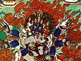

  
[Intangible Textual Heritage](../../index)  [Buddhism](../index.md) 
[Index](index)  [Previous](ettt18)  [Next](ettt20.md) 

------------------------------------------------------------------------

  
*Esoteric Teachings of the Tibetan Tantra*, by C.A. Musés, \[1961\], at
Intangible Textual Heritage

------------------------------------------------------------------------

p. 262

### CHAPTER TEN

### HOW TO IMPROVE THE PRACTICE

### IN THE PATH

If one intends to attain the Highest Accomplishment (Buddhahood) in
one's lifetime, one should practice both the Arising Yoga and the
Perfecting Yoga. Each of them has three different practices: the
With-Form-Practice, the Without-Form-Practice, and the
Extremely-Without-Form Practice. This is said in the Book of Sgron-gsal
(*The Light of the Lamp*). Here, some explanation of the term "Practice"
is needed. The so-called "Practice" \[with and without form\] means the
practice of enjoying all pleasures with a spirit absorbed in the
realization of the Dharma-essence \[the very heart of Tantric practice,
whether Hindu, Taoist, or Buddhist.—*Ed*.\]; especially it implies the
enjoyment of the negative embodiment. Through this practice on the
(excessive) enjoyments, the Enlightenment on the Soleness will be
elevated to consummation. The Extremely-Without Form Practice denotes
the practice of the Wisdom-Yoga, which is a practice of enjoying the
blisses of the negative embodiment [\*](#fn_20.md).
The other practices imply the Karma Yoga. \[Only the
Extremely-Without-Form is karma-free.\]

These practices can be performed in three different ways: the elaborate
way, which is the joyful performance including dancing and singing,
etc.; the modest way; and the simplest way. These practices are applied
at the beginning

p. 263

stage of the Illusory Body Yoga practice, and at the time when one wants
to attain the Without-Learning-Two-In-One Position from the
With-Learning-Two-In-One Position. These are the three times one may
carry out the practices. It is for the purpose of planting the
Dharma-seed in the mind of sincere disciples that I have mentioned these
practices and given all the essential instruction in full. For fear of
involving too many words, the foregoing instructions are not given in
detail. If one wants them elaborated, one may study and search in the
works of the Collective Pith-Instructions (of Gsun-*a*dus).

What happens when the Final Accomplishment comes into being?

Having attained the position of the With-Learning-Two-in-One, one
furthers the meditation on the Light Yoga; thus, in time, the dualistic
thoughts and manifestations are purified and the absolute Dharmakaya is
fully unfolded. The Two-in-One-Illusory Body of the With-Learning is
transformed into the Two-in-One-Body of the Without-Learning. As long as
the Saṃsara exists, this body will not change or vanish; (for the
welfare of sentient beings) this pure body of Buddha will remain.

Here, the two-Hindrances-Free Objective-Light is the immutable
Dharmakaya itself. The Subjective-Light is the Wisdom Dharmakaya itself;
it is also called the Body of Great Bliss. Coexistent with it is the
Body-of-Form, or the Sambhogakaya, which is the (consummated)
transformation of the Mind-Prana. These two Bodies are one in essence
and two in aspect. This Body-of-Form is identical with the
Not-Two-Wisdom-Body \[better: "Non-Twofold Wisdom Body" *Ed*.\]; this is
frequently mentioned by the gurus. Some people say that the Body-of-Form
cannot be

p. 264

ascribed to (or do not exist in) the realm of Buddha, but only appears
through the Karma of sentient beings 'or, more accurately speaking' this
Body-of-Form only appears as a reflection from the mind-mirror-of-Karma
of sentient beings. They also claim that this Body-of-Form is in essence
insensible and non-conscious. Some even say that in the Absolute
Accomplishment (or Enlightenment) there is no wisdom whatsoever. One
should know that all these sayings are false!

From this Unparalleled Two-in-One Body emanates the supreme Nirmanakaya,
and from it are conjured numerous Transformation-Forms.

------------------------------------------------------------------------

### Footnotes

[262:\*](ettt19.htm#fr_20.md) We feel that 'Body of
Non-Form" better expresses the meaning here, which points to the
Without-Form Practice of the Anuttara Tantra.—*Ed*.

------------------------------------------------------------------------

[Next: Chapter Eleven: Tsong Khopa's Summary of Sources](ettt20.md)

