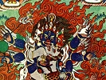

  
[Intangible Textual Heritage](../../index)  [Buddhism](../index) 
[Index](index)  [Previous](ettt20)  [Next](ettt22) 

------------------------------------------------------------------------

  
*Esoteric Teachings of the Tibetan Tantra*, by C.A. Musés, \[1961\], at
Intangible Textual Heritage

------------------------------------------------------------------------

p. 267

### EPILOGUE

"O, the peerless teachings of Buddha Shakyamuni  
 That were preached for the good of sentient beings!  
 Among them, the unparalleled is the Tantra of Highest Division,  
 Including the Mother Tantras and Father Tantras.  
 Based (mainly) upon the Mother Tantra  
 The instruction on the Dumo Yoga  
 With the essential practice of Small *Ah* and Life-Prana are given.  
 It is the path, the teaching that  
 Leads to the unfoldment of the original Innate Wisdom.  
 From the skillfully instructed main teaching (of Dumo Yoga)  
 Come the Illusory Body and the Light Yoga of Gsun-*a*dus.  
 Derived from it and based upon it  
 Are also the Transformation and Entering-Body Yoga of Vajra
Gdan-bzhi.  
 These are the famous Six Yogas,  
 The supreme teachings of the great Masters Tilopa and Naropa.  
 In the Country of Snow this teaching is widespread;  
 It is practiced by all gifted ones in Tibet:  
 It is the quintessence of Tantra,  
 The teaching of profundity, the happiness-bestower!  
 Urging me to write a book on Six Yogas is Lord Canopy of Fame—  
 He whose crown is adorned with the Three Precious Ones; p. 268  
 Through the power of his great merits in the past lives  
 He now becomes the dominant master of the broad kingdoms.  
 Because of his sincere request, this book is written.  
 Also petitioning me to comment on Six Yogas  
 Is the Reverend Dharma-Brother, Canopy of Merit.  
 He is the one who has perfectly mastered the Holy scriptures  
 And absorbed the deep intuitive meditations.  
 Because of his sincere request, this book is written.  
 They offered me grains of fine gold and the precious Mandala,  
 And said to me,  
 'There are many disciples who yearn for this supreme teaching;  
 Pray, for their sake, write a book of Six Yogas!'  
 Thus, with diligence and effort I wrote this book.  
 It contains the clear instructions and explanations  
 On all practices and visualizations.  
 It is trustworthy,  
 For it is based on the holy writings.  
 It is a special book, the Book of Three Confidences.  
 Oh, difficult indeed it is to understand the profound teaching!  
 And human dispositions vary greatly!  
 If anyone misunderstands this teaching and finds faults,  
 I beg the guards and Dakinis  
 Grant their mercy and pardon him;  
 Through the merits of this well-spoken instruction,  
 May all the sentient beings enter into the Unparalleled Vehicle!  
 Let this teaching spread afar! p. 269

Let the supreme path increasingly expand!"

This book is called "The Six Yogas of Naropa, with the Successive
Instructions Leading to the Profound Path—the Book with Three
Confidences" \[i.e. The Book of Threefold Faith—see Note
[1](ettt22.htm#an_n_nar:1) *Ed*.\].

Because of repeated requests from the Lord Canopy of Fame
(Mi-Dong-grogs-b’a-rgyal-mds’an) and the Reverend Canopy of Merit
(Chos-rje-bsod-nams-rgyal-mds’an) I wrote this book. It includes the
well arranged instructions on the practice of Heat Yoga, etc., and some
explanations on the common teachings, together with the elaborate
expositions on each of the special practices (of the Tantric Yogas).
This book was written with a pure wish of spreading the Dharma of this
school \[Gelugpa\], low School), which is thriving in this region to a
great extent; however, it has not yet reached the full-flourishing
state. In consideration of the welfare of many of those who have faith
in and admiration for the teaching of this school, this book was written
at the Victorious Place Dge-ldan on the Great Hill of the Pasture Land
by me, the well-learned Buddhist monk, the renouncer, Good Mind Fame
Tsong Khapa of the East \[of Eastern Tibet\].

May goodness and prosperity thrive!

------------------------------------------------------------------------

[Next: Notes](ettt22)

