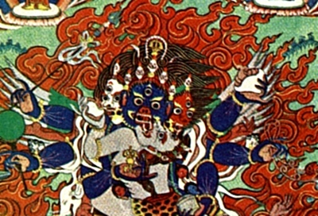

  
[Intangible Textual Heritage](../../index)  [Buddhism](../index.md) 

------------------------------------------------------------------------

<table width="75%">
<colgroup>
<col style="width: 50%" />
<col style="width: 50%" />
</colgroup>
<tbody>
<tr class="odd">
<td width="50%" data-valign="TOP"></td>
<td width="50%" data-valign="CENTER"><h1 id="esoteric-teachings-of-the-tibetan-tantra" data-align="CENTER">Esoteric Teachings of the Tibetan Tantra</h1>
<h2 id="by-c.a.-musés" data-align="CENTER">by C.A. Musés</h2>
<h4 id="section" data-align="CENTER">[1961]</h4></td>
</tr>
</tbody>
</table>

------------------------------------------------------------------------

[Contents](#contents)    [Start Reading](ettt00.md)    [Page
Index](pageidx)    [Text \[Zipped\]](ettt.txt.gz.md)

------------------------------------------------------------------------

This book contains three separate, and very important, works detailing
Tibetan Tantric Buddhist thought and practice: Seven Initiation Rituals
of the Tibetan Tantra, The Six Yogas of Naropa, and The Vow of
Mahamudra. These were translated and edited by Musés assisted by exiled
Tibetan monks from manuscripts in the Library of Congress.

There are some very strange passages here. There is [the mysterious
prophecy of Mi-Gyur-Dorje](ettt03.htm#page_36.md) found in one of the
manuscripts among the initiation rituals, which tells of a far future
time when Tibet will be shattered and perscuted by demons. Naropa
relates [the Yoga of Entering Another's Body](ettt18.htm#page_256.md)
(which can be used to reanimate a corpse!). Naropa also discusses at
some length what we call [lucid dreaming](ettt15.md), but which he calls
*The Practice of the Illusory Body*. Of course, these are all pretty
advanced studies, but it is fascinating to learn what the Tibetan monks
were up to, firsthand. If all you have read about Tibetan Tantra is
western descriptions, you owe it to yourself to take a look at these
primary texts.

*Production Notes:* This is one of the few modern
books with translations of Tibetan Buddhist texts which we know of in
the public domain. In fact, we checked using Thompson Compumark, and
there was no record of a renewal or registration of this work at the US
copyright office, which was required by law at the time. There were a
large number of typographical errors in this book, which we have
corrected [in the usual fashion](errata.md). We also merged the author's
errata into this etext (some of which we found ourselves during the
spell check).--J.B. Hare, December 10th, 2009.

------------------------------------------------------------------------

 [Title Page](ettt00.md)  
[Contents](ettt01.md)  

### Part I: Seven Initiation Rituals of the Tibetan Tantra

[Chapter One: The Initiation Ritual of the Fierce Guru](ettt02.md)  
[Chapter Two: The Initiation Ritual of the Fierce Guru With
Phurba](ettt03.md)  
[Chapter Three: The Initiation Ritual of the All-Merciful One](ettt04.md)  
[Chapter Four: The Initiation Ritual of Hayagriva Buddha, The Green
Rta-Mgrin's Initiation Ceremony From the Treasury of
Percipience](ettt05.md)  
[Chapter Five: The Initiation Ritual of the Red Gshin-Rje](ettt06.md)  
[Chapter Six. The Superb Initiation Ritual of Ahm Gtsug
Vajrapāṇi](ettt07.md)  
[Chapter Seven: A Compendium of the Initiation Rituals of Performance or
All-Accomplishing Wisdom Presided Over by Amoghasiddhi](ettt08.md)  

### Part II: The Six Yogas of Naropa

[Prologue](ettt09.md)  
[Chapter One: Introduction](ettt10.md)  
[Chapter Two: Special Preparations](ettt11.md)  
[Chapter Three: The Arising and Perfecting Yoga](ettt12.md)  
[Chapter Four: The Steps of Practice in the Path](ettt13.md)  
[Chapter Five: The Art Of Gtum-Mo or Heat Yoga](ettt14.md)  
[Chapter Six: The Practice of the Illusory Body or Dream Yoga, Depending
on Foregoing Heat Yoga](ettt15.md)  
[Chapter Seven: On the Bardo Realm](ettt16.md)  
[Chapter Eight: The Yoga of the Light](ettt17.md)  
[Chapter Nine: The Transformation Yoga](ettt18.md)  
[Chapter Ten: How to Improve the Practice in the Path](ettt19.md)  
[Chapter Eleven: Tsong Khopa's Summary of Sources](ettt20.md)  
[Epilogue](ettt21.md)  
[Notes](ettt22.md)  

### Appendix: The Vow of Mahāmudrā

[Translator's Introduction](ettt23.md)  
[Text](ettt24.md)  
[Errata from original](ettt25.md)  
