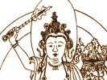

  
[Intangible Textual Heritage](../../index)  [Buddhism](../index.md) 
[Index](index)  [Previous](glg18)  [Next](glg20.md) 

------------------------------------------------------------------------

[Buy this Book at
Amazon.com](https://www.amazon.com/exec/obidos/ASIN/B0026P3WHK/internetsacredte.md)

------------------------------------------------------------------------

  
*The Gateless Gate*, by Ekai, called Mu-mon, tr. Nyogen Senzaki and Paul
Reps \[1934\], at Intangible Textual Heritage

------------------------------------------------------------------------

### 19. Everyday Life Is the Path

Joshu asked Nansen: "What is the path?"

Nansen said: "Everyday life is the path."

Joshu asked: "Can it be studied?"

Nansen said: "If you try to study, you will be far away from it."

Joshu asked: "If I do not study, how can I know it is the path?"

Nansen said: "The path does not belong to the perception world, neither
does it belong to the nonperception world. Cognition is a delusion and
noncognition is senseless. If you want to reach the true path beyond
doubt, place yourself in the same freedom as sky. You name it neither
good nor not-good."

At these words Joshu was enlightened.

 

*Mumon's comment:* Nansen could melt Joshu's frozen doubts at once when
Joshu asked his questions. I doubt though if Joshu reached the point
that Nansen did. He needed thirty more years of study.

*In spring, hundreds of flowers; in autumn, a harvest moon;  
In summer, a refreshing breeze; in winter, snow will accompany you.  
If useless things do not hang in your mind,  
Any season is a good season for you*.

------------------------------------------------------------------------

[Next: 20. The Enlightened Man](glg20.md)
