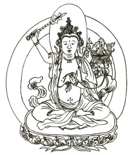

  
[Intangible Textual Heritage](../../index)  [Buddhism](../index.md) 

------------------------------------------------------------------------

[Buy this Book at
Amazon.com](https://www.amazon.com/exec/obidos/ASIN/B0026P3WHK/internetsacredte.md)

------------------------------------------------------------------------

<table width="75%">
<colgroup>
<col style="width: 50%" />
<col style="width: 50%" />
</colgroup>
<tbody>
<tr class="odd">
<td width="50%" data-valign="TOP"> 
Manjusri, Buddhist God of Wisdom [Public Domain Image]</td>
<td width="50%" data-valign="CENTER"><h1 id="the-gateless-gate" data-align="CENTER">The Gateless Gate</h1>
<h2 id="by-ekai-called-mu-mon-tr.-by-nyogen-senzaki-and-paul-reps" data-align="CENTER">by Ekai, called Mu-mon, tr. by Nyogen Senzaki and Paul Reps</h2>
<h4 id="no-renewal" data-align="CENTER">[1934, no renewal]</h4></td>
</tr>
</tbody>
</table>

------------------------------------------------------------------------

[Contents](#contents)    [Start Reading](glg00.md)    [Text
\[Zipped\]](glg.txt.gz.md)

------------------------------------------------------------------------

|                                                                                                                           |
|---------------------------------------------------------------------------------------------------------------------------|
|  |

This classic Zen Buddhist collection of 49 koans with commentary by
Mumon was originally published in 1934, and later included in Paul Reps
and Nyogen Senzaki's popular anthology Zen Flesh, Zen Bones. Due to
non-renewal it is currently in the public domain in the US (although
other parts of Zen Flesh, Zen Bones are not).

Koans are a Zen Buddhist spiritual technique which use word-play to
achieve enlightenment. They frequently involve absurd or contradictory
statements, which are intended to create extreme cognitive dissonance in
the mind of the pupil. As such, their actual content or structure is not
as important as the mental state which they induce. This collection
includes some of the most famous koans, such as [Tozan's "three pounds
of flax"](glg18.md):

*What is the Buddha? -- This flax weighs three pounds.*

and [Baso's conundrum](glg33.md):

*What is Buddha? -- This mind is not Buddha.*

as well as some involving bizarre behavior, such as [Nansen Cuts the Cat
in Two](glg14) and [Blow out the Candle](glg28.md).

While short and succinct, this book has enormous depth, and offers new
rewards on repeated readings.

------------------------------------------------------------------------

 [Title Page](glg00.md)  
[1. Joshu's Dog](glg01.md)  
[2. Hyakujo's Fox](glg02.md)  
[3. Gutei's Finger](glg03.md)  
[4. A Beardless Foreigner](glg04.md)  
[5. Kyogen Mounts the Tree](glg05.md)  
[6. Buddha Twirls a Flower](glg06.md)  
[7. Joshu Washes the Bowl](glg07.md)  
[8. Keichu's Wheel](glg08.md)  
[9. A Buddha before History](glg09.md)  
[10. Seizei Alone and Poor](glg10.md)  
[11. Joshu Examines a Monk in Meditation](glg11.md)  
[12. Zuigan Calls His Own Master](glg12.md)  
[13. Tokusan Holds His Bowl](glg13.md)  
[14. Nansen Cuts the Cat in Two](glg14.md)  
[15. Tozan's Three Blows](glg15.md)  
[16. Bells and Robes](glg16.md)  
[17. The Three Calls of the Emperor's Teacher](glg17.md)  
[18. Tozan's Three Pounds](glg18.md)  
[19. Everyday Life Is the Path](glg19.md)  
[20. The Enlightened Man](glg20.md)  
[21. Dried Dung](glg21.md)  
[22. Kashapa's Preaching Sign](glg22.md)  
[23. Do Not Think Good, Do Not Think Not-Good](glg23.md)  
[24. Without Words, Without Silence](glg24.md)  
[25. Preaching from the Third Seat](glg25.md)  
[26. Two Monks Roll Up the Screen](glg26.md)  
[27. It Is Not Mind, It Is Not Buddha, It Is Not Things](glg27.md)  
[28. Blow Out the Candle](glg28.md)  
[29. Not the Wind, Not the Flag](glg29.md)  
[30. This Mind Is Buddha](glg30.md)  
[31. Joshu Investigates](glg31.md)  
[32. A Philosopher Asks Buddha](glg32.md)  
[33. This Mind Is Not Buddha](glg33.md)  
[34. Learning Is Not the Path](glg34.md)  
[35. Two Souls](glg35.md)  
[36. Meeting a Zen Master on the Road](glg36.md)  
[37. A Buffalo Passes Through the Enclosure](glg37.md)  
[38. An Oak Tree in the Garden](glg38.md)  
[39. Ummon's Sidetrack](glg39.md)  
[40. Tipping Over a Water Vase](glg40.md)  
[41. Bodhidharma Pacifies the Mind](glg41.md)  
[42. The Girl Comes Out from Meditation](glg42.md)  
[43. Shuzan's Short Staff](glg43.md)  
[44. Basho's Staff](glg44.md)  
[45. Who Is He?](glg45.md)  
[46. Proceed from the Top of the Pole](glg46.md)  
[47. Three Gates of Tosotsu](glg47.md)  
[48. One Road of Kembo](glg48.md)  
[49. Amban's Addition](glg49.md)  
