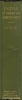

  
[Intangible Textual Heritage](../../index)  [Buddhism](../index.md) 
[Index](index)  [Next](ipc01.md) 

------------------------------------------------------------------------

[Buy this Book at
Amazon.com](https://www.amazon.com/exec/obidos/ASIN/0766135209/internetsacredte.md)

------------------------------------------------------------------------

  
*India in Primitive Christianity*, by Arthur Lille, \[1909\], at
Intangible Textual Heritage

------------------------------------------------------------------------

# INDIA IN PRIMITIVE CHRISTIANITY

###### BY

## ARTHUR LILLIE

###### (Late Regiment of Lucknow)

##### Author of "Buddhism in Christianity," "Buddha and Buddhism," Etc.

##### "Ye gave the Nazarite wine to drink and commanded the Prophet, saying, 'Prophesy not.'"—Tatian.

#### LONDON

#### KEGAN PAUL, TRENCH, TRÜBNER & CO., LTD.

#### DRYDEN HOUSE, GERRARD STREET, W.

#### \[1909\]

Scanned, proofed and formatted at Intangible Textual Heritage, February
2008. This text is in the public domain in the US because it was
published prior to 1923.

 
[  
Click to enlarge](img/spine.jpg.md)  
Spine  

  [  
Click to enlarge](img/front.jpg.md)  
THE RATHAS OF MAHÂBÂLIPUR. After Daniell  

  [  
Click to enlarge](img/title.jpg.md)  
Title Page  

------------------------------------------------------------------------

[Next: Contents](ipc01.md)
