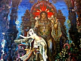

  
[Intangible Textual Heritage](../../index)  [Buddhism](../index.md) 
[Index](index)  [Previous](ipc15)  [Next](ipc17.md) 

------------------------------------------------------------------------

[Buy this Book at
Amazon.com](https://www.amazon.com/exec/obidos/ASIN/0766135209/internetsacredte.md)

------------------------------------------------------------------------

  
*India in Primitive Christianity*, by Arthur Lille, \[1909\], at
Intangible Textual Heritage

------------------------------------------------------------------------

p. 219

  [  
Click to enlarge](img/pl15.jpg.md)  
PLATE 15  
BUDDHIST MONKS.  

### CHAPTER XIII

#### RITES

The Abbé Huc on the close similarity of Christian
and Buddhist rites—Confirmed by Fathers Disderi and Grueber—Rev. S. Beal
on a Buddhist liturgy—Mr. Fergusson holds that the various details of
the Christian Basilica have been taken from the temples of the
Buddhists—On which side was the borrowing?—Arguments *pro* and
*con*.

I have left myself little space to write
of the many points of close similarity between the Buddhists and the
Roman Catholics.

The French missionary, Huc, in his celebrated travels in Thibet, was
much struck with this similarity.

"The crozier, the mitre, the dalmatic, the cope or *pluvial*, which the
grand lâmas wear on a journey, or when they perform some ceremony
outside the temple, the service with a double choir, psalmody,
exorcisms, the censer swinging on five chains and contrived to be opened
and shut at will, benediction by the lâmas, with the right hand extended
over the heads of the faithful, the chaplet, sacerdotal celibacy, Lenten
retirements from the world, the worship of saints, fasts, processions,
litanies, holy water—these are the points of contact between the
Buddhists and ourselves."

Listen also to Father Disderi, who visited Thibet in the year 1714. "The
lâmas have a tonsure like our priests, and are bound over to perpetual
celibacy. They study their scriptures in a language and in

p. 220

characters that differ from the ordinary characters. They recite prayers
in choir. They serve the temple, present the offerings, and keep the
lamps perpetually alight. They offer to God corn and barley and paste
and water in little vases, which are extremely clean. Food thus offered
is considered consecrated, and they eat it. The lâmas have local
superiors, and a superior-general." [\*](#fn_223.md)

Father Grueber, with another priest, named Dorville, passed from Pekin
through Thibet to Patna in the year 1661. Henry Prinsep [†](#fn_224.md) thus sums up what he has recorded:—

"Father Grueber was much struck with the extraordinary similarity he
found, as well in the doctrine as in the rituals, of the Buddhists of
Lha Sa, to those of his own Romish faith. He noticed, first, that the
dress of the lâmas corresponded to that handed down to us in ancient
paintings as the dress of the Apostles. Second, that the discipline of
the monasteries and of the different orders of lâmas or priests bore the
same resemblance to that of the Romish Church. Third, that the notion of
an Incarnation was common to both, so also the belief in paradise and
purgatory. Fourth, he remarked that they made suffrages, alms, prayers,
and sacrifices for the dead, like the Roman Catholics. Fifth, that they
had convents filled with monks and friars to the number of thirty
thousand, near Lha Sa, who all made the three vows of poverty,
obedience, and chastity, like Roman monks, besides other vows. Sixth,
that they had confessors licensed by the superior lâmas or bishops, and
so empowered to receive confessions, impose penances, and give
absolution. Besides all this there was found the practice of using holy
water, of singing service in alternation, of praying for the dead, and
of perfect

p. 221

similarity in the customs of the great and superior lâmas to those of
the different orders of the Romish hierarchy. These early missionaries
further were led to conclude, from what they saw and heard, that the
ancient books of the lâmas contained traces of the Christian religion,
which must, they thought, have been preached in Thibet in the time of
the Apostles."

In the year 1829 Victor Jacquemont, the French botanist, made a short
excursion from Simla into Thibet. He writes: "The Grand Lâma of Kanum
has the episcopal mitre and crozier. He is dressed just like our
bishops. A superficial observer at a little distance would take his
Thibetan and Buddhist mass for a Roman mass of the first water. He makes
twenty genuflexions at the right intervals, turns to the altar and then
to the congregation, rings a bell, drinks in a chalice water poured out
by an acolyte, intones paternosters quite of the right sing-song—the
resemblance is really shocking. But men whose faith is properly robust
will see here nothing but a corruption of Christianity." [\*](#fn_225.md)

It must be borne in mind that what is called Southern Buddhism has the
same rites. St. Francis Xavier in Japan found Southern Buddhism so like
his own that he donned the yellow *sanghati*, and called himself an
apostle of Buddha, quieting his conscience by furtively mumbling a
little Latin of the baptismal service over some of his "converts."

This is what the Rev. S. Beal, a chaplain in the Navy, wrote of a
liturgy that he found in China:—

"The form of this office is a very curious one. It bears a singular
likeness in its outline to the common type of the Eastern Christian
liturgies. That is to say, there is a 'Proanaphoral' and an 'Anaphoral.'
portion. There is a prayer of entrance (τῆς εἰσοδου), an ascription of
praise to the threefold object of

p. 222

worship (τρισαγίον), a prayer of oblation (τῆς προσθεσεως), the
lections, the recitations of the Dharani (μυστηριον), the Embolismus, or
prayer against temptation, followed by a 'Confession' and a
'Dismissal:'" [\*](#fn_226.md)

Turning to architecture, I must point out that Mr. Fergusson, the
leading authority in ancient art was of opinion that the various details
of the early Christian basilica—nave, aisle, columns, semi-domed apse,
cruciform ground plan—were borrowed *en bloc* from the Buddhists.
Relic-worship, he says, was certainly borrowed from the East. Of the
rock-cut temple of Kârle (B.C. 78) he writes:—

"The building resembles, to a great extent, an early Christian Church in
its arrangements, consisting of a nave and side aisles terminating in an
apse or semi-dome, round which the aisle is carried. . . . As a scale
for comparison, it may be mentioned that its arrangements and dimensions
are very similar to those of the choir of Norwich Cathedral, and of the
Abbaye aux Hommes at Caen, omitting the outer aisles in the latter
buildings.

"Immediately under the semi-dome of the apse, and nearly where the altar
stands in Christian churches, is placed the Dâgoba." [†](#fn_227.md)

The list of resemblances is by no means exhausted. The monks on entering
a temple make the gesture that we call the sign of the cross. The
Buddhists have illuminated missals, Gregorian chants, a tabernacle on
the altar for oblations, a pope, cardinals angels with wings, saints
with the nimbus. For a full account I must refer the reader to my
"Buddhism in Christendom."

How is all this to be accounted for? Several theories have been
started:—

  [  
Click to enlarge](img/pl16.jpg.md)  
PLATE 16.  
THE BUDDHIST HIGH ALTAR.  

p. 223

The first attempts to make light of the matter altogether. All
religions, it says, have sacrifice, incense, priests, the idea of faith,
etc. This may be called the orthodox Protestant theory, and many bulky
books have recently appeared propounding it. But as these books avoid
all the strong points of the case, they cannot be called at all
satisfactory to the bewildered inquirer.

To this theory the Roman Catholics reply that the similarities between
Buddhism and Catholicism are so microscopic and so complete, that one
religion must have borrowed from the other. In consequence they try to
prove that the rites of Buddhism and the life of its founder were
derived from Christianity, from the Nestorians, from St. Thomas, from
St. Hyacinth of Poland, from St. Oderic of Frioul. [\*](#fn_228.md)

In the way of this theory, however, there are also insuperable
difficulties. Buddha died 470 years before Christ, and for many years
the Christian Church had no basilicas, popes, cardinals, basilica
worship, nor even for a long time a definite life of the founder. At the
date of Asoka (B.C. 260) there was a metrical life of Buddha (Muni
Gâtha), and the incidents of this life are found sculptured in marble on
the gateways of Buddhist temples that precede the Christian epoch. This
is the testimony of Sir Alexander Cunningham, the greatest of Indian
Archæologists. He fixes the date of the Bharhut Stûpa at from 270 to 250
B.C. There he finds Queen Maya's dream of the elephant, the Rishis at
the ploughing match, the transfiguration of Buddha and the ladder of
diamonds, and other incidents. At the Sanchi tope, an earlier structure
(although the present marble gateways, repeated probably from wood, are
fixed at about A.D. 19), he announces representations of Buddha as an
elephant

p. 224

coming down to his mother's womb, three out of the "Four Presaging
Tokens," Buddha bending the bow of Sinhahanu, King Bimbisâra visiting
the young prince, and other incidents.

A man who invents, let us say, a submarine boat, at once puts his idea
to a practical test. Let us try and construct a working model here.
Suppose that the present ruler of Afghanistan were paying us a visit,
and, introduced at Fulham Palace, he were to suggest that the life of
Mahomet should supersede that of Jesus in our Bible, and Mussulman rites
replace the Christian ritual in the diocese of London. What would be the
answer? The bishop, anxious to deal gently with a valuable ally, would
point out that he was only a cogwheel in a vast machinery, a cogwheel
that could be promptly replaced if it proved the least out of gear. He
would show that the Anglican Church had a mass of very definite rules
called canon law, with courts empowered to punish the slightest
infringement of these rules. He would show that even an archbishop could
not alter a tittle of the gospel narrative. Every man, woman, and child
would immediately detect the change.

Similar difficulties would be in the way of St. Hyacinth of Poland in,
say, a monastery of Ceylon. The Abbot there would be responsible to what
Bishop Bigandet calls his "provincial," and he again to his
"superior-général," and so on to the Achârya, the "High Priest of all
the World," who, in his palace at Nalanda, near Buddha Gaya, was wont to
sit in state, surrounded by ten thousand monks. Buddhism, by the time
that a Christian missionary could have reached it, was a far more
diffused and conservative religion than Anglicanism. It had a canon law
quite as definite. It had hundreds of volumes treating of the minutest
acts of Sâkya Muni.

------------------------------------------------------------------------

### Footnotes

[220:\*](ipc16.htm#fr_224.md) "Lettres
Edifiantes," Vol. III., p. 534.

[220:†](ipc16.htm#fr_225.md) "Thibet, Tartary,"
etc., p. 14.

[221:\*](ipc16.htm#fr_226.md) "Corr.," Vol. I., p.
265.

[222:\*](ipc16.htm#fr_227.md) "Catena of Buddhist
Scriptures," p. 397.

[222:†](ipc16.htm#fr_228.md) "Indian and Eastern
Architecture," p. 117.

[223:\*](ipc16.htm#fr_229.md) See Abbe Prouvése,
"Life of Gabriel Durand," Vol. II., p. 365.

------------------------------------------------------------------------

[Next: Chapter XIV. Paulinism](ipc17.md)
